# KMP

## 简单模式匹配算法

### 串匹配的概念

要说 KMP，首先要知道为什么要引入 KMP？KMP 到底解决了什么问题？KMP 有什么优势？

首先，下面先介绍字符串的模式匹配概念，再来解决模式匹配的算法，再来引入 KMP。

首先，我们应该有过在一个文本文件中查找某个字符串（或某个关键字）的经历，如图：


在上图中，`forget` 被称为子串或者模式串，而那一段文本内容被称为主串。『查找下一个』按钮第一次按它就是找这个子串 `forget` 第一次在主串中出现的位置，然后背景色变为蓝色显示出来。

如上，这种**求子串在主串中的位置的操作称为串的模式匹配**。那么它背后的原理是怎么样的呢？是如何通过代码实现的呢？


### BF 算法

我们会想到这么一种方法：穷举主串的所有子串，然后判断它们是否与给定的子串相匹配。

用算法的思想来描述，就是这样的：从主串的第一个位置（下标为 0）起和子串的第一个字符开始比较，如果相等，则继续逐一比较后续字符；如果不相等则从主串的第二个字符开始，再重新用上一步的方法与子串中的字符做比较。以此类推，直到比较完子串中的所有字符。若匹配成功，则返回子串在主串中的位置；若匹配失败，则返回一个可用于区别主串所有位置的标记，如 `'\0'`。以 `str="helxworhellold"; substr="hello"` 为例如图所示：

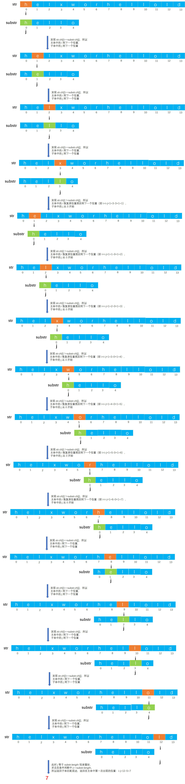

实现代码如下：

```c
/**
 * 定位子串，若主串 str 中存在与串 substr 值相同的子串，则返回它在主串 str 中第一次出现的位置
 * @param str 主串
 * @param substr 子串
 * @return 如果存在子串则返回第一次出现的位置，否则返回 0
 */
int index(String str, String substr) {
    // 变量，i 记录串 str 中字符的下标，j 记录串 substr 中字符的下标
    int i = 0, j = 0;
    // 同时扫描主串 str 和子串 substr
    while (i < str.length && j < substr.length) {
        // 如果主串中的字符与子串中的字符相等，则继续比较下一对字符
        if (str.ch[i] == substr.ch[j]) {
            // 同时加一，指向串的下一个字符
            i++;
            j++;
        }
        // 如果不相等，那么就继续比较主串中下一个字符开始的串与子串，注意，需要恢复 i 和 j
        else {
            // 恢复主串中的 i，回到第 i-j 个字符，然后加一表示下一个字符
            i = i - j + 1;
            // 而 j 要恢复为子串的第一个字符的下标，即为 0，又要从 0 开始比较起走
            j = 0;
        }
    }
    // 如果循环结束 j 等于 length，那么表示主串中一定存在子串
    if (j == substr.length) {
        // 则返回子串第一次出现的位置
        return i - j;
    } else {
        // 如果不相等，则表示子串不存在于主串中，在返回标记 0
        return '\0';
    }
}
```

> 注：如果想要知道完整可运行代码请参考：[String.c](https://github.com/lcl100/data-structure-learning/blob/main/src/%E4%B8%B2/%E4%BB%A3%E7%A0%81/String.c)。

上述算法称之为 BF（Brute Force）算法，即暴力穷举算法。其时间复杂度在最坏的情况下会达到 `O(n*m)`，在其中 n 和 m 分别是主串和子串的长度。


## KMP 算法

### 引入 KMP 算法

通过上面的代码，还会发现每次不匹配时，计数指针 `i` 和 `j` 都会回溯，其中 `i` 会回到 `i-j+1` 的位置，而 `j` 会回到 `0` 的位置，又从子串的第一个字符开始比较起走。

实际上，完全没必要从主串 `str` 的每一个字符开始穷举每一种情况，为了得到更优的算法，三位大神Knuth、Morris和Pratt对该算法进行了改进，称之为 KMP 算法。

**所以 KMP 算法是为了更快的在主串中匹配到子串。**

下面就来一步步看如何优化它，即 KMP 算法是如何优化它的。

实际上上面的例子 `str="helxworhellold"; substr="hello"`  并不能很好的体现出 KMP 算法的优势来，至于原因后面会进行说明。所以给出一个更适合 KMP 算法发挥优势的例子：`str="abaabaabeca"; substr="abaabe"`。它使用暴力穷举法的图解如下：

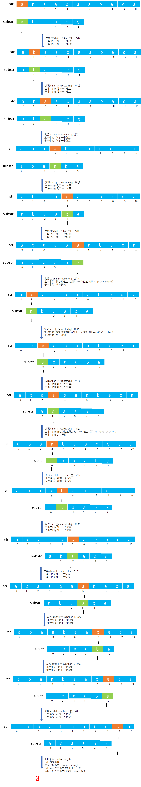

如图所展示的例子，按照 BF 算法，当不等时，则计数指针 `i` 回退到 `i-j+1` 处，而计数指针 `j` 回退到 0，即 `i=1, j=0`，如图所示：

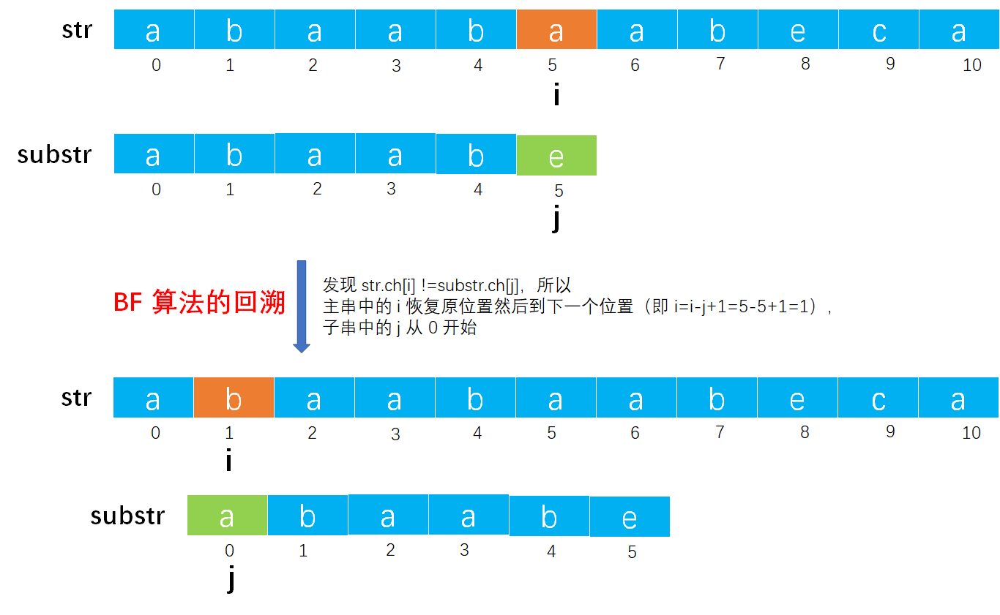

优化来了，其实可以让 `i` 不回退，而是让 `j` 回退到第三个位置（即下标为 2 的位置），接着比较即可。这种回溯策略就是 KMP 算法的核心。

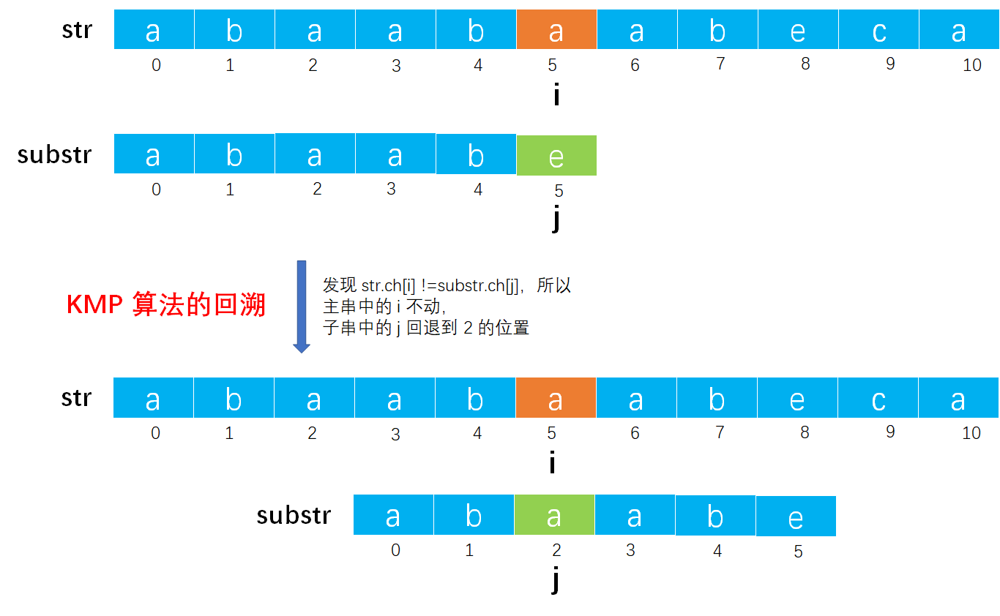


### KMP 原理

那么问题来了，为什么要 `j` 回退到第三个位置（下标为 2 的位置）？而不是第一个位置或者第二个位置，亦或者第四个位置呢？

因为子串开头的两个字符 `"ab"` 和 `i` 指向的字符的前面两个字符一模一样，如图所示。所以 `j` 可以直接回退到第三个位置（下标为 2 的位置）继续比较了，因为前面两个字符已经相等了，相当于已经比较过了。

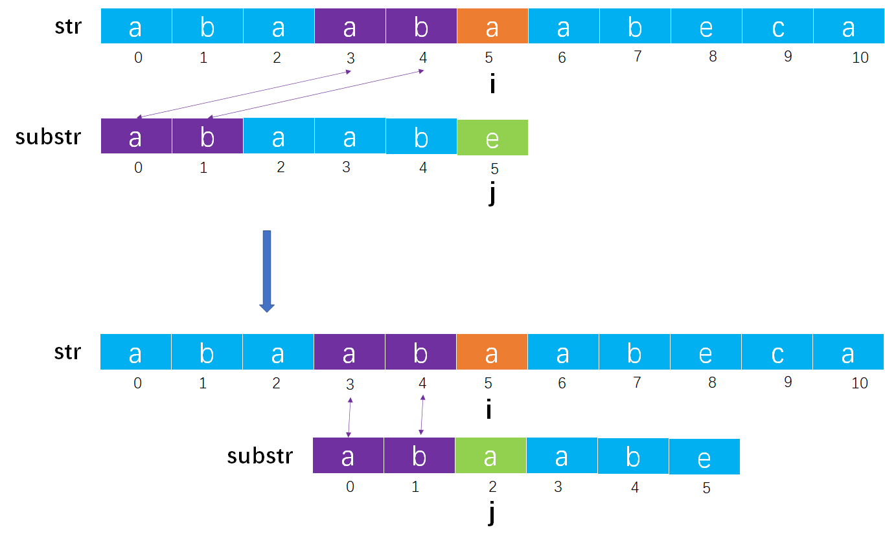

那么问题来了，怎么知道子串 `substr` 中开头的两个字符 `"ab"` 和主串 `str` 中 `i` 指向的字符前面的两个字符 `"ab"` 一模一样呢？难道还需要比较？

通过观察发现主串 `str` 中 `i` 指向的字符前面的两个字符 `"ab"` 和子串 `substr` 中 `j` 指向的字符前面两个字符 `"ab"` 一模一样，注意，这不是偶然，只有它们（即 `i` 和 `j` 所指向的字符）一直相等，才会 `i++`、`j++` 走到当前的位置。

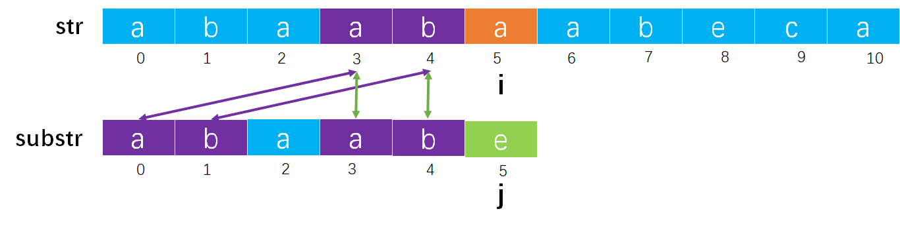

也就是我们不必去判断子串 `substr` 中开头的两个字符和主串 `str` 中 `i` 指向的字符的前面的两个字符是否一样，只需要在子串 `substr` 本身比较就可以了，即不需要主串 `str` 的参与了，就能确定相等的字符情况。

那么问题来了，怎么在子串 `substr` 中确定相等的字符情况呢？

> 在回答上面的问题之前，需要了解一些关于前缀和后缀的概念：
>
> - 前缀：是指在字符串中除了最后一个字符以外，一个字符串的全部头部组合。如字符串 `"Snape"` 中，`"S"`、`"Sn"`、`"Sna"` 和  `"Snap"` 都是它的正确前缀。
> - 后缀：是指在字符串中除了第一个字符以外，一个字符串的全部尾部组合。如字符串 `"Hagrid"` 中，`"agrid"`、`"grid"`、`"rid"`、`"id"` 和 `"d"` 都是它的正确后缀。
>
> 在前缀和后缀中都不可以取字符串本身。如果字符串的长度为 `n`，那么前缀和后缀的长度最多达到 `n-`。
>
> 我们还得知道一个概念：即 **（子）模式中与同（子）模式中正确后缀匹配的最长正确前缀的长度**。可能有些难以理解，举例来说明：
>
> - 有一个字符串 `"aba"`，在这个字符串中有两个正确前缀（`"a"` 和 `"ab"`）和两个正确后缀（`"a"` 和 `"ba"`）。正确的前缀 `"ab"` 与两个正确的后缀中的任何一个都不匹配（即相等的意思）。但是正确的前缀 `"a"` 与正确的后缀 `"a"` 匹配。因此，**匹配正确后缀的最长正确前缀的长度**，在这种情况下，是 1（即正确前缀 `"a"` 中字字符的个数）。
> - 有一个字符串 `"abab"`，在这个字符串中有三个正确前缀（`"a"`、`"ab"` 和 `"aba"`）和三个正确后缀（`"b"`、`"ab"` 和 `"bab"`）。正确的前缀 `"a"` 和三个正确的后缀中任何一个都不匹配；正确的前缀 `"aba"` 和三个正确的后缀中任何一个都不匹配；正确的前缀 `"ab"` 和正确的后缀 `"ab"` 匹配。因此，**匹配正确后缀的最长正确前缀的长度**，在这种情况，是 2（即正确前缀 `"ab"` 中字字符的个数）。
> - 有一个字符串 `"ababa"`，在这个字符串中有四个正确的前缀（`"a"`、`"ab"`、`"aba"` 和 `"abab"`）和四个正确的后缀（`"a"`、`"ba"`、`"aba"` 和 `"baba"`）。正确的前缀 `"a"` 和四个正确的后缀中的 `"a"` 后缀相匹配；正确的前缀 `"ab"` 和四个正确的后缀中的任何一个都不匹配；正确的前缀 `"aba"` 和四个正确的后缀中的 `"aba"` 相匹配；正确的前缀 `"abab"` 和四个正确的后缀中的任何一个都不匹配。这时候，我们发现有两个匹配成功的项：`"a"` 和 `"aba"`。但是我们要求的是**最长**，而 `"aba"` 比 `"a"` 长，所以最终的结果是 3（即正确前缀 `"aba"` 中字字符的个数）。

**即找到子串 `substr` 中当前 `j` 所指向的字符前面所有字符组成的串中正确后缀匹配的最长正确前缀的长度。这个长度就是 `j` 回退的位置。**

上图子串 `substr="abaabe"` 中当 `j=5` 时它前面所有字符组成的串是 `"abaab"`，该串所有的正确前缀有：`"a"`、`"ab"`、`"aba"`、`"abaa"`，该串所有的正确后缀有：`"b"`、`"ab"`、`"aab"`、`"baab"`。其中正确后缀匹配的最长正确前缀是 `"ab"`，它的长度是 2。所以 `j` 可以退出到 2 （下标位置）继续比较。

**因此当 `i` 和 `j` 指向的字符不相等时，只需要求出 `j` 所指向的字符前面所有字符组成的串中正确后缀匹配的最长正确前缀的长度 `len`，就可以让 `i` 不变，`j` 回退到 `len` 位置（下标位置）继续比较。**

通过上面的方法，我们已经知道了当 `i` 和 `j` 指向的字符不相等时可以进行的回溯策略。

那么问题来了，`j` 所指向的每个字符都可能不匹配，那么是不是该计算每个 `j` 所指向的字符前面所有字符组成的串中正确后缀匹配的最长正确前缀的长度呢？

是的，我们必须要计算每一个 `j` 的情况，而它们放在一个数组中就被称为 `next[]` 数组，该数组中 `next[j]` 表示 `j` 要回退的位置（下标位置）。


### 如何手动求 `next` 数组

那么我们就来手动求下子串 `substr="abaabe"` 中 `j` 从 0 到 5 每一个数情况下的正确后缀匹配的最长正确前缀的长度吧：

- 当 `j=0` 时，`j` 所指向的字符 `a` 前面没有任何字符，所以无法计算，通常将其设定为 -1（这是一种规定）。即 `next[0]=-1`。
- 当 `j=1` 时，`j` 所指向的字符 `b` 前面所有字符组成的串是 `"a"`，没有任何前缀和后缀，所以正确后缀匹配的最长正确前缀的长度为 0。即 `next[1]=0`。其实无论什么串，当 `j=0` 或 `j=1` 时都会是这种结果。
- 当 `j=2` 时，`j` 所指向的字符 `a` 前面所有字符组成的串是 `"ab"`，它的正确前缀有 `"a"`，它的正确后缀有 `"b"`，但没有相匹配的情况，所以正确后缀匹配的最长正确前缀的长度为 0。即 `next[2]=0`。
- 当 `j=3` 时，`j` 所指向的字符 `a` 前面所有字符组成的串是 `"aba"`，它的正确前缀有 `"a"`、`"ab"`，它的正确后缀有 `"a"`、`"ba"`，能相匹配的情况是 `"a"`，所以正确后缀匹配的最长正确前缀的长度为 1。即 `next[3]=1`。
- 当 `j=4` 时，`j` 所指向的字符 `b` 前面所有字符组成的串是 `"abaa"`，它的正确前缀有 `"a"`、`"ab"`、`"aba"`，它的正确后缀有 `"a"`、`"aa"`、`"baa"`，能相匹配的情况是 `"a"`，所以正确后缀匹配的最长正确前缀的长度为 1。即 `next[4]=1`。
- 当 `j=5` 时，`j` 所指向的字符 `e` 前面所有字符组成的串是 `"abaab"`，它的正确前缀有 `"a"`、`"ab"`、`"aba"`、`"abaa"`，它的正确后缀有 `"b"`、`"ab"`、`"aab"`、`"baab"`，能相匹配的情况有 `"a"` 和 `"ab"`，但我们要求最长的，所以选择 `"ab"`，所以正确后缀匹配的最长正确前缀的长度为 2。即 `next[5]=2`。

所以最终子串 `substr` 生成的 `next[]` 数组如下：

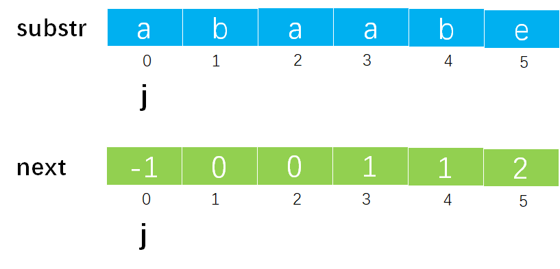

根据上面的计算过程，我们还可以得到这样一个通用计算公式：

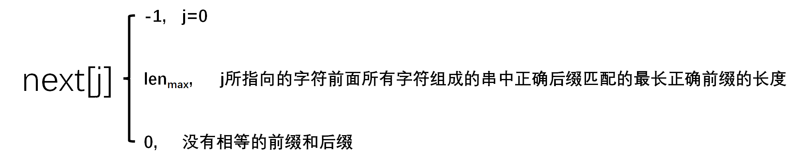


### 如何用代码求 `next` 数组

那么问题来了，我们现在如何手动推算出 `next[]` 数组，但是该如何用代码来计算出 `next[]` 数组呢？这才是难点，也是最难理解的地方。

我们来看看求得 `next[]` 数组的代码：

```c
void getNext(String substr, int next[]) {
    int j = 0, k = -1;
    next[0] = -1;
    while (j < substr.length - 1) {
        if (k == -1 || substr.ch[j] == substr.ch[k]) {
            j++;
            k++;
            next[j] = k;
        } else {
            k = next[k];
        }
    }
}
```

说明一些代码中各局部变量的含义：

- 其中 `substr` 表示待求 `next[]` 数组的子串；
- `next[]` 数组用来存放每个 `j` 在子串 `substr` 中所指向的字符前面所有字符组成的串中正确后缀匹配的最长正确前缀的长度；
- `j` 既是指 `next[]` 数组的下标，又是指子串 `substr` 中的下标；
- `k` 表示的就是 `j` 所指向的字符前面所有字符组成的串中正确后缀匹配的最长正确前缀的长度。即 `next[j]`。

下面分三种情况来分析 `next[]` 数组的求解过程，即代码是为什么要这样写的：

- 第一种情况：特殊情况。对应代码中 `if(k==-1)` 的条件判断语句。

即当 `j=0` 或者 `j=1` 时，它们的 `k` 值都为 0，即 `j` 所指向的字符前面所有字符组成的串中正确后缀匹配的最长正确前缀的长度为 0，上面手动求解 `next[]` 数组的过程中可以验证。但是通常为了后面 `k` 值计算的方便，让 `next[0]=-1`，这样没有任何影响。如图所讲的例子：

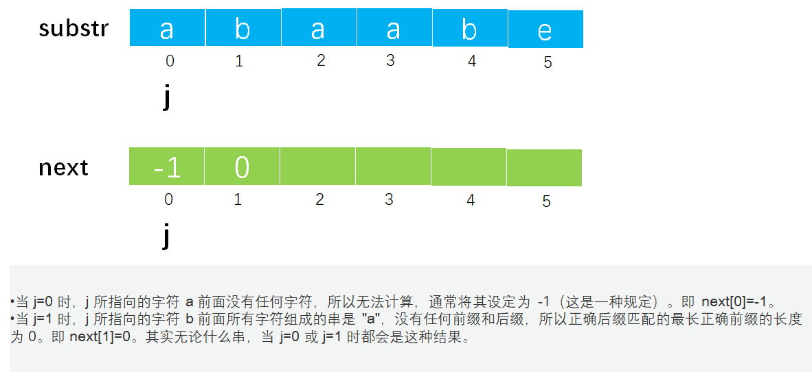

- 第二种情况：当 `substr.ch[j]==substr.ch[k]` 时。对应代码中 `if(substr.ch[j]==substr.ch[k])` 的条件判断语句。

如图，假如子串 `substr="abcabcd"`，那么通过手动求取 `next[]` 数组如下：

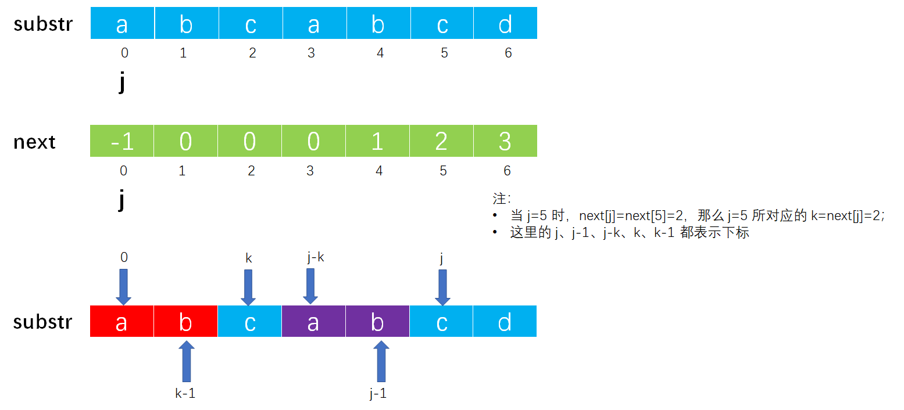

观察上图发现，当 `substr.ch[j]==substr.ch[k]` 时，必然有 `[substr.ch[0] ~ substr.ch[k-1]] == [substr.ch[j-k] ~ substr.ch[j-1]]`（在图中是 `['a', 'b'] == ['a', 'b']`），此时的 `k` 就是正确后缀匹配的最长正确前缀的长度。所以进行如下推论：

> 注：`[substr.ch[0] ~ substr.ch[k-1]]` 只是表示下标为 `[0 ~ k-1]` 之间所有字符的集合，如 `['a', 'b']` 、`['a', 'b', 'c']` 这样的，没有什么特殊含义。

- 因为 `[substr.ch[0], substr.ch[k-1]] == [substr.ch[j-k], substr.ch[j-1]]`
- 并且 `substr.ch[j] == substr.ch[k]`
- 所以 `[substr.ch[0], substr.ch[k]] == [substr.ch[j-k], substr.ch[j]]`
- 即 `next[j+1] = k+1`，即 `next[j+1] = next[j]+1`。

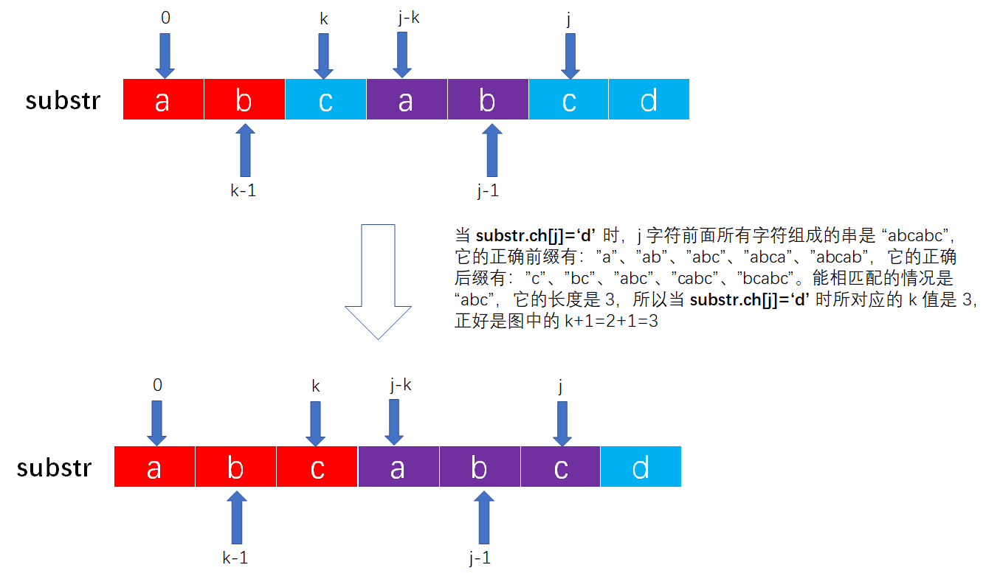

- 第三种情况：当 `substr.ch[j]!=substr.ch[k]` 时。对应代码中 `else` 的条件判断语句。

> 注：`k = next[k];` 太难理解了。我也没有理解到，所以下面只是讲一下我的理解，没有说明那些证明过程，因为我也还彻底掌握。建议参考多份资料来进行理解把握。

我们知道 KMP 算法是当 `str.ch[i]!=substr.ch[j]` 时让子串中的 `j` 进行回溯，回溯到 `next[j]` 的位置。


所以在这里当 `substr.ch[j]!=substr.ch[k]` 时也让 `k` 进行回溯，回溯到 `next[k]` 的位置。在下图中我们以 `substr="abacdababc"` 为例：

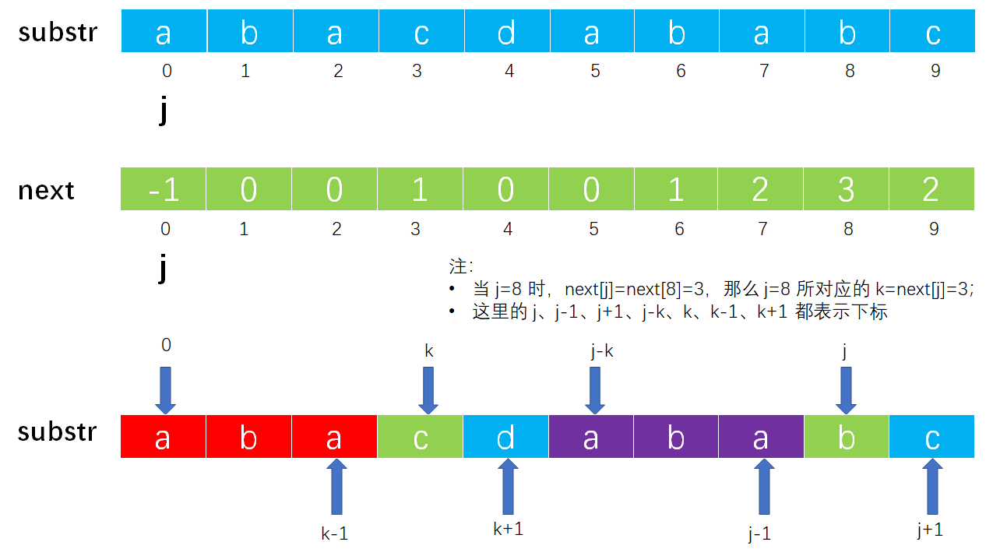

那么问题来了，为什么是回溯到 `next[k]`，而不是 `next[k-1]` 呢？

由第二种情况可知，当 `substr.ch[j]==substr.ch[k]` 时，`substr.ch[j]` 的正确后缀匹配的最长正确前缀的长度是 `k`，即 `next[j+1]=k+1`。再由图上可知此时 `substr.ch[j]!=substr.ch[k]`，所以 `next[j+1]<k`。

我们把串 `substr` 分为两部分：一部分是 `substr.ch[0] ~ substr.ch[k]`；一部分是 `substr.ch[j-k] ~ substr.ch[j]`。为什么分为这样的两部分呢？因为是从 `substr.ch[0]==substr.ch[j-k]` 开始相等的，从 `substr.ch[k]!=substr.ch[j]` 结束的，如图所示：

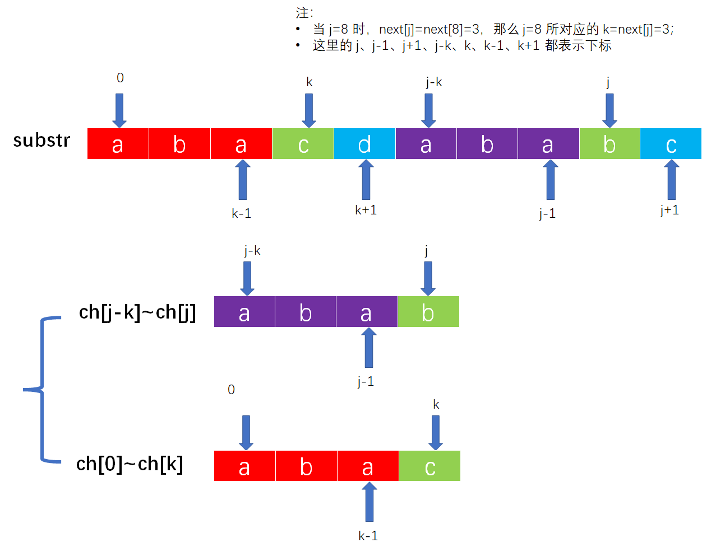

我们对这两部分所表示的串进行比较，回退并查找 `next[k]=k'=next[3]=1` 位置，比较 `ch[k']=ch[1]='b'` 是否与 `ch[j]=ch[8]='b'` 相等，如图所示：

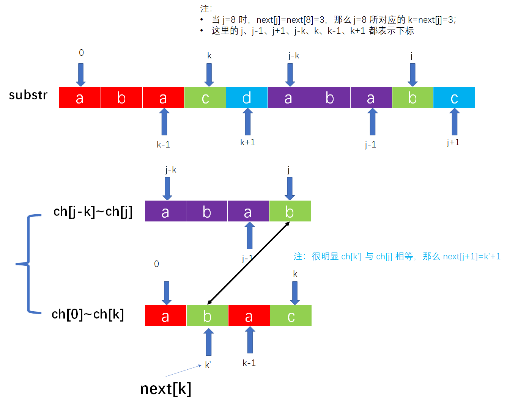

如果 `ch[k']==ch[j]`，图中 `ch[k']=='b'` 与 `ch[j]=='b'` 是相等，因此 `next[j+1]=k'+1`。对应到图上就是 `next[j+1]=k'+1=next[8+1]=next[9]=k'+1=1+1=2`，即 `next[9]=2`。其实相等就会跳到第二种情况去了。

如果 `ch[k']!=ch[j]`，那么则继续回退并查找 `next[k']=k''`，比较 `ch[k'']` 与 `ch[j]` 是否相等。如果 `ch[k'']==ch[j]`，则 `next[j+1]=k''+1`。如果 `ch[k'']!=ch[j]`，则继续向前查找，直到找到 `next[0]=-1`，停止，此时 `next[j+1]=-1+1=0`，即从 0 开始比较。

上面说明了求 `next[]` 数组的原理，下面我们用上述方法再次求得 `substr="abaabe"` 的 `next[]` 数组进行验证，过程如下：

- 初始化时 `next[0]=-1`，j=0，k=-1，进入循环，判断 k=-1，执行代码 `next[++j]=++k`，即 `next[1]=0`，此时 j=1，k=0。
- 进入循环，判断是否满足 `ch[j]==ch[k]`，发现 `ch[1]!=ch[0]`，执行代码 `k=next[k]`，即 `k=next[0]=-1`，此时 j=1，k=-1。
- k=-1，执行代码 `next[++j]=++k`，即 `next[2]=0`，此时 j=2，k=0。
- `ch[2]==ch[0]`，执行代码 `next[++j]=++k`，即 `next[3]=1`，此时 j=3，k=1。
- `ch[3]!=ch[1]`，执行代码 `k=next[k]=next[1]=0`，此时 j=3，k=0。
- `ch[3]==ch[0]`，执行代码 `next[++j]=++k`，即 `next[4]=1`，此时 j=4，k=1。
- `ch[4]==ch[1]`，执行代码 `next[++j]=++k`，即 `next[5]=2`，此时 j=5，k=2。
- `ch[5]!=ch[2]`，执行代码 `k=next[k]=next[2]=0`，此时 j=5，k=0。
- `ch[5]!=ch[0]`，执行代码 `k=next[k]=next[0]=-1`，此时 j=5，k=-1。
- k=-1，执行代码 `next[++j]=++k`，即 `next[6]=0`，此时 j=6，k=0。
- 此时 `j==length`，字符串处理结束。`next[]` 数组构造完成。


### KMP 算法分析

我们对这个 KMP 算法进行简单的分析：在 KMP 算法中 `i` 不回退，当 `str.ch[i]!=substr.ch[j]` 时，`j` 回退到 `next[j]`，重新开始比较，在最坏的情况下扫描整个主串 `str`，其时间复杂度为 `O(str.length)`。计算子串 `substr` 的 `next[]` 数组需要扫描整个子串 `substr`，其时间复杂度为 `substr.length`，因此总的时间复杂度为 `O(str.length + substr.length)`。

需要注意下，BF 算法在最坏情况下时间复杂度为 `O(str.length * substr.length)`，KMP 算法的时间复杂度为 `O(str.length + substr.length)`，但在实际运用中，BF 算法的时间复杂度一般为 `O(str.length + substr.length)`，因此仍然有很多地方用 BF 算法进行模式匹配，KMP 算法只是优化而非替代。只有在主串和子串中有很多部分匹配的情况下，KMP 才显得高效。所以也解释了上面为什么不用 `str="helxworhellold"; substr="hello"`  为例了。


## 改进的 KMP 算法

### 为什么要改进

在 KMP 算法中，采用 `next[]` 求解很方便，但也有一个问题，当 `str.ch[i]!=substr.ch[j]` 时，`j` 回退到 `next[j]` 位置，然后将 `str.ch[i]` 与 `substr.ch[j]` 进行比较。这样没问题，但如果 `substr.ch[j]==substr.ch[k]`（所谓的 `k` 就是 `next[j]`），那么这次比较就没有必要了，刚才正是因为 `str.ch[i]!=substr.ch[j]` 才回退的，而 `substr.ch[j]==substr.ch[k]`，所以 `str.ch[i]!=substr.ch[k]`，完全没有必要再比较了。以 `str="aaabaaaab"; substr="aaaab"` 为例如图所示：

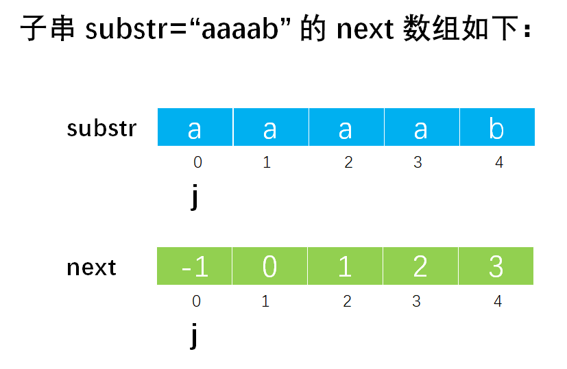

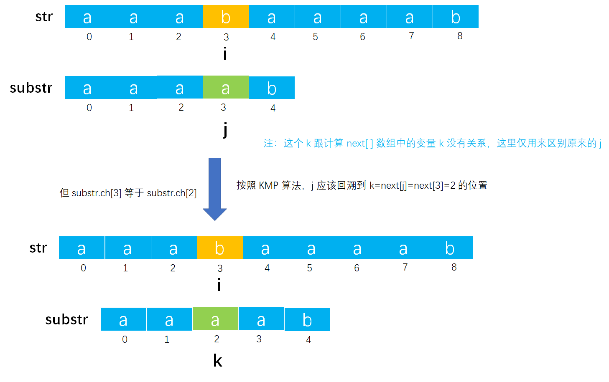

因为回退后 `str.ch[i]` 仍然不等于 `substr.ch[k]`，所以 `j` 要再向前回退到下一个位置 `next[k]=next[next[j]]`，再继续比较。


### 如何改进

当 `str.ch[i]!=substr.ch[j]` 时，本应该让 `j` 回退到 `next[j]` 的位置，再将 `str.ch[i]` 与 `substr.ch[k]` 进行比较。但如果 `substr.ch[k]==substr.ch[j]`，则不需要比较，继续回退到下一个位置 `next[k]=next[next[j]]` 即可，减少一次无效比较，这就是对 KMP 算法的改进。如图：

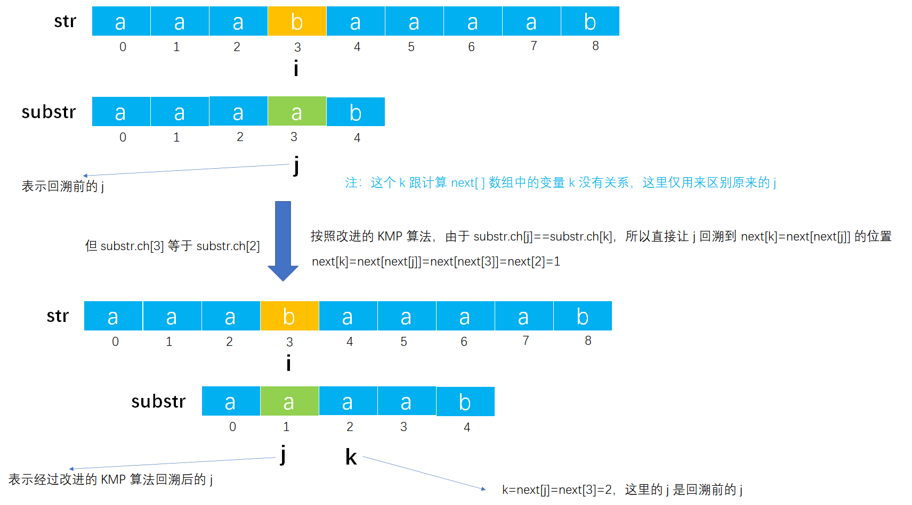


### `nextval` 数组

改进后的 `next[]` 数组更名为 `nextval[]` 数组。以 `substr="aaaab"` 为例 `next[]` 数组和 `nextval[]` 数组如下：

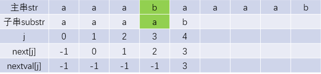

所以求 `nextval[]` 数组的代码如下：

```c
void getNextVal(String substr, int nextval[]) {
    int j = 0, k = -1;
    nextval[0] = -1;
    while (j < substr.length - 1) {
        if (k == -1 || substr.ch[j] == substr.ch[k]) {
            j++;
            k++;
            if (substr.ch[j] == substr.ch[k]) {
                nextval[j] = nextval[k];
            } else {
                nextval[j] = k;
            }
        } else {
            k = nextval[k];
        }
    }
}
```


### 如何手动求 `nextval` 数组

我们还要知道如何手动求 `nextval[]` 数组。在求得 `next[]` 数组的情况求子串 `substr` 的 `nextval[]` 数组的一般如下：

- 当 `j=0` 时，`nextval[j]` 赋值为 0，作为特殊标记。
- 当 `substr.ch[j]!=substr.ch[k]` 时（`k` 等于 `next[j]`），`nextval[j]` 赋值为 `k`。
- 当 `substr.ch[j]==substr.ch[k]` 时（`k` 等于 `next[j]`），`nextval[j]` 赋值为 `nextval[k]`。

以 `substr="ababaab"` 为例演示过程如下：

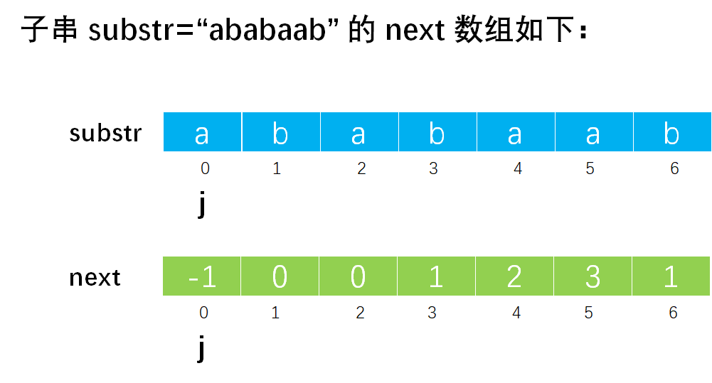

- 当 `j=0` 时，`nextval[j]=nextval[0]=-1`。
- 当 `j=1` 时，由于 `substr.ch[j]=substr.ch[1]='b'` 不等于 `substr.ch[k]=substr.ch[next[j]]=substr.ch[next[1]]='a'`，所以 `nextval[j]=nextval[1]=k=next[j]=next[1]=0`。
- 当 `j=2` 时，由于 `substr.ch[j]=substr.ch[2]='a'` 等于 `substr.ch[k]=substr.ch[next[j]]=substr.ch[next[2]]=substr.ch[0]='a'`，所以 `nextval[j]=nextval[2]=nextval[k]=nextval[next[j]]=nextval[next[2]]=nextval[0]=-1`。
- 当 `j=3` 时，由于 `substr.ch[j]=substr.ch[3]='b'` 等于 `substr.ch[k]=substr.ch[next[j]]=substr.ch[next[3]]=substr.ch[1]='b'`，所以 `nextval[j]=nextval[3]=nextval[k]=nextval[next[j]]=nextval[next[3]]=nextval[1]=0`。
- 当 `j=4` 时，由于 `substr.ch[j]=substr.ch[4]='a'` 等于 `substr.ch[k]=substr.ch[next[j]]=substr.ch[next[4]]=substr.ch[2]='a'`，所以 `nextval[j]=nextval[4]=nextval[k]=nextval[next[j]]=nextval[next[4]]=nextval[2]=-1`。
- 当 `j=5` 时，由于 `substr.ch[j]=substr.ch[5]='a'` 不等于 `substr.ch[k]=substr.ch[next[j]]=substr.ch[next[5]]=substr.ch[3]='b'`，所以 `nextval[j]=nextval[5]=k=next[j]=next[5]=3`。
- 当 `j=6` 时，由于 `substr.ch[j]=substr.ch[6]='b'` 等于 `substr.ch[k]=substr.ch[next[j]]=substr.ch[next[6]]=substr.ch[1]='b'`，所以 `nextval[j]=nextval[6]=nextval[k]=nextval[next[j]]=nextval[next[6]]=nextval[1]=0`。

所以最终的 `nextval[]` 数组结果如图所示：

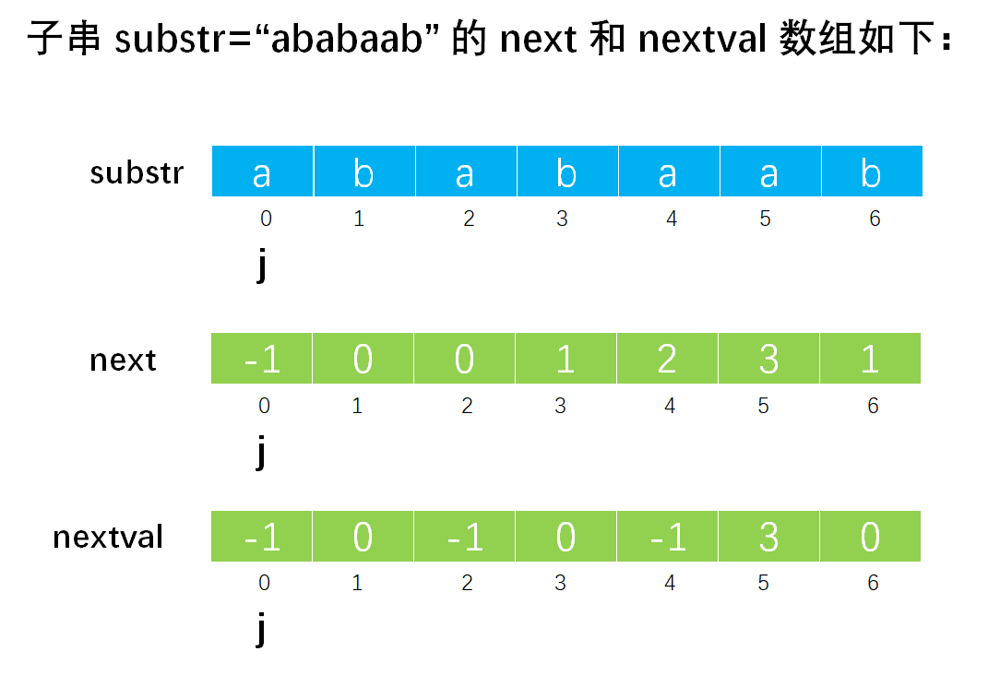

所以完整的 KMP 算法代码如下：

```c
/**
 * KMP 算法求 next 数组
 * @param substr 子串
 * @param next 数组
 */
void getNext(String substr, int next[]) {
    int j = 0, k = -1;
    next[0] = -1;
    while (j < substr.length - 1) {
        if (k == -1 || substr.ch[j] == substr.ch[k]) {
            j++;
            k++;
            next[j] = k;
        } else {
            k = next[k];
        }
    }
}

/**
 * 改进的 KMP 算法求 nextval 数组
 * @param substr 子串
 * @param nextval 数组
 */
void getNextVal(String substr, int nextval[]) {
    int j = 0, k = -1;
    nextval[0] = -1;
    while (j < substr.length - 1) {
        if (k == -1 || substr.ch[j] == substr.ch[k]) {
            j++;
            k++;
            if (substr.ch[j] == substr.ch[k]) {
                nextval[j] = nextval[k];
            } else {
                nextval[j] = k;
            }
        } else {
            k = nextval[k];
        }
    }
}

/**
 * 定位子串，若主串 str 中存在与串 substr 值相同的子串，则返回它在主串 str 中第一次出现的位置
 * @param str 主串
 * @param substr 子串
 * @return 如果存在子串则返回第一次出现的位置，否则返回 0
 */
int index(String str, String substr) {
    // 声明 next 数组并调用 getNext 函数进行计算
    int next[substr.length];
    getNext(substr, next);

    // 变量，i 记录串 str 中字符的下标，j 记录串 substr 中字符的下标
    int i = 0, j = 0;
    // 同时扫描主串 str 和子串 substr
    while (i < str.length && j < substr.length) {
        // 如果主串中的字符与子串中的字符相等，则继续比较下一对字符
        if (str.ch[i] == substr.ch[j]) {
            // 同时加一，指向串的下一个字符
            i++;
            j++;
        }
            // 如果不相等，那么就回退 j
        else {
            // j 回退到 next[j] 位置，而 i 不回退
            j = next[j];
        }
    }
    // 如果循环结束 j 等于 length，那么表示主串中一定存在子串
    if (j == substr.length) {
        // 则返回子串第一次出现的位置
        return i - j;
    } else {
        // 如果不相等，则表示子串不存在于主串中，在返回标记 0
        return '\0';
    }
}
```

完整可运行的 KMP 代码请参考：[KMP.c](https://github.com/lcl100/data-structure-learning/blob/main/src/%E4%B8%B2/%E4%BB%A3%E7%A0%81/KMP.c)。


参考资料：

- 《2022 天勤数据结构》
- 《2022 王道数据结构》
- [KMP算法完美图解](https://www.bilibili.com/read/cv15625987/)
- [The Knuth-Morris-Pratt Algorithm in my own words](http://jakeboxer.com/blog/2009/12/13/the-knuth-morris-pratt-algorithm-in-my-own-words/)
- [[字符串匹配的KMP算法](https://kb.cnblogs.com/page/176818/)](https://kb.cnblogs.com/page/176818/)
- [KMP算法详解-彻底清楚了](https://www.cnblogs.com/dusf/p/kmp.html)
- [KMP算法—终于全部弄懂了](https://blog.csdn.net/dark_cy/article/details/88698736)