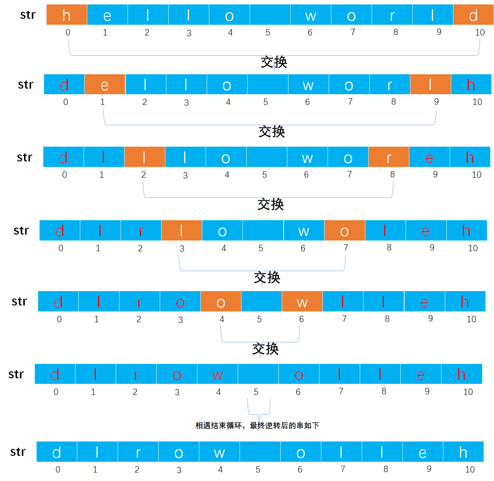

# Example002

## 题目

实现串 str 的逆转函数，如果 str 为空串，则什么都不做。


## 分析

其实本题就是数组的逆置算法。

分别交换从头和从尾出发的指针所指向的字符，直到串的中间结束交换。

> 关于数组的逆置可以参考：[线性表练习之Example004-将顺序表中所有元素逆置](https://blog.csdn.net/cnds123321/article/details/123784452)。
>
> 这道题之前也写过，可以参考：[考研数据结构之串（4.4）——练习题之实现串str的逆转函数（C表示）](https://blog.csdn.net/cnds123321/article/details/106521726)。


## 图解




## C实现

核心代码：

```c
/**
 * 实现串 str 的逆转函数，如果 str 为空串，则什么都不做
 * @param str 待逆置的串
 */
void reverse(String *str) {
    // 参数校验，如果是空串，则什么都不做
    if (str->length == 0) {
        return;
    }

    // 实际上字符串的逆置，可以把它当作字符数组来处理，即逆置数组
    for (int i = 0; i < str->length / 2; i++) {
        // 交换 ch[i] 与 ch[length-i-1] 的字符
        char temp = str->ch[i];
        str->ch[i] = str->ch[str->length - i - 1];
        str->ch[str->length - i - 1] = temp;
    }
}
```

完整代码：

```c
#include <stdio.h>
#include <stdlib.h>

/**
 * 串结构体定义
 */
typedef struct {
    /**
     * 变长分配存储串，表示指向动态分配存储区首地址的字符指针
     */
    char *ch;

    /**
     * 串的长度，即实际字符个数
     */
    int length;
} String;

/**
 * 初始化串
 * @param str 未初始化的串
 */
void init(String *str) {
    str->ch = NULL;
    str->length = 0;
}

/**
 * 将一个常量字符串赋给一个串
 * @param str 串
 * @param ch 常量字符串
 * @return 如果赋值成功则返回 1，否则返回 0 表示赋值失败
 */
int assign(String *str, char *ch) {
    // 0.参数校验，如果 str 中已有字符，那么释放原串空间，因为我们会给它重新分配空间
    if (str->ch != NULL) {
        free(str->ch);
        str->ch = NULL;
    }

    // 1.统计常量字符串 ch 中的字符个数，只有知道它的字符个数，我们才能清楚为 str 分配多少个字符空间
    // 局部变量，存储常量字符串 ch 中的字符个数
    int len = 0;
    // 注意，我们不能直接操作 ch，因为是一个指针变量，在下面的操作后我们会移动指针，会修改掉 ch 原本的值，后面如果需要再使用就不是传入的参数值，所以要创建一个临时局部变量引用它的值来进行操作
    char *c = ch;
    // 从头到尾扫描常量字符串，以结束标记 '\0' 作为循环结束条件
    while (*c != '\0') {
        // 计数器加一
        len++;
        // 指针加一，继续下一个字符
        c++;
    }

    // 2.为串 str 分配空间并赋值
    // 2.1 如果常量字符串长度为 0，那么串 str 也该为一个空串
    if (len == 0) {
        str->ch = NULL;
        str->length = 0;
        return 1;
    }
        // 2.2 如果常量字符串长度不为 0，那么将常量字符串中所有字符赋给串 str
    else {
        // 2.2.1 给串分配 len+1 个存储空间，多分配一个空间是为了存放 '\0' 字符
        str->ch = (char *) malloc(sizeof(char) * (len + 1));
        // 2.2.2 判断是否分配空间成功
        // 2.2.2.1 如果分配空间失败，则返回 0
        if (str->ch == NULL) {
            // 如果分配空间失败，则返回 0
            return 0;
        }
            // 2.2.2.2 如果分配空间成功，则遍历常量字符串中的每个字符，依次赋给串 str
        else {
            // 局部变量，保存常量字符串 ch 的首地址，后续用于操作
            c = ch;
            // 2.2.2.2.1 扫描整个常量字符串，依次将每个字符赋给新串 str
            for (int i = 0; i <= len; i++) {// 之所以在循环条件中使用 <=。是为例将常量字符串最后的 '\0' 字符也复制到新串中作为结束标记
                str->ch[i] = *(c + i);// 其实也可以使用 str->ch[i]=c[i];
            }
            // 2.2.2.2.2 给新串赋予长度，即常量字符串的长度
            str->length = len;
            // 2.2.2.2.3 返回 1 表示赋值成功
            return 1;
        }
    }
}

/**
 * 实现串 str 的逆转函数，如果 str 为空串，则什么都不做
 * @param str 待逆置的串
 */
void reverse(String *str) {
    // 参数校验，如果是空串，则什么都不做
    if (str->length == 0) {
        return;
    }

    // 实际上字符串的逆置，可以把它当作字符数组来处理，即逆置数组
    for (int i = 0; i < str->length / 2; i++) {
        // 交换 ch[i] 与 ch[length-i-1] 的字符
        char temp = str->ch[i];
        str->ch[i] = str->ch[str->length - i - 1];
        str->ch[str->length - i - 1] = temp;
    }
}

int main() {
    String str;
    init(&str);
    assign(&str, "hello world");

    printf("逆转前的字符串：%s\n", str.ch);
    // 调用函数，进行逆转字符串
    reverse(&str);
    printf("逆转后的字符串：%s\n", str.ch);
}
```

执行结果：

```text
逆转前的字符串：hello world
逆转后的字符串：dlrow olleh
```


## Java实现

无。
