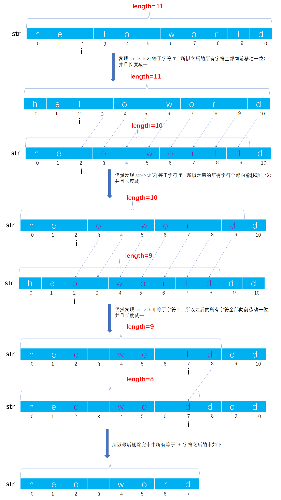

# Example003

## 题目

删除 str 中值为 `ch` 的所有字符，如果 str 为空串，或者串中不含值为 `ch` 的字符，则什么都不做。


## 分析

本题有两种解法：

- 解法一：开辟一个新串空间，将原串中未删除的字符复制到这片新串空间上，然后释放原串空间。
  - 首先，统计出原串中会被删字符的个数，然后通过串长度得出未删除的字符个数，根据它来分配新串的空间。
  - 接着将原串中所有未删除字符复制依次复制到新串中。
  - 最后修改新串长度和释放原串空间。
- 解法二：如果本串采用定长顺序存储串作为串的存储结构，则可以通过移动覆盖元素实现删除。即当发现值等于 `ch` 字符时，将其后所有字符都向前移动一个位置。跟顺序表删除元素一样的算法。


## 图解

以 `str="hello world"; ch='l'` 为例讲解算法二：




## C实现

解法一核心代码：

```c
/**
 * 删除 str 中值为 ch 的所有字符，如果 str 为空串，或者串中不含值为 ch 的字符，则什么都不做
 * @param str 待逆置的串
 * @param ch 待删除的字符
 */
void del(String *str, char ch) {
    // 0.参数校验，如果是空串，则什么都不做
    if (str->length == 0) {
        return;
    }

    // 1.统计被删字符个数，即串中等于 ch 字符的个数
    int count = 0;
    for (int i = 0; i < str->length; i++) {
        if (str->ch[i] == ch) {
            count++;
        }
    }

    // 2.将串 str 中未删除字符复制到新串中
    // 2.1 根据 count 分配新串空间，实际上 temp_ch 相当于 str->ch
    char *temp_ch = (char *) malloc(sizeof(char) * (str->length - count + 1));
    // 2.2 将原串中所有不是 ch 字符的字符复制到新串中
    int i, j;// i 指向原串中的字符下标；j 指向新串中的字符下标
    for (i = 0, j = 0; i < str->length; i++) {
        if (str->ch[i] != ch) {
            // 将原串中的字符复制到新串中
            temp_ch[j] = str->ch[i];
            // 并且新串的下标指针加一
            j++;
        }
    }
    temp_ch[j] = '\0';// 注意为新串添加上串的结束标记 '\0'
    // 2.3 释放原串空间
    free(str->ch);
    // 2.4 修改原串长度
    str->length = str->length - count;
    // 2.5 将原串指针指向新串，这样新串才能被外面所使用到
    str->ch = temp_ch;
}
```

解法二核心代码：

```c
/**
 * 删除 str 中值为 ch 的所有字符，如果 str 为空串，或者串中不含值为 ch 的字符，则什么都不做
 * @param str 待逆置的串
 * @param ch 待删除的字符
 */
void del(String *str, char ch) {
    // 参数校验，如果是空串，则什么都不做
    if (str->length == 0) {
        return;
    }

    // 变量，记录扫描串 str 的索引，即下标
    int i = 0;
    // 扫描整个串中的所有字符
    while (i < str->length) {
        // 如果当前扫描的字符等于给定 ch 字符
        if (str->ch[i] == ch) {
            // 那么将当前字符（不包括当前字符）之后的所有字符向前移动一位，即后面的字符覆盖前面的字符
            for (int j = i; j < str->length - 1; j++) {
                str->ch[j] = str->ch[j + 1];
            }
            // 删除一个字符后，串的长度减一
            str->length--;
        }
            // 如果不等，则继续判断下一个字符，之所以把 i 加一放在 else 语句里面而不是放在外面，是为了避免连续多个相邻的 ch 字符
        else {
            i++;
        }
    }
    // 将串的第 length 字符置为串的结束标记
    str->ch[str->length] = '\0';
}
```

完整代码：

```c
#include <stdio.h>
#include <stdlib.h>

/**
 * 串结构体定义
 */
typedef struct {
    /**
     * 变长分配存储串，表示指向动态分配存储区首地址的字符指针
     */
    char *ch;

    /**
     * 串的长度，即实际字符个数
     */
    int length;
} String;

/**
 * 初始化串
 * @param str 未初始化的串
 */
void init(String *str) {
    str->ch = NULL;
    str->length = 0;
}

/**
 * 将一个常量字符串赋给一个串
 * @param str 串
 * @param ch 常量字符串
 * @return 如果赋值成功则返回 1，否则返回 0 表示赋值失败
 */
int assign(String *str, char *ch) {
    // 0.参数校验，如果 str 中已有字符，那么释放原串空间，因为我们会给它重新分配空间
    if (str->ch != NULL) {
        free(str->ch);
        str->ch = NULL;
    }

    // 1.统计常量字符串 ch 中的字符个数，只有知道它的字符个数，我们才能清楚为 str 分配多少个字符空间
    // 局部变量，存储常量字符串 ch 中的字符个数
    int len = 0;
    // 注意，我们不能直接操作 ch，因为是一个指针变量，在下面的操作后我们会移动指针，会修改掉 ch 原本的值，后面如果需要再使用就不是传入的参数值，所以要创建一个临时局部变量引用它的值来进行操作
    char *c = ch;
    // 从头到尾扫描常量字符串，以结束标记 '\0' 作为循环结束条件
    while (*c != '\0') {
        // 计数器加一
        len++;
        // 指针加一，继续下一个字符
        c++;
    }

    // 2.为串 str 分配空间并赋值
    // 2.1 如果常量字符串长度为 0，那么串 str 也该为一个空串
    if (len == 0) {
        str->ch = NULL;
        str->length = 0;
        return 1;
    }
        // 2.2 如果常量字符串长度不为 0，那么将常量字符串中所有字符赋给串 str
    else {
        // 2.2.1 给串分配 len+1 个存储空间，多分配一个空间是为了存放 '\0' 字符
        str->ch = (char *) malloc(sizeof(char) * (len + 1));
        // 2.2.2 判断是否分配空间成功
        // 2.2.2.1 如果分配空间失败，则返回 0
        if (str->ch == NULL) {
            // 如果分配空间失败，则返回 0
            return 0;
        }
            // 2.2.2.2 如果分配空间成功，则遍历常量字符串中的每个字符，依次赋给串 str
        else {
            // 局部变量，保存常量字符串 ch 的首地址，后续用于操作
            c = ch;
            // 2.2.2.2.1 扫描整个常量字符串，依次将每个字符赋给新串 str
            for (int i = 0; i <= len; i++) {// 之所以在循环条件中使用 <=。是为例将常量字符串最后的 '\0' 字符也复制到新串中作为结束标记
                str->ch[i] = *(c + i);// 其实也可以使用 str->ch[i]=c[i];
            }
            // 2.2.2.2.2 给新串赋予长度，即常量字符串的长度
            str->length = len;
            // 2.2.2.2.3 返回 1 表示赋值成功
            return 1;
        }
    }
}

/**
 * 删除 str 中值为 ch 的所有字符，如果 str 为空串，或者串中不含值为 ch 的字符，则什么都不做
 * @param str 待逆置的串
 * @param ch 待删除的字符
 */
void del(String *str, char ch) {
    // 参数校验，如果是空串，则什么都不做
    if (str->length == 0) {
        return;
    }

    // 变量，记录扫描串 str 的索引，即下标
    int i = 0;
    // 扫描整个串中的所有字符
    while (i < str->length) {
        // 如果当前扫描的字符等于给定 ch 字符
        if (str->ch[i] == ch) {
            // 那么将当前字符（不包括当前字符）之后的所有字符向前移动一位，即后面的字符覆盖前面的字符
            for (int j = i; j < str->length - 1; j++) {
                str->ch[j] = str->ch[j + 1];
            }
            // 删除一个字符后，串的长度减一
            str->length--;
        }
            // 如果不等，则继续判断下一个字符，之所以把 i 加一放在 else 语句里面而不是放在外面，是为了避免连续多个相邻的 ch 字符
        else {
            i++;
        }
    }
    // 将串的第 length 字符置为串的结束标记
    str->ch[str->length] = '\0';
}

int main() {
    String str;
    init(&str);
    assign(&str, "hello world");

    printf("\n删除前的字符串：%s\n", str.ch);
    // 调用函数，进行删除字符串中的字符
    del(&str, 'l');
    printf("\n删除后的字符串：%s\n", str.ch);
}
```

执行结果：

```text
删除前的字符串：
hello world
删除后的字符串：
heo word
```


## Java实现

无。
