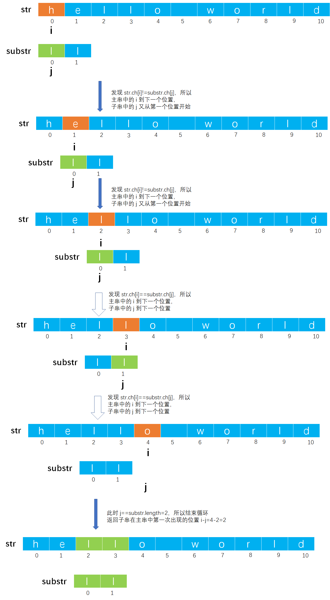

# Example004

## 题目

从串 str 中的 pos 位置起，求出与 substr 串匹配的子串的位置，如果 str 为空串，或者串中不含与 substr 匹配的子串，则返回 -1 做标记。


## 分析

本题考查的是串模式匹配，可以使用简单串模式匹配，也可以使用 KMP 算法模式匹配，后者的时间复杂度更低也更难理解。


## 图解

以 `str="hello world"; substr="ll"` 为例，简单串模式匹配图解如下：




## C实现

简单模式匹配算法核心代码：

```c
/**
 * 从串 str 中的 pos 位置起，求出与 substr 串匹配的子串的位置，如果 str 为空串，或者串中不含与 substr 匹配的子串，则返回 -1 做标记
 * @param str 主串
 * @param substr 子串
 * @param pos 从主串开始匹配的起始位置
 * @return 如果匹配成功则返回子串在主串中第一次出现的位置，否则返回 -1 表示匹配失败
 */
int index(String str, String substr, int pos) {
    // 参数校验，如果位置不合法，也不能匹配
    if (pos < 0 || pos >= str.length) {
        return -1;
    }
    // 参数校验，如果 str 为空串
    if (str.length == 0) {
        return -1;
    }
    // 参数校验，如果子串长度大于 pos 到主串结束的长度，也无法匹配
    if (substr.length > str.length - pos) {
        return -1;
    }

    // 变量，i 记录主串中字符的下标，但是是从 pos 开始的而不是从 0 开始的；j 记录子串中字符的下标，从 0 开始（即从第一个字符开始）
    int i = pos, j = 0;
    // 同时扫描主串和子串
    while (i < str.length && j < substr.length) {
        // 如果主串中 i 所指向的字符等于子串中 j 所指向的字符
        if (str.ch[i] == substr.ch[j]) {
            // 那么 i 和 j 同时加一，继续比较下一对字符
            i++;
            j++;
        }
            // 如果不等，则继续主串下一个字符的比较，但注意恢复 i 和 j
        else {
            // i 从主串的下一个字符开始
            i = i - j + 1;
            // j 又从子串的第一个字符开始
            j = 0;
        }
    }
    // 扫描完成，如果 j 等于子串的长度，那么表示主串中一定有子串，返回 i-j 即子串第一次出现的位置
    if (j == substr.length) {
        return i - j;
    } else {
        // 否则返回 -1 表示子串不存在于主串中
        return -1;
    }
}
```

完整代码：

```c
#include <stdio.h>
#include <stdlib.h>

/**
 * 串结构体定义
 */
typedef struct {
    /**
     * 变长分配存储串，表示指向动态分配存储区首地址的字符指针
     */
    char *ch;

    /**
     * 串的长度，即实际字符个数
     */
    int length;
} String;

/**
 * 初始化串
 * @param str 未初始化的串
 */
void init(String *str) {
    str->ch = NULL;
    str->length = 0;
}

/**
 * 将一个常量字符串赋给一个串
 * @param str 串
 * @param ch 常量字符串
 * @return 如果赋值成功则返回 1，否则返回 0 表示赋值失败
 */
int assign(String *str, char *ch) {
    // 0.参数校验，如果 str 中已有字符，那么释放原串空间，因为我们会给它重新分配空间
    if (str->ch != NULL) {
        free(str->ch);
        str->ch = NULL;
    }

    // 1.统计常量字符串 ch 中的字符个数，只有知道它的字符个数，我们才能清楚为 str 分配多少个字符空间
    // 局部变量，存储常量字符串 ch 中的字符个数
    int len = 0;
    // 注意，我们不能直接操作 ch，因为是一个指针变量，在下面的操作后我们会移动指针，会修改掉 ch 原本的值，后面如果需要再使用就不是传入的参数值，所以要创建一个临时局部变量引用它的值来进行操作
    char *c = ch;
    // 从头到尾扫描常量字符串，以结束标记 '\0' 作为循环结束条件
    while (*c != '\0') {
        // 计数器加一
        len++;
        // 指针加一，继续下一个字符
        c++;
    }

    // 2.为串 str 分配空间并赋值
    // 2.1 如果常量字符串长度为 0，那么串 str 也该为一个空串
    if (len == 0) {
        str->ch = NULL;
        str->length = 0;
        return 1;
    }
        // 2.2 如果常量字符串长度不为 0，那么将常量字符串中所有字符赋给串 str
    else {
        // 2.2.1 给串分配 len+1 个存储空间，多分配一个空间是为了存放 '\0' 字符
        str->ch = (char *) malloc(sizeof(char) * (len + 1));
        // 2.2.2 判断是否分配空间成功
        // 2.2.2.1 如果分配空间失败，则返回 0
        if (str->ch == NULL) {
            // 如果分配空间失败，则返回 0
            return 0;
        }
            // 2.2.2.2 如果分配空间成功，则遍历常量字符串中的每个字符，依次赋给串 str
        else {
            // 局部变量，保存常量字符串 ch 的首地址，后续用于操作
            c = ch;
            // 2.2.2.2.1 扫描整个常量字符串，依次将每个字符赋给新串 str
            for (int i = 0; i <= len; i++) {// 之所以在循环条件中使用 <=。是为例将常量字符串最后的 '\0' 字符也复制到新串中作为结束标记
                str->ch[i] = *(c + i);// 其实也可以使用 str->ch[i]=c[i];
            }
            // 2.2.2.2.2 给新串赋予长度，即常量字符串的长度
            str->length = len;
            // 2.2.2.2.3 返回 1 表示赋值成功
            return 1;
        }
    }
}

/**
 * 从串 str 中的 pos 位置起，求出与 substr 串匹配的子串的位置，如果 str 为空串，或者串中不含与 substr 匹配的子串，则返回 -1 做标记
 * @param str 主串
 * @param substr 子串
 * @param pos 从主串开始匹配的起始位置
 * @return 如果匹配成功则返回子串在主串中第一次出现的位置，否则返回 -1 表示匹配失败
 */
int index(String str, String substr, int pos) {
    // 参数校验，如果位置不合法，也不能匹配
    if (pos < 0 || pos >= str.length) {
        return -1;
    }
    // 参数校验，如果 str 为空串
    if (str.length == 0) {
        return -1;
    }
    // 参数校验，如果子串长度大于 pos 到主串结束的长度，也无法匹配
    if (substr.length > str.length - pos) {
        return -1;
    }

    // 变量，i 记录主串中字符的下标，但是是从 pos 开始的而不是从 0 开始的；j 记录子串中字符的下标，从 0 开始（即从第一个字符开始）
    int i = pos, j = 0;
    // 同时扫描主串和子串
    while (i < str.length && j < substr.length) {
        // 如果主串中 i 所指向的字符等于子串中 j 所指向的字符
        if (str.ch[i] == substr.ch[j]) {
            // 那么 i 和 j 同时加一，继续比较下一对字符
            i++;
            j++;
        }
            // 如果不等，则继续主串下一个字符的比较，但注意恢复 i 和 j
        else {
            // i 从主串的下一个字符开始
            i = i - j + 1;
            // j 又从子串的第一个字符开始
            j = 0;
        }
    }
    // 扫描完成，如果 j 等于子串的长度，那么表示主串中一定有子串，返回 i-j 即子串第一次出现的位置
    if (j == substr.length) {
        return i - j;
    } else {
        // 否则返回 -1 表示子串不存在于主串中
        return -1;
    }
}

int main() {
    // 声明主串
    String str;
    init(&str);
    assign(&str, "hello world");

    // 声明子串
    String substr;
    init(&substr);
    assign(&substr, "ll");

    // 调用函数，匹配子串的位置
    int idx;
    idx = index(str, substr, 1);
    printf("%d\n", idx);
}
```

执行结果：

```text
2
```


## Java实现

无。
