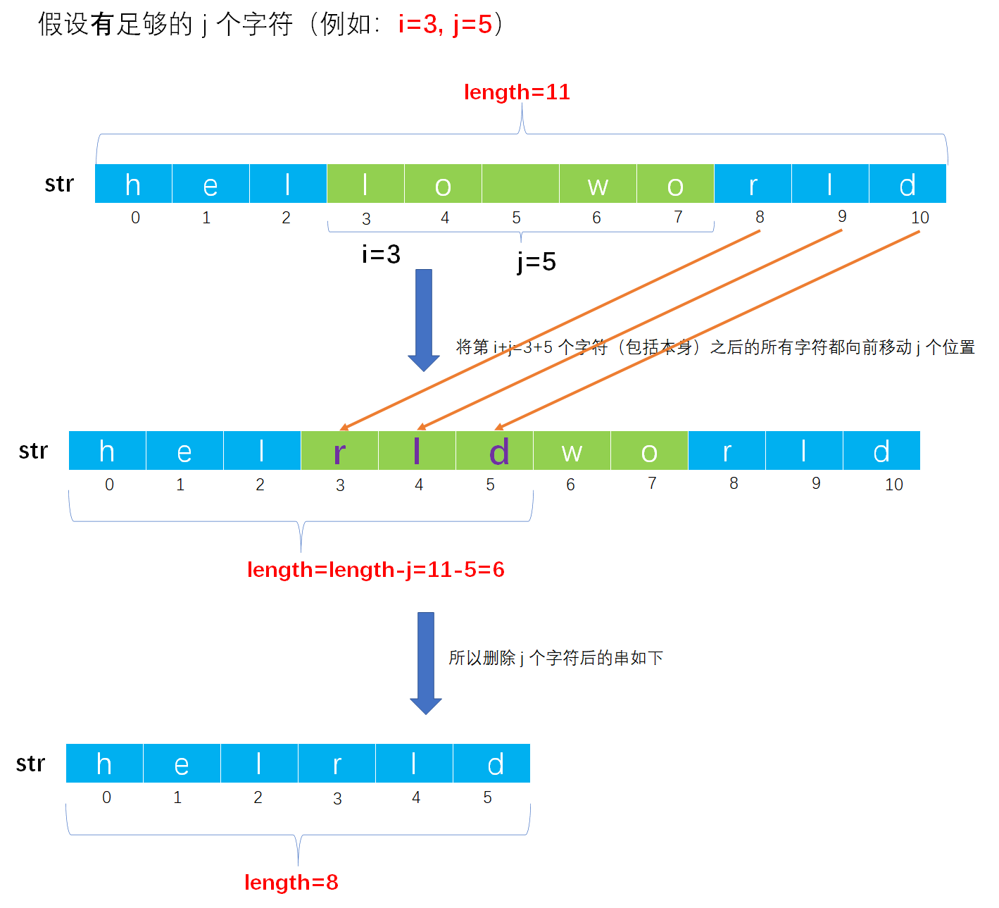
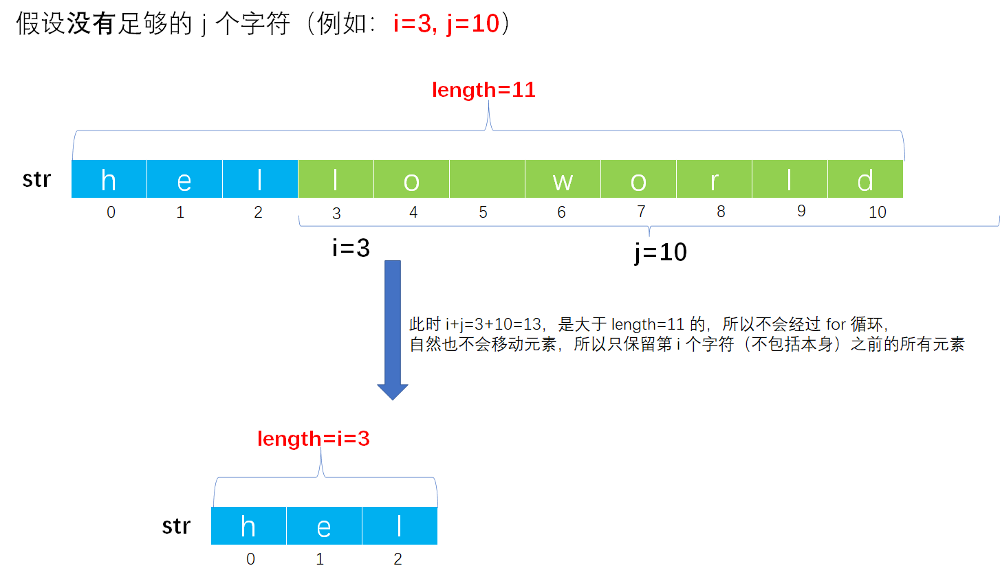

# Example005

## 题目

采用定长顺序存储表示串，编写一个函数，删除串中从下标为 i 的字符开始的 j 个字符，如果下标为 i 的字符后没有足够的 j 个字符，则有几个删除几个。


## 分析

从下标为 `i+j` 个字符开始，将所有的字符向前移动 j 个单位，然后将字符串长度缩减为被删字符的个数即可。

> 注：之前也写过这道题，可参考：[考研数据结构之串（4.4）——练习题之编写一个函数来删除串中从下标为i的字符开始的j个字符，如果下标为i的字符后没有足够的j个字符，则有几个删除几个（C表示）](https://blog.csdn.net/cnds123321/article/details/106524252)。


## 图解






## C实现

核心代码：

```c
/**
 * 采用定长顺序存储表示串，编写一个函数，删除串中从下标为 i 的字符开始的 j 个字符，如果下标为 i 的字符后没有足够的 j 个字符，则有几个删除几个
 * @param str 串
 * @param i 删除的起始下标，包括本身
 * @param j 删除的字符个数
 */
void del(String *str, int i, int j) {
    // 参数校验，如果是空串则什么都不做
    if (str->length == 0) {
        return;
    }
    // 参数校验，如果 i 不合法则什么都不做
    if (i < 0 || i >= str->length) {
        return;
    }
    // 参数校验，如果 j 不合法则什么都不做
    if (j < 0) {
        return;
    }

    // 将第 i+j 个字符（包括它本身）之后的所有字符向前移动 j 个位置
    for (int m = i + j; m < str->length; m++) {
        str->ch[m - j] = str->ch[m];
    }
    // 调整串长，需要考虑两种情况
    str->length = (str->length - i < j) ? i : str->length - j;
    // 将串第 length 位置的字符置为结束标记 '\0'
    str->ch[str->length] = '\0';
}
```

完整代码：

```c
#include <stdio.h>
#include <stdlib.h>

#define MAXSIZE 100

/**
 * 串结构体定义
 */
typedef struct {
    /**
     * 变长分配存储串，表示指向动态分配存储区首地址的字符指针
     */
    char ch[MAXSIZE + 1];

    /**
     * 串的长度，即实际字符个数
     */
    int length;
} String;

/**
 * 初始化串
 * @param str 未初始化的串
 */
void init(String *str) {
    str->length = 0;
}

/**
 * 将一个常量字符串赋给一个串
 * @param str 串
 * @param ch 常量字符串
 * @return 如果赋值成功则返回 1，否则返回 0 表示赋值失败
 */
int assign(String *str, char *ch) {
    // 1.统计常量字符串 ch 中的字符个数，只有知道它的字符个数，我们才能清楚为 str 分配多少个字符空间
    // 局部变量，存储常量字符串 ch 中的字符个数
    int len = 0;
    // 注意，我们不能直接操作 ch，因为是一个指针变量，在下面的操作后我们会移动指针，会修改掉 ch 原本的值，后面如果需要再使用就不是传入的参数值，所以要创建一个临时局部变量引用它的值来进行操作
    char *c = ch;
    // 从头到尾扫描常量字符串，以结束标记 '\0' 作为循环结束条件
    while (*c != '\0') {
        // 计数器加一
        len++;
        // 指针加一，继续下一个字符
        c++;
    }

    // 2.为串 str 分配空间并赋值
    // 2.1 如果常量字符串长度为 0，那么串 str 也该为一个空串
    if (len == 0) {
        str->length = 0;
        return 1;
    }
        // 2.2 如果常量字符串长度不为 0，那么将常量字符串中所有字符赋给串 str
    else {
        // 局部变量，保存常量字符串 ch 的首地址，后续用于操作
        c = ch;
        // 2.2.2.2.1 扫描整个常量字符串，依次将每个字符赋给新串 str
        for (int i = 0; i <= len; i++) {// 之所以在循环条件中使用 <=。是为例将常量字符串最后的 '\0' 字符也复制到新串中作为结束标记
            str->ch[i] = *(c + i);// 其实也可以使用 str->ch[i]=c[i];
        }
        // 2.2.2.2.2 给新串赋予长度，即常量字符串的长度
        str->length = len;
        // 2.2.2.2.3 返回 1 表示赋值成功
        return 1;
    }
}

/**
 * 采用定长顺序存储表示串，编写一个函数，删除串中从下标为 i 的字符开始的 j 个字符，如果下标为 i 的字符后没有足够的 j 个字符，则有几个删除几个
 * @param str 串
 * @param i 删除的起始下标，包括本身
 * @param j 删除的字符个数
 */
void del(String *str, int i, int j) {
    // 参数校验，如果是空串则什么都不做
    if (str->length == 0) {
        return;
    }
    // 参数校验，如果 i 不合法则什么都不做
    if (i < 0 || i >= str->length) {
        return;
    }
    // 参数校验，如果 j 不合法则什么都不做
    if (j < 0) {
        return;
    }

    // 将第 i+j 个字符（包括它本身）之后的所有字符向前移动 j 个位置
    for (int m = i + j; m < str->length; m++) {
        str->ch[m - j] = str->ch[m];
    }
    // 调整串长，需要考虑两种情况
    str->length = (str->length - i < j) ? i : str->length - j;
    // 将串第 length 位置的字符置为结束标记 '\0'
    str->ch[str->length] = '\0';
}

int main() {
    // 声明串
    String str;
    init(&str);
    assign(&str, "hello world");

    // 调用函数
    printf("\n删除前的字符串：%s\n", str.ch);
    del(&str, 3, 5);
    printf("\n删除后的字符串：%s\n", str.ch);
}
```

执行结果：

```text
删除前的字符串：hello world

删除后的字符串：helrld
```


## Java实现

无。