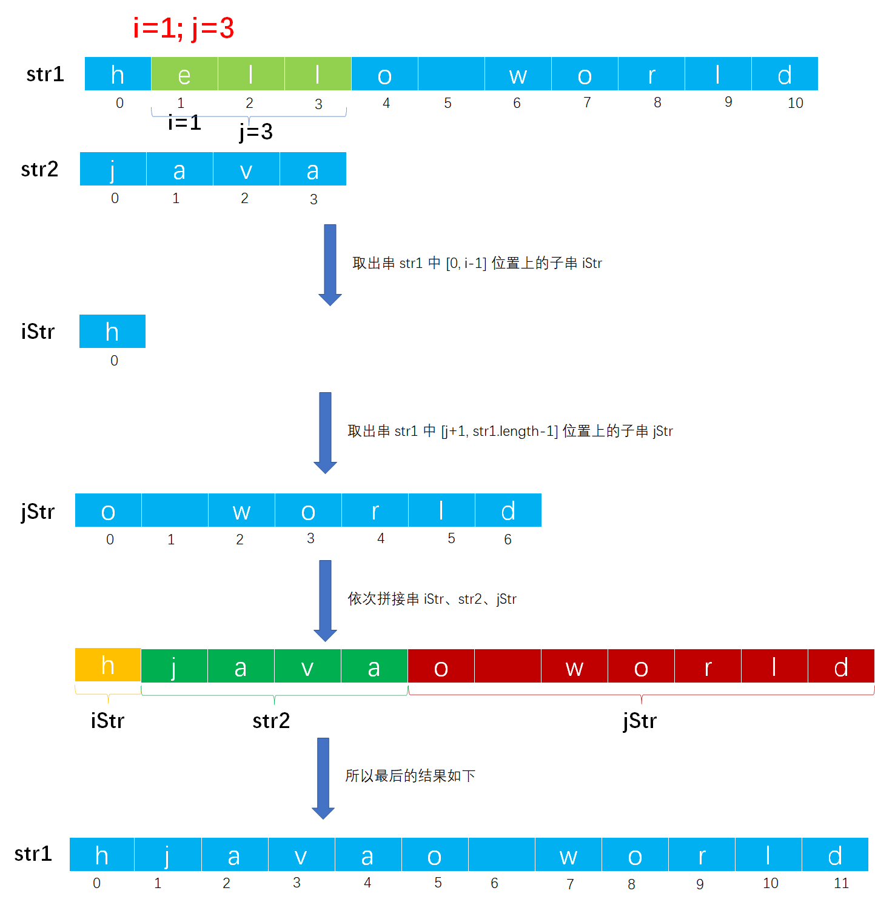

# Example006

## 题目

采用顺序存储方式存储串，编写一个函数，将串 `str1` 中的下标 i 到下标 j 之间的字符（包括 i 和 j 两个位置上的字符）用串 `str2` 替换。


## 分析

本题的思路是取出串 `str1` 中 `[0, i-1]` 位置上的子串 `iStr`，再取串 `str1` 中 `[j+1, str1.length-1]`  位置上的子串 `jStr`，最后依次连接串 `iStr`、`str2`、`jStr` 即可。

这里会用到串已经定义好的函数 `substring` 和 `concat`，分别用来取子串和连接串。


## 图解

以 `str1="hello world"; i=1; j=3; str2="java"` 为例，图解如下：




## C实现

核心代码：

```c
/**
 * 采用顺序存储方式存储串，编写一个函数，将串 str1 中的下标 i 到下标 j 之间的字符（包括 i 和 j 两个位置上的字符）用串 str2 替换
 * @param str1 串
 * @param i 起始下标，从 0 开始
 * @param j
 * @param str2
 */
void replace(String *str1, int i, int j, String str2) {
    // 0.参数校验
    // 0.1 校验下标 i，如果下标 i 不合法则什么都不做
    if (i < 0 || i >= str1->length) {
        return;
    }
    // 0.2 校验下标 j，如果下标 j 不合法则什么都不做
    if (j < 0 || j >= str1->length) {
        return;
    }
    // 0.3 如果下标 j 小于 i 也是不合法的
    if (j < i) {
        return;
    }

    // 1.替换字符串
    // 1.1 获取串 str1 中前 i 个字符组成的串
    String iStr;// 用来存储串 str1 前 i 个字符组成的串
    init(&iStr);// 初始化串是为了将串的 length 置为 0
    substring(&iStr, *str1, 0, i);
    // 1.2 获取串 str1 中后 j 个字符组成的串
    String jStr;// 用来存储串 str1 后 j 个字符组成的串
    init(&jStr);
    substring(&jStr, *str1, j + 1, str1->length - j - 1);
    // 1.3 首先拼接串 iStr 和串 str2
    String str;// 用来存储串 iStr 和串 str2 拼接后的结果
    init(&str);
    concat(&str, iStr, str2);
    // 1.4 接着拼接新串 str 和串 jStr，并且将拼接结果存储到串 str1 中
    concat(str1, str, jStr);
}
```

完整代码：

```c
#include <stdio.h>

#define MAXSIZE 100

/**
 * 串结构体定义
 */
typedef struct {
    /**
     * 变长分配存储串，表示指向动态分配存储区首地址的字符指针
     */
    char ch[MAXSIZE + 1];

    /**
     * 串的长度，即实际字符个数
     */
    int length;
} String;

/**
 * 初始化串
 * @param str 未初始化的串
 */
void init(String *str) {
    str->length = 0;
}

/**
 * 将一个常量字符串赋给一个串
 * @param str 串
 * @param ch 常量字符串
 * @return 如果赋值成功则返回 1，否则返回 0 表示赋值失败
 */
int assign(String *str, char *ch) {
    // 1.统计常量字符串 ch 中的字符个数，只有知道它的字符个数，我们才能清楚为 str 分配多少个字符空间
    // 局部变量，存储常量字符串 ch 中的字符个数
    int len = 0;
    // 注意，我们不能直接操作 ch，因为是一个指针变量，在下面的操作后我们会移动指针，会修改掉 ch 原本的值，后面如果需要再使用就不是传入的参数值，所以要创建一个临时局部变量引用它的值来进行操作
    char *c = ch;
    // 从头到尾扫描常量字符串，以结束标记 '\0' 作为循环结束条件
    while (*c != '\0') {
        // 计数器加一
        len++;
        // 指针加一，继续下一个字符
        c++;
    }

    // 2.为串 str 分配空间并赋值
    // 2.1 如果常量字符串长度为 0，那么串 str 也该为一个空串
    if (len == 0) {
        str->length = 0;
        return 1;
    }
        // 2.2 如果常量字符串长度不为 0，那么将常量字符串中所有字符赋给串 str
    else {
        // 局部变量，保存常量字符串 ch 的首地址，后续用于操作
        c = ch;
        // 2.2.2.2.1 扫描整个常量字符串，依次将每个字符赋给新串 str
        for (int i = 0; i <= len; i++) {// 之所以在循环条件中使用 <=。是为例将常量字符串最后的 '\0' 字符也复制到新串中作为结束标记
            str->ch[i] = *(c + i);// 其实也可以使用 str->ch[i]=c[i];
        }
        // 2.2.2.2.2 给新串赋予长度，即常量字符串的长度
        str->length = len;
        // 2.2.2.2.3 返回 1 表示赋值成功
        return 1;
    }
}

/**
 * 连接字符串，用 str 返回由 s1 和 s2 连接而成的新串
 * @param str 用来保存连接后的新串
 * @param s1 第一个串
 * @param s2 第二个串
 * @return 如果连接成功则返回 1，否则返回 0
 */
int concat(String *str, String s1, String s2) {
    // 0.参数校验
    // 0.1 参数校验，如果 str 是非空串，则释放其原本的空间，因为要存储合并后的串内容
    // 0.2 参数校验，如果两个串的长度之和为 0，那么新串一定是一个空串
    if (s1.length + s2.length == 0) {
        str->length = 0;
        return 1;
    }

    // 1.连接串 s1 和 s2
    // 1.2 先将串 s1 中的所有字符复制到串 str 中
    for (int i = 0; i < s1.length; i++) {
        str->ch[i] = *(s1.ch + i);
    }
    // 1.3 接着将串 s2 中的所有字符复制到串 str 中
    for (int i = 0; i <= s2.length; i++) {// 将串 s2 中的结束标记 '\0' 也复制过来
        str->ch[s1.length + i] = *(s2.ch + i);
    }
    // 1.4 为连接后的串指定长度
    str->length = s1.length + s2.length;
    // 1.5 返回 1 表示连接成功
    return 1;
}

/**
 * 求子串，用 substr 返回串 str 的第 pos 个字符起长度为 len 的子串
 * @param substr 用来保存子串
 * @param str 主串
 * @param pos 起始位置，从 0 开始
 * @param len 子串的长度
 * @return 如果获取成功则返回 1，否则返回 0 表示失败
 */
int substring(String *substr, String str, int pos, int len) {
    // 0.参数校验
    // 0.1 校验参数 pos，位置必须在 [0, str.length) 之间，即下标的范围内，否则就是不合法
    if (pos < 0 || pos >= str.length) {
        return 0;
    }
    //  0.2 校验参数 len，子串长度不能小于 0；也不能大于 length-pos
    if (len < 0 || str.length - pos < len) {
        return 0;
    }
    // 0.3 如果要求的子串长度为 0，那么返回的子串为空串，直接返回即可
    if (len == 0) {
        substr->length = 0;
        return 1;
    }

    // 1.求子串
    // 1.2 将主串中第 pos 个位置（包括本身）之后的 len 个字符复制到子串中
    int i = 0;
    for (i = 0; i < len; i++) {
        // 星号用来取值，其实也可以写成这样：substr->ch[i]=str.ch[pos+i];
        substr->ch[i] = *(str.ch + pos + i);
    }
    // 1.3 让串的最后一个字符是 '\0'，表示是串的结束标记
    substr->ch[i] = '\0';
    // 1.4 置子串的长度为 len
    substr->length = len;
    // 1.5 返回 1 表示求子串成功
    return 1;
}

/**
 * 打印字符串，是根据 length 实际字符个数来打印字符串的，而非打印 ch 所指向的所有字符
 * @param 串
 */
void print(String str) {
    for (int i = 0; i < str.length; i++) {
        printf("%c", str.ch[i]);
    }
}

/**
 * 采用顺序存储方式存储串，编写一个函数，将串 str1 中的下标 i 到下标 j 之间的字符（包括 i 和 j 两个位置上的字符）用串 str2 替换
 * @param str1 串
 * @param i 起始下标，从 0 开始
 * @param j
 * @param str2
 */
void replace(String *str1, int i, int j, String str2) {
    // 0.参数校验
    // 0.1 校验下标 i，如果下标 i 不合法则什么都不做
    if (i < 0 || i >= str1->length) {
        return;
    }
    // 0.2 校验下标 j，如果下标 j 不合法则什么都不做
    if (j < 0 || j >= str1->length) {
        return;
    }
    // 0.3 如果下标 j 小于 i 也是不合法的
    if (j < i) {
        return;
    }

    // 1.替换字符串
    // 1.1 获取串 str1 中前 i 个字符组成的串
    String iStr;// 用来存储串 str1 前 i 个字符组成的串
    init(&iStr);// 初始化串是为了将串的 length 置为 0
    substring(&iStr, *str1, 0, i);
    // 1.2 获取串 str1 中后 j 个字符组成的串
    String jStr;// 用来存储串 str1 后 j 个字符组成的串
    init(&jStr);
    substring(&jStr, *str1, j + 1, str1->length - j - 1);
    // 1.3 首先拼接串 iStr 和串 str2
    String str;// 用来存储串 iStr 和串 str2 拼接后的结果
    init(&str);
    concat(&str, iStr, str2);
    // 1.4 接着拼接新串 str 和串 jStr，并且将拼接结果存储到串 str1 中
    concat(str1, str, jStr);
}


int main() {
    // 声明串 str1
    String str1;
    init(&str1);
    assign(&str1, "hello world");

    // 声明串 str2
    String str2;
    init(&str2);
    assign(&str2, "java");

    // 调用函数
    replace(&str1, 1, 3, str2);
    printf("%s\n", str1.ch);
}
```

执行结果：

```text
hjavao world
```


## Java实现

无。
