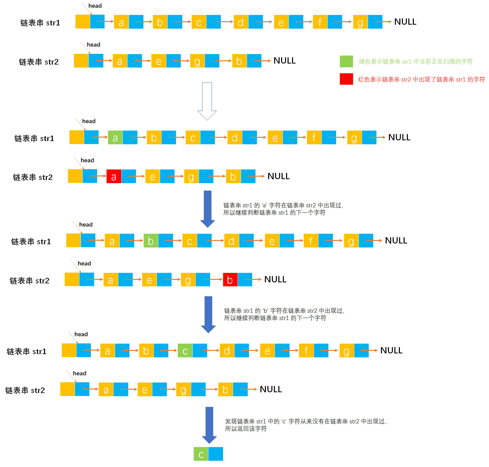

# Example008

## 题目

构造串的链表结点数据结构（每个结点内存储一个字符），编写一个函数，找出串 `str1` 中第一个不在串 `str2` 中出现的字符。


## 分析

所谓串的链表结点数据结构，就是单链表，只不过存储的数据类型变成了 `char` 类型。

而本题的算法思想是：从头到尾扫描串 `str1`，对于 `str1` 中的每一个结点判断是否在 `str2` 中出现，若出现，则继续扫描 `str1` 中的下一个字符；若没有出现，则返回当前检测的字符。如果 `str1` 中的所有字符都在 `str2` 中出现，则返回 `'\0'`。

即双层 for 循环，算法思想是很简单，无非就是双层遍历。


## 图解




## C实现

核心代码：

```c
/**
 * 找出串 str1 中第一个不在串 str2 中出现的字符
 * @param str1 第一个链表串
 * @param str2 第二个链表串
 * @return 如果存在 str1 中不在串 str2 中出现的字符则进行返回，否则返回 '\0' 表示不存在
 */
char find(SNode *str1, SNode *str2) {
    // 由于单链表是带头结点的，所以 node1 表示串 str1 的开始结点
    SNode *node1 = str1->next;
    // 从头到尾扫描链表串 str1 中的每个结点
    while (node1 != NULL) {
        // 局部变量，用作标记，标记 node1 是否在链表串 str1 中出现过，如果出现过则为 1，没有出现过则为 0
        int flag = 0;
        // 局部变量，链表串 str1 的开始结点
        SNode *node2 = str2->next;
        // 从头到尾扫描链表串 str2 中的每个字符
        while (node2 != NULL) {
            // 如果 node1 与链表串 str2 中某个结点的值相等，则表示 node1 在链表串 str2 中出现过
            if (node1->data == node2->data) {
                // 则将标记置为 1，表示出现过
                flag = 1;
            }
            // 继续链表串 str2 的下一个结点
            node2 = node2->next;
        }
        // 扫描完链表串 str2 之后，就需要判断标记 flag 了，如果标记为 0，表示 node1 没有在链表串 str2 中出现过
        if (flag == 0) {
            // 那么就返回该字符
            return node1->data;
        }
        // 否则继续判断链表串 str1 的下一个结点
        node1 = node1->next;
    }
    // 如果 str1 中所有字符都在 str2 中出现过则返回
    return '\0';
}
```

完整代码：

```c
#include <stdio.h>
#include <malloc.h>

/**
 * 单链表节点
 */
typedef struct SNode {
    /**
     * 单链表节点的数据域
     */
    char data;
    /**
     * 单链表节点的的指针域，指向当前节点的后继节点
     */
    struct SNode *next;
} SNode;

/**
 * 初始化单链表
 * @param list 待初始化的单链表
 */
void init(SNode **list) {
    // 创建头结点，分配空间
    *list = (SNode *) malloc(sizeof(SNode));
    // 同时将头节点的 next 指针指向 NULL，因为空链表没有任何节点
    (*list)->next = NULL;
}

/**
 * 通过尾插法创建单链表
 * @param list 单链表
 * @param nums 创建单链表时插入的数据数组
 * @param n 数组长度
 * @return 创建好的单链表
 */
SNode *createByTail(SNode **list, char nums[], int n) {
    // 1.初始化单链表
    // 创建链表必须要先初始化链表，也可以选择直接调用 init() 函数
    *list = (SNode *) malloc(sizeof(SNode));
    (*list)->next = NULL;

    // 尾插法，必须知道链表的尾节点（即链表的最后一个节点），初始时，单链表的头结点就是尾节点
    // 因为在单链表中插入节点我们必须知道前驱节点，而头插法中的前驱节点一直是头节点，但尾插法中要在单链表的末尾插入新节点，所以前驱节点一直都是链表的最后一个节点，而链表的最后一个节点由于链表插入新节点会一直变化
    SNode *node = (*list);

    // 2.循环数组，将所有数依次插入到链表的尾部
    for (int i = 0; i < n; i++) {
        // 2.1 创建新节点，并指定数据域和指针域
        // 2.1.1 创建新节点，为其分配空间
        SNode *newNode = (SNode *) malloc(sizeof(SNode));
        // 2.1.2 为新节点指定数据域
        newNode->data = nums[i];
        // 2.1.3 为新节点指定指针域，新节点的指针域初始时设置为 null
        newNode->next = NULL;

        // 2.2 将新节点插入到单链表的尾部
        // 2.2.1 将链表原尾节点的 next 指针指向新节点
        node->next = newNode;
        // 2.2.2 将新节点置为新的尾节点
        node = newNode;
    }
    return *list;
}

/**
 * 打印链表的所有节点
 * @param list 单链表
 */
void print(SNode *list) {
    printf("[");
    // 链表的第一个节点
    SNode *node = list->next;
    // 循环单链表所有节点，打印值
    while (node != NULL) {
        printf("%c", node->data);
        if (node->next != NULL) {
            printf(", ");
        }
        node = node->next;
    }
    printf("]\n");
}

/**
 * 找出串 str1 中第一个不在串 str2 中出现的字符
 * @param str1 第一个链表串
 * @param str2 第二个链表串
 * @return 如果存在 str1 中不在串 str2 中出现的字符则进行返回，否则返回 '\0' 表示不存在
 */
char find(SNode *str1, SNode *str2) {
    // 由于单链表是带头结点的，所以 node1 表示串 str1 的开始结点
    SNode *node1 = str1->next;
    // 从头到尾扫描链表串 str1 中的每个结点
    while (node1 != NULL) {
        // 局部变量，用作标记，标记 node1 是否在链表串 str1 中出现过，如果出现过则为 1，没有出现过则为 0
        int flag = 0;
        // 局部变量，链表串 str1 的开始结点
        SNode *node2 = str2->next;
        // 从头到尾扫描链表串 str2 中的每个字符
        while (node2 != NULL) {
            // 如果 node1 与链表串 str2 中某个结点的值相等，则表示 node1 在链表串 str2 中出现过
            if (node1->data == node2->data) {
                // 则将标记置为 1，表示出现过
                flag = 1;
            }
            // 继续链表串 str2 的下一个结点
            node2 = node2->next;
        }
        // 扫描完链表串 str2 之后，就需要判断标记 flag 了，如果标记为 0，表示 node1 没有在链表串 str2 中出现过
        if (flag == 0) {
            // 那么就返回该字符
            return node1->data;
        }
        // 否则继续判断链表串 str1 的下一个结点
        node1 = node1->next;
    }
    // 如果 str1 中所有字符都在 str2 中出现过则返回
    return '\0';
}

int main() {
    // 声明链表串 str1
    SNode *str1;
    init(&str1);
    char chs1[] = "abcdefg";
    int n1 = 7;
    createByTail(&str1, chs1, n1);
    print(str1);

    // 声明链表串 str2
    SNode *str2;
    init(&str2);
    char chs2[] = "aegb";
    int n2 = 4;
    createByTail(&str2, chs2, n2);
    print(str2);

    // 调用函数进行判断
    char c;
    c = find(str1, str2);
    printf("str1第一个不在串str2中出现的字符是：%c", c);
}
```

执行结果：

```text
[a, b, c, d, e, f, g]
[a, e, g, b]
str1第一个不在串str2中出现的字符是：c
```


## Java实现

无。