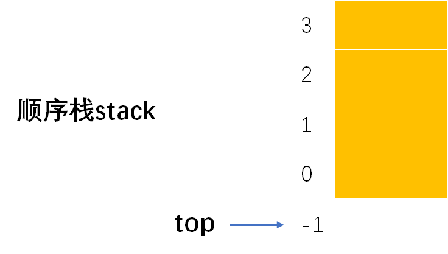
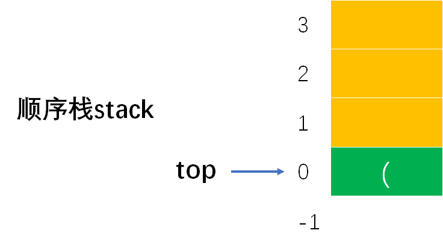
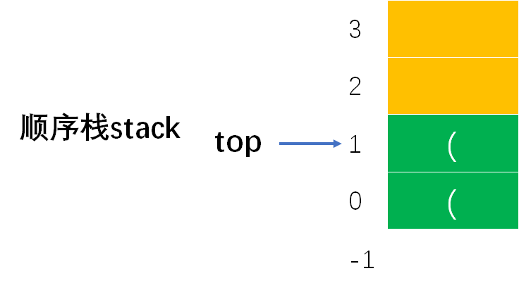
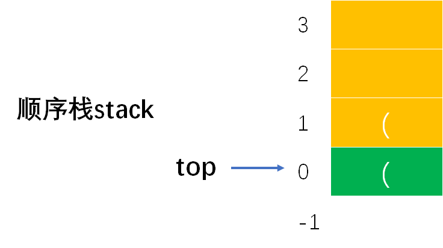

# Example001

## 题目

C 语言中算术表达式中的括号只有小括号。编写算法，判断一个表达式中的括号是否正确配对，表达式已经存入字符数组 `exp[]` 中，表达式的字符个数为 `n`。


## 分析

例如算术表达式：`3*(a++)+c*(b+(2+d))+d*3`。其实表达式中括号匹配分为如下三种情况：
- 完全匹配，如 `((()))` 中左括号 `(` 和右括号 `)` 的个数是完全相等的。如果将左括号入栈，右括号与栈顶元素进行比较，那么最后栈为空，表示匹配成功。
- 不完全匹配，如 `(()))` 中左括号 `(` 和右括号 `)` 的个数不完全相等，并且右括号的个数大于左括号的个数。如果将左括号入栈，右括号与栈顶元素进行比较，那么一定会出现空栈与右括号比较的情况，表示匹配失败。
- 不完全匹配，如 `((())` 中左括号 `(` 和右括号 `)` 的个数不完全相等，并且左括号的个数大于右括号的个数。如果将左括号入栈，右括号与栈顶元素进行比较，当遍历完字符数组后，那么栈中一定还剩余左括号，表示匹配失败。

其实看到上面的三种情况，就明白了，我们只需要处理小括号字符，不关注其他非小括号字符，并且将左括号字符加入到栈中，将右括号字符与左括号字符进行配对比较。

下面的代码中使用的是标准的顺序栈，而非一个简单的数组，书中采用的就是利用简单的数组来实现栈的功能。具体可参考：[考研数据结构之栈（2.3）——练习题之判断表达式中的括号是否正确配对（C表示）](https://blog.csdn.net/cnds123321/article/details/106278770)


## 图解

以 `3*(a++)+c*(b+(2+d))+d*3` 为例，步骤如下：

- （0）空顺序栈如下：



- （1）第一个扫描到的字符是 `3`，既不是左圆括号，也不是右圆括号，所以跳过，继续判断下一个字符。
- （2）接着扫描到的字符是 `*`，既不是左圆括号，也不是右圆括号，所以跳过，继续判断下一个字符。
- （3）接着扫描到的字符是 `(`，是左圆括号，将其入栈。此时顺序栈如图所示：



- （4）接着扫描到的字符是 `a`，既不是左圆括号，也不是右圆括号，所以跳过，继续判断下一个字符。
- （5）接着扫描到的字符是 `+`，既不是左圆括号，也不是右圆括号，所以跳过，继续判断下一个字符。
- （6）接着扫描到的字符是 `+`，既不是左圆括号，也不是右圆括号，所以跳过，继续判断下一个字符。
- （7）接着扫描到的字符是 `)`，是右圆括号，判断是否栈空，如果栈空则直接返回 0 表示不匹配；如果栈非空则将栈顶元素（即左圆括号）出栈，即 `(` 与 `)` 相互配对。此时顺序栈如图所示：


- （8）接着扫描到的字符是 `+`，既不是左圆括号，也不是右圆括号，所以跳过，继续判断下一个字符。
- （9）接着扫描到的字符是 `c`，既不是左圆括号，也不是右圆括号，所以跳过，继续判断下一个字符。
- （10）接着扫描到的字符是 `*`，既不是左圆括号，也不是右圆括号，所以跳过，继续判断下一个字符。
- （11）接着扫描到的字符是 `(`，是左圆括号，将其入栈。此时顺序栈如图所示：


- （12）接着扫描到的字符是 `b`，既不是左圆括号，也不是右圆括号，所以跳过，继续判断下一个字符。
- （13）接着扫描到的字符是 `+`，既不是左圆括号，也不是右圆括号，所以跳过，继续判断下一个字符。
- （14）接着扫描到的字符是 `(`，是左圆括号，将其入栈。此时顺序栈如图所示：



- （15）接着扫描到的字符是 `2`，既不是左圆括号，也不是右圆括号，所以跳过，继续判断下一个字符。
- （16）接着扫描到的字符是 `+`，既不是左圆括号，也不是右圆括号，所以跳过，继续判断下一个字符。
- （16）接着扫描到的字符是 `d`，既不是左圆括号，也不是右圆括号，所以跳过，继续判断下一个字符。
- （17）接着扫描到的字符是 `)`，是右圆括号，判断是否栈空，如果栈空则直接返回 0 表示不匹配；如果栈非空则将栈顶元素（即左圆括号）出栈，即 `(` 与 `)` 相互配对。此时顺序栈如图所示：



- （18）接着扫描到的字符是 `)`，是右圆括号，判断是否栈空，如果栈空则直接返回 0 表示不匹配；如果栈非空则将栈顶元素（即左圆括号）出栈，即 `(` 与 `)` 相互配对。此时顺序栈如图所示：


- （19）接着扫描到的字符是 `+`，既不是左圆括号，也不是右圆括号，所以跳过，继续判断下一个字符。
- （20）接着扫描到的字符是 `d`，既不是左圆括号，也不是右圆括号，所以跳过，继续判断下一个字符。
- （21）接着扫描到的字符是 `*`，既不是左圆括号，也不是右圆括号，所以跳过，继续判断下一个字符。
- （22）接着扫描到的字符是 `3`，既不是左圆括号，也不是右圆括号，所以跳过，继续判断下一个字符。
- （23）扫描完成，判断顺序栈是否为空，如果为空则表示所有圆括号配对成功；如果不为空则表示左圆括号多于右圆括号，也配对失败。


## C实现

核心代码：

```c
/**
 * 判断字符序列中的小括号是否匹配
 * @param exp 包括小括号的字符序列
 * @param n 数组长度
 * @return 如果字符序列中的小括号完全匹配则返回 1，否则返回 0 表示匹配失败
 */
int isMatch(char exp[], int n) {
    // 声明一个顺序栈并初始化，用来存储小括号
    SeqStack stack;
    init(&stack);

    // 局部变量，无任何实际意义，仅用于填充 pop 函数的第二个参数
    char top;
    // 扫描字符数组，循环遍历每个字符
    for (int i = 0; i < n; i++) {
        // 如果是小括号中的左括号（即 '('），将其存储到顺序栈中
        if (exp[i] == '(') {
            push(&stack, exp[i]);
        }
        // 如果是小括号中的右括号（即 ')'），那么将栈顶元素出栈
        else if (exp[i] == ')') {
            // 注意，有可能栈空，那么就是右括号至少多一个，那么表达式中的括号一定不会是配对的
            if (isEmpty(stack)) {
                // 所以直接返回 0 表示不配对
                return 0;
            } else {
                // 如果栈不为空，才将顺序栈栈顶元素出栈，表示一对括号匹配成功
                pop(&stack, &top);
            }
        }
    }
    // 如果是空栈，表示所有括号正确匹配；如果不是空栈，那么就是右括号至少多一个，那么表达式中的括号一定不会是配对的
    if (isEmpty(stack)) {
        return 1;
    } else {
        return 0;
    }
}
```

完整代码：

```c
#include <stdio.h>

/**
 * 顺序栈最大存储的元素个数
 */
#define MAXSIZE 100

/**
 * 顺序栈结构体定义
 */
typedef struct {
    /**
     * 数据域，数组，用来存储栈中元素
     */
    char data[MAXSIZE];
    /**
     * 指针域，表示栈顶指针，实际上就是数组下标
     */
    int top;
} SeqStack;

/**
 * 初始化顺序栈，即将栈顶指针指向 -1 表示空栈
 * @param stack 顺序栈
 */
void init(SeqStack *stack) {
    // 设定让栈顶指针指向 -1 表示为栈空
    stack->top = -1;
}

/**
 * 判断顺序栈是否为空
 * @param stack 顺序栈
 * @return 如果顺序栈为空则返回 1，否则返回 0
 */
int isEmpty(SeqStack stack) {
    // 只需要判断栈顶指针是否等于 -1 即可，如果是空栈则返回 1，不是空栈则返回 0
    if (stack.top == -1) {
        return 1;
    } else {
        return 0;
    }
}

/**
 * 将元素入栈
 * @param stack 顺序栈
 * @param ele 元素值
 * @return 如果栈满则返回 0 表示入栈失败；如果插入成功则返回 1
 */
int push(SeqStack *stack, char ele) {
    // 1.参数校验，如果栈满则不能入栈元素
    if (stack->top == MAXSIZE - 1) {
        // 如果栈满，则返回 0，表示不能入栈
        return 0;
    }
    // 2.先将栈顶指针加一，指向新空数组位置
    stack->top++;
    // 3.将新元素值填充到新位置中
    stack->data[stack->top] = ele;
    return 1;
}

/**
 * 将元素出栈
 * @param stack 顺序栈
 * @param ele 用来保存出栈的元素
 * @return 如果栈空则返回 0 表示出栈失败；否则返回 1 表示出栈成功
 */
int pop(SeqStack *stack, char *ele) {
    // 1.参数校验，栈空不能出栈
    if (stack->top == -1) {
        // 栈空，没有元素可出栈
        return 0;
    }
    // 2.用 ele 来保存顺序栈栈顶元素
    *ele = stack->data[stack->top];
    // 3.然后栈顶指针减一，表示出栈一个元素
    stack->top--;
    return 1;
}

/**
 * 获取栈顶元素，但不出栈
 * @param stack 顺序栈
 * @param ele 用来保存出栈元素
 * @return 如果栈空则返回 0 表示出栈失败；否则返回 1 表示出栈成功
 */
int getTop(SeqStack stack, char *ele) {
    // 1.参数校验，如果栈空则不能出栈
    if (stack.top == -1) {
        // 栈空，没有元素可出栈
        return 0;
    }
    // 2.保存栈顶元素返回
    *ele = stack.data[stack.top];
    return 1;
}

/**
 * 判断字符序列中的小括号是否匹配
 * @param exp 包括小括号的字符序列
 * @param n 数组长度
 * @return 如果字符序列中的小括号完全匹配则返回 1，否则返回 0 表示匹配失败
 */
int isMatch(char exp[], int n) {
    // 声明一个顺序栈并初始化，用来存储小括号
    SeqStack stack;
    init(&stack);

    // 局部变量，无任何实际意义，仅用于填充 pop 函数的第二个参数
    char top;
    // 扫描字符数组，循环遍历每个字符
    for (int i = 0; i < n; i++) {
        // 如果是小括号中的左括号（即 '('），将其存储到顺序栈中
        if (exp[i] == '(') {
            push(&stack, exp[i]);
        }
        // 如果是小括号中的右括号（即 ')'），那么将栈顶元素出栈
        else if (exp[i] == ')') {
            // 注意，有可能栈空，那么就是右括号至少多一个，那么表达式中的括号一定不会是配对的
            if (isEmpty(stack)) {
                // 所以直接返回 0 表示不配对
                return 0;
            } else {
                // 如果栈不为空，才将顺序栈栈顶元素出栈，表示一对括号匹配成功
                pop(&stack, &top);
            }
        }
    }
    // 如果是空栈，表示所有括号正确匹配；如果不是空栈，那么就是右括号至少多一个，那么表达式中的括号一定不会是配对的
    if (isEmpty(stack)) {
        return 1;
    } else {
        return 0;
    }
}

int main() {
    char arr[] = "3*(a++)+c*(b+(2+d))+d*3";
    int n = 23;

    // 调用函数判断字符序列中的小括号是否配对
    int result;
    result = isMatch(arr, n);
    printf("%s 中小括号是否匹配：%d", arr, result);
}
```

执行结果：

```text
3*(a++)+c*(b+(2+d))+d*3 中小括号是否匹配：1
```


## Java实现

核心代码：

```java
    /**
     * 判断指定字符序列中的括号是否配对成功
     *
     * @param arr 字符序列
     * @return 如果配对成功则返回 1，否则返回 0 表示失败
     * @throws Exception 如果栈满再入栈则抛出异常
     */
    public static int isMatch(char[] exp) throws Exception {
        // 声明一个顺序栈并初始化，用来存储小括号
        SeqStack stack = new SeqStack();
        stack.init();

        // 变量，记录数组长度
        int n = exp.length;
        // 扫描字符数组，循环遍历每个字符
        for (int i = 0; i < n; i++) {
            // 如果是小括号中的左括号（即 '('），将其存储到顺序栈中
            if (exp[i] == '(') {
                stack.push(exp[i]);
            }
            // 如果是小括号中的右括号（即 ')'），那么将栈顶元素出栈
            else if (exp[i] == ')') {
                // 注意，有可能栈空，那么就是右括号至少多一个，那么表达式中的括号一定不会是配对的
                if (stack.isEmpty()) {
                    // 所以直接返回 0 表示不配对
                    return 0;
                } else {
                    // 如果栈不为空，才将顺序栈栈顶元素出栈，表示一对括号匹配成功
                    stack.pop();
                }
            }
        }
        // 如果是空栈，表示所有括号正确匹配；如果不是空栈，那么就是右括号至少多一个，那么表达式中的括号一定不会是配对的
        if (stack.isEmpty()) {
            return 1;
        } else {
            return 0;
        }
    }
```

完整代码：

```java
public class Test {
    public static void main(String[] args) throws Exception {
        String str = "3*(a++)+c*(b+(2+d))+d*3";

        int result;
        result = isMatch(str.toCharArray());
        System.out.println(str + "中小括号是否配对：" + result);
    }

    /**
     * 判断指定字符序列中的括号是否配对成功
     *
     * @param arr 字符序列
     * @return 如果配对成功则返回 1，否则返回 0 表示失败
     * @throws Exception 如果栈满再入栈则抛出异常
     */
    public static int isMatch(char[] exp) throws Exception {
        // 声明一个顺序栈并初始化，用来存储小括号
        SeqStack stack = new SeqStack();
        stack.init();

        // 变量，记录数组长度
        int n = exp.length;
        // 扫描字符数组，循环遍历每个字符
        for (int i = 0; i < n; i++) {
            // 如果是小括号中的左括号（即 '('），将其存储到顺序栈中
            if (exp[i] == '(') {
                stack.push(exp[i]);
            }
            // 如果是小括号中的右括号（即 ')'），那么将栈顶元素出栈
            else if (exp[i] == ')') {
                // 注意，有可能栈空，那么就是右括号至少多一个，那么表达式中的括号一定不会是配对的
                if (stack.isEmpty()) {
                    // 所以直接返回 0 表示不配对
                    return 0;
                } else {
                    // 如果栈不为空，才将顺序栈栈顶元素出栈，表示一对括号匹配成功
                    stack.pop();
                }
            }
        }
        // 如果是空栈，表示所有括号正确匹配；如果不是空栈，那么就是右括号至少多一个，那么表达式中的括号一定不会是配对的
        if (stack.isEmpty()) {
            return 1;
        } else {
            return 0;
        }
    }
}
```

`SeqStack`：

```java
public class SeqStack {
    /**
     * 常量，顺序栈所能容纳的最大元素个数
     */
    private final int MAXSIZE = 100;

    /**
     * 声明一个顺序栈
     */
    private Stack stack;

    /**
     * 初始化顺序栈
     */
    public void init() {
        // 实例化栈对象
        stack = new Stack();
        // 为数据域分配空间
        stack.data = new char[MAXSIZE];
        // 将顺序栈的栈顶指针指向 -1 表示空栈
        stack.top = -1;
    }

    /**
     * 判断顺序栈是否为空
     *
     * @return 如果顺序栈为空则返回 true，否则返回 false
     */
    public boolean isEmpty() {
        // 规定了 -1 表示空栈，所以只需要判断栈顶指针是否等于 -1 即可
        return stack.top == -1;
    }

    /**
     * 将指定元素入栈
     *
     * @param ele 指定元素
     * @throws Exception 如果栈满则不能入栈，抛出此异常
     */
    public void push(char ele) throws Exception {
        // 1.参数校验，如果栈满则不能入栈，抛出异常
        if (stack.top == MAXSIZE - 1) {// 因为栈顶指针 top 存储的是数组下标，所以判断是否等于 MAXSIZE-1
            throw new Exception("栈已满，不能再插入！");
        }
        // 2.先栈顶指针加 1，因为原栈顶指针处已经存储了元素，所以加一指向新的空位置
        stack.top++;
        // 3.在新的空位置处插入新元素，即为指定下标的数组元素赋值
        stack.data[stack.top] = ele;
    }

    /**
     * 将栈顶元素出栈
     *
     * @return 栈顶元素
     * @throws Exception 如果栈空则不能出栈，抛出此异常
     */
    public char pop() throws Exception {
        // 1.参数校验，如果栈空则不能出栈，抛出异常
        if (stack.top == -1) {// 因为栈空的定义是栈顶指针为 -1，所以如果栈顶指针为 -1 那么就是空栈，就不能出栈元素
            throw new Exception("栈为空，不能出栈元素！");
        }
        // 2.记录栈顶元素，因为要将该元素返回，即要出栈的元素
        char result = stack.data[stack.top];
        // 3.栈顶指针减一，因为原栈顶元素已经出栈了，栈中元素个数减一
        stack.top--;
        return result;
    }

    /**
     * 获取栈顶元素，但不出栈
     *
     * @return 栈顶元素
     * @throws Exception 如果栈空则不能出栈，抛出此异常
     */
    public char getTop() throws Exception {
        // 1.参数校验，如果栈空则不能出栈，抛出异常
        if (stack.top == -1) {
            throw new Exception("栈为空，不能获取栈顶元素！");
        }
        // 2.直接返回栈顶元素，但不出栈
        return stack.data[stack.top];
    }

    /**
     * 顺序栈中元素个数
     *
     * @return 栈中元素个数
     */
    public int size() {
        // top 表示栈顶指针，实际上就是数组 data 的下标，所以实际元素个数就是下标加一
        // 即使是空栈 top=-1，那么最后也会返回 0 表示元素个数为零个
        return stack.top + 1;
    }

    /**
     * 打印顺序栈中所有元素，从栈顶到栈底
     */
    public void print() {
        System.out.print("[");
        for (int i = stack.top; i >= 0; i--) {
            if (i != stack.top) {
                System.out.print(", ");
            }
            System.out.print(stack.data[i]);
        }
        System.out.print("]\n");
    }

    /**
     * 清空顺序栈
     */
    public void clear() {
        // 直接将栈顶指针指向 -1 即可表示空栈，不用重置栈中已有元素的值，因为顺序栈操作只跟栈顶指针有关
        stack.top = -1;
    }
}

/**
 * 栈定义
 */
class Stack {
    /**
     * 顺序栈用来存储元素的数组
     */
    char[] data;
    /**
     * 记录顺序栈的栈顶指针，即数组下标
     */
    int top;
}
```

执行结果：

```text
3*(a++)+c*(b+(2+d))+d*3中小括号是否配对：1
```