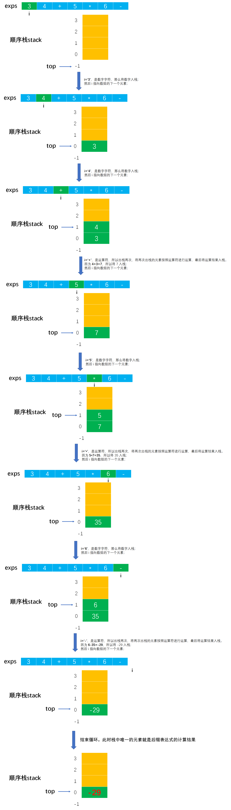

# Example002 

## 题目

编写一个函数，求后缀式的数值，其中后缀式存于一个字符数组 exp 中，exp 中最后一个字符为 `"\0"`，作为结束符，并且假设后缀式中的数字都只有一位。本题中所出现的除法运算，皆为整除运算，如 `2/3` 结果为 0，`3/2` 结果为 1。


## 分析

前缀、中缀和后缀表达式是对表达式的不同记法，其区别在于运算符相对于操作数的位置不同，其中前缀表达式的运算符位于操作数的前面，后缀表达式的运算符位于操作数的后面。例如：

- 中缀表达式：`1+(2+3)*4-5`。
- 前缀表达式：`-+1*+2345`。
- 后缀表达式：`123+4*+5-`。

后缀表达式的计算机求值的算法思想：与前缀表达式的计算类似，只是顺序是**从左向右**扫描表达式。如果遇到数字，则将数字压入栈中；如果遇到运算符，则弹出栈顶的两个数字，用运算符对它们做相应的计算，并且将计算结果压入栈中。重复上述过程直到表达式最右端，最后运算得出的值即为表达式的结果。

例如，有后缀表达式：`34+5*6-`。求值步骤如下：

- （1）从左往右扫描，将 3 和 4 压入栈中。
- （2）遇到 `+` 运算符，因此弹出栈顶的两个元素，分别是 3 和 4（其中 4 是栈顶元素、3 是次栈顶元素），计算 `3+4` 的值，得到结果 7，再将 7 入栈。
- （3）遇到数字 5，然后将 5 入栈。
- （4）接下来是 `*` 字符，因此弹出栈顶的两个元素，分别是 5 和 7，计算 `5*7` 的值，得到结果 35，将 35 入栈。
- （5）遇到数字 6，然后将 6 入栈。
- （6）最后是 `-` 运算符，计算出 `6-35` 的值，即 -29，由此得出最终结果。

更多关于后缀表达式请参考：[Note001-前缀和中缀及后缀表达式](https://github.com/lcl100/data-structure-learning/blob/main/src/%E6%A0%88/%E6%8A%80%E5%B7%A7/Note001-%E5%89%8D%E7%BC%80%E5%92%8C%E4%B8%AD%E7%BC%80%E5%8F%8A%E5%90%8E%E7%BC%80%E8%A1%A8%E8%BE%BE%E5%BC%8F.md)


## 图解

以 `34+5*6-` 为例如图所示：




## C实现

核心代码：

```c
/**
 * 根据运算符计算两数的结果
 * @param sign 运算符
 * @param a 第一个数
 * @param b 第二个数
 * @return 两数计算的结果
 */
int evaluate(char sign, int a, int b) {
    int result = 0;
    switch (sign) {
        case '+':
            result = a + b;
            break;
        case '-':
            result = a - b;
            break;
        case '*':
            result = a * b;
            break;
        case '/':
            result = a / b;
            break;
        case '%':
            result = a % b;
            break;
        default:
            printf("非可计算的运算符：%c", sign);
            break;
    }
    return result;
}

/**
 * 计算前缀表达式
 * @param exps 前缀表达式，以 '\0' 字符结束
 * @param n 字符数组的实际字符个数
 * @return 表达式的计算结果
 */
int evaluateSuffixExpression(char exps[], int n) {
    // 0.解题需要用到栈，所以创建顺序栈并初始化栈
    SeqStack stack;
    init(&stack);

    // 1.从左往右扫描后缀表达式，所以要正序遍历字符数组
    for (int i = 0; i < n; i++) {
        // 1.1 如果当前字符是数字字符
        if (exps[i] >= '0' && exps[i] <= '9') {
            // 1.1.1 则将该数字压入栈中，注意数字字符要转换成数字才能存入栈中，而数字字符要转换成数字可以用数字字符减去'0'字符即可得到所对应的数字
            push(&stack, exps[i] - '0');
        }
        // 1.2 如果当字符不是数字字符，而是运算符
        else {
            // 1.2.1 那么弹出栈顶两个数字，用 a 和 b 来保存
            int a, b;
            pop(&stack, &a);
            pop(&stack, &b);
            // 1.2.2 根据运算符调用函数计算 a 和 b 的结果
            int result = evaluate(exps[i], a, b);
            // 1.2.3 将计算结果压入栈中
            push(&stack, result);
        }
    }

    // 2.最终结果也是存在栈中的，就算栈顶元素，所以获得栈顶元素返回即可
    int top;
    getTop(stack, &top);
    return top;
}
```

完整代码：

```c
#include <stdio.h>

/**
 * 顺序栈最大存储的元素个数
 */
#define MAXSIZE 100

/**
 * 顺序栈结构体定义
 */
typedef struct {
    /**
     * 数据域，数组，用来存储栈中元素
     */
    int data[MAXSIZE];
    /**
     * 指针域，表示栈顶指针，实际上就是数组下标
     */
    int top;
} SeqStack;

/**
 * 初始化顺序栈，即将栈顶指针指向 -1 表示空栈
 * @param stack 顺序栈
 */
void init(SeqStack *stack) {
    // 设定让栈顶指针指向 -1 表示为栈空
    stack->top = -1;
}

/**
 * 将元素入栈
 * @param stack 顺序栈
 * @param ele 元素值
 * @return 如果栈满则返回 0 表示入栈失败；如果插入成功则返回 1
 */
int push(SeqStack *stack, int ele) {
    // 1.参数校验，如果栈满则不能入栈元素
    if (stack->top == MAXSIZE - 1) {
        // 如果栈满，则返回 0，表示不能入栈
        return 0;
    }
    // 2.先将栈顶指针加一，指向新空数组位置
    stack->top++;
    // 3.将新元素值填充到新位置中
    stack->data[stack->top] = ele;
    return 1;
}

/**
 * 将元素出栈
 * @param stack 顺序栈
 * @param ele 用来保存出栈的元素
 * @return 如果栈空则返回 0 表示出栈失败；否则返回 1 表示出栈成功
 */
int pop(SeqStack *stack, int *ele) {
    // 1.参数校验，栈空不能出栈
    if (stack->top == -1) {
        // 栈空，没有元素可出栈
        return 0;
    }
    // 2.用 ele 来保存顺序栈栈顶元素
    *ele = stack->data[stack->top];
    // 3.然后栈顶指针减一，表示出栈一个元素
    stack->top--;
    return 1;
}

/**
 * 获取栈顶元素，但不出栈
 * @param stack 顺序栈
 * @param ele 用来保存出栈元素
 * @return 如果栈空则返回 0 表示出栈失败；否则返回 1 表示出栈成功
 */
int getTop(SeqStack stack, int *ele) {
    // 1.参数校验，如果栈空则不能出栈
    if (stack.top == -1) {
        // 栈空，没有元素可出栈
        return 0;
    }
    // 2.保存栈顶元素返回
    *ele = stack.data[stack.top];
    return 1;
}

/**
 * 根据运算符计算两数的结果
 * @param sign 运算符
 * @param a 第一个数
 * @param b 第二个数
 * @return 两数计算的结果
 */
int evaluate(char sign, int a, int b) {
    int result = 0;
    switch (sign) {
        case '+':
            result = a + b;
            break;
        case '-':
            result = a - b;
            break;
        case '*':
            result = a * b;
            break;
        case '/':
            result = a / b;
            break;
        case '%':
            result = a % b;
            break;
        default:
            printf("非可计算的运算符：%c", sign);
            break;
    }
    return result;
}

/**
 * 计算前缀表达式
 * @param exps 前缀表达式，以 '\0' 字符结束
 * @param n 字符数组的实际字符个数
 * @return 表达式的计算结果
 */
int evaluateSuffixExpression(char exps[], int n) {
    // 0.解题需要用到栈，所以创建顺序栈并初始化栈
    SeqStack stack;
    init(&stack);

    // 1.从左往右扫描后缀表达式，所以要正序遍历字符数组
    for (int i = 0; i < n; i++) {
        // 1.1 如果当前字符是数字字符
        if (exps[i] >= '0' && exps[i] <= '9') {
            // 1.1.1 则将该数字压入栈中，注意数字字符要转换成数字才能存入栈中，而数字字符要转换成数字可以用数字字符减去'0'字符即可得到所对应的数字
            push(&stack, exps[i] - '0');
        }
        // 1.2 如果当字符不是数字字符，而是运算符
        else {
            // 1.2.1 那么弹出栈顶两个数字，用 a 和 b 来保存
            int a, b;
            pop(&stack, &a);
            pop(&stack, &b);
            // 1.2.2 根据运算符调用函数计算 a 和 b 的结果
            int result = evaluate(exps[i], a, b);
            // 1.2.3 将计算结果压入栈中
            push(&stack, result);
        }
    }

    // 2.最终结果也是存在栈中的，就算栈顶元素，所以获得栈顶元素返回即可
    int top;
    getTop(stack, &top);
    return top;
}

int main() {
    char prefixExp[] = "34+5*6-";
    int n = 7;

    int result;
    result = evaluateSuffixExpression(prefixExp, n);
    printf("后缀表达式计算结果：%d", result);
}
```

执行结果：

```text
后缀表达式计算结果：-29
```


## Java实现

核心代码：

```java
    /**
     * 求后缀表达式的值
     *
     * @param exps 后缀表达式字符序列
     * @return 表达式的计算结果
     * @throws Exception 如果栈满再入栈则会抛出此异常
     */
    public static int evaluateSuffixExpression(char exps[]) throws Exception {
        // 0.解题需要用到栈，所以创建顺序栈并初始化栈
        SeqStack stack = new SeqStack();
        stack.init();

        // 变量，记录字符序列的长度
        int n = exps.length;
        // 1.从左往右扫描后缀表达式，所以要正序遍历字符数组
        for (int i = 0; i < n; i++) {
            // 1.1 如果当前字符是数字字符
            if (exps[i] >= '0' && exps[i] <= '9') {
                // 1.1.1 则将该数字压入栈中，注意数字字符要转换成数字才能存入栈中，而数字字符要转换成数字可以用数字字符减去'0'字符即可得到所对应的数字
                stack.push(exps[i] - '0');
            }
            // 1.2 如果当字符不是数字字符，而是运算符
            else {
                // 1.2.1 那么弹出栈顶两个数字，用 a 和 b 来保存
                int a = stack.pop();
                int b = stack.pop();
                // 1.2.2 根据运算符调用函数计算 a 和 b 的结果
                int result = evaluate(exps[i], a, b);
                // 1.2.3 将计算结果压入栈中
                stack.push(result);
            }
        }

        // 2.最终结果也是存在栈中的，就算栈顶元素，所以获得栈顶元素返回即可
        return stack.getTop();
    }

    /**
     * 根据运算符计算两数的结果
     *
     * @param sign 运算符
     * @param a    第一个数
     * @param b    第二个数
     * @return 两数计算的结果
     */
    private static int evaluate(char sign, int a, int b) throws Exception {
        int result = 0;
        switch (sign) {
            case '+':
                result = a + b;
                break;
            case '-':
                result = a - b;
                break;
            case '*':
                result = a * b;
                break;
            case '/':
                result = a / b;
                break;
            case '%':
                result = a % b;
                break;
            default:
                throw new Exception("非可计算的运算符：" + sign);
        }
        return result;
    }
```

完整代码：

```java
public class Test {

    public static void main(String[] args) throws Exception {
        String prefixExp = "34+5*6-";

        // 调用函数计算后缀表达式
        int result;
        result = evaluateSuffixExpression(prefixExp.toCharArray());
        System.out.println("后缀表达式计算结果：" + result);
    }

    /**
     * 求后缀表达式的值
     *
     * @param exps 后缀表达式字符序列
     * @return 表达式的计算结果
     * @throws Exception 如果栈满再入栈则会抛出此异常
     */
    public static int evaluateSuffixExpression(char exps[]) throws Exception {
        // 0.解题需要用到栈，所以创建顺序栈并初始化栈
        SeqStack stack = new SeqStack();
        stack.init();

        // 变量，记录字符序列的长度
        int n = exps.length;
        // 1.从左往右扫描后缀表达式，所以要正序遍历字符数组
        for (int i = 0; i < n; i++) {
            // 1.1 如果当前字符是数字字符
            if (exps[i] >= '0' && exps[i] <= '9') {
                // 1.1.1 则将该数字压入栈中，注意数字字符要转换成数字才能存入栈中，而数字字符要转换成数字可以用数字字符减去'0'字符即可得到所对应的数字
                stack.push(exps[i] - '0');
            }
            // 1.2 如果当字符不是数字字符，而是运算符
            else {
                // 1.2.1 那么弹出栈顶两个数字，用 a 和 b 来保存
                int a = stack.pop();
                int b = stack.pop();
                // 1.2.2 根据运算符调用函数计算 a 和 b 的结果
                int result = evaluate(exps[i], a, b);
                // 1.2.3 将计算结果压入栈中
                stack.push(result);
            }
        }

        // 2.最终结果也是存在栈中的，就算栈顶元素，所以获得栈顶元素返回即可
        return stack.getTop();
    }

    /**
     * 根据运算符计算两数的结果
     *
     * @param sign 运算符
     * @param a    第一个数
     * @param b    第二个数
     * @return 两数计算的结果
     */
    private static int evaluate(char sign, int a, int b) throws Exception {
        int result = 0;
        switch (sign) {
            case '+':
                result = a + b;
                break;
            case '-':
                result = a - b;
                break;
            case '*':
                result = a * b;
                break;
            case '/':
                result = a / b;
                break;
            case '%':
                result = a % b;
                break;
            default:
                throw new Exception("非可计算的运算符：" + sign);
        }
        return result;
    }
}
```

`SeqStack`：

```java
public class SeqStack {
    /**
     * 常量，顺序栈所能容纳的最大元素个数
     */
    private final int MAXSIZE = 100;

    /**
     * 声明一个顺序栈
     */
    private Stack stack;

    /**
     * 初始化顺序栈
     */
    public void init() {
        // 实例化栈对象
        stack = new Stack();
        // 为数据域分配空间
        stack.data = new int[MAXSIZE];
        // 将顺序栈的栈顶指针指向 -1 表示空栈
        stack.top = -1;
    }

    /**
     * 判断顺序栈是否为空
     *
     * @return 如果顺序栈为空则返回 true，否则返回 false
     */
    public boolean isEmpty() {
        // 规定了 -1 表示空栈，所以只需要判断栈顶指针是否等于 -1 即可
        return stack.top == -1;
    }

    /**
     * 将指定元素入栈
     *
     * @param ele 指定元素
     * @throws Exception 如果栈满则不能入栈，抛出此异常
     */
    public void push(int ele) throws Exception {
        // 1.参数校验，如果栈满则不能入栈，抛出异常
        if (stack.top == MAXSIZE - 1) {// 因为栈顶指针 top 存储的是数组下标，所以判断是否等于 MAXSIZE-1
            throw new Exception("栈已满，不能再插入！");
        }
        // 2.先栈顶指针加 1，因为原栈顶指针处已经存储了元素，所以加一指向新的空位置
        stack.top++;
        // 3.在新的空位置处插入新元素，即为指定下标的数组元素赋值
        stack.data[stack.top] = ele;
    }

    /**
     * 将栈顶元素出栈
     *
     * @return 栈顶元素
     * @throws Exception 如果栈空则不能出栈，抛出此异常
     */
    public int pop() throws Exception {
        // 1.参数校验，如果栈空则不能出栈，抛出异常
        if (stack.top == -1) {// 因为栈空的定义是栈顶指针为 -1，所以如果栈顶指针为 -1 那么就是空栈，就不能出栈元素
            throw new Exception("栈为空，不能出栈元素！");
        }
        // 2.记录栈顶元素，因为要将该元素返回，即要出栈的元素
        int result = stack.data[stack.top];
        // 3.栈顶指针减一，因为原栈顶元素已经出栈了，栈中元素个数减一
        stack.top--;
        return result;
    }

    /**
     * 获取栈顶元素，但不出栈
     *
     * @return 栈顶元素
     * @throws Exception 如果栈空则不能出栈，抛出此异常
     */
    public int getTop() throws Exception {
        // 1.参数校验，如果栈空则不能出栈，抛出异常
        if (stack.top == -1) {
            throw new Exception("栈为空，不能获取栈顶元素！");
        }
        // 2.直接返回栈顶元素，但不出栈
        return stack.data[stack.top];
    }

    /**
     * 顺序栈中元素个数
     *
     * @return 栈中元素个数
     */
    public int size() {
        // top 表示栈顶指针，实际上就是数组 data 的下标，所以实际元素个数就是下标加一
        // 即使是空栈 top=-1，那么最后也会返回 0 表示元素个数为零个
        return stack.top + 1;
    }

    /**
     * 打印顺序栈中所有元素，从栈顶到栈底
     */
    public void print() {
        System.out.print("[");
        for (int i = stack.top; i >= 0; i--) {
            if (i != stack.top) {
                System.out.print(", ");
            }
            System.out.print(stack.data[i]);
        }
        System.out.print("]\n");
    }

    /**
     * 清空顺序栈
     */
    public void clear() {
        // 直接将栈顶指针指向 -1 即可表示空栈，不用重置栈中已有元素的值，因为顺序栈操作只跟栈顶指针有关
        stack.top = -1;
    }
}

/**
 * 栈定义
 */
class Stack {
    /**
     * 顺序栈用来存储元素的数组
     */
    int[] data;
    /**
     * 记录顺序栈的栈顶指针，即数组下标
     */
    int top;
}
```

执行结果：

```text
后缀表达式计算结果：-29
```