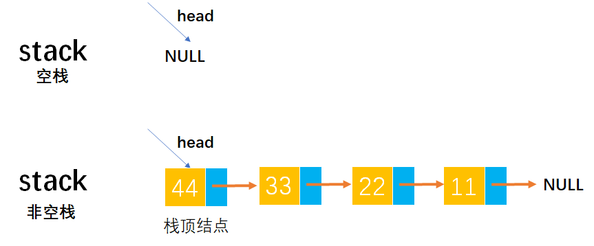
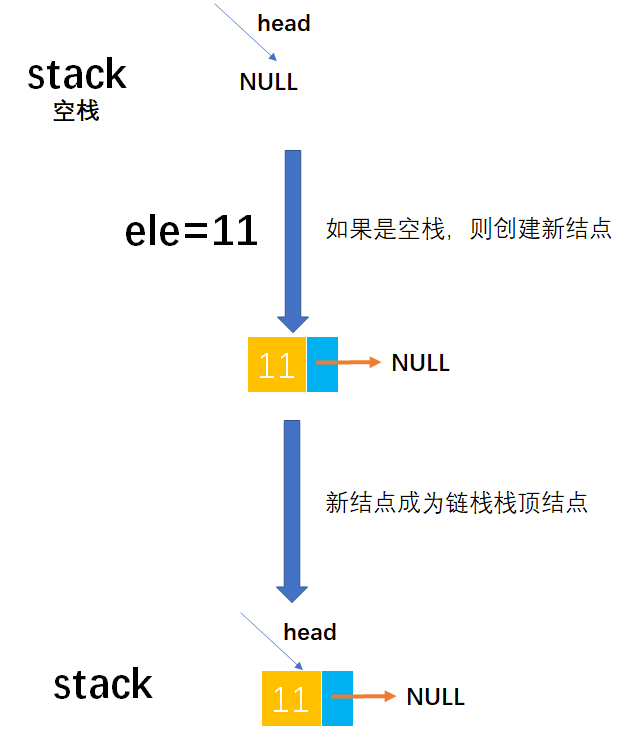
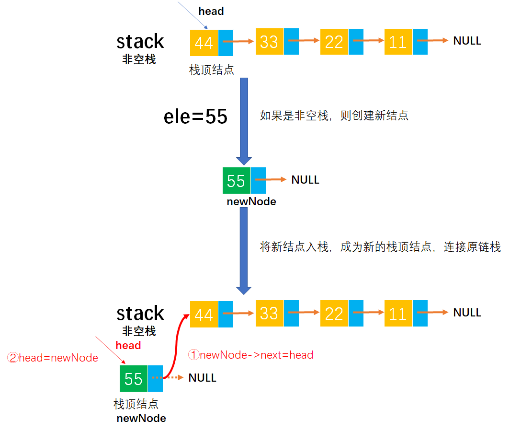
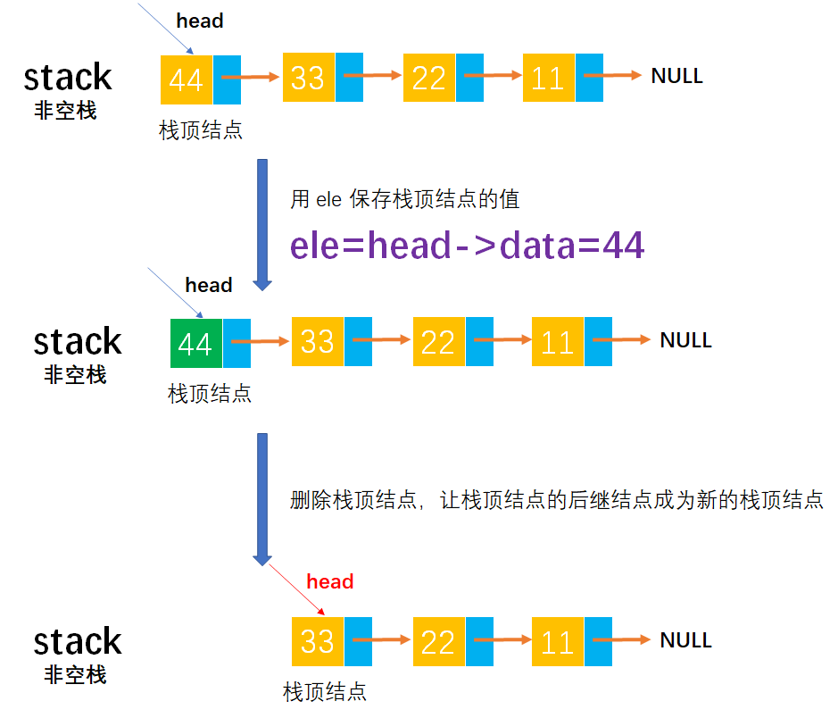

# Example003

## 题目

用不带头结点的单链表存储链栈，设计初始化栈、判断栈是否为空、进栈和出栈等相应的算法。


## 分析

不带头结点的单链表 `list` 为空的条件是 `list==NULL`，进栈和出栈操作都是在表头进行的。

在入栈的时候，由于没有头结点，所以空栈和非空栈的入栈操作需要分情况处理。


## 图解

不带头结点的空栈和非空栈如图所示：



入栈，如果是空栈则如下图所示：



入栈，如果是非空栈则如下图所示：



出栈，操作如图所示：




## C实现

完整代码：

```c
#include<stdio.h>
#include<stdlib.h>

/**
 * 栈结点结构体定义
 */
typedef struct LNode {
    /**
     * 结点数据域
     */
    int data;
    /**
     * 结点指针域，指向后继结点
     */
    struct LNode *next;
} LNode;

/**
 * 初始化不带头结点的链栈
 * @param stack 未初始化的链栈
 */
void init(LNode **stack) {
    // 即置为 NULL，没有头结点
    *stack = NULL;
}

/**
 * 判断链栈是否为空
 * @param stack 不带头结点的链栈
 * @return 如果链栈为空则返回 1，否则返回 0 表示非空
 */
int isEmpty(LNode *stack) {
    if (stack == NULL) {
        return 1;
    } else {
        return 0;
    }
}

/**
 * 将元素入栈。注意，链栈不需要校验栈是否满的问题
 * @param stack 不带头结点的链栈
 * @param ele 元素值
 */
void push(LNode **stack, int ele) {
    // 1.创建新结点并为其指定数据域和初始化指针域
    LNode *newNode = (LNode *) malloc(sizeof(LNode));
    newNode->data = ele;
    newNode->next = NULL;

    // 2.但需要判断栈是否为空的问题，如果栈为空，则新结点是链栈的第一个结点；如果栈非空，则新结点成为链栈新的栈顶结点
    if (stack == NULL) {
        // 新结点直接称为栈顶结点
        *stack = newNode;
    } else {
        // 将新结点入栈
        newNode->next = *stack;
        *stack = newNode;
    }
}

/**
 * 将元素出栈
 * @param stack 不带头结点的链栈
 * @param ele 用来存储出栈元素的值
 * @return 如果栈空则返回 0 表示出栈失败，否则返回 1 表示出栈成功
 */
int pop(LNode **stack, int *ele) {
    // 1.需要校验是否是空栈
    if (*stack == NULL) {
        return 0;
    }
    // 2.将元素出栈
    LNode *node = *stack;
    // 2.1 用 ele 保存出栈元素的数据值
    *ele = node->data;
    // 2.2 删除栈顶结点
    *stack = node->next;
    // 2.3 释放结点空间
    free(node);
    // 2.4 返回 1 表示出栈成功
    return 1;
}

/**
 * 获取栈顶元素，但不出栈
 * @param stack 不带头结点的链栈
 * @param ele 用来存储出栈元素的值
 * @return 如果栈空则返回 0 表示出栈失败，否则返回 1 表示出栈成功
 */
int getTop(LNode *stack, int *ele) {
    // 1.如果栈空则返回 0 表示获取失败
    if (stack == NULL) {
        return 0;
    }
    // 2.用 ele 保存栈顶元素值
    *ele = stack->data;
    return 1;
}

/**
 * 获取链栈中结点个数
 * @param stack 不带头结点的链栈
 * @return 结点个数
 */
int size(LNode *stack) {
    // 变量，记录链栈结点个数
    int len = 0;
    // 从栈顶到栈底扫描链栈所有结点，统计个数
    while (stack != NULL) {
        len++;
        stack = stack->next;
    }
    return len;
}

/**
 * 打印链栈所有结点
 * @param stack 不带头结点的链栈
 */
void print(LNode *stack) {
    printf("[");
    while (stack != NULL) {
        printf("%d", stack->data);
        if (stack->next != NULL) {
            printf(", ");
        }
        stack = stack->next;
    }
    printf("]\n");
}

/**
 * 清空链栈
 * @param stack 不带头结点的链栈
 */
void clear(LNode **stack) {
    // 释放链栈中每一个结点的空间
    while (*stack != NULL) {
        LNode *node = (*stack)->next;
        free(*stack);
        *stack = node;
    }
    *stack = NULL;
}

/**
 * 销毁链栈
 * @param stack 不带头结点的链栈
 */
void destroy(LNode **stack) {
    free(*stack);
}

int main() {
    // 声明链栈
    LNode *stack;

    // 初始化链栈
    printf("初始化链栈：\n");
    init(&stack);
    print(stack);

    // 将元素入栈
    printf("将元素入栈：\n");
    push(&stack, 11);
    print(stack);
    push(&stack, 22);
    print(stack);
    push(&stack, 33);
    print(stack);
    push(&stack, 44);
    print(stack);
    push(&stack, 55);
    print(stack);

    // 将元素出栈
    printf("将元素出栈：\n");
    int ele;
    pop(&stack, &ele);
    print(stack);
    pop(&stack, &ele);
    print(stack);
    pop(&stack, &ele);
    print(stack);

    // 链栈是否为空
    printf("链栈是否为空：\n");
    int empty;
    empty = isEmpty(stack);
    printf("%d\n", empty);

    // 获取栈顶结点数据
    printf("获取栈顶结点数据：\n");
    int top;
    getTop(stack, &top);
    printf("%d\n", top);

    // 获取链栈中元素个数
    printf("获取链栈中元素个数：\n");
    int len;
    len = size(stack);
    printf("%d\n", len);

    // 清空链栈
    printf("清空链栈：\n");
    clear(&stack);
    print(stack);

    // 销毁链栈
    printf("销毁链栈：\n");
    destroy(&stack);
}
```

执行结果：

```text
初始化链栈：
[]
将元素入栈：
[11]
[22, 11]
[33, 22, 11]
[44, 33, 22, 11]
[55, 44, 33, 22, 11]
将元素出栈：
[44, 33, 22, 11]
[33, 22, 11]
[22, 11]
链栈是否为空：
0
获取栈顶结点数据：
22
获取链栈中元素个数：
2
清空链栈：
[]
销毁链栈：
```


## Java实现

完整代码：

```java
public class LinkedStack {
    /**
     * 声明不带头结点的链栈
     */
    private LNode stack;

    /**
     * 初始化没有头结点的链栈
     */
    public void init() {
        // 即指向 null 表示空栈
        stack = null;
    }

    /**
     * 判断链栈是否为空
     *
     * @return 如果链栈为空则返回 true，否则返回 false 表示非空
     */
    public boolean isEmpty() {
        // 即判断头指针是否指向 null
        return stack == null;
    }

    /**
     * 将元素入栈
     *
     * @param ele 待入栈的元素值
     */
    public void push(int ele) {
        // 1.如果是空栈，则将新结点置为链栈的栈顶结点
        if (stack == null) {
            // 直接是栈顶结点
            stack = new LNode();
            stack.data = ele;
            stack.next = null;
        }
        // 2.如果是非空栈，则创建新结点并且将新结点与原链栈连接起来
        else {
            // 2.1 创建新结点并为其分配数据域和指针域
            LNode newNode = new LNode();
            newNode.data = ele;
            newNode.next = null;
            // 2.2 将新结点与原链栈连接起来，成为新的链栈栈顶结点
            newNode.next = stack;
            stack = newNode;
        }
    }

    /**
     * 将栈顶元素出栈
     *
     * @return 栈顶元素值
     * @throws Exception 如果栈空则抛出此异常
     */
    public int pop() throws Exception {
        // 0.参数校验，如果栈空则抛出异常
        if (stack == null) {
            throw new Exception("栈空，没有元素可出栈！");
        }
        // 1.出栈栈顶元素
        // 1.1 记录栈顶结点的值然后返回
        int top = stack.data;
        // 1.2 删除栈顶结点，让原栈顶结点的后继结点成为新的栈顶结点
        stack = stack.next;
        return top;
    }

    /**
     * 获取栈顶结点的值
     *
     * @return 栈顶结点的数据值
     * @throws Exception 如果栈空则抛出此异常
     */
    public int getTop() throws Exception {
        // 0.参数校验，如果栈空则抛出异常
        if (stack == null) {
            throw new Exception("栈空，没有元素可出栈！");
        }
        // 1.直接返回栈顶结点的数据值
        return stack.data;
    }

    /**
     * 获取链栈中的结点个数
     *
     * @return 链栈的结点个数
     */
    public int size() {
        // 变量，记录链栈结点个数
        int len = 0;
        // 变量，记录链栈，为了不修改链栈本身
        LNode node = stack;
        while (node != null) {
            len++;
            node = node.next;
        }
        return len;
    }

    /**
     * 打印链栈所有结点
     */
    public void print() {
        LNode node = stack;
        System.out.print("[");
        while (node != null) {
            System.out.print(node.data);
            if (node.next != null) {
                System.out.print(", ");
            }
            node = node.next;
        }
        System.out.print("]\n");
    }

    /**
     * 清空链栈
     */
    public void clear() {
        while (stack != null) {
            LNode node = stack.next;
            stack.next = null;
            stack = null;
            stack = node;
        }
        stack = null;
    }
}

/**
 * 链栈结点
 */
class LNode {
    /**
     * 结点数据域
     */
    int data;
    /**
     * 结点指针域
     */
    LNode next;
}
```

测试代码：

```java
public class LinkedStackTest {
    public static void main(String[] args) throws Exception {
        // 声明链栈
        LinkedStack stack = new LinkedStack();

        // 初始化链栈
        System.out.println("\n初始化链栈：");
        stack.init();
        stack.print();

        // 将元素入栈
        System.out.println("\n将元素入栈：");
        stack.push(11);
        stack.print();
        stack.push(22);
        stack.print();
        stack.push(33);
        stack.print();
        stack.push(44);
        stack.print();
        stack.push(55);
        stack.print();

        // 将元素出栈
        System.out.println("\n将元素出栈：");
        int ele;
        ele = stack.pop();
        stack.print();
        ele = stack.pop();
        stack.print();
        ele = stack.pop();
        stack.print();

        // 链栈是否为空
        System.out.println("\n链栈是否为空：");
        boolean empty;
        empty = stack.isEmpty();
        System.out.println(empty);

        // 获取栈顶结点数据
        System.out.println("\n获取栈顶结点数据：");
        int top;
        top = stack.getTop();
        System.out.println(top);

        // 获取链栈中元素个数
        System.out.println("\n获取链栈中元素个数：");
        int len;
        len = stack.size();
        System.out.println(len);

        // 清空链栈
        System.out.println("\n清空链栈：");
        stack.clear();
        stack.print();
    }
}
```

执行结果：

```text
初始化链栈：
[]

将元素入栈：
[11]
[22, 11]
[33, 22, 11]
[44, 33, 22, 11]
[55, 44, 33, 22, 11]

将元素出栈：
[44, 33, 22, 11]
[33, 22, 11]
[22, 11]

链栈是否为空：
false

获取栈顶结点数据：
22

获取链栈中元素个数：
2

清空链栈：
[]
```