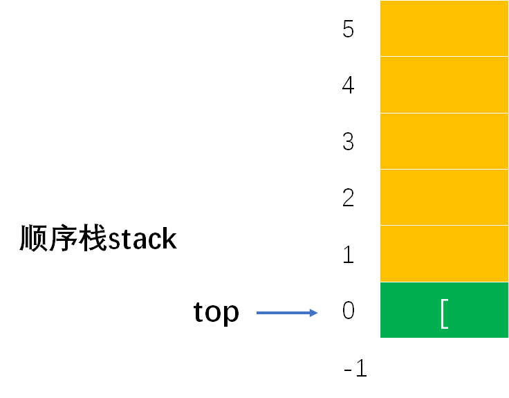
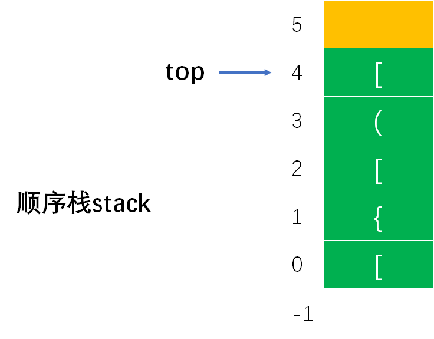
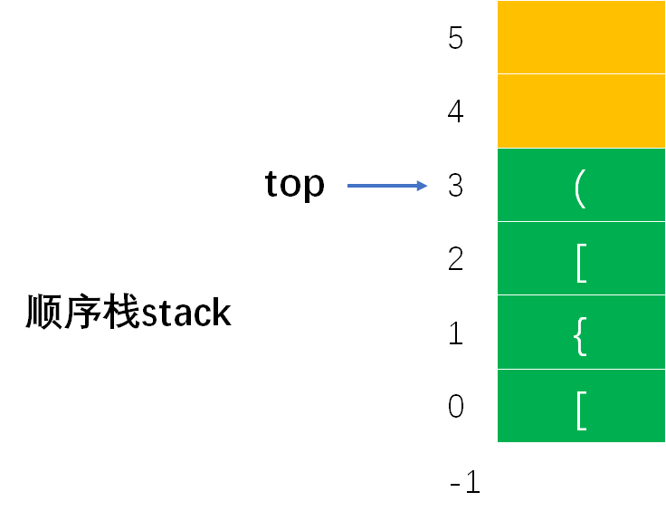
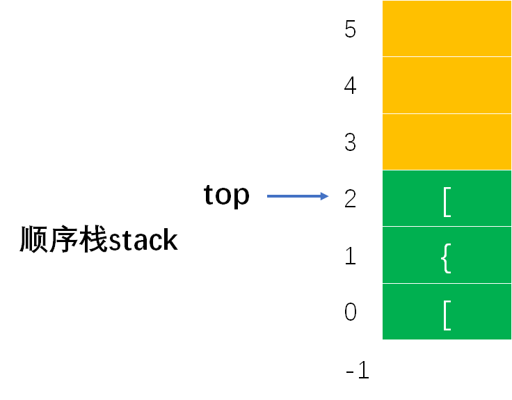
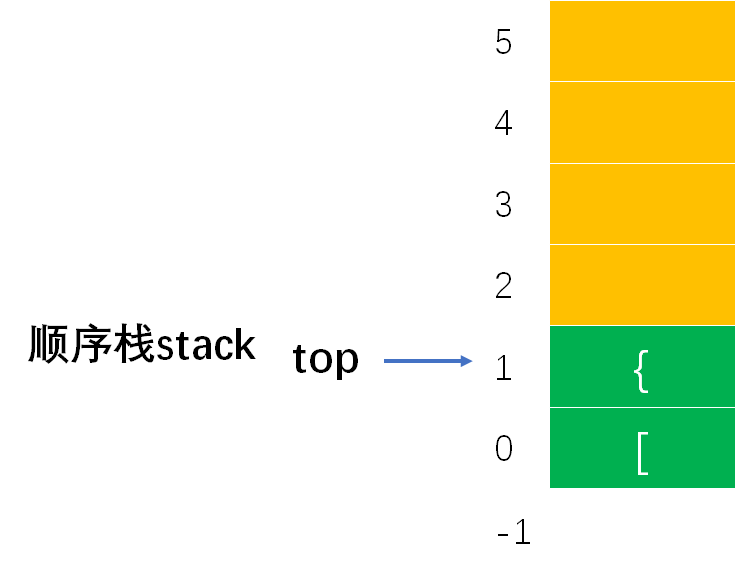
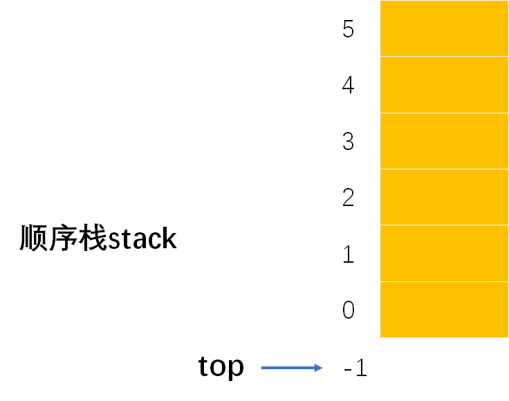

# Example005

## 题目
试编写一个算法，检查一个程序中的花括号、方括号和圆括号是否配对，若全部配对，则返回1，否则返回0。对于程序中出现的一对单引号或双引号内的字符不进行括号配对检查。39为单引号的ASCII 值，34为双引号的ASCII值，单引号和双引号如果出现则必成对出现。


## 分析

在算法中，扫描程序中的每一个字符，当扫描到每个左花括号（即 `{`）、左方括号（即 `[`）、左圆括号（即 `(`）字符时，令其进栈；当扫描到右花括号（即 `}`）、右方括号（即 `]`）、右圆括号（即 `)`）时，则检查栈顶是否为相应的左括号，若是则做退栈处理，若不是则表明出现了语法错误，返回0。当扫描到程序文件结尾后，若栈为空，则表明没有发现括号配对错误，返回1;否则表明栈中还有未配对的括号，返回0。另外，对于一对单引号或双引号内的字符不进行括号配对检查。

这个题之前也做过一次，可参考：[考研数据结构之栈（2.5）——练习题之编写一个算法，检查一个程序中的花括号、方括号和圆括号是否配对（C表示）](https://blog.csdn.net/cnds123321/article/details/106462467)


## 图解

以 `a[c'ab[]}',{[(3[sdfe])345]aa}]''` 为例，执行步骤如下所示：

- （1）扫描到的字符是 `a`，不是括号字符，也非引号字符，所以继续判断下一个字符。
- （2）扫描到的字符是 `[`，是左方括号，所以将其入栈。继续判断下一个字符。此时栈如下图所示：



- （3）此时扫描到的字符是 `c`，不是括号字符，也非引号字符，所以继续判断下一个字符。
- （4）扫描到的字符是 `'`，是单引号字符。因为题目中明确表示引号是成对出现的，所以跳过这对单引号及单引号之内的内容。所以跳过 `'ab[]}'` 所有字符，即使引号之内有括号字符，也要跳过。
- （5）此时扫描到的字符是 `,`，不是括号字符，也非引号字符，所以继续判断下一个字符。
- （6）此时扫描到的字符是 `{`，是左花括号字符，所以入栈。继续判断下一个字符。
- （7）此时扫描到的字符是 `[`，是左方括号字符，所以入栈。继续判断下一个字符。
- （8）此时扫描到的字符是 `(`，是左圆括号字符，所以入栈。继续判断下一个字符。此时栈如下图所示：


- （9）此时扫描的字符是 `3`，不是括号字符，也非引号字符，所以继续判断下一个字符。
- （10）此时扫描到的字符是 `[`，是左方括号字符，所以入栈。然后继续判断下一个字符。此时栈如下图所示：



- （11）此时扫描到的字符是 `s`，不是括号字符，也非引号字符，所以继续判断下一个字符。
- （12）此时扫描到的字符是 `d`，不是括号字符，也非引号字符，所以继续判断下一个字符。
- （13）此时扫描到的字符是 `f`，不是括号字符，也非引号字符，所以继续判断下一个字符。
- （14）此时扫描到的字符是 `e`，不是括号字符，也非引号字符，所以继续判断下一个字符。
- （15）此时扫描到的字符是 `]`，将栈顶字符与当前扫描到的字符进行，正好栈顶字符是左方括号 `[`，与右方括号字符 `]` 是一对，所以将栈顶元素出栈。然后继续判断下一个字符。此时栈如下图所示：



- （16）此时扫描到的字符是 `)`，是右圆括号字符，将栈顶字符与当前扫描到的字符进行，正好栈顶字符是左圆括号 `(`，与右圆括号字符 `)` 是一对，所以将栈顶元素出栈。然后继续判断下一个字符。此时栈如下图所示：



- （17）此时扫描到的字符是 `3`，不是括号字符，也非引号字符，所以继续判断下一个字符。
- （18）此时扫描到的字符是 `4`，不是括号字符，也非引号字符，所以继续判断下一个字符。
- （19）此时扫描到的字符是 `5`，不是括号字符，也非引号字符，所以继续判断下一个字符。
- （20）此时扫描到的字符是 `]`，将栈顶字符与当前扫描到的字符进行，正好栈顶字符是左方括号 `[`，与右方括号字符 `]` 是一对，所以将栈顶元素出栈。然后继续判断下一个字符。此时栈如下图所示：



- （21）此时扫描到的字符是 `a`，不是括号字符，也非引号字符，所以继续判断下一个字符。
- （22）此时扫描到的字符是 `a`，不是括号字符，也非引号字符，所以继续判断下一个字符。
- （23）此时扫描到的字符是 `}`，将栈顶字符与当前扫描到的字符进行，正好栈顶字符是左花方括号 `{`，与右花括号字符 `}` 是一对，所以将栈顶元素出栈。然后继续判断下一个字符。此时栈如下图所示：


- （24）此时扫描到的字符是 `]`，将栈顶字符与当前扫描到的字符进行，正好栈顶字符是左方括号 `[`，与右方括号字符 `]` 是一对，所以将栈顶元素出栈。然后继续判断下一个字符。此时栈如下图所示：



- （25）扫描到的字符是 `'`，是单引号字符。因为题目中明确表示引号是成对出现的，所以跳过这对单引号及单引号之内的内容。所以跳过 `''` 所有字符，包括引号字符本身也要跳过。
- （26）扫描完成，判断如果栈空则表示序列中所有括号配对成功，则返回 1 表示成功。如果栈非空，则表示括号配对失败。


## C实现

核心代码：

```c
/**
 * 判断字符数组中的括号是否配对
 * @param arr 字符数组
 * @param n 数组长度
 * @return 如果所有括号配对成功则返回 1，否则返回 0 表示不匹配
 */
int isMatch(char arr[], int n) {
    // 声明栈并初始化，作为辅助解题数据结构使用
    SeqStack stack;
    init(&stack);

    // 变量，存放栈顶元素
    char top;

    // 变量，记录字符数组下标
    int i = 0;
    // 循环遍历包含括号的字符数组中的每个字符
    while (i < n) {
        // 为什么要用 ASCII 码值，因为不可能用一对单引号来引一个单引号字符，所以用数字来进行比较判断当前字符是否是单引号字符
        // 如果当前字符是单引号，则跳过一对单引号之后的所有字符，包括单引号本身
        if (arr[i] == 39) {
            // 跳过这对单引号中的第一个单引号
            i++;
            // 跳过单引号内的所有字符
            while (arr[i] != 39) {
                i++;
            }
            // 跳过这对单引号中的最后一个单引号
            i++;
        }
        // 如果当前字符是双引号，则跳过一对双引号之后的所有字符，包括双引号本身
        else if (arr[i] == 34) {
            // 跳过这对双引号中的第一个单引号
            i++;
            // 跳过双引号内的所有字符
            while (arr[i] != 34) {
                i++;
            }
            // 跳过这对双引号中的最后一个双引号
            i++;
        }
        // 如果是括号中的任何一个左括号
        else if (arr[i] == '(' || arr[i] == '[' || arr[i] == '{') {
            // 将其存入栈中
            push(&stack, arr[i]);
            // 然后继续比较下一个字符
            i++;
        }
        // 如果是右圆括号
        else if (arr[i] == ')') {
            // 获取栈顶元素
            getTop(stack, &top);
            // 如果栈顶元素是左圆括号，则正好配对 ()
            if (top == '(') {
                // 则将栈顶元素出栈
                pop(&stack, &top);
            } else {
                // 如果不是则一定不配对，那么整个程序也配对失败，返回 0
                return 0;
            }
            // 如果圆括号配对成功则继续比较下一个字符
            i++;
        }
        // 如果是右方括号
        else if (arr[i] == ']') {
            // 获取栈顶元素
            getTop(stack, &top);
            // 如果栈顶元素是左方括号，则正好配对 []
            if (top == '[') {
                // 则将栈顶元素出栈
                pop(&stack, &top);
            } else {
                // 如果不是则一定不配对，那么整个程序也配对失败，返回 0
                return 0;
            }
            // 如果方括号配对成功则继续比较下一个字符
            i++;
        }
        // 如果是右花括号
        else if (arr[i] == '}') {
            // 获取栈顶元素
            getTop(stack, &top);
            // 如果栈顶元素是花括号，则正好配对 {}
            if (top == '{') {
                // 则将栈顶元素出栈
                pop(&stack, &top);
            } else {
                // 如果不是则一定不配对，那么整个程序也配对失败，返回 0
                return 0;
            }
            // 如果花括号配对成功则继续比较下一个字符
            i++;
        }
        // 如果是其他字符，则跳过继续比较判断下一个字符
        else {
            i++;
        }
    }

    // 循环结束后，如果栈为空则表示所有括号配对成功；如果栈非空，则栈中一定还有左括号，那么配对失败
    if (isEmpty(stack)) {
        return 1;
    } else {
        return 0;
    }
}
```

完整代码：

```c
#include <stdio.h>

/**
 * 顺序栈最大存储的元素个数
 */
#define MAXSIZE 100

/**
 * 顺序栈结构体定义
 */
typedef struct {
    /**
     * 数据域，数组，用来存储栈中元素
     */
    char data[MAXSIZE];
    /**
     * 指针域，表示栈顶指针，实际上就是数组下标
     */
    int top;
} SeqStack;

/**
 * 初始化顺序栈，即将栈顶指针指向 -1 表示空栈
 * @param stack 顺序栈
 */
void init(SeqStack *stack) {
    // 设定让栈顶指针指向 -1 表示为栈空
    stack->top = -1;
}

/**
 * 判断顺序栈是否为空
 * @param stack 顺序栈
 * @return 如果顺序栈为空则返回 1，否则返回 0
 */
int isEmpty(SeqStack stack) {
    // 只需要判断栈顶指针是否等于 -1 即可，如果是空栈则返回 1，不是空栈则返回 0
    if (stack.top == -1) {
        return 1;
    } else {
        return 0;
    }
}

/**
 * 将元素入栈
 * @param stack 顺序栈
 * @param ele 元素值
 * @return 如果栈满则返回 0 表示入栈失败；如果插入成功则返回 1
 */
int push(SeqStack *stack, char ele) {
    // 1.参数校验，如果栈满则不能入栈元素
    if (stack->top == MAXSIZE - 1) {
        // 如果栈满，则返回 0，表示不能入栈
        return 0;
    }
    // 2.先将栈顶指针加一，指向新空数组位置
    stack->top++;
    // 3.将新元素值填充到新位置中
    stack->data[stack->top] = ele;
    return 1;
}

/**
 * 将元素出栈
 * @param stack 顺序栈
 * @param ele 用来保存出栈的元素
 * @return 如果栈空则返回 0 表示出栈失败；否则返回 1 表示出栈成功
 */
int pop(SeqStack *stack, char *ele) {
    // 1.参数校验，栈空不能出栈
    if (stack->top == -1) {
        // 栈空，没有元素可出栈
        return 0;
    }
    // 2.用 ele 来保存顺序栈栈顶元素
    *ele = stack->data[stack->top];
    // 3.然后栈顶指针减一，表示出栈一个元素
    stack->top--;
    return 1;
}

/**
 * 获取栈顶元素，但不出栈
 * @param stack 顺序栈
 * @param ele 用来保存出栈元素
 * @return 如果栈空则返回 0 表示出栈失败；否则返回 1 表示出栈成功
 */
int getTop(SeqStack stack, char *ele) {
    // 1.参数校验，如果栈空则不能出栈
    if (stack.top == -1) {
        // 栈空，没有元素可出栈
        return 0;
    }
    // 2.保存栈顶元素返回
    *ele = stack.data[stack.top];
    return 1;
}

/**
 * 判断字符数组中的括号是否配对
 * @param arr 字符数组
 * @param n 数组长度
 * @return 如果所有括号配对成功则返回 1，否则返回 0 表示不匹配
 */
int isMatch(char arr[], int n) {
    // 声明栈并初始化，作为辅助解题数据结构使用
    SeqStack stack;
    init(&stack);

    // 变量，存放栈顶元素
    char top;

    // 变量，记录字符数组下标
    int i = 0;
    // 循环遍历包含括号的字符数组中的每个字符
    while (i < n) {
        // 为什么要用 ASCII 码值，因为不可能用一对单引号来引一个单引号字符，所以用数字来进行比较判断当前字符是否是单引号字符
        // 如果当前字符是单引号，则跳过一对单引号之后的所有字符，包括单引号本身
        if (arr[i] == 39) {
            // 跳过这对单引号中的第一个单引号
            i++;
            // 跳过单引号内的所有字符
            while (arr[i] != 39) {
                i++;
            }
            // 跳过这对单引号中的最后一个单引号
            i++;
        }
        // 如果当前字符是双引号，则跳过一对双引号之后的所有字符，包括双引号本身
        else if (arr[i] == 34) {
            // 跳过这对双引号中的第一个单引号
            i++;
            // 跳过双引号内的所有字符
            while (arr[i] != 34) {
                i++;
            }
            // 跳过这对双引号中的最后一个双引号
            i++;
        }
        // 如果是括号中的任何一个左括号
        else if (arr[i] == '(' || arr[i] == '[' || arr[i] == '{') {
            // 将其存入栈中
            push(&stack, arr[i]);
            // 然后继续比较下一个字符
            i++;
        }
        // 如果是右圆括号
        else if (arr[i] == ')') {
            // 获取栈顶元素
            getTop(stack, &top);
            // 如果栈顶元素是左圆括号，则正好配对 ()
            if (top == '(') {
                // 则将栈顶元素出栈
                pop(&stack, &top);
            } else {
                // 如果不是则一定不配对，那么整个程序也配对失败，返回 0
                return 0;
            }
            // 如果圆括号配对成功则继续比较下一个字符
            i++;
        }
        // 如果是右方括号
        else if (arr[i] == ']') {
            // 获取栈顶元素
            getTop(stack, &top);
            // 如果栈顶元素是左方括号，则正好配对 []
            if (top == '[') {
                // 则将栈顶元素出栈
                pop(&stack, &top);
            } else {
                // 如果不是则一定不配对，那么整个程序也配对失败，返回 0
                return 0;
            }
            // 如果方括号配对成功则继续比较下一个字符
            i++;
        }
        // 如果是右花括号
        else if (arr[i] == '}') {
            // 获取栈顶元素
            getTop(stack, &top);
            // 如果栈顶元素是花括号，则正好配对 {}
            if (top == '{') {
                // 则将栈顶元素出栈
                pop(&stack, &top);
            } else {
                // 如果不是则一定不配对，那么整个程序也配对失败，返回 0
                return 0;
            }
            // 如果花括号配对成功则继续比较下一个字符
            i++;
        }
        // 如果是其他字符，则跳过继续比较判断下一个字符
        else {
            i++;
        }
    }

    // 循环结束后，如果栈为空则表示所有括号配对成功；如果栈非空，则栈中一定还有左括号，那么配对失败
    if (isEmpty(stack)) {
        return 1;
    } else {
        return 0;
    }
}

int main() {
    char arr[] = "a[c'ab[]}',{[(3[sdfe])345]aa}]''";
    int n = 32;

    int match;
    match = isMatch(arr, n);
    printf("%s 中括号是否配对：%d", arr, match);
}
```

执行结果：

```text
a[c'ab[]}',{[(3[sdfe])345]aa}]'' 中括号是否配对：1
```


## Java实现

核心代码：

```java
    /**
     * 判断指定字符序列中的括号是否配对成功
     *
     * @param arr 字符序列
     * @return 如果配对成功则返回 1，否则返回 0 表示失败
     * @throws Exception 如果栈满再入栈则抛出异常
     */
    public static int isMatch(char[] arr) throws Exception {
        // 声明栈并初始化，作为辅助解题数据结构使用
        SeqStack stack = new SeqStack();
        stack.init();

        // 变量，存放栈顶元素
        char top;

        // 变量，记录字符数组下标
        int i = 0;
        // 变量，即数组长度
        int n = arr.length;
        // 循环遍历包含括号的字符数组中的每个字符
        while (i < n) {
            // 为什么要用 ASCII 码值，因为不可能用一对单引号来引一个单引号字符，所以用数字来进行比较判断当前字符是否是单引号字符
            // 如果当前字符是单引号，则跳过一对单引号之后的所有字符，包括单引号本身
            if (arr[i] == 39) {
                // 跳过这对单引号中的第一个单引号
                i++;
                // 跳过单引号内的所有字符
                while (arr[i] != 39) {
                    i++;
                }
                // 跳过这对单引号中的最后一个单引号
                i++;
            }
            // 如果当前字符是双引号，则跳过一对双引号之后的所有字符，包括双引号本身
            else if (arr[i] == 34) {
                // 跳过这对双引号中的第一个单引号
                i++;
                // 跳过双引号内的所有字符
                while (arr[i] != 34) {
                    i++;
                }
                // 跳过这对双引号中的最后一个双引号
                i++;
            }
            // 如果是括号中的任何一个左括号
            else if (arr[i] == '(' || arr[i] == '[' || arr[i] == '{') {
                // 将其存入栈中
                stack.push(arr[i]);
                // 然后继续比较下一个字符
                i++;
            }
            // 如果是右圆括号
            else if (arr[i] == ')') {
                // 获取栈顶元素
                top = stack.getTop();
                // 如果栈顶元素是左圆括号，则正好配对 ()
                if (top == '(') {
                    // 则将栈顶元素出栈
                    stack.pop();
                } else {
                    // 如果不是则一定不配对，那么整个程序也配对失败，返回 0
                    return 0;
                }
                // 如果圆括号配对成功则继续比较下一个字符
                i++;
            }
            // 如果是右方括号
            else if (arr[i] == ']') {
                // 获取栈顶元素
                top = stack.getTop();
                // 如果栈顶元素是左方括号，则正好配对 []
                if (top == '[') {
                    // 则将栈顶元素出栈
                    stack.pop();
                } else {
                    // 如果不是则一定不配对，那么整个程序也配对失败，返回 0
                    return 0;
                }
                // 如果方括号配对成功则继续比较下一个字符
                i++;
            }
            // 如果是右花括号
            else if (arr[i] == '}') {
                // 获取栈顶元素
                top = stack.getTop();
                // 如果栈顶元素是花括号，则正好配对 {}
                if (top == '{') {
                    // 则将栈顶元素出栈
                    stack.pop();
                } else {
                    // 如果不是则一定不配对，那么整个程序也配对失败，返回 0
                    return 0;
                }
                // 如果花括号配对成功则继续比较下一个字符
                i++;
            }
            // 如果是其他字符，则跳过继续比较判断下一个字符
            else {
                i++;
            }
        }

        // 循环结束后，如果栈为空则表示所有括号配对成功；如果栈非空，则栈中一定还有左括号，那么配对失败
        if (stack.isEmpty()) {
            return 1;
        } else {
            return 0;
        }
    }
```

完整代码：

```java
public class Test {
    public static void main(String[] args) throws Exception {
        String str = "a[c'ab[]}',{[(3[sdfe])345]aa}]''";

        int result;
        result = isMatch(str.toCharArray());
        System.out.println(str + "中括号是否配对：" + result);
    }

    /**
     * 判断指定字符序列中的括号是否配对成功
     *
     * @param arr 字符序列
     * @return 如果配对成功则返回 1，否则返回 0 表示失败
     * @throws Exception 如果栈满再入栈则抛出异常
     */
    public static int isMatch(char[] arr) throws Exception {
        // 声明栈并初始化，作为辅助解题数据结构使用
        SeqStack stack = new SeqStack();
        stack.init();

        // 变量，存放栈顶元素
        char top;

        // 变量，记录字符数组下标
        int i = 0;
        // 变量，即数组长度
        int n = arr.length;
        // 循环遍历包含括号的字符数组中的每个字符
        while (i < n) {
            // 为什么要用 ASCII 码值，因为不可能用一对单引号来引一个单引号字符，所以用数字来进行比较判断当前字符是否是单引号字符
            // 如果当前字符是单引号，则跳过一对单引号之后的所有字符，包括单引号本身
            if (arr[i] == 39) {
                // 跳过这对单引号中的第一个单引号
                i++;
                // 跳过单引号内的所有字符
                while (arr[i] != 39) {
                    i++;
                }
                // 跳过这对单引号中的最后一个单引号
                i++;
            }
            // 如果当前字符是双引号，则跳过一对双引号之后的所有字符，包括双引号本身
            else if (arr[i] == 34) {
                // 跳过这对双引号中的第一个单引号
                i++;
                // 跳过双引号内的所有字符
                while (arr[i] != 34) {
                    i++;
                }
                // 跳过这对双引号中的最后一个双引号
                i++;
            }
            // 如果是括号中的任何一个左括号
            else if (arr[i] == '(' || arr[i] == '[' || arr[i] == '{') {
                // 将其存入栈中
                stack.push(arr[i]);
                // 然后继续比较下一个字符
                i++;
            }
            // 如果是右圆括号
            else if (arr[i] == ')') {
                // 获取栈顶元素
                top = stack.getTop();
                // 如果栈顶元素是左圆括号，则正好配对 ()
                if (top == '(') {
                    // 则将栈顶元素出栈
                    stack.pop();
                } else {
                    // 如果不是则一定不配对，那么整个程序也配对失败，返回 0
                    return 0;
                }
                // 如果圆括号配对成功则继续比较下一个字符
                i++;
            }
            // 如果是右方括号
            else if (arr[i] == ']') {
                // 获取栈顶元素
                top = stack.getTop();
                // 如果栈顶元素是左方括号，则正好配对 []
                if (top == '[') {
                    // 则将栈顶元素出栈
                    stack.pop();
                } else {
                    // 如果不是则一定不配对，那么整个程序也配对失败，返回 0
                    return 0;
                }
                // 如果方括号配对成功则继续比较下一个字符
                i++;
            }
            // 如果是右花括号
            else if (arr[i] == '}') {
                // 获取栈顶元素
                top = stack.getTop();
                // 如果栈顶元素是花括号，则正好配对 {}
                if (top == '{') {
                    // 则将栈顶元素出栈
                    stack.pop();
                } else {
                    // 如果不是则一定不配对，那么整个程序也配对失败，返回 0
                    return 0;
                }
                // 如果花括号配对成功则继续比较下一个字符
                i++;
            }
            // 如果是其他字符，则跳过继续比较判断下一个字符
            else {
                i++;
            }
        }

        // 循环结束后，如果栈为空则表示所有括号配对成功；如果栈非空，则栈中一定还有左括号，那么配对失败
        if (stack.isEmpty()) {
            return 1;
        } else {
            return 0;
        }
    }
}
```

`SeqStack`：

```java
public class SeqStack {
    /**
     * 常量，顺序栈所能容纳的最大元素个数
     */
    private final int MAXSIZE = 100;

    /**
     * 声明一个顺序栈
     */
    private Stack stack;

    /**
     * 初始化顺序栈
     */
    public void init() {
        // 实例化栈对象
        stack = new Stack();
        // 为数据域分配空间
        stack.data = new char[MAXSIZE];
        // 将顺序栈的栈顶指针指向 -1 表示空栈
        stack.top = -1;
    }

    /**
     * 判断顺序栈是否为空
     *
     * @return 如果顺序栈为空则返回 true，否则返回 false
     */
    public boolean isEmpty() {
        // 规定了 -1 表示空栈，所以只需要判断栈顶指针是否等于 -1 即可
        return stack.top == -1;
    }

    /**
     * 将指定元素入栈
     *
     * @param ele 指定元素
     * @throws Exception 如果栈满则不能入栈，抛出此异常
     */
    public void push(char ele) throws Exception {
        // 1.参数校验，如果栈满则不能入栈，抛出异常
        if (stack.top == MAXSIZE - 1) {// 因为栈顶指针 top 存储的是数组下标，所以判断是否等于 MAXSIZE-1
            throw new Exception("栈已满，不能再插入！");
        }
        // 2.先栈顶指针加 1，因为原栈顶指针处已经存储了元素，所以加一指向新的空位置
        stack.top++;
        // 3.在新的空位置处插入新元素，即为指定下标的数组元素赋值
        stack.data[stack.top] = ele;
    }

    /**
     * 将栈顶元素出栈
     *
     * @return 栈顶元素
     * @throws Exception 如果栈空则不能出栈，抛出此异常
     */
    public char pop() throws Exception {
        // 1.参数校验，如果栈空则不能出栈，抛出异常
        if (stack.top == -1) {// 因为栈空的定义是栈顶指针为 -1，所以如果栈顶指针为 -1 那么就是空栈，就不能出栈元素
            throw new Exception("栈为空，不能出栈元素！");
        }
        // 2.记录栈顶元素，因为要将该元素返回，即要出栈的元素
        char result = stack.data[stack.top];
        // 3.栈顶指针减一，因为原栈顶元素已经出栈了，栈中元素个数减一
        stack.top--;
        return result;
    }

    /**
     * 获取栈顶元素，但不出栈
     *
     * @return 栈顶元素
     * @throws Exception 如果栈空则不能出栈，抛出此异常
     */
    public char getTop() throws Exception {
        // 1.参数校验，如果栈空则不能出栈，抛出异常
        if (stack.top == -1) {
            throw new Exception("栈为空，不能获取栈顶元素！");
        }
        // 2.直接返回栈顶元素，但不出栈
        return stack.data[stack.top];
    }

    /**
     * 顺序栈中元素个数
     *
     * @return 栈中元素个数
     */
    public int size() {
        // top 表示栈顶指针，实际上就是数组 data 的下标，所以实际元素个数就是下标加一
        // 即使是空栈 top=-1，那么最后也会返回 0 表示元素个数为零个
        return stack.top + 1;
    }

    /**
     * 打印顺序栈中所有元素，从栈顶到栈底
     */
    public void print() {
        System.out.print("[");
        for (int i = stack.top; i >= 0; i--) {
            if (i != stack.top) {
                System.out.print(", ");
            }
            System.out.print(stack.data[i]);
        }
        System.out.print("]\n");
    }

    /**
     * 清空顺序栈
     */
    public void clear() {
        // 直接将栈顶指针指向 -1 即可表示空栈，不用重置栈中已有元素的值，因为顺序栈操作只跟栈顶指针有关
        stack.top = -1;
    }
}

/**
 * 栈定义
 */
class Stack {
    /**
     * 顺序栈用来存储元素的数组
     */
    char[] data;
    /**
     * 记录顺序栈的栈顶指针，即数组下标
     */
    int top;
}
```

执行结果：

```text
a[c'ab[]}',{[(3[sdfe])345]aa}]''中括号是否配对：1
```