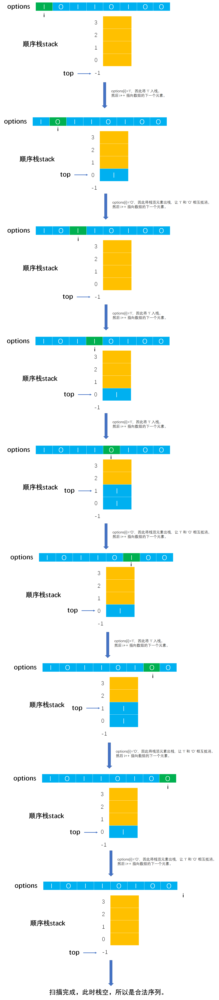

# Example006

## 题目

假设以 I 和 O 分别表示入栈和出栈操作。栈的初态和终态均为空，入栈和出栈的操作序列可表示为仅有 I 和 O 组成的序列，可以操作的序列为合法序列，否则称为非法序列。如 `IOIIOIOO`、`IIIOOIOO` 是合法的；而 `IOOIOIIO`、`IIIOIOIO` 不合法。写出一个算法，判定给定的操作序列是否合法。若合法则返回 1，否则返回 0（假定被判定的操作序列已存入一维数组 char 型数组 `ch[]` 中，操作序列以 "\0" 为结束符）。


## 分析

**解法一算法思想**：从头到尾扫描操作序列，如果是 `I` 操作则将 `I` 字符入栈，如果是 `O` 字符则判断是否栈空，如果栈空则表示此时 `O` 操作多于 `I` 操作，必然不是合法序列，如果栈非空则将栈顶元素出栈，`I` 和 `O` 操作相互抵消。当扫描完操作序列后，如果栈空则 `I` 操作和 `O` 操作一一对应，表示是合法序列；如果栈非空则表示 `I` 操作多于 `O` 操作，那么一定是非法序列。


**解法二算法思想**：算法的基本设计思想:依次逐一扫描入栈出栈序列（即由 `I` 和 `O` 组成的字符串)，每扫描至任一位置均需检查出栈次数（即 `O` 的个数）是否小于入栈次数(`I` 的个数)，若大于则为非法序列。扫描结束后，再判断入栈和出栈次数是否相等，若不相等则不合题意，为非法序列。


## 图解

解法一图解：




## C实现

解法一核心代码：

```c
/**
 * 判断指定操作序列是否合法
 * @param options 操作序列数组，由 I 和 O 组成
 * @param n 数组长度
 * @return 如果操作序列合法则返回 1，否则返回 0 表示不合法
 */
int isLegal(char options[], int n) {
    // 0.声明栈并初始化栈，用来作为解题的辅助数据结构
    SeqStack stack;
    init(&stack);

    // 1.遍历字符数组 options 中所有字符
    for (int i = 0; i < n; i++) {
        // 局部变量，记录当前的数组元素
        char c = options[i];
        // 1.1 如果是 I 操作，则将其入栈
        if (c == 'I') {
            push(&stack, c);
        }
        // 1.2 如果是 O 操作，则需要根据不同情况进行处理
        else if (c == 'O') {
            // 1.2.1 如果是空栈，则表示此时 O 操作比 I 操作，那么一定不合法，返回 0
            if (isEmpty(stack)) {
                return 0;
            }
            // 1.2.2 如果不是空栈，则将栈顶元素出栈，即 O 操作与 I 操作相互抵消一次
            else {
                char top;
                pop(&stack, &top);
            }
        }
    }

    // 2.循环结束后，判断栈中是否还有元素，如果还有元素则表示 I 操作比 O 操作多，不合法；如果栈空则表示合法
    if (isEmpty(stack)) {
        return 1;
    } else {
        return 0;
    }
}
```

解法二核心代码：

```c
/**
 * 判断指定操作序列是否合法
 * @param options 操作序列数组，由 I 和 O 组成
 * @param n 数组长度
 * @return 如果操作序列合法则返回 1，否则返回 0 表示不合法
 */
int isLegal(char options[], int n) {
    int i = 0;// 表示 I 操作的个数
    int o = 0;// 表示 O 操作的个数

    for (int m = 0; m < n; m++) {
        if (options[m] == 'I') {
            i++;
        } else if (options[m] == 'O') {
            o++;
            // 如果出栈操作 O 的次数大于入栈操作 I 的次数，那么必然不是合法序列
            if (o > i) {
                return 0;
            }
        }
    }

    // 扫描完成后，比较 i 和 o 的次数，如果相等则表示序列合法，否则表示 I 操作的次数大于 O 操作的次数则不合法
    if (i != o) {
        return 0;
    } else {
        return 1;
    }
}
```

完整代码：

```c
/*
假设以 I 和 O 分别表示入栈和出栈操作。栈的初态和终态均为空，入栈和出栈的操作序列可表示为
仅有 I 和 O 组成的序列，可以操作的序列为合法序列，否则称为非法序列。如 IOIIOIOO、IIIOOIOO 是
合法的；而 IOOIOIIO、IIIOIOIO 不合法。写出一个算法，判定给定的操作序列是否合法。若合法则返回 1，
否则返回 0（假定被判定的操作序列已存入一维数组 char 型数组 ch[] 中，操作序列以 "\0" 为结束符）。
*/
#include <stdio.h>

/**
 * 顺序栈最大存储的元素个数
 */
#define MAXSIZE 100

/**
 * 顺序栈结构体定义
 */
typedef struct {
    /**
     * 数据域，数组，用来存储栈中元素
     */
    char data[MAXSIZE];
    /**
     * 指针域，表示栈顶指针，实际上就是数组下标
     */
    int top;
} SeqStack;

/**
 * 初始化顺序栈，即将栈顶指针指向 -1 表示空栈
 * @param stack 顺序栈
 */
void init(SeqStack *stack) {
    // 设定让栈顶指针指向 -1 表示为栈空
    stack->top = -1;
}

/**
 * 判断顺序栈是否为空
 * @param stack 顺序栈
 * @return 如果顺序栈为空则返回 1，否则返回 0
 */
int isEmpty(SeqStack stack) {
    // 只需要判断栈顶指针是否等于 -1 即可，如果是空栈则返回 1，不是空栈则返回 0
    if (stack.top == -1) {
        return 1;
    } else {
        return 0;
    }
}

/**
 * 将元素入栈
 * @param stack 顺序栈
 * @param ele 元素值
 * @return 如果栈满则返回 0 表示入栈失败；如果插入成功则返回 1
 */
int push(SeqStack *stack, char ele) {
    // 1.参数校验，如果栈满则不能入栈元素
    if (stack->top == MAXSIZE - 1) {
        // 如果栈满，则返回 0，表示不能入栈
        return 0;
    }
    // 2.先将栈顶指针加一，指向新空数组位置
    stack->top++;
    // 3.将新元素值填充到新位置中
    stack->data[stack->top] = ele;
    return 1;
}

/**
 * 将元素出栈
 * @param stack 顺序栈
 * @param ele 用来保存出栈的元素
 * @return 如果栈空则返回 0 表示出栈失败；否则返回 1 表示出栈成功
 */
int pop(SeqStack *stack, char *ele) {
    // 1.参数校验，栈空不能出栈
    if (stack->top == -1) {
        // 栈空，没有元素可出栈
        return 0;
    }
    // 2.用 ele 来保存顺序栈栈顶元素
    *ele = stack->data[stack->top];
    // 3.然后栈顶指针减一，表示出栈一个元素
    stack->top--;
    return 1;
}

/**
 * 获取栈顶元素，但不出栈
 * @param stack 顺序栈
 * @param ele 用来保存出栈元素
 * @return 如果栈空则返回 0 表示出栈失败；否则返回 1 表示出栈成功
 */
int getTop(SeqStack stack, char *ele) {
    // 1.参数校验，如果栈空则不能出栈
    if (stack.top == -1) {
        // 栈空，没有元素可出栈
        return 0;
    }
    // 2.保存栈顶元素返回
    *ele = stack.data[stack.top];
    return 1;
}

/**
 * 判断指定操作序列是否合法
 * @param options 操作序列数组，由 I 和 O 组成
 * @param n 数组长度
 * @return 如果操作序列合法则返回 1，否则返回 0 表示不合法
 */
int isLegal(char options[], int n) {
    // 0.声明栈并初始化栈，用来作为解题的辅助数据结构
    SeqStack stack;
    init(&stack);

    // 1.遍历字符数组 options 中所有字符
    for (int i = 0; i < n; i++) {
        // 局部变量，记录当前的数组元素
        char c = options[i];
        // 1.1 如果是 I 操作，则将其入栈
        if (c == 'I') {
            push(&stack, c);
        }
        // 1.2 如果是 O 操作，则需要根据不同情况进行处理
        else if (c == 'O') {
            // 1.2.1 如果是空栈，则表示此时 O 操作比 I 操作，那么一定不合法，返回 0
            if (isEmpty(stack)) {
                return 0;
            }
            // 1.2.2 如果不是空栈，则将栈顶元素出栈，即 O 操作与 I 操作相互抵消一次
            else {
                char top;
                pop(&stack, &top);
            }
        }
    }

    // 2.循环结束后，判断栈中是否还有元素，如果还有元素则表示 I 操作比 O 操作多，不合法；如果栈空则表示合法
    if (isEmpty(stack)) {
        return 1;
    } else {
        return 0;
    }
}


int main() {
    int result;

    char arr1[] = "IOIIOIOO";
    int n1 = 8;
    result = isLegal(arr1, 8);
    printf("%s 是否是合法的操作序列：%d\n", arr1, result);

    char arr2[] = "IIIOOIOO";
    int n2 = 8;
    result = isLegal(arr2, 8);
    printf("%s 是否是合法的操作序列：%d\n", arr2, result);

    char arr3[] = "IOOIOIIO";
    int n3 = 8;
    result = isLegal(arr3, 8);
    printf("%s 是否是合法的操作序列：%d\n", arr3, result);

    char arr4[] = "IIIOIOIO";
    int n4 = 8;
    result = isLegal(arr4, 8);
    printf("%s 是否是合法的操作序列：%d\n", arr4, result);
}
```

执行结果：

```text
IOIIOIOO 是否是合法的操作序列：1
IIIOOIOO 是否是合法的操作序列：1
IOOIOIIO 是否是合法的操作序列：0
IIIOIOIO 是否是合法的操作序列：0
```


## Java实现

核心代码：

```java
    /**
     * 判断给定由 'I' 和 'O' 组成的字符序列是否合法
     *
     * @param options 由 'I' 和 'O' 组成的字符序列
     * @return 如果合法则返回 1，否则返回 0 表示不合法
     * @throws Exception
     */
    public static int isLegal(char[] options) throws Exception {
        // 0.声明栈并初始化栈，用来作为解题的辅助数据结构
        SeqStack stack = new SeqStack();
        stack.init();

        // 1.遍历字符数组 options 中所有字符
        for (int i = 0; i < options.length; i++) {
            // 局部变量，记录当前的数组元素
            char c = options[i];
            // 1.1 如果是 I 操作，则将其入栈
            if (c == 'I') {
                stack.push(c);
            }
            // 1.2 如果是 O 操作，则需要根据不同情况进行处理
            else if (c == 'O') {
                // 1.2.1 如果是空栈，则表示此时 O 操作比 I 操作，那么一定不合法，返回 0
                if (stack.isEmpty()) {
                    return 0;
                }
                // 1.2.2 如果不是空栈，则将栈顶元素出栈，即 O 操作与 I 操作相互抵消一次
                else {
                    stack.pop();
                }
            }
        }

        // 2.循环结束后，判断栈中是否还有元素，如果还有元素则表示 I 操作比 O 操作多，不合法；如果栈空则表示合法
        if (stack.isEmpty()) {
            return 1;
        } else {
            return 0;
        }
    }
```

完整代码：

```java
public class Test {
    public static void main(String[] args) throws Exception {
        int result;

        String str1 = "IOIIOIOO";
        result = isLegal(str1.toCharArray());
        System.out.println(str1 + " 是否是合法操作序列：" + result);

        String str2 = "IIIOOIOO";
        result = isLegal(str2.toCharArray());
        System.out.println(str2 + " 是否是合法操作序列：" + result);

        String str3 = "IOOIOIIO";
        result = isLegal(str3.toCharArray());
        System.out.println(str3 + " 是否是合法操作序列：" + result);

        String str4 = "IIIOIOIO";
        result = isLegal(str4.toCharArray());
        System.out.println(str4 + " 是否是合法操作序列：" + result);
    }

    /**
     * 判断给定由 'I' 和 'O' 组成的字符序列是否合法
     *
     * @param options 由 'I' 和 'O' 组成的字符序列
     * @return 如果合法则返回 1，否则返回 0 表示不合法
     * @throws Exception
     */
    public static int isLegal(char[] options) throws Exception {
        // 0.声明栈并初始化栈，用来作为解题的辅助数据结构
        SeqStack stack = new SeqStack();
        stack.init();

        // 1.遍历字符数组 options 中所有字符
        for (int i = 0; i < options.length; i++) {
            // 局部变量，记录当前的数组元素
            char c = options[i];
            // 1.1 如果是 I 操作，则将其入栈
            if (c == 'I') {
                stack.push(c);
            }
            // 1.2 如果是 O 操作，则需要根据不同情况进行处理
            else if (c == 'O') {
                // 1.2.1 如果是空栈，则表示此时 O 操作比 I 操作，那么一定不合法，返回 0
                if (stack.isEmpty()) {
                    return 0;
                }
                // 1.2.2 如果不是空栈，则将栈顶元素出栈，即 O 操作与 I 操作相互抵消一次
                else {
                    stack.pop();
                }
            }
        }

        // 2.循环结束后，判断栈中是否还有元素，如果还有元素则表示 I 操作比 O 操作多，不合法；如果栈空则表示合法
        if (stack.isEmpty()) {
            return 1;
        } else {
            return 0;
        }
    }

}
```

`SeqStack`：

```java
public class SeqStack {
    /**
     * 常量，顺序栈所能容纳的最大元素个数
     */
    private final int MAXSIZE = 100;

    /**
     * 声明一个顺序栈
     */
    private Stack stack;

    /**
     * 初始化顺序栈
     */
    public void init() {
        // 实例化栈对象
        stack = new Stack();
        // 为数据域分配空间
        stack.data = new int[MAXSIZE];
        // 将顺序栈的栈顶指针指向 -1 表示空栈
        stack.top = -1;
    }

    /**
     * 判断顺序栈是否为空
     *
     * @return 如果顺序栈为空则返回 true，否则返回 false
     */
    public boolean isEmpty() {
        // 规定了 -1 表示空栈，所以只需要判断栈顶指针是否等于 -1 即可
        return stack.top == -1;
    }

    /**
     * 将指定元素入栈
     *
     * @param ele 指定元素
     * @throws Exception 如果栈满则不能入栈，抛出此异常
     */
    public void push(int ele) throws Exception {
        // 1.参数校验，如果栈满则不能入栈，抛出异常
        if (stack.top == MAXSIZE - 1) {// 因为栈顶指针 top 存储的是数组下标，所以判断是否等于 MAXSIZE-1
            throw new Exception("栈已满，不能再插入！");
        }
        // 2.先栈顶指针加 1，因为原栈顶指针处已经存储了元素，所以加一指向新的空位置
        stack.top++;
        // 3.在新的空位置处插入新元素，即为指定下标的数组元素赋值
        stack.data[stack.top] = ele;
    }

    /**
     * 将栈顶元素出栈
     *
     * @return 栈顶元素
     * @throws Exception 如果栈空则不能出栈，抛出此异常
     */
    public int pop() throws Exception {
        // 1.参数校验，如果栈空则不能出栈，抛出异常
        if (stack.top == -1) {// 因为栈空的定义是栈顶指针为 -1，所以如果栈顶指针为 -1 那么就是空栈，就不能出栈元素
            throw new Exception("栈为空，不能出栈元素！");
        }
        // 2.记录栈顶元素，因为要将该元素返回，即要出栈的元素
        int result = stack.data[stack.top];
        // 3.栈顶指针减一，因为原栈顶元素已经出栈了，栈中元素个数减一
        stack.top--;
        return result;
    }

    /**
     * 获取栈顶元素，但不出栈
     *
     * @return 栈顶元素
     * @throws Exception 如果栈空则不能出栈，抛出此异常
     */
    public int getTop() throws Exception {
        // 1.参数校验，如果栈空则不能出栈，抛出异常
        if (stack.top == -1) {
            throw new Exception("栈为空，不能获取栈顶元素！");
        }
        // 2.直接返回栈顶元素，但不出栈
        return stack.data[stack.top];
    }

    /**
     * 顺序栈中元素个数
     *
     * @return 栈中元素个数
     */
    public int size() {
        // top 表示栈顶指针，实际上就是数组 data 的下标，所以实际元素个数就是下标加一
        // 即使是空栈 top=-1，那么最后也会返回 0 表示元素个数为零个
        return stack.top + 1;
    }

    /**
     * 打印顺序栈中所有元素，从栈顶到栈底
     */
    public void print() {
        System.out.print("[");
        for (int i = stack.top; i >= 0; i--) {
            if (i != stack.top) {
                System.out.print(", ");
            }
            System.out.print(stack.data[i]);
        }
        System.out.print("]\n");
    }

    /**
     * 清空顺序栈
     */
    public void clear() {
        // 直接将栈顶指针指向 -1 即可表示空栈，不用重置栈中已有元素的值，因为顺序栈操作只跟栈顶指针有关
        stack.top = -1;
    }
}

/**
 * 栈定义
 */
class Stack {
    /**
     * 顺序栈用来存储元素的数组
     */
    int[] data;
    /**
     * 记录顺序栈的栈顶指针，即数组下标
     */
    int top;
}
```

执行结果：

```text
IOIIOIOO 是否是合法操作序列：1
IIIOOIOO 是否是合法操作序列：1
IOOIOIIO 是否是合法操作序列：0
IIIOIOIO 是否是合法操作序列：0
```