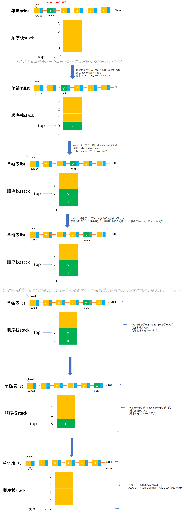

# Example007

## 题目

设单链表的表头指针为 L，结点结构由 data 和 next 两个域构成，其中 data 域为字符型。试设计算法判定该链表的全部 n 个字符是否中心对称。例如 `xyx`、`xyyx` 都是中心对称。


## 分析

**算法思想**：

​		使用栈来判断链表中的数据是否中心对称。让链表的前一半元素依次进栈。在处理链表的后一半元素时，当访问到链表的第一个元素后，就从栈中弹出一个元素，两个元素比较，若相等，则将链表中的下一个元素与栈中再弹出的元素比较，直至链表尾。这时若栈是空栈，则链表中心对称；否则，当链表中的一个元素与栈中弹出元素不等时，则链表非中心对称，结束算法的执行。

**注意**：

- 需要注意单链表的元素个数是奇数还是偶数，来处理中间结点。


## 图解




## C实现

核心代码：

```c
/**
 * 判断单链表是否对称
 * @param list 带头结点的单链表
 * @param n 单链表结点个数
 * @return 如果单链表对称则返回 1，否则返回 0 表示不对称
 */
int isSymmetry(LNode *list, int n) {
    // 0.声明顺序栈，并初始化，用来存放单链表前半个链表中的元素
    SeqStack stack;
    initStack(&stack);

    // 1.用栈存放单链表前半个链表中的元素并同时找到链表的中间结点
    // 变量，计算中间结点是单链表中的第几个结点
    int count = n / 2;
    // 变量，记录链表中的结点，初始为单链表的开始结点
    LNode *node = list->next;
    // 1.1 循环结束后，node 刚好指向单链表的中间结点
    while (count > 0) {
        // 1.1.1 用栈存放单链表前半个链表中的元素
        push(&stack, node->data);
        // 1.1.2 继续单链表的下一个结点
        node = node->next;
        // 1.1.3 计数器减一
        count--;
    }
    // 1.2 如果单链表结点个数是奇数个，则要前进一步才是单链表后半段的开始结点
    if (n % 2 != 0) {
        node = node->next;
    }

    // 2.同时扫描栈和后半段单链表，比较两个值是否相等，如果相等则将栈顶元素出栈和继续单链表的下一个结点
    while (!isEmpty(stack) && node != NULL) {
        // 2.1 变量，记录栈顶元素值
        char top;
        getTop(stack, &top);
        // 2.2 变量，记录单链表当前结点的数据值
        char data;
        data = node->data;
        // 2.3 如果 top 不等于 data，则表示单链表一定不是对称的，所以直接返回 0 即可
        if (top != data) {
            return 0;
        }
        // 2.4 将栈顶元素出栈
        pop(&stack, &top);
        // 2.5 继续链表的下一个结点
        node = node->next;
    }

    // 3.循环扫描完成后，如果栈中所有元素和单链表后半段所有元素一一对应相等，则表示该单链表是对称的，所以返回 1
    return 1;
}
```

完整代码：

```c
#include <stdio.h>
#include <malloc.h>

/**
 * 单链表节点
 */
typedef struct LNode {
    /**
     * 单链表节点的数据域
     */
    char data;
    /**
     * 单链表节点的的指针域，指向当前节点的后继节点
     */
    struct LNode *next;
} LNode;

/**
 * 顺序栈最大存储的元素个数
 */
#define MAXSIZE 100

/**
 * 顺序栈结构体定义
 */
typedef struct {
    /**
     * 数据域，数组，用来存储栈中元素
     */
    char data[MAXSIZE];
    /**
     * 指针域，表示栈顶指针，实际上就是数组下标
     */
    int top;
} SeqStack;

/**
 * 初始化顺序栈，即将栈顶指针指向 -1 表示空栈
 * @param stack 顺序栈
 */
void initStack(SeqStack *stack) {
    // 设定让栈顶指针指向 -1 表示为栈空
    stack->top = -1;
}

/**
 * 判断顺序栈是否为空
 * @param stack 顺序栈
 * @return 如果顺序栈为空则返回 1，否则返回 0
 */
int isEmpty(SeqStack stack) {
    // 只需要判断栈顶指针是否等于 -1 即可，如果是空栈则返回 1，不是空栈则返回 0
    if (stack.top == -1) {
        return 1;
    } else {
        return 0;
    }
}

/**
 * 将元素入栈
 * @param stack 顺序栈
 * @param ele 元素值
 * @return 如果栈满则返回 0 表示入栈失败；如果插入成功则返回 1
 */
int push(SeqStack *stack, char ele) {
    // 1.参数校验，如果栈满则不能入栈元素
    if (stack->top == MAXSIZE - 1) {
        // 如果栈满，则返回 0，表示不能入栈
        return 0;
    }
    // 2.先将栈顶指针加一，指向新空数组位置
    stack->top++;
    // 3.将新元素值填充到新位置中
    stack->data[stack->top] = ele;
    return 1;
}

/**
 * 将元素出栈
 * @param stack 顺序栈
 * @param ele 用来保存出栈的元素
 * @return 如果栈空则返回 0 表示出栈失败；否则返回 1 表示出栈成功
 */
int pop(SeqStack *stack, char *ele) {
    // 1.参数校验，栈空不能出栈
    if (stack->top == -1) {
        // 栈空，没有元素可出栈
        return 0;
    }
    // 2.用 ele 来保存顺序栈栈顶元素
    *ele = stack->data[stack->top];
    // 3.然后栈顶指针减一，表示出栈一个元素
    stack->top--;
    return 1;
}

/**
 * 获取栈顶元素，但不出栈
 * @param stack 顺序栈
 * @param ele 用来保存出栈元素
 * @return 如果栈空则返回 0 表示出栈失败；否则返回 1 表示出栈成功
 */
int getTop(SeqStack stack, char *ele) {
    // 1.参数校验，如果栈空则不能出栈
    if (stack.top == -1) {
        // 栈空，没有元素可出栈
        return 0;
    }
    // 2.保存栈顶元素返回
    *ele = stack.data[stack.top];
    return 1;
}

/**
 * 初始化单链表
 * @param list 待初始化的单链表
 */
void initList(LNode **list) {
    // 创建头结点，分配空间
    *list = (LNode *) malloc(sizeof(LNode));
    // 同时将头节点的 next 指针指向 NULL，因为空链表没有任何节点
    (*list)->next = NULL;
}

/**
 * 通过尾插法创建单链表
 * @param list 单链表
 * @param nums 创建单链表时插入的数据数组
 * @param n 数组长度
 * @return 创建好的单链表
 */
LNode *createByTail(LNode **list, char nums[], int n) {
    // 1.初始化单链表
    // 创建链表必须要先初始化链表，也可以选择直接调用 init() 函数
    *list = (LNode *) malloc(sizeof(LNode));
    (*list)->next = NULL;

    // 尾插法，必须知道链表的尾节点（即链表的最后一个节点），初始时，单链表的头结点就是尾节点
    // 因为在单链表中插入节点我们必须知道前驱节点，而头插法中的前驱节点一直是头节点，但尾插法中要在单链表的末尾插入新节点，所以前驱节点一直都是链表的最后一个节点，而链表的最后一个节点由于链表插入新节点会一直变化
    LNode *node = (*list);

    // 2.循环数组，将所有数依次插入到链表的尾部
    for (int i = 0; i < n; i++) {
        // 2.1 创建新节点，并指定数据域和指针域
        // 2.1.1 创建新节点，为其分配空间
        LNode *newNode = (LNode *) malloc(sizeof(LNode));
        // 2.1.2 为新节点指定数据域
        newNode->data = nums[i];
        // 2.1.3 为新节点指定指针域，新节点的指针域初始时设置为 null
        newNode->next = NULL;

        // 2.2 将新节点插入到单链表的尾部
        // 2.2.1 将链表原尾节点的 next 指针指向新节点
        node->next = newNode;
        // 2.2.2 将新节点置为新的尾节点
        node = newNode;
    }
    return *list;
}

/**
 * 计算单链表的长度，即节点个数
 * @param list 单链表
 * @return 链表节点个数
 */
int size(LNode *list) {
    // 计数器，记录链表的节点个数
    int count = 0;
    // 链表的第一个节点
    LNode *node = list->next;
    // 循环遍历链表
    while (node != NULL) {
        // 计数器加1
        count++;
        // 继续链表的下一个节点
        node = node->next;
    }
    // 返回链表节点个数
    return count;
}

/**
 * 打印链表的所有节点
 * @param list 单链表
 */
void print(LNode *list) {
    printf("[");
    // 链表的第一个节点
    LNode *node = list->next;
    // 循环单链表所有节点，打印值
    while (node != NULL) {
        printf("%c", node->data);
        if (node->next != NULL) {
            printf(", ");
        }
        node = node->next;
    }
    printf("]\n");
}

/**
 * 判断单链表是否对称
 * @param list 带头结点的单链表
 * @param n 单链表结点个数
 * @return 如果单链表对称则返回 1，否则返回 0 表示不对称
 */
int isSymmetry(LNode *list, int n) {
    // 0.声明顺序栈，并初始化，用来存放单链表前半个链表中的元素
    SeqStack stack;
    initStack(&stack);

    // 1.用栈存放单链表前半个链表中的元素并同时找到链表的中间结点
    // 变量，计算中间结点是单链表中的第几个结点
    int count = n / 2;
    // 变量，记录链表中的结点，初始为单链表的开始结点
    LNode *node = list->next;
    // 1.1 循环结束后，node 刚好指向单链表的中间结点
    while (count > 0) {
        // 1.1.1 用栈存放单链表前半个链表中的元素
        push(&stack, node->data);
        // 1.1.2 继续单链表的下一个结点
        node = node->next;
        // 1.1.3 计数器减一
        count--;
    }
    // 1.2 如果单链表结点个数是奇数个，则要前进一步才是单链表后半段的开始结点
    if (n % 2 != 0) {
        node = node->next;
    }

    // 2.同时扫描栈和后半段单链表，比较两个值是否相等，如果相等则将栈顶元素出栈和继续单链表的下一个结点
    while (!isEmpty(stack) && node != NULL) {
        // 2.1 变量，记录栈顶元素值
        char top;
        getTop(stack, &top);
        // 2.2 变量，记录单链表当前结点的数据值
        char data;
        data = node->data;
        // 2.3 如果 top 不等于 data，则表示单链表一定不是对称的，所以直接返回 0 即可
        if (top != data) {
            return 0;
        }
        // 2.4 将栈顶元素出栈
        pop(&stack, &top);
        // 2.5 继续链表的下一个结点
        node = node->next;
    }

    // 3.循环扫描完成后，如果栈中所有元素和单链表后半段所有元素一一对应相等，则表示该单链表是对称的，所以返回 1
    return 1;
}

int main() {
    // 声明单链表并初始化单链表
    LNode *list;
    initList(&list);

    // 通过尾插法添加测试数据
    char nums[] = "xyzyx";
    int n = 5;
    createByTail(&list, nums, n);
    print(list);

    // 判断单链表是否对称
    int symmetry;
    symmetry = isSymmetry(list, n);
    printf("单链表是否对称：%d", symmetry);
}
```

执行结果：

```text
[x, y, z, y, x]
单链表是否对称：1
```


## Java实现

核心代码：

```java
    /**
     * 判断单链表是否对称
     *
     * @return 如果单链表是对称的则返回 true，否则返回 false
     * @throws Exception 如果顺序栈已满再入栈则抛出此异常
     */
    public boolean isSymmetry() throws Exception {
        // 0.声明顺序栈，并初始化，用来存放单链表前半个链表中的元素
        SeqStack stack = new SeqStack();
        stack.init();

        // 1.用栈存放单链表前半个链表中的元素并同时找到链表的中间结点
        // 变量，记录单链表中的结点个数
        int n = size();
        // 变量，计算中间结点是单链表中的第几个结点
        int count = n / 2;
        // 变量，记录链表中的结点，初始为单链表的开始结点
        LNode node = list.next;
        // 1.1 循环结束后，node 刚好指向单链表的中间结点
        while (count > 0) {
            // 1.1.1 用栈存放单链表前半个链表中的元素
            stack.push(node.data);
            // 1.1.2 继续单链表的下一个结点
            node = node.next;
            // 1.1.3 计数器减一
            count--;
        }
        // 1.2 如果单链表结点个数是奇数个，则要前进一步才是单链表后半段的开始结点
        if (n % 2 != 0) {
            node = node.next;
        }

        // 2.同时扫描栈和后半段单链表，比较两个值是否相等，如果相等则将栈顶元素出栈和继续单链表的下一个结点
        while (!stack.isEmpty() && node != null) {
            // 2.1 变量，记录栈顶元素值
            char top;
            top = stack.getTop();
            // 2.2 变量，记录单链表当前结点的数据值
            char data;
            data = node.data;
            // 2.3 如果 top 不等于 data，则表示单链表一定不是对称的，所以直接返回 0 即可
            if (top != data) {
                return false;
            }
            // 2.4 将栈顶元素出栈
            stack.pop();
            // 2.5 继续链表的下一个结点
            node = node.next;
        }

        // 3.循环扫描完成后，如果栈中所有元素和单链表后半段所有元素一一对应相等，则表示该单链表是对称的，所以返回 1
        return true;
    }
```

完整代码：

```java
public class LinkedList {
    /**
     * 单链表
     */
    private LNode list;

    /**
     * 初始化单链表
     */
    public void init() {
        // 单链表的初始化分为两步：第一步，创建头结点并分配内存空间；第二步，将头结点的 next 指针指向 null
        list = new LNode();
        list.next = null;
    }

    /**
     * 通过尾插法创建单链表
     *
     * @param nums 创建单链表时插入的数据
     * @return 创建好的单链表
     */
    public LNode createByTail(char... nums) {
        // 1.初始化单链表
        // 创建链表必须要先初始化链表，也可以选择直接调用 init() 函数
        list = new LNode();
        list.next = null;

        // 尾插法，必须知道链表的尾节点（即链表的最后一个节点），初始时，单链表的头结点就是尾节点
        // 因为在单链表中插入节点我们必须知道前驱节点，而头插法中的前驱节点一直是头节点，但尾插法中要在单链表的末尾插入新节点，所以前驱节点一直都是链表的最后一个节点，而链表的最后一个节点由于链表插入新节点会一直变化
        LNode tailNode = list;

        // 2.循环数组，将所有数依次插入到链表的尾部
        for (int i = 0; i < nums.length; i++) {
            // 2.1 创建新节点，并指定数据域和指针域
            // 2.1.1 创建新节点，为其分配空间
            LNode newNode = new LNode();
            // 2.1.2 为新节点指定数据域
            newNode.data = nums[i];
            // 2.1.3 为新节点指定指针域，新节点的指针域初始时设置为 null
            newNode.next = null;

            // 2.2 将新节点插入到单链表的尾部
            // 2.2.1 将链表原尾节点的 next 指针指向新节点
            tailNode.next = newNode;
            // 2.2.2 将新节点置为新的尾节点
            tailNode = newNode;
        }

        return list;
    }

    /**
     * 判断单链表是否对称
     *
     * @return 如果单链表是对称的则返回 true，否则返回 false
     * @throws Exception 如果顺序栈已满再入栈则抛出此异常
     */
    public boolean isSymmetry() throws Exception {
        // 0.声明顺序栈，并初始化，用来存放单链表前半个链表中的元素
        SeqStack stack = new SeqStack();
        stack.init();

        // 1.用栈存放单链表前半个链表中的元素并同时找到链表的中间结点
        // 变量，记录单链表中的结点个数
        int n = size();
        // 变量，计算中间结点是单链表中的第几个结点
        int count = n / 2;
        // 变量，记录链表中的结点，初始为单链表的开始结点
        LNode node = list.next;
        // 1.1 循环结束后，node 刚好指向单链表的中间结点
        while (count > 0) {
            // 1.1.1 用栈存放单链表前半个链表中的元素
            stack.push(node.data);
            // 1.1.2 继续单链表的下一个结点
            node = node.next;
            // 1.1.3 计数器减一
            count--;
        }
        // 1.2 如果单链表结点个数是奇数个，则要前进一步才是单链表后半段的开始结点
        if (n % 2 != 0) {
            node = node.next;
        }

        // 2.同时扫描栈和后半段单链表，比较两个值是否相等，如果相等则将栈顶元素出栈和继续单链表的下一个结点
        while (!stack.isEmpty() && node != null) {
            // 2.1 变量，记录栈顶元素值
            char top;
            top = stack.getTop();
            // 2.2 变量，记录单链表当前结点的数据值
            char data;
            data = node.data;
            // 2.3 如果 top 不等于 data，则表示单链表一定不是对称的，所以直接返回 0 即可
            if (top != data) {
                return false;
            }
            // 2.4 将栈顶元素出栈
            stack.pop();
            // 2.5 继续链表的下一个结点
            node = node.next;
        }

        // 3.循环扫描完成后，如果栈中所有元素和单链表后半段所有元素一一对应相等，则表示该单链表是对称的，所以返回 1
        return true;
    }

    /**
     * 计算单链表的长度，即节点个数
     *
     * @return 链表节点个数
     */
    public int size() {
        // 计数器，记录链表的节点个数
        int count = 0;
        // 链表的第一个节点
        LNode node = list.next;
        // 循环单链表，统计节点个数
        while (node != null) {
            // 计数器加1
            count++;
            // 继续链表的下一个节点
            node = node.next;
        }
        // 返回统计结果
        return count;
    }

    /**
     * 打印单链表所有节点
     */
    public void print() {
        // 链表的第一个节点
        LNode node = list.next;
        // 循环打印
        String str = "[";
        while (node != null) {
            // 拼接节点的数据域
            str += node.data;
            // 只要不是最后一个节点，那么就在每个节点的数据域后面添加一个分号，用于分隔字符串
            if (node.next != null) {
                str += ", ";
            }
            // 继续链表的下一个节点
            node = node.next;
        }
        str += "]";
        // 打印链表
        System.out.println(str);
    }
}

/**
 * 单链表的节点
 */
class LNode {
    /**
     * 链表的数据域，暂时指定为 int 类型，因为 Java 支持泛型，可以指定为泛型，就能支持更多的类型了
     */
    char data;
    /**
     * 链表的指针域，指向该节点的下一个节点
     */
    LNode next;
}
```

`SeqStack`：

```java
public class SeqStack {
    /**
     * 常量，顺序栈所能容纳的最大元素个数
     */
    private final int MAXSIZE = 100;

    /**
     * 声明一个顺序栈
     */
    private Stack stack;

    /**
     * 初始化顺序栈
     */
    public void init() {
        // 实例化栈对象
        stack = new Stack();
        // 为数据域分配空间
        stack.data = new char[MAXSIZE];
        // 将顺序栈的栈顶指针指向 -1 表示空栈
        stack.top = -1;
    }

    /**
     * 判断顺序栈是否为空
     *
     * @return 如果顺序栈为空则返回 true，否则返回 false
     */
    public boolean isEmpty() {
        // 规定了 -1 表示空栈，所以只需要判断栈顶指针是否等于 -1 即可
        return stack.top == -1;
    }

    /**
     * 将指定元素入栈
     *
     * @param ele 指定元素
     * @throws Exception 如果栈满则不能入栈，抛出此异常
     */
    public void push(char ele) throws Exception {
        // 1.参数校验，如果栈满则不能入栈，抛出异常
        if (stack.top == MAXSIZE - 1) {// 因为栈顶指针 top 存储的是数组下标，所以判断是否等于 MAXSIZE-1
            throw new Exception("栈已满，不能再插入！");
        }
        // 2.先栈顶指针加 1，因为原栈顶指针处已经存储了元素，所以加一指向新的空位置
        stack.top++;
        // 3.在新的空位置处插入新元素，即为指定下标的数组元素赋值
        stack.data[stack.top] = ele;
    }

    /**
     * 将栈顶元素出栈
     *
     * @return 栈顶元素
     * @throws Exception 如果栈空则不能出栈，抛出此异常
     */
    public char pop() throws Exception {
        // 1.参数校验，如果栈空则不能出栈，抛出异常
        if (stack.top == -1) {// 因为栈空的定义是栈顶指针为 -1，所以如果栈顶指针为 -1 那么就是空栈，就不能出栈元素
            throw new Exception("栈为空，不能出栈元素！");
        }
        // 2.记录栈顶元素，因为要将该元素返回，即要出栈的元素
        char result = stack.data[stack.top];
        // 3.栈顶指针减一，因为原栈顶元素已经出栈了，栈中元素个数减一
        stack.top--;
        return result;
    }

    /**
     * 获取栈顶元素，但不出栈
     *
     * @return 栈顶元素
     * @throws Exception 如果栈空则不能出栈，抛出此异常
     */
    public char getTop() throws Exception {
        // 1.参数校验，如果栈空则不能出栈，抛出异常
        if (stack.top == -1) {
            throw new Exception("栈为空，不能获取栈顶元素！");
        }
        // 2.直接返回栈顶元素，但不出栈
        return stack.data[stack.top];
    }

    /**
     * 顺序栈中元素个数
     *
     * @return 栈中元素个数
     */
    public int size() {
        // top 表示栈顶指针，实际上就是数组 data 的下标，所以实际元素个数就是下标加一
        // 即使是空栈 top=-1，那么最后也会返回 0 表示元素个数为零个
        return stack.top + 1;
    }

    /**
     * 打印顺序栈中所有元素，从栈顶到栈底
     */
    public void print() {
        System.out.print("[");
        for (int i = stack.top; i >= 0; i--) {
            if (i != stack.top) {
                System.out.print(", ");
            }
            System.out.print(stack.data[i]);
        }
        System.out.print("]\n");
    }

    /**
     * 清空顺序栈
     */
    public void clear() {
        // 直接将栈顶指针指向 -1 即可表示空栈，不用重置栈中已有元素的值，因为顺序栈操作只跟栈顶指针有关
        stack.top = -1;
    }
}

/**
 * 栈定义
 */
class Stack {
    /**
     * 顺序栈用来存储元素的数组
     */
    char[] data;
    /**
     * 记录顺序栈的栈顶指针，即数组下标
     */
    int top;
}
```

测试代码：

```java
public class Test {
    public static void main(String[] args) throws Exception {
        // 创建单链表并初始化
        LinkedList list = new LinkedList();
        list.init();

        // 为单链表添加测试数据
        list.createByTail("xyzyx".toCharArray());
        list.print();

        // 调用函数，判断单链表是否对称
        boolean symmetry = list.isSymmetry();
        System.out.println("单链表是否对称：" + symmetry);
    }
}
```

执行结果：

```text
[x, y, z, y, x]
单链表是否对称：true
```