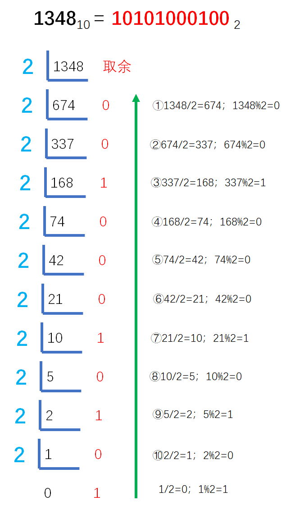

# Example008

## 题目

编写一个算法，将一个非负的十进制整数 N 转换为一个二进制数。


## 分析

由于不知道十进制整数的具体位数，可以考虑使用链栈来存储。但下面使用的顺序栈，栈只是用来解题的工具。

**十进制整数转换为二进制整数采用"除2取余，逆序排列"法。**

具体做法是：用2整除十进制整数，可以得到一个商和余数；再用2去除商，又会得到一个商和余数，如此进行，直到商为小于1时为止，然后把先得到的余数作为二进制数的低位有效位，后得到的余数作为二进制数的高位有效位，依次排列起来。

关于将十进制数转换成其他进制的解法可以参考：[考研数据结构之栈（2.5）——练习题之实现数制转换（C表示）](https://blog.csdn.net/cnds123321/article/details/106283565)。


## 图解

以十进制数 1348 为例，转换成二进制如下图所示：




## C实现

核心代码：

```c
/**
 * 将十进制整数转换成二进制
 * @param num 十进制整数
 */
void conversion(int num) {
    // 声明顺序栈并初始化，用于辅助解题
    SeqStack stack;
    init(&stack);

    // 让 num 不断对 2 求商和取余，将商的结果作为下次的 num，将与的结果压入栈中
    while (num > 0) {// 将 num 大于 0 作为循环结束的条件
        push(&stack, num % 2);
        num = num / 2;
    }

    // 从栈顶扫描到栈底，即转换后的二进制结果，将结果打印出来
    while (!isEmpty(stack)) {
        int top;
        pop(&stack, &top);
        printf("%d", top);
    }
}
```

完整代码：

```c
#include <stdio.h>

/**
 * 顺序栈最大存储的元素个数
 */
#define MAXSIZE 100

/**
 * 顺序栈结构体定义
 */
typedef struct {
    /**
     * 数据域，数组，用来存储栈中元素
     */
    int data[MAXSIZE];
    /**
     * 指针域，表示栈顶指针，实际上就是数组下标
     */
    int top;
} SeqStack;

/**
 * 初始化顺序栈，即将栈顶指针指向 -1 表示空栈
 * @param stack 顺序栈
 */
void init(SeqStack *stack) {
    // 设定让栈顶指针指向 -1 表示为栈空
    stack->top = -1;
}

/**
 * 判断顺序栈是否为空
 * @param stack 顺序栈
 * @return 如果顺序栈为空则返回 1，否则返回 0
 */
int isEmpty(SeqStack stack) {
    // 只需要判断栈顶指针是否等于 -1 即可，如果是空栈则返回 1，不是空栈则返回 0
    if (stack.top == -1) {
        return 1;
    } else {
        return 0;
    }
}

/**
 * 将元素入栈
 * @param stack 顺序栈
 * @param ele 元素值
 * @return 如果栈满则返回 0 表示入栈失败；如果插入成功则返回 1
 */
int push(SeqStack *stack, int ele) {
    // 1.参数校验，如果栈满则不能入栈元素
    if (stack->top == MAXSIZE - 1) {
        // 如果栈满，则返回 0，表示不能入栈
        return 0;
    }
    // 2.先将栈顶指针加一，指向新空数组位置
    stack->top++;
    // 3.将新元素值填充到新位置中
    stack->data[stack->top] = ele;
    return 1;
}

/**
 * 将元素出栈
 * @param stack 顺序栈
 * @param ele 用来保存出栈的元素
 * @return 如果栈空则返回 0 表示出栈失败；否则返回 1 表示出栈成功
 */
int pop(SeqStack *stack, int *ele) {
    // 1.参数校验，栈空不能出栈
    if (stack->top == -1) {
        // 栈空，没有元素可出栈
        return 0;
    }
    // 2.用 ele 来保存顺序栈栈顶元素
    *ele = stack->data[stack->top];
    // 3.然后栈顶指针减一，表示出栈一个元素
    stack->top--;
    return 1;
}

/**
 * 将十进制整数转换成二进制
 * @param num 十进制整数
 */
void conversion(int num) {
    // 声明顺序栈并初始化，用于辅助解题
    SeqStack stack;
    init(&stack);

    // 让 num 不断对 2 求商和取余，将商的结果作为下次的 num，将与的结果压入栈中
    while (num > 0) {// 将 num 大于 0 作为循环结束的条件
        push(&stack, num % 2);
        num = num / 2;
    }

    // 从栈顶扫描到栈底，即转换后的二进制结果，将结果打印出来
    while (!isEmpty(stack)) {
        int top;
        pop(&stack, &top);
        printf("%d", top);
    }
}

int main() {
    int num = 1348;

    // 调用函数，将十进制整数转换成二进制数
    conversion(num);
}
```

执行结果：

```text
10101000100
```


## Java实现

核心代码：

```java
    /**
     * 将十进制整数转换成二进制
     *
     * @param num 十进制整数
     */
    public static void conversion(int num) throws Exception {
        // 声明链栈并初始化，用于辅助解题
        LinkedStack stack = new LinkedStack();
        stack.init();

        // 让 num 不断对 2 求商和取余，将商的结果作为下次的 num，将与的结果压入栈中
        while (num > 0) {// 将 num 大于 0 作为循环结束的条件
            stack.push(num % 2);
            num = num / 2;
        }

        // 从栈顶扫描到栈底，即转换后的二进制结果，将结果打印出来
        while (!stack.isEmpty()) {
            System.out.print(stack.pop());
        }
    }
```

完整代码：

```java
public class Test {
    public static void main(String[] args) throws Exception {
        int num = 123456;

        // 调用函数
        conversion(num);
    }

    /**
     * 将十进制整数转换成二进制
     *
     * @param num 十进制整数
     */
    public static void conversion(int num) throws Exception {
        // 声明链栈并初始化，用于辅助解题
        LinkedStack stack = new LinkedStack();
        stack.init();

        // 让 num 不断对 2 求商和取余，将商的结果作为下次的 num，将与的结果压入栈中
        while (num > 0) {// 将 num 大于 0 作为循环结束的条件
            stack.push(num % 2);
            num = num / 2;
        }

        // 从栈顶扫描到栈底，即转换后的二进制结果，将结果打印出来
        while (!stack.isEmpty()) {
            System.out.print(stack.pop());
        }
    }
}
```

`LinkedStack`

```java
public class LinkedStack {
    /**
     * 声明链栈
     */
    private LNode stack;

    /**
     * 初始化链栈
     */
    public void init() {
        // 1.创建链栈头结点，为其分配空间
        stack = new LNode();
        // 2.将链栈头结点的 next 指针指向 null，表示是空栈
        stack.next = null;
    }

    /**
     * 判断链栈是否为空
     *
     * @return 如果链栈为空则返回 true，否则返回 false
     */
    public boolean isEmpty() {
        // 即只需要判断链栈的栈顶结点是否为空
        return stack.next == null;
    }

    /**
     * 将元素入栈
     *
     * @param ele 待入栈的元素值
     */
    public void push(int ele) {
        // 1.创建新结点
        // 1.1 为新结点分配空间
        LNode newNode = new LNode();
        // 1.2 为新结点指定数据域
        newNode.data = ele;
        // 1.3 为新结点指定初始指针域，即指向 null
        newNode.next = null;

        // 2.将新结点入栈
        // 2.1 将新结点的 next 指针指向原栈顶结点，完成新结点与原栈顶结点的链接
        newNode.next = stack.next;
        // 2.2 将链栈头结点的 next 指针指向新结点，即新结点成为了链栈的新栈顶结点
        stack.next = newNode;
    }

    /**
     * 将元素出栈
     *
     * @return 栈顶结点的元素值
     * @throws Exception 如果链栈为空则不能出栈抛出该异常
     */
    public int pop() throws Exception {
        // 0.变量，记录栈顶结点
        LNode topNode = stack.next;
        // 1.判断链栈是否为空，分情况处理
        // 1.1 如果栈空，则抛出异常
        if (topNode == null) {
            throw new Exception("栈为空，不能出栈！");
        }
        // 1.2 如果栈不为空，则出栈栈顶元素
        else {
            // 1.2.1 保存栈顶结点的数据值，待返回
            int topNodeData = topNode.data;
            // 1.2.2 删除栈顶结点
            stack.next = topNode.next;
            // 1.2.3 释放栈顶结点空间
            topNode.next = null;
            topNode = null;
            // 1.2.4 返回栈顶结点的数据值
            return topNodeData;
        }
    }

    /**
     * 获取栈顶结点的数据值
     *
     * @return 栈顶结点的数据值
     * @throws Exception
     */
    public int getTop() throws Exception {
        // 1.如果链栈为空，则抛出异常
        if (stack.next == null) {
            throw new Exception("栈为空，没有栈顶元素！");
        }
        // 2.如果链栈不为空，则返回栈顶结点值
        return stack.next.data;
    }

    /**
     * 获取链栈的结点个数
     *
     * @return 链栈结点个数
     */
    public int size() {
        // 0.变量，计数器，记录链栈中结点个数
        int len = 0;
        // 0.变量，记录链栈的栈顶结点
        LNode topNode = stack.next;
        // 1.从栈顶扫描到栈底，统计链栈中结点个数
        while (topNode != null) {
            len++;
            topNode = topNode.next;
        }
        // 2.返回结点个数
        return len;
    }

    /**
     * 打印链栈所有结点
     */
    public void print() {
        System.out.print("[");
        LNode topNode = stack.next;
        while (topNode != null) {
            System.out.print(topNode.data);
            if (topNode.next != null) {
                System.out.print(", ");
            }
            topNode = topNode.next;
        }
        System.out.print("]\n");
    }

    /**
     * 清空链栈
     */
    public void clear() {
        // 变量，记录链栈的栈顶结点
        LNode topNode = stack.next;
        // 从栈顶到栈底扫描栈中所有结点
        while (topNode != null) {
            // 记录当前结点的后继结点
            LNode temp = topNode.next;
            // 释放当前结点的存储空间
            topNode.next = null;
            topNode = null;
            // 继续栈的下一个结点
            topNode = temp;
        }
        // 最后将链栈头结点的 next 指针指向 null，表示这是一个空栈
        stack.next = null;
    }

    /**
     * 销毁链栈
     */
    public void destroy() {
        // 即将链栈的头结点指向 null
        stack.next = null;
        stack = null;
    }
}

/**
 * 链栈结点定义
 */
class LNode {
    /**
     * 结点数据域，数据类型为整型，也可以定义为其他类型
     */
    int data;
    /**
     * 结点指针域，指向结点的后继结点
     */
    LNode next;
}
```

执行结果：

```text
11110001001000000
```