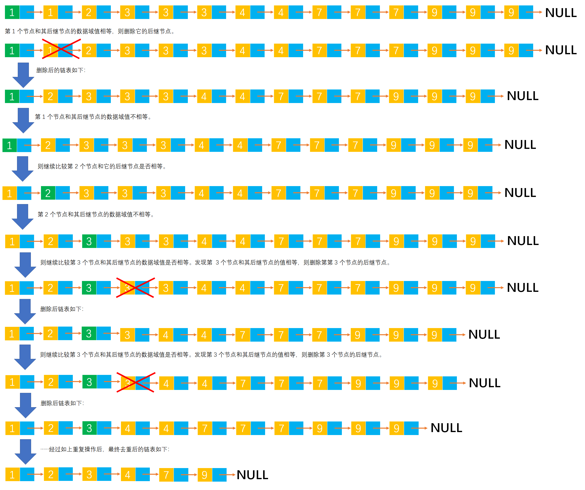

# Example002

## 题目

有一个递增非空单链表，设计一个算法删除值域重复的节点。例如，`{1, 1, 2, 3, 3, 3, 4, 4, 7, 7, 7, 9, 9, 9}` 经过删除后变成 `{1, 2, 3, 4, 7, 9}`。

## 分析

本题考查的知识点：
- 单链表
- 删除单链表中的节点

**分析**：
- 从单链表的第一个节点开始循环单链表中的所有节点。
- 在迭代的当前节点的后继节点存在的情况下，比较当前节点和其后继节点的数据域值是否相等，如果相等则表示重复。
- 如果重复则删除其后继节点；如果不重复则继续判断比较下一个节点。

**注意**：

- 只能删除连续重复值域的节点，不能删除非连续重复的节点。当然题目已经要求是**递增非空单链表**，所以重复节点一定会连续出现。
- 如果只是纯 C 编译环境，那么参数列表中传入的单链表用指向指针的指针 `**`。如果是数据结构题目更倾向于使用引用 `*&`。

## 图解




## C实现

核心代码：

```c
/**
 * 删除单链表中的连续重复节点
 * @param list 单链表
 */
void deleteRepeat(LNode **list) {
    // 链表的第一个节点
    LNode *node = (*list)->next;
    // 循环单链表，删除节点
    while (node != NULL) {
        // 当前节点的后继节点
        LNode *nextNode = node->next;
        // 判断当前节点和当前节点的后继节点这两个相邻节点的值域是否相等，如果相等则删除当前节点的重复后继节点
        // 注意，必须在后继节点存在的情况下才能比较
        if (nextNode != NULL && node->data == nextNode->data) {
            // 删除重复节点
            node->next = nextNode->next;
        } else {
            // 如果不重复，则继续比较下一个节点
            node = node->next;
        }
    }
}
```

完整代码：

```c
#include <stdio.h>
#include <malloc.h>

typedef struct LNode {
    int data;
    struct LNode *next;
} LNode;

/**
 * 使用尾插法创建单链表
 * @param list 单链表
 * @param nums 待插入到单链表中的数组
 * @param n 数组长度
 */
void createByTail(LNode **list, int nums[], int n) {
    // 初始化单链表
    *list = (LNode *) malloc(sizeof(LNode) * n);
    (*list)->next = NULL;
    // 链表的尾节点，初始时链表的尾节点就是头节点
    LNode *tailNode = (*list);
    // 循环数组 nums 中所有数据
    for (int i = 0; i < n; i++) {
        // 创建新节点并指定数据域和指针域
        LNode *newNode = (LNode *) malloc(sizeof(LNode));
        newNode->data = nums[i];
        newNode->next = NULL;
        // 将新节点插入到链表的尾部
        tailNode->next = newNode;
        tailNode = newNode;
    }
}

/**
 * 删除单链表中的连续重复节点
 * @param list 单链表
 */
void deleteRepeat(LNode **list) {
    // 链表的第一个节点
    LNode *node = (*list)->next;
    // 循环单链表，删除节点
    while (node != NULL) {
        // 当前节点的后继节点
        LNode *nextNode = node->next;
        // 判断当前节点和当前节点的后继节点这两个相邻节点的值域是否相等，如果相等则删除当前节点的重复后继节点
        // 注意，必须在后继节点存在的情况下才能比较
        if (nextNode != NULL && node->data == nextNode->data) {
            // 删除重复节点
            node->next = nextNode->next;
        } else {
            // 如果不重复，则继续比较下一个节点
            node = node->next;
        }
    }
}

/**
 * 打印单链表所有节点
 * @param list 单链表
 */
void print(LNode list) {
    printf("[");
    // 链表的第一个节点
    LNode *node = list.next;
    // 循环单链表所有节点，打印值
    while (node != NULL) {
        printf("%d", node->data);
        if (node->next != NULL) {
            printf(", ");
        }
        node = node->next;
    }
    printf("]\n");
}

int main() {
    LNode *list;
    int nums[] = {1, 1, 2, 3, 3, 3, 4, 4, 7, 7, 7, 9, 9, 9};
    int n = 14;

    // 创建单链表
    createByTail(&list, nums, n);
    print(*list);

    // 删除单链表中的连续重复节点
    deleteRepeat(&list);
    print(*list);
}
```

执行结果：

```text
[1, 1, 2, 3, 3, 3, 4, 4, 7, 7, 7, 9, 9, 9]
[1, 2, 3, 4, 7, 9]
```

注意：在数据结构题目中更倾向于使用 `*&` 引用来修改单链表，而不是使用指向指针的指针 `**`。尽管那属于 C++ 中的知识。

```c++
#include <stdio.h>
#include <malloc.h>

typedef struct LNode {
	int data;
	struct LNode *next;
} LNode;

/**
 * 使用尾插法创建单链表
 * @param list 单链表
 * @param nums 待插入到单链表中的数组
 * @param n 数组长度
 */
void createByTail(LNode *&list, int nums[], int n) {
	// 初始化单链表
	list = (LNode *) malloc(sizeof(LNode) * n);
	list->next = NULL;
	// 链表的尾节点，初始时链表的尾节点就是头节点
	LNode *tailNode = list;
	// 循环数组 nums 中所有数据
	for (int i = 0; i < n; i++) {
		// 创建新节点并指定数据域和指针域
		LNode *newNode = (LNode *) malloc(sizeof(LNode));
		newNode->data = nums[i];
		newNode->next = NULL;
		// 将新节点插入到链表的尾部
		tailNode->next = newNode;
		tailNode = newNode;
	}
}

/**
 * 删除单链表中的连续重复节点
 * @param list 单链表
 */
void deleteRepeat(LNode *&list) {
	// 链表的第一个节点
	LNode *node = list->next;
	// 循环单链表，删除节点
	while (node != NULL) {
		// 当前节点的后继节点
		LNode *nextNode = node->next;
		// 判断当前节点和当前节点的后继节点这两个相邻节点的值域是否相等，如果相等则删除当前节点的重复后继节点
		// 注意，必须在后继节点存在的情况下才能比较
		if (nextNode != NULL && node->data == nextNode->data) {
			// 删除重复节点
			node->next = nextNode->next;
		} else {
			// 如果不重复，则继续比较下一个节点
			node = node->next;
		}
	}
}

/**
 * 打印单链表所有节点
 * @param list 单链表
 */
void print(LNode list) {
	printf("[");
	// 链表的第一个节点
	LNode *node = list.next;
	// 循环单链表所有节点，打印值
	while (node != NULL) {
		printf("%d", node->data);
		if (node->next != NULL) {
			printf(", ");
		}
		node = node->next;
	}
	printf("]\n");
}

int main() {
	LNode *list;
	int nums[] = {1, 1, 2, 3, 3, 3, 4, 4, 7, 7, 7, 9, 9, 9};
	int n = 14;

	// 创建单链表
	createByTail(list, nums, n);
	print(*list);

	// 删除单链表中的连续重复节点
	deleteRepeat(list);
	print(*list);
}
```

## Java实现

核心代码：

```java
    /**
     * 删除链表中的所有连续值域重复节点
     */
    public void deleteRepeat() {
        // 链表的第一个节点
        Node node = list.next;
        // 遍历链表所有节点
        while (node != null) {
            // 当前节点的后继节点
            Node nextNode = node.next;
            // 如果当前节点的后继节点存在并且当前节点的数据域值等于其后继节点的数据域值，那么表示这两个相邻节点重复，则删除这个重复的后继节点
            if (nextNode != null && node.data == nextNode.data) {
                // 删除重复节点
                node.next = nextNode.next;
            } else {
                // 如果相邻节点不重复，则继续链表的下一个节点
                node = node.next;
            }
        }
    }
```

完整代码：

```java
public class LinkedList {
    private Node list;

    /**
     * 通过尾插法创建单链表
     *
     * @param nums 创建单链表时插入的数据
     * @return 创建好的单链表
     */
    public Node createByTail(int... nums) {
        list = new Node();
        list.next = null;
        Node temp = list;

        for (int i = 0; i < nums.length; i++) {
            // 创建新节点，并指定数据域和指针域
            Node newNode = new Node();
            newNode.data = nums[i];
            newNode.next = null;
            // 将新节点插入到单链表的尾部
            temp.next = newNode;
            temp = newNode;
        }

        return list;
    }

    /**
     * 删除链表中的所有连续值域重复节点
     */
    public void deleteRepeat() {
        // 链表的第一个节点
        Node node = list.next;
        // 遍历链表所有节点
        while (node != null) {
            // 当前节点的后继节点
            Node nextNode = node.next;
            // 如果当前节点的后继节点存在并且当前节点的数据域值等于其后继节点的数据域值，那么表示这两个相邻节点重复，则删除这个重复的后继节点
            if (nextNode != null && node.data == nextNode.data) {
                // 删除重复节点
                node.next = nextNode.next;
            } else {
                // 如果相邻节点不重复，则继续链表的下一个节点
                node = node.next;
            }
        }
    }

    /**
     * 打印单链表所有节点
     */
    public void print() {
        // 链表的第一个节点
        Node node = list.next;
        // 循环打印
        String str = "[";
        while (node != null) {
            str += node.data;
            if (node.next != null) {
                str += ", ";
            }
            node = node.next;
        }
        str += "]";
        System.out.println(str);
    }
}

class Node {
    /**
     * 链表的数据域，暂时指定为 int 类型，因为 Java 支持泛型，可以指定为泛型，就能支持更多的类型了
     */
    int data;
    /**
     * 链表的指针域，指向该节点的下一个节点
     */
    Node next;
}
```

测试代码：

```java
/**
 * @author lcl100
 * @create 2022-02-24 10:05
 */
public class LinkedListTest {
    public static void main(String[] args) {
        LinkedList list = new LinkedList();
        // 创建单链表
        list.createByTail(1, 1, 2, 3, 3, 3, 4, 4, 7, 7, 7, 9, 9, 9);
        list.print();

        // 删除重复节点
        list.deleteRepeat();
        list.print();
    }
}
```

执行结果：

```text
[1, 1, 2, 3, 3, 3, 4, 4, 7, 7, 7, 9, 9, 9]
[1, 2, 3, 4, 7, 9]
```