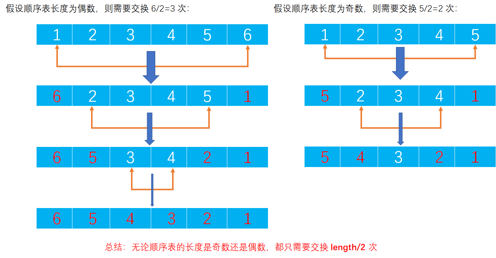

# Example004

## 题目

设计一个算法，将顺序表中所有元素逆置。

## 分析

本题考查的知识点：
- 顺序表
- 逆置数组

**分析**：
- 给定一个线性表，如何将其中的元素逆置？可设置两个整型变量 i 和 j ，i 指向第一个元素，j 指向最后一个元素，边交换 i 和 j 所指元素，边让 i 和 j 相向而行，直到相遇，实现代码如下。
- 假设元素存于数组 `a[]` 中，`left` 和 `right`是数组两端元素的下标。那么实现代码如下：
```c
    for (int i = left, j = right; i < j; i++, j--) {
        temp = a[i];
        a[i] = a[j];
        a[j] = temp;
    }
```

## 图解




## C实现

核心代码：

```c
/**
 * 逆置顺序表
 * @param list 顺序表
 */
void inversion(SeqList *list) {
    // 双指针（不是实际的指针，仅是两个变量），分别指向顺序表的头部和尾部
    int i = 0;// 指向顺序表的头部，从前往后移动
    int j = list->length - 1;// 指向顺序表的尾部，从后往前移动
    // 交换 length/2 次
    while (i < j) {
        // 交换 data[i] 与 data[j] 所表示的值
        int temp = list->data[i];
        list->data[i] = list->data[j];
        list->data[j] = temp;
        // 然后指针 i 向后移动一位，指针 j 向前移动一位
        i++;
        j--;
    }
}
```

完整代码：

```c
#include <stdio.h>

#define MAXSIZE 20

/**
 * 顺序表的结构体
 */
typedef struct {
    /**
     * 顺序表，实际上一个长度为 MAXSIZE 的数组，存储的数据类型为整型，当然可以设置为其他类型，但推荐使用宏定义类型，方便替换
     */
    int data[MAXSIZE];
    /**
     * 顺序表长度，即数组中实际元素个数
     */
    int length;
} SeqList;

/**
 * 初始化顺序表，仅需要将 length 置为 0 即可
 * @param list 待初始化的顺序表
 */
void init(SeqList *list) {
    // 仅需要将 length 置为 0 即可
    (*list).length = 0;
    // 或者可以用下面的语法
    // list->length=0;
}

/**
 * 直接添加新元素到顺序表的尾部
 * @param list 顺序表
 * @param ele 待添加的新元素
 * @return 如果插入成功则返回 1，否则返回 0
 */
int add(SeqList *list, int ele) {
    // 0.校验
    // 0.1 向顺序表中插入元素要检查顺序表是否已经满了，如果已经满了则不能再插入新元素则添加失败
    if (list->length == MAXSIZE) {
        return 0;
    }
    // 1.插入新元素
    // 1.1 直接获取顺序表的 length，然后将新元素的值赋予到 length 位置即可
    list->data[list->length] = ele;
    // 1.2 注意修改 length
    list->length++;
    return 1;
}

/**
 * 逆置顺序表
 * @param list 顺序表
 */
void inversion(SeqList *list) {
    // 双指针（不是实际的指针，仅是两个变量），分别指向顺序表的头部和尾部
    int i = 0;// 指向顺序表的头部，从前往后移动
    int j = list->length - 1;// 指向顺序表的尾部，从后往前移动
    // 交换 length/2 次
    while (i < j) {
        // 交换 data[i] 与 data[j] 所表示的值
        int temp = list->data[i];
        list->data[i] = list->data[j];
        list->data[j] = temp;
        // 然后指针 i 向后移动一位，指针 j 向前移动一位
        i++;
        j--;
    }
}

/**
 * 打印顺序表
 * @param list 待打印的顺序表
 */
void print(SeqList list) {
    printf("[");
    for (int i = 0; i < list.length; i++) {
        printf("%d", list.data[i]);
        if (i != list.length - 1) {
            printf(", ");
        }
    }
    printf("]\n");
}

int main() {
    // 声明顺序表并初始化
    SeqList list;
    init(&list);

    // 向顺序表添加元素
    add(&list, 1);
    add(&list, 2);
    add(&list, 3);
    add(&list, 4);
    add(&list, 5);
    add(&list, 6);
    print(list);

    // 逆置顺序表
    inversion(&list);
    print(list);
}
```

执行结果：

```text
[1, 2, 3, 4, 5, 6]
[6, 5, 4, 3, 2, 1]
```

## Java实现

核心代码：

```java
    /**
     * 逆置顺序表
     */
    public void inversion() {
        // 双指针（不是实际的指针，仅是两个变量），分别指向顺序表的头部和尾部
        int i = 0;// 指向顺序表的头部，从前往后移动
        int j = list.length - 1;// 指向顺序表的尾部，从后往前移动
        // 交换 length/2 次
        while (i < j) {
            // 交换 data[i] 与 data[j] 所表示的值
            int temp = list.data[i];
            list.data[i] = list.data[j];
            list.data[j] = temp;
            // 然后指针 i 向后移动一位，指针 j 向前移动一位
            i++;
            j--;
        }
    }
```

完整代码：

```java
/**
 * @author lcl100
 * @desc 线性表
 * @create 2022-02-28 20:16
 */
public class SeqList {
    /**
     * 顺序表最大能存放元素个数
     */
    private final int MAXSIZE = 20;

    /**
     * 声明的顺序表，未初始化
     */
    private List list;

    /**
     * 初始化顺序表
     */
    public void init() {
        list = new List();
        // 指定数据数组长度为 MAXSIZE
        list.data = new int[MAXSIZE];
        // 但指定顺序表实际元素个数为 0
        list.length = 0;
    }

    /**
     * 逆置顺序表
     */
    public void inversion() {
        // 双指针（不是实际的指针，仅是两个变量），分别指向顺序表的头部和尾部
        int i = 0;// 指向顺序表的头部，从前往后移动
        int j = list.length - 1;// 指向顺序表的尾部，从后往前移动
        // 交换 length/2 次
        while (i < j) {
            // 交换 data[i] 与 data[j] 所表示的值
            int temp = list.data[i];
            list.data[i] = list.data[j];
            list.data[j] = temp;
            // 然后指针 i 向后移动一位，指针 j 向前移动一位
            i++;
            j--;
        }
    }

    /**
     * 直接添加新元素到顺序表的尾部
     *
     * @param ele 待插入的新元素
     */
    public void add(int ele) throws Exception {
        // 0.校验
        // 0.1 向顺序表中插入元素要检查顺序表是否已经满了，如果已经满了则不能再插入新元素则抛出异常
        if (list.length == MAXSIZE) {
            throw new Exception("顺序表已满，不能再插入了！");
        }
        // 1.插入新元素
        // 1.1 直接获取顺序表的 length，然后将新元素的值赋予到 length 位置即可
        list.data[list.length] = ele;
        // 1.2 注意修改 length
        list.length++;
    }

    /**
     * 打印顺序表
     */
    public void print() {
        String str = "[";
        for (int i = 0; i < list.length; i++) {
            str += list.data[i];
            if (i != list.length - 1) {
                str += ", ";
            }
        }
        str += "]";
        System.out.println(str);
    }
}

/**
 * 顺序表
 */
class List {
    /**
     * 数据域，保存数据的数组
     */
    int[] data;
    /**
     * 数组中实际元素个数
     */
    int length;
}
```

测试代码：

```java
/**
 * @author lcl100
 * @desc 顺序表测试类
 * @create 2022-02-28 20:18
 */
public class SeqListTest {
    public static void main(String[] args) throws Exception {
        // 实例化顺序表对象
        SeqList list = new SeqList();
        list.init();

        // 向顺序表添加元素
        list.add(1);
        list.add(2);
        list.add(3);
        list.add(4);
        list.add(5);
        list.add(6);
        list.print();

        // 逆置顺序表
        list.inversion();
        list.print();
    }
}
```

执行结果：

```text
[1, 2, 3, 4, 5, 6]
[6, 5, 4, 3, 2, 1]
```