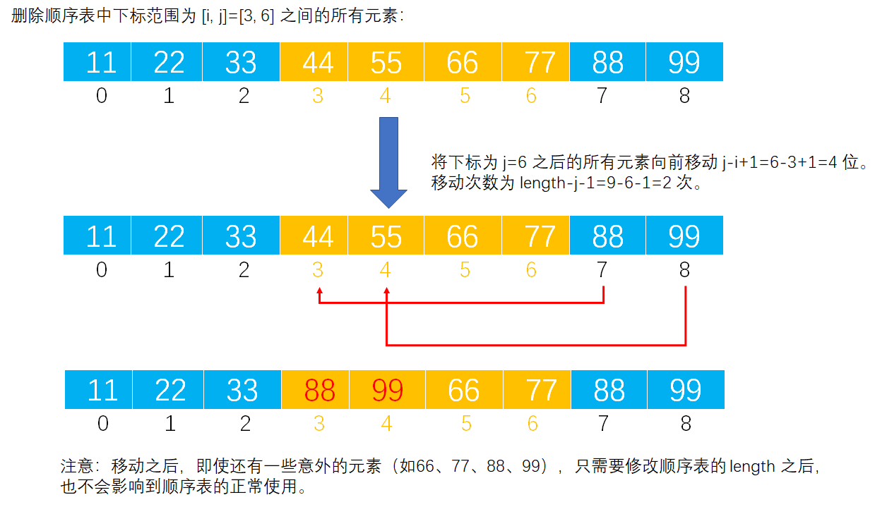

# Example005

## 题目

设计一个算法，从一给定的顺序表 L 中删除下标 i~j（i<=j，包括 i 和 j）的所有元素，假定 i 和 j 都是合法的。

## 分析

本题考查的知识点：
- 顺序表
- 删除顺序表中的元素

**分析**：
- 之前的删除顺序表元素操作，只是删除一个元素。
- 而本题要求删除多个，只需要通过循环来完成即可。
- 但需要注意删除的下标范围和删除的元素个数和循环的执行次数。

**注意**：
- 实际上是用后面的元素覆盖了前面的元素，但有一些元素是未被覆盖的，仍然保持原值。
- 例如 `[11, 22, 33, 44, 55, 66, 77, 88, 99]` 删除 `[3, 6]` 之间的所有元素之后，完整的顺序表是 `[11, 22, 33, 88, 99, 66, 77, 88, 99]`。
- 但后面的元素不会影响到顺序表的正常使用，因为我们会修改顺序表的另外一个字段 `length`，该字段表示了顺序表实际元素个数，而我们操作顺序表增删改查都会根据这个字段，所以最后的结果是 `[11, 22, 33, 88, 99]`。

## 图解




## C实现

核心代码：

```c
/**
 * 删除顺序表中 [i, j] 之间的所有元素
 * @param list 顺序表
 * @param i 起始下标
 * @param j 结束下标
 */
void deleteScope(SeqList *list, int i, int j) {
    // [i, j]之间所有元素的个数，即要被删除的元素个数
    int scope = j - i + 1;
    // 将下标为 j 之后的所有元素向前移动 j-i+1 位，需要移动 length-j-1 次
    for (int m = j + 1; m < list->length; m++) {
        list->data[m - scope] = list->data[m];// 用后面的数覆盖前面的数
    }
    // 修改顺序表表长
    list->length -= scope;
}
```

完整代码：

```c
#include <stdio.h>

#define MAXSIZE 20

/**
 * 顺序表的结构体
 */
typedef struct {
    /**
     * 顺序表，实际上一个长度为 MAXSIZE 的数组，存储的数据类型为整型，当然可以设置为其他类型，但推荐使用宏定义类型，方便替换
     */
    int data[MAXSIZE];
    /**
     * 顺序表长度，即数组中实际元素个数
     */
    int length;
} SeqList;

/**
 * 初始化顺序表，仅需要将 length 置为 0 即可
 * @param list 待初始化的顺序表
 */
void init(SeqList *list) {
    // 仅需要将 length 置为 0 即可
    (*list).length = 0;
    // 或者可以用下面的语法
    // list->length=0;
}

/**
 * 直接添加新元素到顺序表的尾部
 * @param list 顺序表
 * @param ele 待添加的新元素
 * @return 如果插入成功则返回 1，否则返回 0
 */
int add(SeqList *list, int ele) {
    // 0.校验
    // 0.1 向顺序表中插入元素要检查顺序表是否已经满了，如果已经满了则不能再插入新元素则添加失败
    if (list->length == MAXSIZE) {
        return 0;
    }
    // 1.插入新元素
    // 1.1 直接获取顺序表的 length，然后将新元素的值赋予到 length 位置即可
    list->data[list->length] = ele;
    // 1.2 注意修改 length
    list->length++;
    return 1;
}

/**
 * 删除顺序表中 [i, j] 之间的所有元素
 * @param list 顺序表
 * @param i 起始下标
 * @param j 结束下标
 */
void deleteScope(SeqList *list, int i, int j) {
    // [i, j]之间所有元素的个数，即要被删除的元素个数
    int scope = j - i + 1;
    // 将下标为 j 之后的所有元素向前移动 j-i+1 位，需要移动 length-j-1 次
    for (int m = j + 1; m < list->length; m++) {
        list->data[m - scope] = list->data[m];// 用后面的数覆盖前面的数
    }
    // 修改顺序表表长
    list->length -= scope;
}

/**
 * 打印顺序表
 * @param list 待打印的顺序表
 */
void print(SeqList list) {
    printf("[");
    for (int i = 0; i < list.length; i++) {
        printf("%d", list.data[i]);
        if (i != list.length - 1) {
            printf(", ");
        }
    }
    printf("]\n");
}

int main() {
    // 声明顺序表并初始化
    SeqList list;
    init(&list);

    // 向顺序表添加元素
    add(&list, 11);
    add(&list, 22);
    add(&list, 33);
    add(&list, 44);
    add(&list, 55);
    add(&list, 66);
    add(&list, 77);
    add(&list, 88);
    add(&list, 99);
    print(list);

    // 删除顺序表中 [i, j] 之间的所有元素
    int i = 3, j = 6;
    deleteScope(&list, i, j);
    print(list);
}
```

执行结果：

```text
[11, 22, 33, 44, 55, 66, 77, 88, 99]
[11, 22, 33, 88, 99]
```

## Java实现

核心代码：

```java
    /**
     * 删除顺序表中下标范围为 [i, j] 之间的所有元素
     *
     * @param i 起始下标
     * @param j 结束下标
     */
    public void deleteScope(int i, int j) {
        // [i, j]之间所有元素的个数，即要被删除的元素个数
        int scope = j - i + 1;
        // 将下标为 j 之后的所有元素向前移动 j-i+1 位，需要移动 length-j-1 次
        for (int m = j + 1; m < list.length; m++) {
            list.data[m - scope] = list.data[m];// 用后面的数覆盖前面的数
        }
        // 修改顺序表表长
        list.length -= scope;
    }
```

完整代码：

```java
/**
 * @author lcl100
 * @desc 线性表
 * @create 2022-02-28 20:16
 */
public class SeqList {
    /**
     * 顺序表最大能存放元素个数
     */
    private final int MAXSIZE = 20;

    /**
     * 声明的顺序表，未初始化
     */
    private List list;

    /**
     * 初始化顺序表
     */
    public void init() {
        list = new List();
        // 指定数据数组长度为 MAXSIZE
        list.data = new int[MAXSIZE];
        // 但指定顺序表实际元素个数为 0
        list.length = 0;
    }

    /**
     * 删除顺序表中下标范围为 [i, j] 之间的所有元素
     *
     * @param i 起始下标
     * @param j 结束下标
     */
    public void deleteScope(int i, int j) {
        // [i, j]之间所有元素的个数，即要被删除的元素个数
        int scope = j - i + 1;
        // 将下标为 j 之后的所有元素向前移动 j-i+1 位，需要移动 length-j-1 次
        for (int m = j + 1; m < list.length; m++) {
            list.data[m - scope] = list.data[m];// 用后面的数覆盖前面的数
        }
        // 修改顺序表表长
        list.length -= scope;
    }

    /**
     * 直接添加新元素到顺序表的尾部
     *
     * @param ele 待插入的新元素
     */
    public void add(int ele) throws Exception {
        // 0.校验
        // 0.1 向顺序表中插入元素要检查顺序表是否已经满了，如果已经满了则不能再插入新元素则抛出异常
        if (list.length == MAXSIZE) {
            throw new Exception("顺序表已满，不能再插入了！");
        }
        // 1.插入新元素
        // 1.1 直接获取顺序表的 length，然后将新元素的值赋予到 length 位置即可
        list.data[list.length] = ele;
        // 1.2 注意修改 length
        list.length++;
    }

    /**
     * 打印顺序表
     */
    public void print() {
        String str = "[";
        for (int i = 0; i < list.length; i++) {
            str += list.data[i];
            if (i != list.length - 1) {
                str += ", ";
            }
        }
        str += "]";
        System.out.println(str);
    }
}

/**
 * 顺序表
 */
class List {
    /**
     * 数据域，保存数据的数组
     */
    int[] data;
    /**
     * 数组中实际元素个数
     */
    int length;
}
```

测试代码：

```java
/**
 * @author lcl100
 * @desc 顺序表测试类
 * @create 2022-02-28 20:18
 */
public class SeqListTest {
    public static void main(String[] args) throws Exception {
        // 实例化顺序表对象
        SeqList list = new SeqList();
        list.init();

        // 向顺序表添加元素
        list.add(11);
        list.add(22);
        list.add(33);
        list.add(44);
        list.add(55);
        list.add(66);
        list.add(77);
        list.add(88);
        list.add(99);
        list.print();

        // 删除顺序表中下标范围为 [i, j] 之间的所有元素
        list.deleteScope(3,6);
        list.print();
    }
}
```

执行结果：

```text
[11, 22, 33, 44, 55, 66, 77, 88, 99]
[11, 22, 33, 88, 99]
```