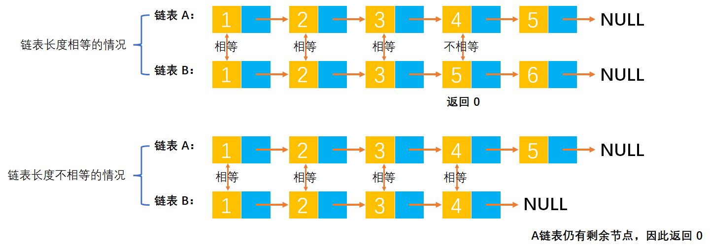

# Example006

## 题目

设有两个用有序链表表示的集合 A 和 B，设计一个算法，判断它们是否相等。

## 分析

本题考查的知识点：

- 单链表


**分析**：
- 循环扫描A、B两个表，当所有元素都对应相等，且A、B的循环扫描同时结束，则两者相等，否则不相等。

**注意**：
- 我们要注意到两种情况，第一种情况如果两个链表的长度相等，则只需要比较对应节点的数据域值是否相等，如果出现一对不相等的情况则直接返回 0 表示两个单链表不相等，只有双链表所有节点的数据域值都相等则最终才能判定两个双链表相等。
- 第二种情况就是如果两个链表的长度不等，那么在同时扫描链表 A 和 B 结束后，一定会有一个链表还剩余有节点，那么这时候就判断两个链表不相等，只有当两个链表都没有未被扫描到的节点时才能判定相等。

## 图解




## C实现

核心代码：

```c
/**
 * 比较两个有序链表是否相等
 * @param aList 链表 A
 * @param bList 链表 B
 * @return 如果两个链表完全相等则返回 1，如果不相等则返回 0
 */
int isEmpty(LNode *aList, LNode *bList) {
    // 0.获取链表的第一个节点
    // 0.1 链表 A 的第一个节点
    LNode *aNode = aList->next;
    // 0.2 链表 B 的第一个节点
    LNode *bNode = bList->next;

    // 1.同时对 A 链表和 B 链表进行循环扫描
    while (aNode != NULL && bNode != NULL) {
        // 1.1 如果链表 A 和 B 对应元素相等，则继续比较链表的下一个节点
        if (aNode->data == bNode->data) {
            aNode = aNode->next;
            bNode = bNode->next;
        }
        // 1.2 如果链表 A 和 B 对应元素不相等，则返回 0
        else {
            return 0;
        }
    }

    // 2.执行到这里如果链表的长度相等则返回 1，如果任一链表有剩余节点那么这两个链表绝对不会相等所以返回 0
    if (aNode != NULL || bNode != NULL) {
        return 0;
    } else {
        return 1;
    }
}
```

完整代码：

```c
#include <stdio.h>
#include <malloc.h>

/**
 * 单链表节点
 */
typedef struct LNode {
    /**
     * 单链表节点的数据域
     */
    int data;
    /**
     * 单链表节点的的指针域，指向当前节点的后继节点
     */
    struct LNode *next;
} LNode;

/**
 * 通过尾插法创建单链表
 * @param list 单链表
 * @param nums 创建单链表时插入的数据数组
 * @param n 数组长度
 * @return 创建好的单链表
 */
LNode *createByTail(LNode **list, int nums[], int n) {
    // 1.初始化单链表
    // 创建链表必须要先初始化链表，也可以选择直接调用 init() 函数
    *list = (LNode *) malloc(sizeof(LNode));
    (*list)->next = NULL;

    // 尾插法，必须知道链表的尾节点（即链表的最后一个节点），初始时，单链表的头结点就是尾节点
    // 因为在单链表中插入节点我们必须知道前驱节点，而头插法中的前驱节点一直是头节点，但尾插法中要在单链表的末尾插入新节点，所以前驱节点一直都是链表的最后一个节点，而链表的最后一个节点由于链表插入新节点会一直变化
    LNode *node = (*list);

    // 2.循环数组，将所有数依次插入到链表的尾部
    for (int i = 0; i < n; i++) {
        // 2.1 创建新节点，并指定数据域和指针域
        // 2.1.1 创建新节点，为其分配空间
        LNode *newNode = (LNode *) malloc(sizeof(LNode));
        // 2.1.2 为新节点指定数据域
        newNode->data = nums[i];
        // 2.1.3 为新节点指定指针域，新节点的指针域初始时设置为 null
        newNode->next = NULL;

        // 2.2 将新节点插入到单链表的尾部
        // 2.2.1 将链表原尾节点的 next 指针指向新节点
        node->next = newNode;
        // 2.2.2 将新节点置为新的尾节点
        node = newNode;
    }
    return *list;
}

/**
 * 比较两个有序链表是否相等
 * @param aList 链表 A
 * @param bList 链表 B
 * @return 如果两个链表完全相等则返回 1，如果不相等则返回 0
 */
int isEmpty(LNode *aList, LNode *bList) {
    // 0.获取链表的第一个节点
    // 0.1 链表 A 的第一个节点
    LNode *aNode = aList->next;
    // 0.2 链表 B 的第一个节点
    LNode *bNode = bList->next;

    // 1.同时对 A 链表和 B 链表进行循环扫描
    while (aNode != NULL && bNode != NULL) {
        // 1.1 如果链表 A 和 B 对应元素相等，则继续比较链表的下一个节点
        if (aNode->data == bNode->data) {
            aNode = aNode->next;
            bNode = bNode->next;
        }
        // 1.2 如果链表 A 和 B 对应元素不相等，则返回 0
        else {
            return 0;
        }
    }

    // 2.执行到这里如果链表的长度相等则返回 1，如果任一链表有剩余节点那么这两个链表绝对不会相等所以返回 0
    if (aNode != NULL || bNode != NULL) {
        return 0;
    } else {
        return 1;
    }
}

/**
 * 打印链表的所有节点
 * @param list 单链表
 */
void print(LNode *list) {
    printf("[");
    // 链表的第一个节点
    LNode *node = list->next;
    // 循环单链表所有节点，打印值
    while (node != NULL) {
        printf("%d", node->data);
        if (node->next != NULL) {
            printf(", ");
        }
        node = node->next;
    }
    printf("]\n");
}

int main() {
    // 声明单链表 A 和 B
    LNode *aList;
    LNode *bList;

    // 为单链表赋值
    int aNums[] = {1, 2, 3, 4, 5};
    int aN = 5;
    createByTail(&aList, aNums, aN);
    print(aList);
    int bNums[] = {1, 2, 3, 5};
    int bN = 4;
    createByTail(&bList, bNums, bN);
    print(bList);

    // 判断两个链表是否相等
    int equal;
    equal = isEmpty(aList, bList);
    printf("%d", equal);
}
```

执行结果：

```text
[1, 2, 3, 4, 5]
[1, 2, 3, 5]
0
```

## Java实现

核心代码：

```java
    /**
     * 判断指定两个有序链表是否相等
     *
     * @param aList 链表 A
     * @param bList 链表 B
     * @return 如果两个链表所有节点都对应相等则返回 true，否则返回 false
     */
    public boolean isEmpty(LinkedList aList, LinkedList bList) {
        // 0.获取链表的第一个节点
        // 0.1 链表 A 的第一个节点
        LNode aNode = aList.list.next;
        // 0.2 链表 B 的第一个节点
        LNode bNode = bList.list.next;

        // 1.同时对 A 链表和 B 链表进行循环扫描
        while (aNode != null && bNode != null) {
            // 1.1 如果链表 A 和 B 对应元素相等，则继续比较链表的下一个节点
            if (aNode.data == bNode.data) {
                aNode = aNode.next;
                bNode = bNode.next;
            }
            // 1.2 如果链表 A 和 B 对应元素不相等，则返回 false
            else {
                return false;
            }
        }

        // 2.执行到这里如果链表的长度相等则返回 true，如果任一链表有剩余节点那么这两个链表绝对不会相等所以返回 false
        if (aNode != null || bNode != null) {
            return false;
        } else {
            return true;
        }
    }
```

完整代码：

```java
package test;

/**
 * @author lcl100
 * @create 2022-03-01 21:32
 */
public class LinkedList {
    /**
     * 单链表
     */
    private LNode list;

    /**
     * 通过尾插法创建单链表
     *
     * @param nums 创建单链表时插入的数据
     * @return 创建好的单链表
     */
    public LNode createByTail(int... nums) {
        // 1.初始化单链表
        // 创建链表必须要先初始化链表，也可以选择直接调用 init() 函数
        list = new LNode();
        list.next = null;

        // 尾插法，必须知道链表的尾节点（即链表的最后一个节点），初始时，单链表的头结点就是尾节点
        // 因为在单链表中插入节点我们必须知道前驱节点，而头插法中的前驱节点一直是头节点，但尾插法中要在单链表的末尾插入新节点，所以前驱节点一直都是链表的最后一个节点，而链表的最后一个节点由于链表插入新节点会一直变化
        LNode tailNode = list;

        // 2.循环数组，将所有数依次插入到链表的尾部
        for (int i = 0; i < nums.length; i++) {
            // 2.1 创建新节点，并指定数据域和指针域
            // 2.1.1 创建新节点，为其分配空间
            LNode newNode = new LNode();
            // 2.1.2 为新节点指定数据域
            newNode.data = nums[i];
            // 2.1.3 为新节点指定指针域，新节点的指针域初始时设置为 null
            newNode.next = null;

            // 2.2 将新节点插入到单链表的尾部
            // 2.2.1 将链表原尾节点的 next 指针指向新节点
            tailNode.next = newNode;
            // 2.2.2 将新节点置为新的尾节点
            tailNode = newNode;
        }

        return list;
    }

    /**
     * 判断指定两个有序链表是否相等
     *
     * @param aList 链表 A
     * @param bList 链表 B
     * @return 如果两个链表所有节点都对应相等则返回 true，否则返回 false
     */
    public boolean isEmpty(LinkedList aList, LinkedList bList) {
        // 0.获取链表的第一个节点
        // 0.1 链表 A 的第一个节点
        LNode aNode = aList.list.next;
        // 0.2 链表 B 的第一个节点
        LNode bNode = bList.list.next;

        // 1.同时对 A 链表和 B 链表进行循环扫描
        while (aNode != null && bNode != null) {
            // 1.1 如果链表 A 和 B 对应元素相等，则继续比较链表的下一个节点
            if (aNode.data == bNode.data) {
                aNode = aNode.next;
                bNode = bNode.next;
            }
            // 1.2 如果链表 A 和 B 对应元素不相等，则返回 false
            else {
                return false;
            }
        }

        // 2.执行到这里如果链表的长度相等则返回 true，如果任一链表有剩余节点那么这两个链表绝对不会相等所以返回 false
        if (aNode != null || bNode != null) {
            return false;
        } else {
            return true;
        }
    }

    /**
     * 打印单链表所有节点
     */
    public void print() {
        // 链表的第一个节点
        LNode node = list.next;
        // 循环打印
        String str = "[";
        while (node != null) {
            // 拼接节点的数据域
            str += node.data;
            // 只要不是最后一个节点，那么就在每个节点的数据域后面添加一个分号，用于分隔字符串
            if (node.next != null) {
                str += ", ";
            }
            // 继续链表的下一个节点
            node = node.next;
        }
        str += "]";
        // 打印链表
        System.out.println(str);
    }
}

/**
 * 单链表的节点
 */
class LNode {
    /**
     * 链表的数据域，暂时指定为 int 类型，因为 Java 支持泛型，可以指定为泛型，就能支持更多的类型了
     */
    int data;
    /**
     * 链表的指针域，指向该节点的下一个节点
     */
    LNode next;
}
```

测试代码：

```java
/**
 * @author lcl100
 * @create 2022-03-01 21:32
 */
public class LinkedListTest {
    public static void main(String[] args) {
        // 创建单链表 A
        LinkedList aList = new LinkedList();
        aList.createByTail(1, 2, 3, 4, 5);
        aList.print();

        // 创建单链表 B
        LinkedList bList = new LinkedList();
        bList.createByTail(1, 2, 3, 4, 5);
        bList.print();

        // 比较两个链表是否相等
        LinkedList list = new LinkedList();
        boolean equal = list.isEmpty(aList, bList);
        System.out.println(equal);
    }
}
```

执行结果：

```text
[1, 2, 3, 4, 5]
[1, 2, 3, 4, 5]
true
```