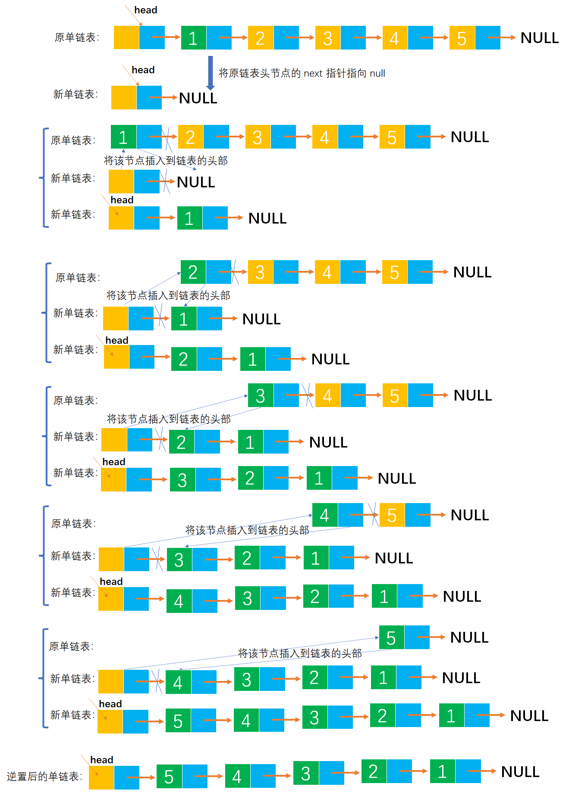

# Example007

## 题目

有一个线性表，采用带头结点的单链表 L 来存储。设计一个算法将其逆置。要求不能建立新结点，只能通过表中已有结点的重新组合来完成。

## 分析

本题考查的知识点：
- 单链表
- 头插法创建单链表

**分析**：
- 本题考查的是不在创建一条新链表的情况下完成链表的逆置，所以要利用原链表的头节点。但仍然会需要额外的空间。
- 本题涉及建立链表的头插法。头插法完成后，链表中的元素顺序和原数组中元素的顺序相反。
- 这里可以将 L 中的元素作为逆转后 L 的元素来源，即将 `L->next` 设置为空，然后将头结点后的一串结点用头插法逐个插入 L 中，这样新的L中的元素顺序正好是逆序的。

## 图解




## C实现

核心代码：

```c
/**
 * 逆置单链表
 * @param list 原单链表
 */
void inversion(LNode **list) {
    // 原单链表的第一个节点
    LNode *node = (*list)->next;
    // 重新初始化原链表，即将原链表的头节点的 next 指针指向 null，故称为新链表
    (*list)->next = NULL;
    // 循环遍历原链表，将原链表所有节点使用头插法插入到新链表中
    while (node != NULL) {
        // 保存当前节点的后继节点，如果不保存的话，插入操作会把原链表的节点给覆盖掉
        LNode *temp = node->next;
        // 把当前节点 node 当作一个新节点来插入。将 node 节点的 next 指针指向新链表的第一个节点
        node->next = (*list)->next;
        // 将新链表的头节点的 next 指针指向 node 节点，即让 node 节点成为新链表的第一个节点
        (*list)->next = node;
        // 继续原链表的下一个节点
        node = temp;
    }
}
```

完整代码：

```c
#include <stdio.h>
#include <malloc.h>

/**
 * 单链表节点
 */
typedef struct LNode {
    /**
     * 单链表节点的数据域
     */
    int data;
    /**
     * 单链表节点的的指针域，指向当前节点的后继节点
     */
    struct LNode *next;
} LNode;

/**
 * 通过尾插法创建单链表
 * @param list 单链表
 * @param nums 创建单链表时插入的数据数组
 * @param n 数组长度
 * @return 创建好的单链表
 */
LNode *createByTail(LNode **list, int nums[], int n) {
    // 1.初始化单链表
    // 创建链表必须要先初始化链表，也可以选择直接调用 init() 函数
    *list = (LNode *) malloc(sizeof(LNode));
    (*list)->next = NULL;

    // 尾插法，必须知道链表的尾节点（即链表的最后一个节点），初始时，单链表的头结点就是尾节点
    // 因为在单链表中插入节点我们必须知道前驱节点，而头插法中的前驱节点一直是头节点，但尾插法中要在单链表的末尾插入新节点，所以前驱节点一直都是链表的最后一个节点，而链表的最后一个节点由于链表插入新节点会一直变化
    LNode *node = (*list);

    // 2.循环数组，将所有数依次插入到链表的尾部
    for (int i = 0; i < n; i++) {
        // 2.1 创建新节点，并指定数据域和指针域
        // 2.1.1 创建新节点，为其分配空间
        LNode *newNode = (LNode *) malloc(sizeof(LNode));
        // 2.1.2 为新节点指定数据域
        newNode->data = nums[i];
        // 2.1.3 为新节点指定指针域，新节点的指针域初始时设置为 null
        newNode->next = NULL;

        // 2.2 将新节点插入到单链表的尾部
        // 2.2.1 将链表原尾节点的 next 指针指向新节点
        node->next = newNode;
        // 2.2.2 将新节点置为新的尾节点
        node = newNode;
    }
    return *list;
}

/**
 * 逆置单链表
 * @param list 原单链表
 */
void inversion(LNode **list) {
    // 原单链表的第一个节点
    LNode *node = (*list)->next;
    // 重新初始化原链表，即将原链表的头节点的 next 指针指向 null，故称为新链表
    (*list)->next = NULL;
    // 循环遍历原链表，将原链表所有节点使用头插法插入到新链表中
    while (node != NULL) {
        // 保存当前节点的后继节点，如果不保存的话，插入操作会把原链表的节点给覆盖掉
        LNode *temp = node->next;
        // 把当前节点 node 当作一个新节点来插入。将 node 节点的 next 指针指向新链表的第一个节点
        node->next = (*list)->next;
        // 将新链表的头节点的 next 指针指向 node 节点，即让 node 节点成为新链表的第一个节点
        (*list)->next = node;
        // 继续原链表的下一个节点
        node = temp;
    }
}

/**
 * 打印链表的所有节点
 * @param list 单链表
 */
void print(LNode *list) {
    printf("[");
    // 链表的第一个节点
    LNode *node = list->next;
    // 循环单链表所有节点，打印值
    while (node != NULL) {
        printf("%d", node->data);
        if (node->next != NULL) {
            printf(", ");
        }
        node = node->next;
    }
    printf("]\n");
}

int main() {
    // 声明单链表
    LNode *list;

    // 创建单链表
    int nums[] = {1, 2, 3, 4, 5, 6};
    int n = 6;
    createByTail(&list, nums, n);
    print(list);

    // 逆置链表
    inversion(&list);
    print(list);
}
```

执行结果：

```text
[1, 2, 3, 4, 5, 6]
[6, 5, 4, 3, 2, 1]
```

注意：在数据结构题目中更倾向于使用 `*&` 引用来修改单链表，而不是使用指向指针的指针 `**`。尽管那属于 C++ 中的知识。

```c++
#include <stdio.h>
#include <malloc.h>

/**
 * 单链表节点
 */
typedef struct LNode {
    /**
     * 单链表节点的数据域
     */
    int data;
    /**
     * 单链表节点的的指针域，指向当前节点的后继节点
     */
    struct LNode *next;
} LNode;

/**
 * 使用尾插法创建单链表
 * @param list 单链表
 * @param nums 待插入到单链表中的数组
 * @param n 数组长度
 */
void createByTail(LNode *&list, int nums[], int n) {
    // 初始化单链表
    list = (LNode *) malloc(sizeof(LNode) * n);
    list->next = NULL;
    // 链表的尾节点，初始时链表的尾节点就是头节点
    LNode *tailNode = list;
    // 循环数组 nums 中所有数据
    for (int i = 0; i < n; i++) {
        // 创建新节点并指定数据域和指针域
        LNode *newNode = (LNode *) malloc(sizeof(LNode));
        newNode->data = nums[i];
        newNode->next = NULL;
        // 将新节点插入到链表的尾部
        tailNode->next = newNode;
        tailNode = newNode;
    }
}

/**
 * 逆置单链表
 * @param list 原单链表
 */
void inversion(LNode *&list) {
    // 原单链表的第一个节点
    LNode *node = list->next;
    // 重新初始化原链表，即将原链表的头节点的 next 指针指向 null，故称为新链表
    list->next = NULL;
    // 循环遍历原链表，将原链表所有节点使用头插法插入到新链表中
    while (node != NULL) {
        // 保存当前节点的后继节点，如果不保存的话，插入操作会把原链表的节点给覆盖掉
        LNode *temp = node->next;
        // 把当前节点 node 当作一个新节点来插入。将 node 节点的 next 指针指向新链表的第一个节点
        node->next = list->next;
        // 将新链表的头节点的 next 指针指向 node 节点，即让 node 节点成为新链表的第一个节点
        list->next = node;
        // 继续原链表的下一个节点
        node = temp;
    }
}

/**
 * 打印链表的所有节点
 * @param list 单链表
 */
void print(LNode *list) {
    printf("[");
    // 链表的第一个节点
    LNode *node = list->next;
    // 循环单链表所有节点，打印值
    while (node != NULL) {
        printf("%d", node->data);
        if (node->next != NULL) {
            printf(", ");
        }
        node = node->next;
    }
    printf("]\n");
}

int main() {
    // 声明单链表
    LNode *list;

    // 创建单链表
    int nums[] = {1, 2, 3, 4, 5, 6};
    int n = 6;
    createByTail(list, nums, n);
    print(list);

    // 逆置链表
    inversion(list);
    print(list);
}
```

## Java实现

核心代码：

```java
    /**
     * 逆置单链表
     */
    public void inversion() {
        // 单链表的第一个节点
        LNode node = list.next;
        // 将单链表头节点的 next 指针指向 null，为了在头节点后面插入新节点，相当于重新进行了初始化，此时称 list 为新链表
        list.next = null;
        // 循环遍历原链表所有节点，利用头插法，将节点重新插入，就完成了链表的逆置
        while (node != null) {
            // 临时记录当前节点的后继节点
            LNode temp = node.next;
            // 将当前节点的 next 指向新链表的第一个节点。这里把当前节点 node 当作一个新节点来处理，其实就是头插法
            node.next = list.next;
            // 将新链表头节点的 next 指针指向当前节点
            list.next = node;
            // 继续下一个节点
            node = temp;
        }
    }
```

完整代码：

```java
/**
 * @author lcl100
 * @desc （带头结点的）单链表
 * @create 2022-03-01 20:58
 */
public class LinkedList {
    /**
     * 单链表
     */
    private LNode list;

    /**
     * 通过尾插法创建单链表
     *
     * @param nums 创建单链表时插入的数据
     * @return 创建好的单链表
     */
    public LNode createByTail(int... nums) {
        // 1.初始化单链表
        // 创建链表必须要先初始化链表，也可以选择直接调用 init() 函数
        list = new LNode();
        list.next = null;

        // 尾插法，必须知道链表的尾节点（即链表的最后一个节点），初始时，单链表的头结点就是尾节点
        // 因为在单链表中插入节点我们必须知道前驱节点，而头插法中的前驱节点一直是头节点，但尾插法中要在单链表的末尾插入新节点，所以前驱节点一直都是链表的最后一个节点，而链表的最后一个节点由于链表插入新节点会一直变化
        LNode tailNode = list;

        // 2.循环数组，将所有数依次插入到链表的尾部
        for (int i = 0; i < nums.length; i++) {
            // 2.1 创建新节点，并指定数据域和指针域
            // 2.1.1 创建新节点，为其分配空间
            LNode newNode = new LNode();
            // 2.1.2 为新节点指定数据域
            newNode.data = nums[i];
            // 2.1.3 为新节点指定指针域，新节点的指针域初始时设置为 null
            newNode.next = null;

            // 2.2 将新节点插入到单链表的尾部
            // 2.2.1 将链表原尾节点的 next 指针指向新节点
            tailNode.next = newNode;
            // 2.2.2 将新节点置为新的尾节点
            tailNode = newNode;
        }

        return list;
    }

    /**
     * 逆置单链表
     */
    public void inversion() {
        // 单链表的第一个节点
        LNode node = list.next;
        // 将单链表头节点的 next 指针指向 null，为了在头节点后面插入新节点，相当于重新进行了初始化，此时称 list 为新链表
        list.next = null;
        // 循环遍历原链表所有节点，利用头插法，将节点重新插入，就完成了链表的逆置
        while (node != null) {
            // 临时记录当前节点的后继节点
            LNode temp = node.next;
            // 将当前节点的 next 指向新链表的第一个节点。这里把当前节点 node 当作一个新节点来处理，其实就是头插法
            node.next = list.next;
            // 将新链表头节点的 next 指针指向当前节点
            list.next = node;
            // 继续下一个节点
            node = temp;
        }
    }

    /**
     * 打印单链表所有节点
     */
    public void print() {
        // 链表的第一个节点
        LNode node = list.next;
        // 循环打印
        String str = "[";
        while (node != null) {
            // 拼接节点的数据域
            str += node.data;
            // 只要不是最后一个节点，那么就在每个节点的数据域后面添加一个分号，用于分隔字符串
            if (node.next != null) {
                str += ", ";
            }
            // 继续链表的下一个节点
            node = node.next;
        }
        str += "]";
        // 打印链表
        System.out.println(str);
    }
}

/**
 * 单链表的节点
 */
class LNode {
    /**
     * 链表的数据域，暂时指定为 int 类型，因为 Java 支持泛型，可以指定为泛型，就能支持更多的类型了
     */
    int data;
    /**
     * 链表的指针域，指向该节点的下一个节点
     */
    LNode next;
}
```

测试代码：

```java
/**
 * @author lcl100
 * @desc 单链表测试类
 * @create 2022-03-01 20:59
 */
public class LinkedListTest {
    public static void main(String[] args) throws Exception {
        // 创建单链表
        LinkedList list = new LinkedList();
        list.createByTail(1, 2, 3, 4, 5, 6);
        list.print();

        // 将单链表逆置
        list.inversion();
        list.print();
    }
}
```

执行结果：

```text
[1, 2, 3, 4, 5, 6]
[6, 5, 4, 3, 2, 1]
```