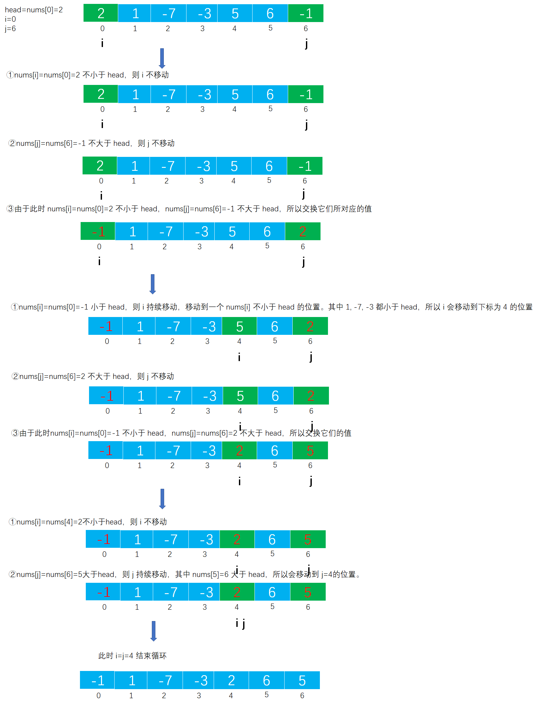

# Example008

## 题目

有一个顺序表 L，其元素为整型数据，设计一个算法，将 L 中所有小于表头元素的整数放在前半部分，大于表头元素的整数放在后半部分。


## 分析

本题考查的知识点：
- 顺序表
- 双指针
- 交换两个变量的值

**分析**：

- 定义一个局部变量 `head` 保存表头元素，再定义两根指针 `i` 和 `j` 指向顺序表中的第一个元素和最后一个元素。
- 当 `i ` 不等于 `j` 时进行循环，然后进行逻辑处理。
- 在循环中当指针 `i` 所指向的顺序表元素小于表头元素 `head` 时则不断移动 `i` 指针，从前往后移动。直到遇到大于或等于表头元素 `head` 时结束移动。
- 在循环中当指针 `j` 所指向的顺序表元素大于表头元素 `head` 时则不断移动 `j`指针，从后往前移动。直到遇到小于或等于表头元素 `head` 时结束移动。
- 此时，指针 `i` 所指向的顺序表元素大于或等于表头元素，指针 `j` 所指向的顺序表元素小于或等于表头元素，那么交换它们所对应的值。
- 交换完成后，继续下一轮循环移动，直到 `i` 不等于 `j`结束外层循环。

**注意**：

- 指针 `i` 和指针 `j` 所表示的循环，以及交换它们的值，都要求 `i<j`，因为在移动过程中 `i` 和 `j` 都很可能移动过界（大于顺序表长度或小于 0），所以必须进行限制。
- 外层循环结束的条件是 `i>=j`，即当 `i==j` 时就会结束循环，因为此时顺序表中小于表头的元素已经被放到了前半部分，而大于表头的元素已经被放到了后半部分，因此结束循环。


## 图解

以 `[2, 1, -7, -3, 5, 6, -1]`为例：




## C实现

核心代码：

```c
/**
 * 移动顺序表中的元素，将小于表头的元素放到前半部分，将大于表头的元素放到后半部分
 * @param list 顺序表
 */
void move(SeqList *list) {
    // 顺序表的表头元素
    int head = list->data[0];
    // 定义两根指针，分别指向顺序表中的第一个元素和最后一个元素
    int i = 0;// 指针 i 从前往后移动
    int j = list->length - 1;// 指针 j 从后往前移动

    // 当 i==j 时结束循环
    while (i < j) {
        // 从前往后移动，遇到第一个比你表头元素大的整数停止，注意 i<j 是必须的，因为指针 i 在不断增加过程中可能会大于 j 甚至超出顺序表的边界范围，导致出错
        while (i < j && list->data[i] < head) {
            // 如果遇到比表头元素小的整数，则 i 指针不断前进，直到遇到第一个比你表头元素大的整数停止
            i++;
        }
        // 从后往前移动，遇到第一个比表头元素小的整数停止
        while (i < j && list->data[j] > head) {
            // 如果遇到比表头元素大的整数，则 j 指针不断前进，直到遇到第一个比你表头元素小的整数停止
            j--;
        }
        // 当 i 遇到第一个比表头元素大的整数，j 遇到第一个比表头元素小的整数，则交换 i 和 j所表示的元素值
        if (i < j) {
            // 交换 data[i] 和 data[j] 的值
            int temp = list->data[i];
            list->data[i] = list->data[j];
            list->data[j] = temp;
        }
    }
}
```

完整代码：

```c
#include <stdio.h>

#define MAXSIZE 20

/**
 * 顺序表的结构体
 */
typedef struct {
    /**
     * 顺序表，实际上一个长度为 MAXSIZE 的数组，存储的数据类型为整型，当然可以设置为其他类型，但推荐使用宏定义类型，方便替换
     */
    int data[MAXSIZE];
    /**
     * 顺序表长度，即数组中实际元素个数
     */
    int length;
} SeqList;

/**
 * 初始化顺序表，仅需要将 length 置为 0 即可
 * @param list 待初始化的顺序表
 */
void init(SeqList *list) {
    // 仅需要将 length 置为 0 即可
    (*list).length = 0;
    // 或者可以用下面的语法
    // list->length=0;
}

/**
 * 直接添加新元素到顺序表的尾部
 * @param list 顺序表
 * @param ele 待添加的新元素
 * @return 如果插入成功则返回 1，否则返回 0
 */
int add(SeqList *list, int ele) {
    // 0.校验
    // 0.1 向顺序表中插入元素要检查顺序表是否已经满了，如果已经满了则不能再插入新元素则添加失败
    if (list->length == MAXSIZE) {
        return 0;
    }
    // 1.插入新元素
    // 1.1 直接获取顺序表的 length，然后将新元素的值赋予到 length 位置即可
    list->data[list->length] = ele;
    // 1.2 注意修改 length
    list->length++;
    return 1;
}

/**
 * 移动顺序表中的元素，将小于表头的元素放到前半部分，将大于表头的元素放到后半部分
 * @param list 顺序表
 */
void move(SeqList *list) {
    // 顺序表的表头元素
    int head = list->data[0];
    // 定义两根指针，分别指向顺序表中的第一个元素和最后一个元素
    int i = 0;// 指针 i 从前往后移动
    int j = list->length - 1;// 指针 j 从后往前移动

    // 当 i==j 时结束循环
    while (i < j) {
        // 从前往后移动，遇到第一个比你表头元素大的整数停止，注意 i<j 是必须的，因为指针 i 在不断增加过程中可能会大于 j 甚至超出顺序表的边界范围，导致出错
        while (i < j && list->data[i] < head) {
            // 如果遇到比表头元素小的整数，则 i 指针不断前进，直到遇到第一个比你表头元素大的整数停止
            i++;
        }
        // 从后往前移动，遇到第一个比表头元素小的整数停止
        while (i < j && list->data[j] > head) {
            // 如果遇到比表头元素大的整数，则 j 指针不断前进，直到遇到第一个比你表头元素小的整数停止
            j--;
        }
        // 当 i 遇到第一个比表头元素大的整数，j 遇到第一个比表头元素小的整数，则交换 i 和 j所表示的元素值
        if (i < j) {
            // 交换 data[i] 和 data[j] 的值
            int temp = list->data[i];
            list->data[i] = list->data[j];
            list->data[j] = temp;
        }
    }
}

/**
 * 打印顺序表
 * @param list 待打印的顺序表
 */
void print(SeqList list) {
    printf("[");
    for (int i = 0; i < list.length; i++) {
        printf("%d", list.data[i]);
        if (i != list.length - 1) {
            printf(", ");
        }
    }
    printf("]\n");
}

int main() {
    // 声明顺序表并初始化
    SeqList list;
    init(&list);

    // 为顺序表添加一些测试数据
    add(&list, 2);
    add(&list, 1);
    add(&list, -7);
    add(&list, -3);
    add(&list, 5);
    add(&list, 6);
    add(&list, -1);
    print(list);

    // 移动顺序表中的元素，将小于表头的元素放到前半部分，将小于表头的元素放到后半部分
    move(&list);
    print(list);
}
```

执行结果：

```text
[2, 1, -7, -3, 5, 6, -1]
[-1, 1, -7, -3, 2, 6, 5]
```

## Java实现

核心代码：

```java
    /**
     * 移动顺序表中的元素，将小于表头的元素放到前半部分，将大于表头的元素放到后半部分
     */
    public void move() {
        // 存储表头元素
        int head = list.data[0];
        // 定义两根指针，分别指向顺序表中的第一个元素和最后一个元素
        int i = 0;// 指针 i 从前往后移动
        int j = list.length - 1;// 指针 j 从后往前移动

        // 当 i==j 时结束循环
        while (i < j) {
            // 从前往后移动，遇到第一个比你表头元素大的整数停止，注意 i<j 是必须的，因为指针 i 在不断增加过程中可能会大于 j 甚至超出顺序表的边界范围，导致出错
            while (i < j && list.data[i] < head) {
                // 如果遇到比表头元素小的整数，则 i 指针不断前进，直到遇到第一个比你表头元素大的整数停止
                i++;
            }
            // 从后往前移动，遇到第一个比表头元素小的整数停止
            while (i < j && list.data[j] > head) {
                // 如果遇到比表头元素大的整数，则 j 指针不断前进，直到遇到第一个比你表头元素小的整数停止
                j--;
            }
            // 当 i 遇到第一个比表头元素大的整数，j 遇到第一个比表头元素小的整数，则交换 i 和 j所表示的元素值
            if (i < j) {
                // 交换 data[i] 和 data[j] 的值
                int temp = list.data[i];
                list.data[i] = list.data[j];
                list.data[j] = temp;
            }
        }
    }
```

完整代码：

```java
/**
 * @author lcl100
 * @desc 线性表
 * @create 2022-02-28 20:16
 */
public class SeqList {
    /**
     * 顺序表最大能存放元素个数
     */
    private final int MAXSIZE = 20;

    /**
     * 声明的顺序表，未初始化
     */
    private List list;

    /**
     * 初始化顺序表
     */
    public void init() {
        list = new List();
        // 指定数据数组长度为 MAXSIZE
        list.data = new int[MAXSIZE];
        // 但指定顺序表实际元素个数为 0
        list.length = 0;
    }

    /**
     * 直接添加新元素到顺序表的尾部
     *
     * @param ele 待插入的新元素
     */
    public void add(int ele) throws Exception {
        // 0.校验
        // 0.1 向顺序表中插入元素要检查顺序表是否已经满了，如果已经满了则不能再插入新元素则抛出异常
        if (list.length == MAXSIZE) {
            throw new Exception("顺序表已满，不能再插入了！");
        }
        // 1.插入新元素
        // 1.1 直接获取顺序表的 length，然后将新元素的值赋予到 length 位置即可
        list.data[list.length] = ele;
        // 1.2 注意修改 length
        list.length++;
    }

    /**
     * 移动顺序表中的元素，将小于表头的元素放到前半部分，将大于表头的元素放到后半部分
     */
    public void move() {
        // 存储表头元素
        int head = list.data[0];
        // 定义两根指针，分别指向顺序表中的第一个元素和最后一个元素
        int i = 0;// 指针 i 从前往后移动
        int j = list.length - 1;// 指针 j 从后往前移动

        // 当 i==j 时结束循环
        while (i < j) {
            // 从前往后移动，遇到第一个比你表头元素大的整数停止，注意 i<j 是必须的，因为指针 i 在不断增加过程中可能会大于 j 甚至超出顺序表的边界范围，导致出错
            while (i < j && list.data[i] < head) {
                // 如果遇到比表头元素小的整数，则 i 指针不断前进，直到遇到第一个比你表头元素大的整数停止
                i++;
            }
            // 从后往前移动，遇到第一个比表头元素小的整数停止
            while (i < j && list.data[j] > head) {
                // 如果遇到比表头元素大的整数，则 j 指针不断前进，直到遇到第一个比你表头元素小的整数停止
                j--;
            }
            // 当 i 遇到第一个比表头元素大的整数，j 遇到第一个比表头元素小的整数，则交换 i 和 j所表示的元素值
            if (i < j) {
                // 交换 data[i] 和 data[j] 的值
                int temp = list.data[i];
                list.data[i] = list.data[j];
                list.data[j] = temp;
            }
        }
    }

    /**
     * 打印顺序表
     */
    public void print() {
        String str = "[";
        for (int i = 0; i < list.length; i++) {
            str += list.data[i];
            if (i != list.length - 1) {
                str += ", ";
            }
        }
        str += "]";
        System.out.println(str);
    }
}

/**
 * 顺序表
 */
class List {
    /**
     * 数据域，保存数据的数组
     */
    int[] data;
    /**
     * 数组中实际元素个数
     */
    int length;
}
```

测试代码：

```java
/**
 * @author lcl100
 * @desc 顺序表测试类
 * @create 2022-02-28 20:18
 */
public class SeqListTest {
    public static void main(String[] args) throws Exception {
        // 创建顺序表并初始化
        SeqList list = new SeqList();
        list.init();

        // 添加一些测试数据
        list.add(2);
        list.add(1);
        list.add(-7);
        list.add(-3);
        list.add(5);
        list.add(6);
        list.add(-1);
        list.print();

        // 移动顺序表中的元素，将小于表头的元素放到前半部分，将小于表头的元素放到后半部分
        list.move();
        list.print();
    }
}
```

执行结果：

```text
[2, 1, -7, -3, 5, 6, -1]
[-1, 1, -7, -3, 2, 6, 5]
```