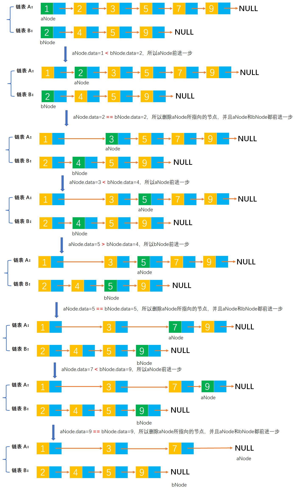

# Example009

## 题目

已知递增有序的单链表A、B(A、B中元素个数分别为m、n，且A、B都带有头结点）分别存储了一个集合，请设计算法，以求出两个集合A和B的差集`A-B`（仅由在A中出现而不在B中出现的元素所构成的集合)。将差集保存在单链表A中，并保持元素的递增有序性。


## 分析

本题考查的知识点：
- 单链表
- 单链表删除节点

**分析**：
- 已知两个单链表都是递增有序的，所以才能采用下面的算法，否则要先对链表进行排序。
- 算法思想如下：循环链表 A 和 B 中的每个节点
- 如果链表 A 中节点的数据域值**小于**链表 B 中节点的数据域值，则链表 A 前进一个节点。该节点必然在差集中。
- 如果链表 A 中节点的数据域值**等于**链表 B 中节点的数据域值，则删除链表 A 中当前节点，并且让链表 A 和 B 都前进一个节点。在两个链表中都存在的节点一定不会在差集中。
- 如果链表 A 中节点的数据域值**大于**链表 B 中节点的数据域值，则链表 B 前进一个节点。
- 循环结束后，即使链表 A 中还有剩余节点，也会保存在链表 A 中。

**注意**：
- 题目要求将两个链表的差集结果保存在链表 A 中，那么必然要删除同时在链表 A 和 B 中出现的节点。
- 而要删除单链表中的节点，则必须知道被删除节点的前驱节点，所以需要注意保存链表 A 中节点的前驱节点。


## 图解




## C实现

核心代码：

```c
/**
 * 求链表 A 和 B 的差集
 * @param aList 链表 A，调用该函数后，差集结果保存在该链表中。注意，因为要修改该单链表，所以形参是指向指针的指针。
 * @param bList 链表 B
 */
void difference(LNode **aList, LNode *bList) {
    // 链表 A 和 B 的第一个节点
    LNode *aNode = (*aList)->next;
    LNode *bNode = bList->next;
    // 记录链表 A 中每个节点的前驱节点，初始为链表的头节点，在删除节点时会用到
    LNode *aPreNode = *aList;

    // 循环两个链表，注意，循环结束的条件是任意一个链表遍历完
    while (aNode != NULL && bNode != NULL) {
        // 如果链表 A 中节点的数据小于链表 B 中节点的数据
        if (aNode->data < bNode->data) {
            // 注意，这里要保存链表 A 中的节点为前驱节点
            aPreNode = aNode;
            // 那么链表 A 前进一步
            aNode = aNode->next;
        }
        // 如果链表 A 中节点的数据等于链表 B 中的节点的数据
        else if (aNode->data == bNode->data) {
            // 删除链表 A 中相等值的节点，即删除 aNode 节点
            aPreNode->next = aNode->next;// 即将 aNode 节点的前驱节点的 next 指针指向 aNode 节点的后继节点，这样就完成了 aNode 节点的删除
            // 那么链表 A 前进一步
            aNode = aNode->next;
            // 那么链表 B 前进一步
            bNode = bNode->next;
        }
        // 如果链表 A 中节点的数据大于链表 B 中的节点的数据
        else {
            // 那么链表 B 前驱节点
            bNode = bNode->next;
        }
    }
}
```

完整代码：

```c
#include <stdio.h>
#include <malloc.h>

/**
 * 单链表节点
 */
typedef struct LNode {
    /**
     * 单链表节点的数据域
     */
    int data;
    /**
     * 单链表节点的的指针域，指向当前节点的后继节点
     */
    struct LNode *next;
} LNode;

/**
 * 通过尾插法创建单链表
 * @param list 单链表
 * @param nums 创建单链表时插入的数据数组
 * @param n 数组长度
 * @return 创建好的单链表
 */
LNode *createByTail(LNode **list, int nums[], int n) {
    // 1.初始化单链表
    // 创建链表必须要先初始化链表，也可以选择直接调用 init() 函数
    *list = (LNode *) malloc(sizeof(LNode));
    (*list)->next = NULL;

    // 尾插法，必须知道链表的尾节点（即链表的最后一个节点），初始时，单链表的头结点就是尾节点
    // 因为在单链表中插入节点我们必须知道前驱节点，而头插法中的前驱节点一直是头节点，但尾插法中要在单链表的末尾插入新节点，所以前驱节点一直都是链表的最后一个节点，而链表的最后一个节点由于链表插入新节点会一直变化
    LNode *node = (*list);

    // 2.循环数组，将所有数依次插入到链表的尾部
    for (int i = 0; i < n; i++) {
        // 2.1 创建新节点，并指定数据域和指针域
        // 2.1.1 创建新节点，为其分配空间
        LNode *newNode = (LNode *) malloc(sizeof(LNode));
        // 2.1.2 为新节点指定数据域
        newNode->data = nums[i];
        // 2.1.3 为新节点指定指针域，新节点的指针域初始时设置为 null
        newNode->next = NULL;

        // 2.2 将新节点插入到单链表的尾部
        // 2.2.1 将链表原尾节点的 next 指针指向新节点
        node->next = newNode;
        // 2.2.2 将新节点置为新的尾节点
        node = newNode;
    }
    return *list;
}

/**
 * 求链表 A 和 B 的差集
 * @param aList 链表 A，调用该函数后，差集结果保存在该链表中。注意，因为要修改该单链表，所以形参是指向指针的指针。
 * @param bList 链表 B
 */
void difference(LNode **aList, LNode *bList) {
    // 链表 A 和 B 的第一个节点
    LNode *aNode = (*aList)->next;
    LNode *bNode = bList->next;
    // 记录链表 A 中每个节点的前驱节点，初始为链表的头节点，在删除节点时会用到
    LNode *aPreNode = *aList;

    // 循环两个链表，注意，循环结束的条件是任意一个链表遍历完
    while (aNode != NULL && bNode != NULL) {
        // 如果链表 A 中节点的数据小于链表 B 中节点的数据
        if (aNode->data < bNode->data) {
            // 注意，这里要保存链表 A 中的节点为前驱节点
            aPreNode = aNode;
            // 那么链表 A 前进一步
            aNode = aNode->next;
        }
        // 如果链表 A 中节点的数据等于链表 B 中的节点的数据
        else if (aNode->data == bNode->data) {
            // 删除链表 A 中相等值的节点，即删除 aNode 节点
            aPreNode->next = aNode->next;// 即将 aNode 节点的前驱节点的 next 指针指向 aNode 节点的后继节点，这样就完成了 aNode 节点的删除
            // 那么链表 A 前进一步
            aNode = aNode->next;
            // 那么链表 B 前进一步
            bNode = bNode->next;
        }
        // 如果链表 A 中节点的数据大于链表 B 中的节点的数据
        else {
            // 那么链表 B 前驱节点
            bNode = bNode->next;
        }
    }
}

/**
 * 打印链表的所有节点
 * @param list 单链表
 */
void print(LNode *list) {
    printf("[");
    // 链表的第一个节点
    LNode *node = list->next;
    // 循环单链表所有节点，打印值
    while (node != NULL) {
        printf("%d", node->data);
        if (node->next != NULL) {
            printf(", ");
        }
        node = node->next;
    }
    printf("]\n");
}

int main() {
    // 声明单链表 A 和 B
    LNode *aList;
    LNode *bList;

    // 为单链表赋值
    int aNums[] = {1, 2, 3, 5, 7, 9};
    int aN = 5;
    createByTail(&aList, aNums, aN);
    print(aList);
    int bNums[] = {2, 4, 5, 9};
    int bN = 4;
    createByTail(&bList, bNums, bN);
    print(bList);

    // 求两个链表的差集
    difference(&aList, bList);
    print(aList);
}
```

执行结果：

```text
[1, 2, 3, 5, 7, 9]
[2, 4, 5, 9]
[1, 3, 7]
```


## Java实现

核心代码：

```java
    /**
     * 求链表 A 和 B 的差集，将差集结果保存到 A 链表中
     *
     * @param aList 链表 A
     * @param bList 链表 B
     */
    public void difference(LinkedList aList, LinkedList bList) {
        // 链表 A 和 B 的第一个节点
        LNode aNode = aList.list.next;
        LNode bNode = bList.list.next;
        // 记录链表 A 中每个节点的前驱节点，初始为链表的头节点，在删除节点时会用到
        LNode aPreNode = aList.list;

        // 循环两个链表，注意，循环结束的条件是任意一个链表遍历完
        while (aNode != null && bNode != null) {
            // 如果链表 A 中节点的数据小于链表 B 中节点的数据
            if (aNode.data < bNode.data) {
                // 注意，这里要保存链表 A 中的节点为前驱节点
                aPreNode = aNode;
                // 那么链表 A 前进一步
                aNode = aNode.next;
            }
            // 如果链表 A 中节点的数据等于链表 B 中的节点的数据
            else if (aNode.data == bNode.data) {
                // 删除链表 A 中相等值的节点，即删除 aNode 节点
                aPreNode.next = aNode.next;// 即将 aNode 节点的前驱节点的 next 指针指向 aNode 节点的后继节点，这样就完成了 aNode 节点的删除
                // 那么链表 A 前进一步
                aNode = aNode.next;
                // 那么链表 B 前进一步
                bNode = bNode.next;
            }
            // 如果链表 A 中节点的数据大于链表 B 中的节点的数据
            else {
                // 那么链表 B 前驱节点
                bNode = bNode.next;
            }
        }
    }
```

完整代码：

```java
/**
 * @author lcl100
 * @create 2022-03-01 21:32
 */
public class LinkedList {
    /**
     * 单链表
     */
    private LNode list;

    /**
     * 通过尾插法创建单链表
     *
     * @param nums 创建单链表时插入的数据
     * @return 创建好的单链表
     */
    public LNode createByTail(int... nums) {
        // 1.初始化单链表
        // 创建链表必须要先初始化链表，也可以选择直接调用 init() 函数
        list = new LNode();
        list.next = null;

        // 尾插法，必须知道链表的尾节点（即链表的最后一个节点），初始时，单链表的头结点就是尾节点
        // 因为在单链表中插入节点我们必须知道前驱节点，而头插法中的前驱节点一直是头节点，但尾插法中要在单链表的末尾插入新节点，所以前驱节点一直都是链表的最后一个节点，而链表的最后一个节点由于链表插入新节点会一直变化
        LNode tailNode = list;

        // 2.循环数组，将所有数依次插入到链表的尾部
        for (int i = 0; i < nums.length; i++) {
            // 2.1 创建新节点，并指定数据域和指针域
            // 2.1.1 创建新节点，为其分配空间
            LNode newNode = new LNode();
            // 2.1.2 为新节点指定数据域
            newNode.data = nums[i];
            // 2.1.3 为新节点指定指针域，新节点的指针域初始时设置为 null
            newNode.next = null;

            // 2.2 将新节点插入到单链表的尾部
            // 2.2.1 将链表原尾节点的 next 指针指向新节点
            tailNode.next = newNode;
            // 2.2.2 将新节点置为新的尾节点
            tailNode = newNode;
        }

        return list;
    }

    /**
     * 求链表 A 和 B 的差集，将差集结果保存到 A 链表中
     *
     * @param aList 链表 A
     * @param bList 链表 B
     */
    public void difference(LinkedList aList, LinkedList bList) {
        // 链表 A 和 B 的第一个节点
        LNode aNode = aList.list.next;
        LNode bNode = bList.list.next;
        // 记录链表 A 中每个节点的前驱节点，初始为链表的头节点，在删除节点时会用到
        LNode aPreNode = aList.list;

        // 循环两个链表，注意，循环结束的条件是任意一个链表遍历完
        while (aNode != null && bNode != null) {
            // 如果链表 A 中节点的数据小于链表 B 中节点的数据
            if (aNode.data < bNode.data) {
                // 注意，这里要保存链表 A 中的节点为前驱节点
                aPreNode = aNode;
                // 那么链表 A 前进一步
                aNode = aNode.next;
            }
            // 如果链表 A 中节点的数据等于链表 B 中的节点的数据
            else if (aNode.data == bNode.data) {
                // 删除链表 A 中相等值的节点，即删除 aNode 节点
                aPreNode.next = aNode.next;// 即将 aNode 节点的前驱节点的 next 指针指向 aNode 节点的后继节点，这样就完成了 aNode 节点的删除
                // 那么链表 A 前进一步
                aNode = aNode.next;
                // 那么链表 B 前进一步
                bNode = bNode.next;
            }
            // 如果链表 A 中节点的数据大于链表 B 中的节点的数据
            else {
                // 那么链表 B 前驱节点
                bNode = bNode.next;
            }
        }
    }

    /**
     * 打印单链表所有节点
     */
    public void print() {
        // 链表的第一个节点
        LNode node = list.next;
        // 循环打印
        String str = "[";
        while (node != null) {
            // 拼接节点的数据域
            str += node.data;
            // 只要不是最后一个节点，那么就在每个节点的数据域后面添加一个分号，用于分隔字符串
            if (node.next != null) {
                str += ", ";
            }
            // 继续链表的下一个节点
            node = node.next;
        }
        str += "]";
        // 打印链表
        System.out.println(str);
    }
}

/**
 * 单链表的节点
 */
class LNode {
    /**
     * 链表的数据域，暂时指定为 int 类型，因为 Java 支持泛型，可以指定为泛型，就能支持更多的类型了
     */
    int data;
    /**
     * 链表的指针域，指向该节点的下一个节点
     */
    LNode next;
}
```

测试代码：

```java
/**
 * @author lcl100
 * @create 2022-03-01 21:32
 */
public class LinkedListTest {
    public static void main(String[] args) {
        // 创建单链表 A
        LinkedList aList = new LinkedList();
        aList.createByTail(1, 2, 3, 5, 7, 9);
        aList.print();

        // 创建单链表 B
        LinkedList bList = new LinkedList();
        bList.createByTail(2, 4, 5, 9);
        bList.print();

        // 求两个链表的差集
        LinkedList list = new LinkedList();
        list.difference(aList, bList);
        aList.print();
    }
}
```

执行结果：

```text
[1, 2, 3, 5, 7, 9]
[2, 4, 5, 9]
[1, 3, 7]
```