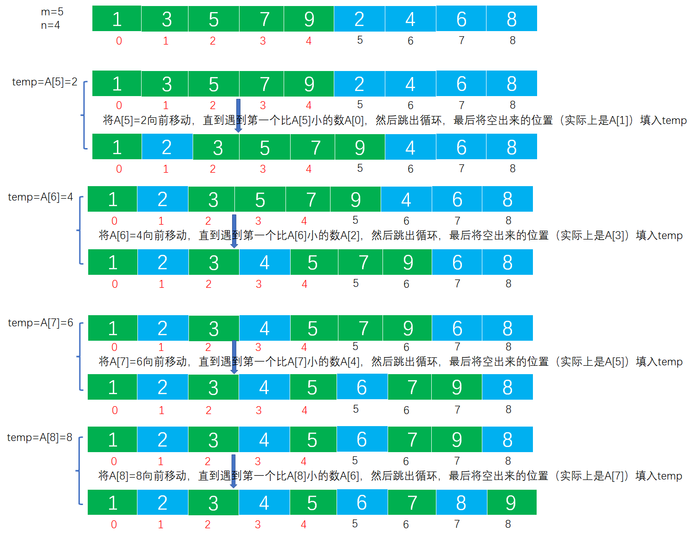

# Example010

## 题目

设顺序表用数组 `A[]` 表示，表中元素存储在数组下标 `0~m+n-1` 的范围内，前 `m` 个元素递增有序，后 `n` 个元素也递增有序，设计一个算法，使得整个顺序表有序。


## 分析

本题考查的知识点：
- 数组
- 嵌套 `for` 循环

**分析**：
- 将数组 `A[]` 中的 `m+n` 个元素（假设元素为 `int` 型）看成两个顺序表：表`L`和表`R`。
- 将数组当前状态看作起始状态，即此时表 `L` 由 `A[]` 中前 `m` 个元素构成，表 `R` 由 `A[]` 中后 `n` 个元素构成。
- 要使 `A[]` 中 `m+n` 个元素整体有序，只需将表`R` 中的元素逐个插入表 `L` 中的合适位置即可。
- 插入过程，取表 `R` 中的第一个元素 `A[m]` 存入辅助变量 `temp` 中，让 `temp` 逐个与 `A[m-1]`，…，`A[0]` 进行比较，当 `temp<A[j]`（0≤j≤m-1）时，将 `A[j]` 后移一位，否则将 `temp` 存入 `A[j+1]` 中。
- 重复上述过程，继续插入 `A[m+1]`，`A[m+2]`，…，`A[m+n-1]`，最终 `A[]` 中元素整体有序。

## 图解




## C实现

核心代码：

```c
/**
 * 使得整个顺序表有序
 *
 * @param A 顺序表
 * @param m 前半部分递增有序的元素个数
 * @param n 后半部分递增有序的元素个数
 */
void moveSort(int A[], int m, int n) {
    // 从 m 开始，需要移动 n 个数
    for (int i = m; i < m + n; i++) {
        // 临时保存要移动的数值
        int temp = A[i];

        int j;
        // 从下标为 i-1 的数开始，将前面的数向后移动一位
        for (j = i - 1; j > 0; j--) {
            // 只移动大于 temp 的数，即不能把下标为 i-1 之前的所有数（包括 i-1 所表示的数）都向后移动一位
            if (A[j] > temp) {
                // 用前一位的数覆盖后一位的数
                A[j + 1] = A[j];
            } else {
                // 即遇到 A[j]<=temp 的情况时，跳出循环，停止移动
                break;
            }
        }

        // 移动之后，A[j+1]就是空出来的位置，填入temp
        A[j + 1] = temp;
    }
}
```

完整代码：

```c
#include <stdio.h>

/**
 * 使得整个顺序表有序
 *
 * @param A 顺序表
 * @param m 前半部分递增有序的元素个数
 * @param n 后半部分递增有序的元素个数
 */
void moveSort(int A[], int m, int n) {
    // 从 m 开始，需要移动 n 个数
    for (int i = m; i < m + n; i++) {
        // 临时保存要移动的数值
        int temp = A[i];

        int j;
        // 从下标为 i-1 的数开始，将前面的数向后移动一位
        for (j = i - 1; j > 0; j--) {
            // 只移动大于 temp 的数，即不能把下标为 i-1 之前的所有数（包括 i-1 所表示的数）都向后移动一位
            if (A[j] > temp) {
                // 用前一位的数覆盖后一位的数
                A[j + 1] = A[j];
            } else {
                // 即遇到 A[j]<=temp 的情况时，跳出循环，停止移动
                break;
            }
        }

        // 移动之后，A[j+1]就是空出来的位置，填入temp
        A[j + 1] = temp;
    }
}

/**
 * 打印数组
 * @param arr 待打印的数组
 * @param len 数组长度
 */
void print(int arr[], int len) {
    printf("[");
    for (int i = 0; i < len; i++) {
        printf("%d", arr[i]);
        if (i != len - 1) {
            printf(", ");
        }
    }
    printf("]\n");
}

int main() {
    // 创建测试用的数组
    int A[] = {1, 3, 5, 7, 9, 2, 4, 6, 8};
    int m = 5, n = 4;
    print(A, m + n);

    // 调用函数排序
    moveSort(A, m, n);
    print(A, m + n);
}
```

执行结果：

```text
[1, 3, 5, 7, 9, 2, 4, 6, 8]
[1, 2, 3, 4, 5, 6, 7, 8, 9]
```

## Java实现

核心代码：

```java
    /**
     * 使得整个顺序表有序
     *
     * @param A 顺序表
     * @param m 前半部分递增有序的元素个数
     * @param n 后半部分递增有序的元素个数
     */
    public static void moveSort(int[] A, int m, int n) {
        // 从 m 开始，需要移动 n 个数
        for (int i = m; i < m + n; i++) {
            // 临时保存要移动的数值
            int temp = A[i];

            int j;
            // 从下标为 i-1 的数开始，将前面的数向后移动一位
            for (j = i - 1; j > 0; j--) {
                // 只移动大于 temp 的数，即不能把下标为 i-1 之前的所有数（包括 i-1 所表示的数）都向后移动一位
                if (A[j] > temp) {
                    // 用前一位的数覆盖后一位的数
                    A[j + 1] = A[j];
                } else {
                    // 即遇到 A[j]<=temp 的情况时，跳出循环，停止移动
                    break;
                }
            }

            // 移动之后，A[j+1]就是空出来的位置，填入temp
            A[j + 1] = temp;
        }
    }
```

完整代码：

```java
import java.util.Arrays;

/**
 * @author lcl100
 * @create 2022-03-06 16:01
 */
public class Test {
    public static void main(String[] args) {
        int[] A = new int[]{1, 3, 5, 7, 9, 2, 4, 6, 8};
        int m = 5, n = 4;
        System.out.println(Arrays.toString(A));// 打印数组

        // 调用函数进行移动
        moveSort(A, m, n);
        System.out.println(Arrays.toString(A));
    }

    /**
     * 使得整个顺序表有序
     *
     * @param A 顺序表
     * @param m 前半部分递增有序的元素个数
     * @param n 后半部分递增有序的元素个数
     */
    public static void moveSort(int[] A, int m, int n) {
        // 从 m 开始，需要移动 n 个数
        for (int i = m; i < m + n; i++) {
            // 临时保存要移动的数值
            int temp = A[i];

            int j;
            // 从下标为 i-1 的数开始，将前面的数向后移动一位
            for (j = i - 1; j > 0; j--) {
                // 只移动大于 temp 的数，即不能把下标为 i-1 之前的所有数（包括 i-1 所表示的数）都向后移动一位
                if (A[j] > temp) {
                    // 用前一位的数覆盖后一位的数
                    A[j + 1] = A[j];
                } else {
                    // 即遇到 A[j]<=temp 的情况时，跳出循环，停止移动
                    break;
                }
            }

            // 移动之后，A[j+1]就是空出来的位置，填入temp
            A[j + 1] = temp;
        }
    }
}
```

执行结果：

```text
[1, 3, 5, 7, 9, 2, 4, 6, 8]
[1, 2, 3, 4, 5, 6, 7, 8, 9]
```