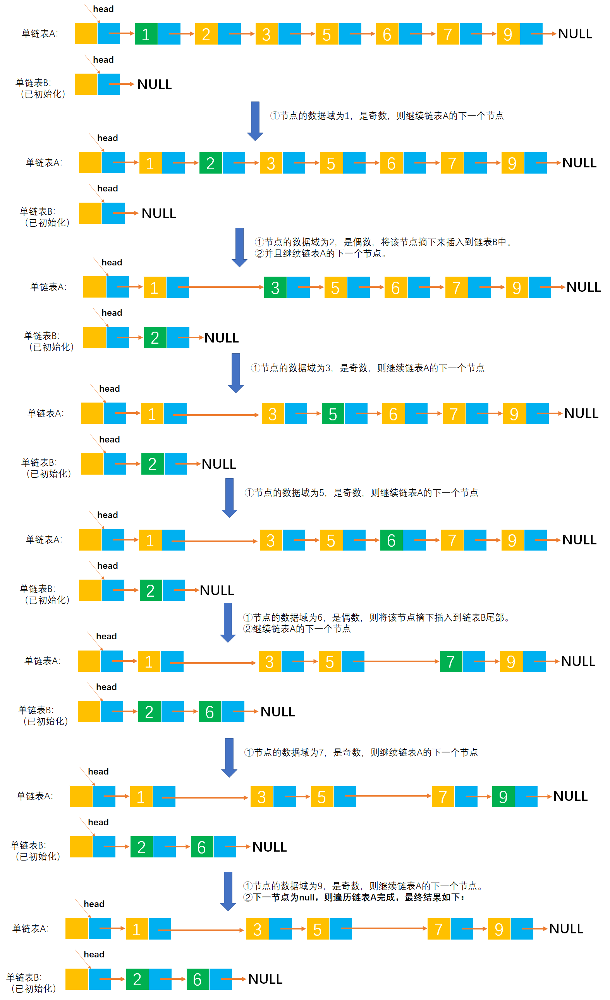

# Example011

## 题目
设计一个算法，将一个头结点为 `A` 的单链表（其数据域为整数）分解成两个单链表 `A` 和 `B`，使得 `A` 链表只含有原来链表中 `data` 域为奇数的结点，而 `B` 链表只含有原链表中 `data` 域为偶数的结点，且保持原来的相对顺序。

## 分析

本题考查的知识点：
- 单链表
- 删除单链表节点
- 使用尾插法创建单链表

**分析**：
- 使用指针 `p` 从头到尾扫描链表 `A`，当发现节点的数据域为偶数时则将该节点插入到链表 `B` 中，如果是奇数则不变。
- 因为题目要求按照原来数据元素的相对顺序，所以要采用尾插法来建立链表 `B`。

**注意**：
- 在代码中是直接创建一个新节点，然后将链表 `A` 中的偶数节点的数据域赋给新节点，然后插入到链表 `B` 的尾部。

## 图解

以 `[1, 2, 3, 5, 6, 7, 9]` 为例，下图演示了分解链表的大概步骤，但具体细节实现在代码中体现：




## C实现

核心代码：

```c
/**
 * 分解链表，使得链表 A 中只保存奇数节点，保存偶数节点到链表 B 中
 * @param aList 链表 A，传入时保存奇数和偶数节点，调用函数后只保留奇数节点
 * @param bList 链表 B，保存链表 A 中的所有偶数节点
 */
void splitOddAndEven(LNode **aList, LNode **bList) {
    // 1.初始化链表 B
    // 1.1 为链表 B 的头节点分配空间
    (*bList) = (LNode *) malloc(sizeof(LNode));
    // 1.2 将链表 B 的头节点的 next 指针指向 null
    (*bList)->next = NULL;

    // 变量，记录链表 B 的尾节点（作为前驱节点，用于在链表 B 的尾部插入新节点），初始时为链表 B 的头节点
    LNode *bTailNode = *bList;
    // 变量，记录链表 A 的每一个节点（用于遍历循环链表 A），初始时为链表 A 的第一个节点
    LNode *aNode = (*aList)->next;
    // 变量，记录链表 A 中节点的前驱节点（作为前驱节点，用于删除链表 A 中的偶数节点），初始时为链表 A 的头节点
    LNode *aPreNode = *aList;

    // 2.循环遍历链表 A，摘掉偶数节点插入到链表 B 中，留下奇数节点在链表 A 中。根据数据域是奇数还是偶数分情况处理：
    while (aNode != NULL) {
        // 2.1 如果链表节点的数据域是偶数
        if (aNode->data % 2 == 0) {
            // 2.1.1 将偶数节点插入到链表 B 中
            // 2.1.1.1 创建新节点（实际上也不需要创建新节点，可以直接将链表 A 中的偶数节点插入到链表 B 中）
            // 2.1.1.1.1 为新节点分配空间
            LNode *newNode = (LNode *) malloc(sizeof(LNode));
            // 2.1.1.1.2 为新节点的数据域指定内容，即偶数节点的数据域内容
            newNode->data = aNode->data;
            // 2.1.1.1.3 将新节点的 next 指针指向 null
            newNode->next = NULL;
            // 2.1.1.2 将新节点插入到链表 B 中
            // 2.1.1.2.1 将新节点插入到链表 B 的尾部
            bTailNode->next = newNode;
            // 2.1.1.2.2 更新变量 bTailNode，更新新节点为链表 B 的尾节点
            bTailNode = newNode;

            // 2.1.2 删除链表 A 中的偶数节点
            // 2.1.2.1 将 aNode 节点的前驱节点的 next 指针指向 aNode 节点的后继节点，完成删除 aNode 节点
            aPreNode->next = aNode->next;
            // 2.1.2.2 继续链表 A 中的下一个节点
            aNode = aNode->next;
        }
        // 2.2 如果链表节点的数据域是奇数
        else {
            // 2.2.1 记录奇数节点的前驱节点，注意，只需要记录奇数节点的前驱节点，不需要记录偶数节点的前驱节点
            aPreNode = aNode;
            // 2.2.2 继续链表 A 中的下一个节点
            aNode = aNode->next;
        }
    }
}
```

完整代码：

```c
#include <stdio.h>
#include <malloc.h>

/**
 * 单链表节点
 */
typedef struct LNode {
    /**
     * 单链表节点的数据域
     */
    int data;
    /**
     * 单链表节点的的指针域，指向当前节点的后继节点
     */
    struct LNode *next;
} LNode;

/**
 * 通过尾插法创建单链表
 * @param list 单链表
 * @param nums 创建单链表时插入的数据数组
 * @param n 数组长度
 * @return 创建好的单链表
 */
LNode *createByTail(LNode **list, int nums[], int n) {
    // 1.初始化单链表
    // 创建链表必须要先初始化链表，也可以选择直接调用 init() 函数
    *list = (LNode *) malloc(sizeof(LNode));
    (*list)->next = NULL;

    // 尾插法，必须知道链表的尾节点（即链表的最后一个节点），初始时，单链表的头结点就是尾节点
    // 因为在单链表中插入节点我们必须知道前驱节点，而头插法中的前驱节点一直是头节点，但尾插法中要在单链表的末尾插入新节点，所以前驱节点一直都是链表的最后一个节点，而链表的最后一个节点由于链表插入新节点会一直变化
    LNode *node = (*list);

    // 2.循环数组，将所有数依次插入到链表的尾部
    for (int i = 0; i < n; i++) {
        // 2.1 创建新节点，并指定数据域和指针域
        // 2.1.1 创建新节点，为其分配空间
        LNode *newNode = (LNode *) malloc(sizeof(LNode));
        // 2.1.2 为新节点指定数据域
        newNode->data = nums[i];
        // 2.1.3 为新节点指定指针域，新节点的指针域初始时设置为 null
        newNode->next = NULL;

        // 2.2 将新节点插入到单链表的尾部
        // 2.2.1 将链表原尾节点的 next 指针指向新节点
        node->next = newNode;
        // 2.2.2 将新节点置为新的尾节点
        node = newNode;
    }
    return *list;
}

/**
 * 分解链表，使得链表 A 中只保存奇数节点，保存偶数节点到链表 B 中
 * @param aList 链表 A，传入时保存奇数和偶数节点，调用函数后只保留奇数节点
 * @param bList 链表 B，保存链表 A 中的所有偶数节点
 */
void splitOddAndEven(LNode **aList, LNode **bList) {
    // 1.初始化链表 B
    // 1.1 为链表 B 的头节点分配空间
    (*bList) = (LNode *) malloc(sizeof(LNode));
    // 1.2 将链表 B 的头节点的 next 指针指向 null
    (*bList)->next = NULL;

    // 变量，记录链表 B 的尾节点（作为前驱节点，用于在链表 B 的尾部插入新节点），初始时为链表 B 的头节点
    LNode *bTailNode = *bList;
    // 变量，记录链表 A 的每一个节点（用于遍历循环链表 A），初始时为链表 A 的第一个节点
    LNode *aNode = (*aList)->next;
    // 变量，记录链表 A 中节点的前驱节点（作为前驱节点，用于删除链表 A 中的偶数节点），初始时为链表 A 的头节点
    LNode *aPreNode = *aList;

    // 2.循环遍历链表 A，摘掉偶数节点插入到链表 B 中，留下奇数节点在链表 A 中。根据数据域是奇数还是偶数分情况处理：
    while (aNode != NULL) {
        // 2.1 如果链表节点的数据域是偶数
        if (aNode->data % 2 == 0) {
            // 2.1.1 将偶数节点插入到链表 B 中
            // 2.1.1.1 创建新节点（实际上也不需要创建新节点，可以直接将链表 A 中的偶数节点插入到链表 B 中）
            // 2.1.1.1.1 为新节点分配空间
            LNode *newNode = (LNode *) malloc(sizeof(LNode));
            // 2.1.1.1.2 为新节点的数据域指定内容，即偶数节点的数据域内容
            newNode->data = aNode->data;
            // 2.1.1.1.3 将新节点的 next 指针指向 null
            newNode->next = NULL;
            // 2.1.1.2 将新节点插入到链表 B 中
            // 2.1.1.2.1 将新节点插入到链表 B 的尾部
            bTailNode->next = newNode;
            // 2.1.1.2.2 更新变量 bTailNode，更新新节点为链表 B 的尾节点
            bTailNode = newNode;

            // 2.1.2 删除链表 A 中的偶数节点
            // 2.1.2.1 将 aNode 节点的前驱节点的 next 指针指向 aNode 节点的后继节点，完成删除 aNode 节点
            aPreNode->next = aNode->next;
            // 2.1.2.2 继续链表 A 中的下一个节点
            aNode = aNode->next;
        }
        // 2.2 如果链表节点的数据域是奇数
        else {
            // 2.2.1 记录奇数节点的前驱节点，注意，只需要记录奇数节点的前驱节点，不需要记录偶数节点的前驱节点
            aPreNode = aNode;
            // 2.2.2 继续链表 A 中的下一个节点
            aNode = aNode->next;
        }
    }
}

/**
 * 打印链表的所有节点
 * @param list 单链表
 */
void print(LNode *list) {
    printf("[");
    // 链表的第一个节点
    LNode *node = list->next;
    // 循环单链表所有节点，打印值
    while (node != NULL) {
        printf("%d", node->data);
        if (node->next != NULL) {
            printf(", ");
        }
        node = node->next;
    }
    printf("]\n");
}

int main() {
    // 声明单链表
    LNode *aList, *bList;

    int nums[] = {1, 2, 3, 5, 6, 7, 9};
    int n = 7;
    createByTail(&aList, nums, n);
    print(aList);

    splitOddAndEven(&aList, &bList);
    print(aList);
    print(bList);
}
```

执行结果：

```text
[1, 2, 3, 5, 6, 7, 9]
[1, 3, 5, 7, 9]
[2, 6]
```

## Java实现

核心代码：

```java
    /**
     * 分解链表，使得链表 A 中只保存奇数节点，保存偶数节点到链表 B 中
     * @param aList 传入时为保存了所有节点的链表，分解后保存原链表中数据域为奇数的节点
     * @param bList 保存原链表中数据域为偶数的节点
     */
    public void splitOddAndEven(LinkedList aList, LinkedList bList) {
        // 初始化链表 B
        // 为头节点分配空间
        bList.list = new LNode();
        // 将头节点的 next 指针指向 null
        bList.list.next = null;

        // 变量，保存链表 B 的尾节点，初始为链表的头节点
        LNode bTailNode = bList.list;
        // 变量，链表 A 的第一个节点
        LNode aNode = aList.list.next;
        // 变量，记录链表 A 中奇数节点的前驱节点，初始为链表 A 的头节点
        LNode aPreNode = aList.list;

        // 循环遍历链表 A 中所有节点，分解奇数节点和偶数节点
        while (aNode != null) {
            // 如果节点的数据域为偶数
            if (aNode.data % 2 == 0) {
                // 创建新节点并且插入到链表 B 的尾部
                LNode newNode = new LNode();// 为新节点分配空间
                newNode.data = aNode.data;// 指定新节点的数据域为偶数节点的数据域
                newNode.next = null;// 将新节点的 next 指针指向 null
                bTailNode.next = newNode;// 将新节点插入到链表 B 的尾部
                bTailNode = newNode;// 更新尾节点为 newNode

                // 删除链表 A 中数据域为偶数的节点
                aPreNode.next = aNode.next;
                // 继续链表 A 的下一个节点
                aNode = aNode.next;
            }
            // 如果节点的数据域为奇数
            else {
                // 记录链表 A 中奇数节点的前驱节点
                aPreNode = aNode;
                // 继续链表 A 的下一个节点
                aNode = aNode.next;
            }
        }
    }
```

完整代码：

```java
/**
 * @author lcl100
 * @create 2022-03-01 21:32
 */
public class LinkedList {
    /**
     * 单链表
     */
    private LNode list;

    /**
     * 通过尾插法创建单链表
     *
     * @param nums 创建单链表时插入的数据
     * @return 创建好的单链表
     */
    public LNode createByTail(int... nums) {
        // 1.初始化单链表
        // 创建链表必须要先初始化链表，也可以选择直接调用 init() 函数
        list = new LNode();
        list.next = null;

        // 尾插法，必须知道链表的尾节点（即链表的最后一个节点），初始时，单链表的头结点就是尾节点
        // 因为在单链表中插入节点我们必须知道前驱节点，而头插法中的前驱节点一直是头节点，但尾插法中要在单链表的末尾插入新节点，所以前驱节点一直都是链表的最后一个节点，而链表的最后一个节点由于链表插入新节点会一直变化
        LNode tailNode = list;

        // 2.循环数组，将所有数依次插入到链表的尾部
        for (int i = 0; i < nums.length; i++) {
            // 2.1 创建新节点，并指定数据域和指针域
            // 2.1.1 创建新节点，为其分配空间
            LNode newNode = new LNode();
            // 2.1.2 为新节点指定数据域
            newNode.data = nums[i];
            // 2.1.3 为新节点指定指针域，新节点的指针域初始时设置为 null
            newNode.next = null;

            // 2.2 将新节点插入到单链表的尾部
            // 2.2.1 将链表原尾节点的 next 指针指向新节点
            tailNode.next = newNode;
            // 2.2.2 将新节点置为新的尾节点
            tailNode = newNode;
        }

        return list;
    }

    /**
     * 分解链表，使得链表 A 中只保存奇数节点，保存偶数节点到链表 B 中
     * @param aList 传入时为保存了所有节点的链表，分解后保存原链表中数据域为奇数的节点
     * @param bList 保存原链表中数据域为偶数的节点
     */
    public void splitOddAndEven(LinkedList aList, LinkedList bList) {
        // 初始化链表 B
        // 为头节点分配空间
        bList.list = new LNode();
        // 将头节点的 next 指针指向 null
        bList.list.next = null;

        // 变量，保存链表 B 的尾节点，初始为链表的头节点
        LNode bTailNode = bList.list;
        // 变量，链表 A 的第一个节点
        LNode aNode = aList.list.next;
        // 变量，记录链表 A 中奇数节点的前驱节点，初始为链表 A 的头节点
        LNode aPreNode = aList.list;

        // 循环遍历链表 A 中所有节点，分解奇数节点和偶数节点
        while (aNode != null) {
            // 如果节点的数据域为偶数
            if (aNode.data % 2 == 0) {
                // 创建新节点并且插入到链表 B 的尾部
                LNode newNode = new LNode();// 为新节点分配空间
                newNode.data = aNode.data;// 指定新节点的数据域为偶数节点的数据域
                newNode.next = null;// 将新节点的 next 指针指向 null
                bTailNode.next = newNode;// 将新节点插入到链表 B 的尾部
                bTailNode = newNode;// 更新尾节点为 newNode

                // 删除链表 A 中数据域为偶数的节点
                aPreNode.next = aNode.next;
                // 继续链表 A 的下一个节点
                aNode = aNode.next;
            }
            // 如果节点的数据域为奇数
            else {
                // 记录链表 A 中奇数节点的前驱节点
                aPreNode = aNode;
                // 继续链表 A 的下一个节点
                aNode = aNode.next;
            }
        }
    }

    /**
     * 打印单链表所有节点
     */
    public void print() {
        // 链表的第一个节点
        LNode node = list.next;
        // 循环打印
        String str = "[";
        while (node != null) {
            // 拼接节点的数据域
            str += node.data;
            // 只要不是最后一个节点，那么就在每个节点的数据域后面添加一个分号，用于分隔字符串
            if (node.next != null) {
                str += ", ";
            }
            // 继续链表的下一个节点
            node = node.next;
        }
        str += "]";
        // 打印链表
        System.out.println(str);
    }
}

/**
 * 单链表的节点
 */
class LNode {
    /**
     * 链表的数据域，暂时指定为 int 类型，因为 Java 支持泛型，可以指定为泛型，就能支持更多的类型了
     */
    int data;
    /**
     * 链表的指针域，指向该节点的下一个节点
     */
    LNode next;
}
```

测试代码：

```java
/**
 * @author lcl100
 * @create 2022-03-01 21:32
 */
public class LinkedListTest {
    public static void main(String[] args) {
        // 创建单链表 A
        LinkedList aList = new LinkedList();
        aList.createByTail(1, 2, 3, 5, 6, 7, 9);
        aList.print();

        // 创建单链表 B
        LinkedList bList = new LinkedList();

        // 分解链表
        LinkedList list = new LinkedList();
        list.splitOddAndEven(aList, bList);
        aList.print();// 打印分解之后的链表 A
        bList.print();// 打印分解之后的链表 B
    }
}
```

执行结果：

```text
[1, 2, 3, 5, 6, 7, 9]
[1, 3, 5, 7, 9]
[2, 6]
```