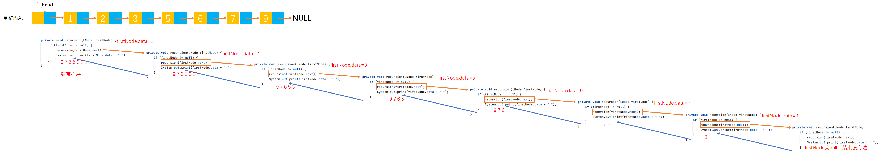

# Example012

## 题目

写一个函数，逆序打印单链表中的数据，假设指针 L 指向了单链表的开始节点。

## 分析

本题考查的知识点：
- 单链表
- 递归

本题所使用的递归函数是不需要返回值的，所以递归出口有如下几种写法：
- 第一种
```c
/**
 * 逆序打印单链表
 * @param firstNode 链表的第一个节点
 */
void reprint(LNode *firstNode) {
    if (firstNode != NULL) {// 不满足条件什么也不做，作为递归出口。当 firstNode 为 null 时作为递归出口，不会执行 if 语句块代码
        reprint(firstNode->next);// 递归调用
        printf("%d, ", firstNode->data);// 打印节点的数据
    }
}
```

- 第二种
```c
/**
 * 逆序打印单链表
 * @param firstNode 链表的第一个节点
 */
void reprint(LNode *firstNode) {
    if (firstNode == NULL) {
        return;// return会结束函数，后面的代码都不会被执行到
    }
    reprint(firstNode->next);// 递归调用
    printf("%d, ", firstNode->data);// 打印节点的数据
}
```

- 第三种
```c
/**
 * 逆序打印单链表
 * @param firstNode 链表的第一个节点
 */
void reprint(LNode *firstNode) {
    if (firstNode == NULL) {
        // 什么都不做，也不需要 return
    } else {
        reprint(firstNode->next);// 递归调用
        printf("%d, ", firstNode->data);// 打印节点的数据
    }
}
```

注意，打印节点数据的语句一定要在递归调用函数的后面。可以看看它们位置不同导致打印结果的差别：
```c
/**
 * 顺序打印链表的所有节点
 * @param firstNode 单链表的第一个节点
 */
void print(LNode *firstNode) {
    if (firstNode == NULL) {
        return;
    }
    printf("%d ", firstNode->data);// 打印节点的数据
    print(firstNode->next);// 递归调用
}

/**
 * 逆序打印单链表
 * @param firstNode 链表的第一个节点
 */
void reprint(LNode *firstNode) {
    if (firstNode == NULL) {
        return;
    }
    reprint(firstNode->next);// 递归调用
    printf("%d ", firstNode->data);// 打印节点的数据
}
```

## 图解




## C实现

核心代码：

```c
/**
 * 逆序打印单链表
 * @param firstNode 链表的第一个节点
 */
void reprint(LNode *firstNode) {
    if (firstNode != NULL) {
        reprint(firstNode->next);// 递归调用
        printf("%d, ", firstNode->data);// 打印节点的数据
    }
}
```

完整代码：

```c
#include <stdio.h>
#include <malloc.h>

/**
 * 单链表节点
 */
typedef struct LNode {
    /**
     * 单链表节点的数据域
     */
    int data;
    /**
     * 单链表节点的的指针域，指向当前节点的后继节点
     */
    struct LNode *next;
} LNode;

/**
 * 通过尾插法创建单链表
 * @param list 单链表
 * @param nums 创建单链表时插入的数据数组
 * @param n 数组长度
 * @return 创建好的单链表
 */
LNode *createByTail(LNode **list, int nums[], int n) {
    // 1.初始化单链表
    // 创建链表必须要先初始化链表，也可以选择直接调用 init() 函数
    *list = (LNode *) malloc(sizeof(LNode));
    (*list)->next = NULL;

    // 尾插法，必须知道链表的尾节点（即链表的最后一个节点），初始时，单链表的头结点就是尾节点
    // 因为在单链表中插入节点我们必须知道前驱节点，而头插法中的前驱节点一直是头节点，但尾插法中要在单链表的末尾插入新节点，所以前驱节点一直都是链表的最后一个节点，而链表的最后一个节点由于链表插入新节点会一直变化
    LNode *node = (*list);

    // 2.循环数组，将所有数依次插入到链表的尾部
    for (int i = 0; i < n; i++) {
        // 2.1 创建新节点，并指定数据域和指针域
        // 2.1.1 创建新节点，为其分配空间
        LNode *newNode = (LNode *) malloc(sizeof(LNode));
        // 2.1.2 为新节点指定数据域
        newNode->data = nums[i];
        // 2.1.3 为新节点指定指针域，新节点的指针域初始时设置为 null
        newNode->next = NULL;

        // 2.2 将新节点插入到单链表的尾部
        // 2.2.1 将链表原尾节点的 next 指针指向新节点
        node->next = newNode;
        // 2.2.2 将新节点置为新的尾节点
        node = newNode;
    }
    return *list;
}

/**
 * 打印链表的所有节点
 * @param list 单链表
 */
void print(LNode *list) {
    printf("[");
    // 链表的第一个节点
    LNode *node = list->next;
    // 循环单链表所有节点，打印值
    while (node != NULL) {
        printf("%d", node->data);
        if (node->next != NULL) {
            printf(", ");
        }
        node = node->next;
    }
    printf("]\n");
}

/**
 * 逆序打印单链表
 * @param firstNode 链表的第一个节点
 */
void reprint(LNode *firstNode) {
    if (firstNode != NULL) {
        reprint(firstNode->next);// 递归调用
        printf("%d, ", firstNode->data);// 打印节点的数据
    }
}

int main() {
    // 声明单链表
    LNode *list;

    // 创建测试用的单链表
    int nums[] = {11, 22, 33, 44, 55};
    int n = 5;
    createByTail(&list, nums, n);
    print(list);

    // 逆序打印单链表
    reprint(list->next);// 由于链表有头节点，所以要传入链表的第一个节点作为实参
}
```

执行结果：

```text
[11, 22, 33, 44, 55]
55, 44, 33, 22, 11,
```

## Java实现

核心代码：

```java
    /**
     * 递归打印单链表节点数据
     *
     * @param firstNode 单链表的第一个节点
     */
    private void recursion(LNode firstNode) {
        if (firstNode != null) {
            recursion(firstNode.next);// 递归逆序打印开始节点后边的数据
            System.out.print(firstNode.data + ", ");// 打印开始节点中的数据
        }
    }
```

完整代码：

```java
/**
 * @author lcl100
 * @create 2022-03-01 21:32
 */
public class LinkedList {
    /**
     * 单链表
     */
    private LNode list;

    /**
     * 通过尾插法创建单链表
     *
     * @param nums 创建单链表时插入的数据
     * @return 创建好的单链表
     */
    public LNode createByTail(int... nums) {
        // 1.初始化单链表
        // 创建链表必须要先初始化链表，也可以选择直接调用 init() 函数
        list = new LNode();
        list.next = null;

        // 尾插法，必须知道链表的尾节点（即链表的最后一个节点），初始时，单链表的头结点就是尾节点
        // 因为在单链表中插入节点我们必须知道前驱节点，而头插法中的前驱节点一直是头节点，但尾插法中要在单链表的末尾插入新节点，所以前驱节点一直都是链表的最后一个节点，而链表的最后一个节点由于链表插入新节点会一直变化
        LNode tailNode = list;

        // 2.循环数组，将所有数依次插入到链表的尾部
        for (int i = 0; i < nums.length; i++) {
            // 2.1 创建新节点，并指定数据域和指针域
            // 2.1.1 创建新节点，为其分配空间
            LNode newNode = new LNode();
            // 2.1.2 为新节点指定数据域
            newNode.data = nums[i];
            // 2.1.3 为新节点指定指针域，新节点的指针域初始时设置为 null
            newNode.next = null;

            // 2.2 将新节点插入到单链表的尾部
            // 2.2.1 将链表原尾节点的 next 指针指向新节点
            tailNode.next = newNode;
            // 2.2.2 将新节点置为新的尾节点
            tailNode = newNode;
        }

        return list;
    }

    /**
     * 逆序打印单链表
     */
    public void reprint() {
        // 从单链表的第一个节点开始
        recursion(list.next);
    }

    /**
     * 递归打印单链表节点数据
     *
     * @param firstNode 单链表的第一个节点
     */
    private void recursion(LNode firstNode) {
        if (firstNode != null) {
            recursion(firstNode.next);// 递归逆序打印开始节点后边的数据
            System.out.print(firstNode.data + ", ");// 打印开始节点中的数据
        }
    }

    /**
     * 打印单链表所有节点
     */
    public void print() {
        // 链表的第一个节点
        LNode node = list.next;
        // 循环打印
        String str = "[";
        while (node != null) {
            // 拼接节点的数据域
            str += node.data;
            // 只要不是最后一个节点，那么就在每个节点的数据域后面添加一个分号，用于分隔字符串
            if (node.next != null) {
                str += ", ";
            }
            // 继续链表的下一个节点
            node = node.next;
        }
        str += "]";
        // 打印链表
        System.out.println(str);
    }
}

/**
 * 单链表的节点
 */
class LNode {
    /**
     * 链表的数据域，暂时指定为 int 类型，因为 Java 支持泛型，可以指定为泛型，就能支持更多的类型了
     */
    int data;
    /**
     * 链表的指针域，指向该节点的下一个节点
     */
    LNode next;
}
```

测试代码：

```java
public class LinkedListTest {
    public static void main(String[] args) {
        // 创建单链表
        LinkedList list = new LinkedList();
        list.createByTail(1, 2, 3, 5, 6, 7, 9);
        list.print();

        // 逆序打印
        list.reprint();
    }
}
```

执行结果：

```text
[1, 2, 3, 5, 6, 7, 9]
9, 7, 6, 5, 3, 2, 1, 
```