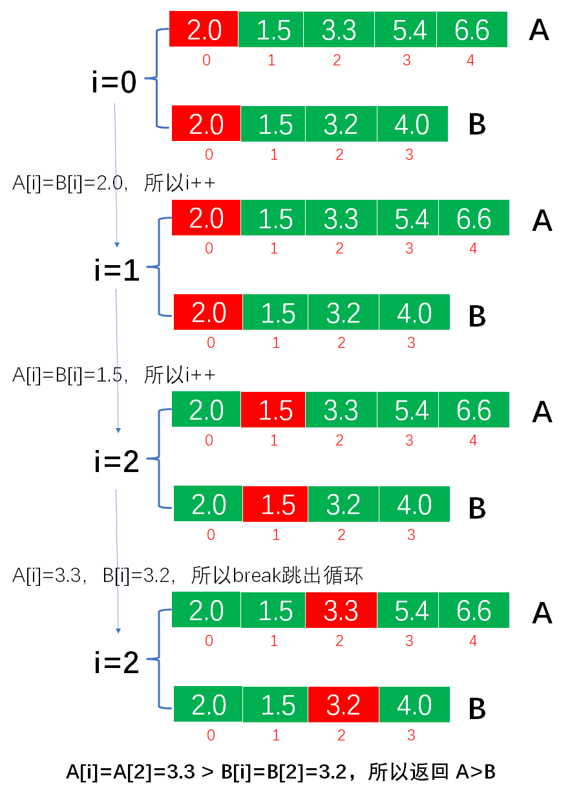

# Example014

## 题目

设 `A= (a1, a2, …, am)` 和 `B= (b1, b2, …, bn)` 均为顺序表，`A'` 和 `B'` 分别是除去最大公共前缀后的子表。例如，`A= (b, e, i, j, i, n, g)`
，`B= (b, e, i, f, a, n, g)`，则两者的最大公共前缀为b、e、i，在两个顺序表中除去最大公共前缀后的子表分别为 `A'= (j, i, n, g)`，`B'= (f, a, n, g)`。若`A'=B'=空表`
，则`A=B`。若`A'=空表`且`B!=空表`，或两者均不为空且`A'`的第一个元素值小于`B'`的第一个元素值，则 `A<B`，否则 `A>B`。所有表中元素均为 float 型，试编写一个函数，根据上述方法比较 A 和 B 的大小。

## 分析

本题考查的知识点：

- 顺序表

**分析**：

- 只需要先进行一趟循环，过滤掉顺序表 A 和 B 的最大公共前缀，再判断剩余部分。
- 假设 A 与 B 中元素值都为 float 类型，如果 A=B 则返回 0；如果 A<B 则返回 -1；如果 A>B 则返回 1。

**注意**：

- 有可能两个顺序表中的元素个数不等，所以循环结束的条件是 `i < aN && i < bN`。

## 图解




## C实现

核心代码：

```c
/**
 * 比较两个顺序表的大小
 * @param aList 第一个待比较的顺序表
 * @param bList 第二个待比较的顺序表
 * @return 如果顺序表 A>B 则返回 1，如果顺序表 A<B 则返回 -1，如果顺序表 A=B 则返回 0
 */
int compare(SeqList aList, SeqList bList) {
    // 指针，从 0 开始同时向顺序表 A 和 B 后面移动
    int i = 0;
    // 注意，由于是同时遍历顺序表 A 和 B，那么循环结束的条件是变量 i 都必须小于顺序表的长度，这样能够避免其中一个顺序表元素多的问题
    while (i < aList.length && i < bList.length) {
        if (aList.data[i] == bList.data[i]) {
            i++;
        } else {
            // 如果已经过滤掉最大公共前缀，则跳出循环
            break;
        }
    }
    // 此时已经过滤掉顺序表的最大公共前缀了，接下来就根据条件判断大小即可
    if (i == aList.length && i == bList.length) {
        // 如果 i 刚好等于顺序表 A 和 B 的长度，则表示顺序表 A 和 B 相等
        return 0;
    } else if ((i == aList.length && i < bList.length) || aList.data[i] < bList.data[i]) {
        // 若`A'=空表`且`B!=空表`，或两者均不为空且`A'`的第一个元素值小于`B'`的第一个元素值，则 `A<B`
        return -1;
    } else {
        // 反之则表示 A>B
        return 1;
    }
}
```

完整代码：

```c
#include <stdio.h>

#define MAXSIZE 20

/**
 * 顺序表的结构体
 */
typedef struct {
    /**
     * 顺序表，实际上一个长度为 MAXSIZE 的数组，存储的数据类型为整型，当然可以设置为其他类型，但推荐使用宏定义类型，方便替换
     */
    float data[MAXSIZE];
    /**
     * 顺序表长度，即数组中实际元素个数
     */
    int length;
} SeqList;

/**
 * 初始化顺序表，仅需要将 length 置为 0 即可
 * @param list 待初始化的顺序表
 */
void init(SeqList *list) {
    // 仅需要将 length 置为 0 即可
    (*list).length = 0;
    // 或者可以用下面的语法
    // list->length=0;
}

/**
 * 直接添加新元素到顺序表的尾部
 * @param list 顺序表
 * @param ele 待添加的新元素
 * @return 如果插入成功则返回 1，否则返回 0
 */
int add(SeqList *list, float ele) {
    // 0.校验
    // 0.1 向顺序表中插入元素要检查顺序表是否已经满了，如果已经满了则不能再插入新元素则添加失败
    if (list->length == MAXSIZE) {
        return 0;
    }
    // 1.插入新元素
    // 1.1 直接获取顺序表的 length，然后将新元素的值赋予到 length 位置即可
    list->data[list->length] = ele;
    // 1.2 注意修改 length
    list->length++;
    return 1;
}

/**
 * 比较两个顺序表的大小
 * @param aList 第一个待比较的顺序表
 * @param bList 第二个待比较的顺序表
 * @return 如果顺序表 A>B 则返回 1，如果顺序表 A<B 则返回 -1，如果顺序表 A=B 则返回 0
 */
int compare(SeqList aList, SeqList bList) {
    // 指针，从 0 开始同时向顺序表 A 和 B 后面移动
    int i = 0;
    // 注意，由于是同时遍历顺序表 A 和 B，那么循环结束的条件是变量 i 都必须小于顺序表的长度，这样能够避免其中一个顺序表元素多的问题
    while (i < aList.length && i < bList.length) {
        if (aList.data[i] == bList.data[i]) {
            i++;
        } else {
            // 如果已经过滤掉最大公共前缀，则跳出循环
            break;
        }
    }
    // 此时已经过滤掉顺序表的最大公共前缀了，接下来就根据条件判断大小即可
    if (i == aList.length && i == bList.length) {
        // 如果 i 刚好等于顺序表 A 和 B 的长度，则表示顺序表 A 和 B 相等
        return 0;
    } else if ((i == aList.length && i < bList.length) || aList.data[i] < bList.data[i]) {
        // 若`A'=空表`且`B!=空表`，或两者均不为空且`A'`的第一个元素值小于`B'`的第一个元素值，则 `A<B`
        return -1;
    } else {
        // 反之则表示 A>B
        return 1;
    }
}

/**
 * 打印顺序表
 * @param list 待打印的顺序表
 */
void print(SeqList list) {
    printf("[");
    for (int i = 0; i < list.length; i++) {
        printf("%.1f", list.data[i]);
        if (i != list.length - 1) {
            printf(", ");
        }
    }
    printf("]\n");
}

int main() {
    // 声明顺序表 A
    SeqList aList;
    init(&aList);
    add(&aList, 1.0f);
    add(&aList, 1.5f);
    add(&aList, 1.7f);
    add(&aList, 3.0f);
    add(&aList, 4.4f);
    print(aList);

    // 声明顺序表 B
    SeqList bList;
    init(&bList);
    add(&bList, 1.0f);
    add(&bList, 1.5f);
    add(&bList, 3.7f);
    add(&bList, 3.0f);
    add(&bList, 4.4f);
    print(bList);

    // 比较大小
    int result = compare(aList, bList);
    if (result == 1) {
        printf("A>B");
    } else if (result == -1) {
        printf("A<B");
    } else if (result == 0) {
        printf("A=B");
    }
}
```

执行结果：

```text
[1.0, 1.5, 1.7, 3.0, 4.4]
[1.0, 1.5, 3.7, 3.0, 4.4]
A<B
```

## Java实现

核心代码：

```java
    /**
     * 比较两个顺序表的大小
     *
     * @param A 第一个待比较的顺序表
     * @param B 第二个待比较的顺序表
     * @return 如果顺序表 A>B 则返回 1，如果顺序表 A<B 则返回 -1，如果顺序表 A=B 则返回 0
     */
    public int compare(SeqList A, SeqList B) {
        // 得到顺序表 A 和 B
        List aList = A.list;
        List bList = B.list;
        // 指针，从 0 开始同时向顺序表 A 和 B 后面移动
        int i = 0;
        // 注意，由于是同时遍历顺序表 A 和 B，那么循环结束的条件是变量 i 都必须小于顺序表的长度，这样能够避免其中一个顺序表元素多的问题
        while (i < aList.length && i < bList.length) {
            if (aList.data[i] == bList.data[i]) {
                i++;
            } else {
                // 如果已经过滤掉最大公共前缀，则跳出循环
                break;
            }
        }
        // 此时已经过滤掉顺序表的最大公共前缀了，接下来就根据条件判断大小即可
        if (i == aList.length && i == bList.length) {
            // 如果 i 刚好等于顺序表 A 和 B 的长度，则表示顺序表 A 和 B 相等
            return 0;
        } else if ((i == aList.length && i < bList.length) || aList.data[i] < bList.data[i]) {
            // 若`A'=空表`且`B!=空表`，或两者均不为空且`A'`的第一个元素值小于`B'`的第一个元素值，则 `A<B`
            return -1;
        } else {
            // 反之则表示 A>B
            return 1;
        }
    }
```

完整代码：

```java
/**
 * @author lcl100
 * @desc 线性表
 * @create 2022-02-28 20:16
 */
public class SeqList {
    /**
     * 顺序表最大能存放元素个数
     */
    private final int MAXSIZE = 20;

    /**
     * 声明的顺序表，未初始化
     */
    private List list;

    /**
     * 初始化顺序表
     */
    public void init() {
        list = new List();
        // 指定数据数组长度为 MAXSIZE
        list.data = new float[MAXSIZE];
        // 但指定顺序表实际元素个数为 0
        list.length = 0;
    }

    /**
     * 直接添加新元素到顺序表的尾部
     *
     * @param ele 待插入的新元素
     */
    public void add(float ele) throws Exception {
        // 0.校验
        // 0.1 向顺序表中插入元素要检查顺序表是否已经满了，如果已经满了则不能再插入新元素则抛出异常
        if (list.length == MAXSIZE) {
            throw new Exception("顺序表已满，不能再插入了！");
        }
        // 1.插入新元素
        // 1.1 直接获取顺序表的 length，然后将新元素的值赋予到 length 位置即可
        list.data[list.length] = ele;
        // 1.2 注意修改 length
        list.length++;
    }

    /**
     * 比较两个顺序表的大小
     *
     * @param A 第一个待比较的顺序表
     * @param B 第二个待比较的顺序表
     * @return 如果顺序表 A>B 则返回 1，如果顺序表 A<B 则返回 -1，如果顺序表 A=B 则返回 0
     */
    public int compare(SeqList A, SeqList B) {
        // 得到顺序表 A 和 B
        List aList = A.list;
        List bList = B.list;
        // 指针，从 0 开始同时向顺序表 A 和 B 后面移动
        int i = 0;
        // 注意，由于是同时遍历顺序表 A 和 B，那么循环结束的条件是变量 i 都必须小于顺序表的长度，这样能够避免其中一个顺序表元素多的问题
        while (i < aList.length && i < bList.length) {
            if (aList.data[i] == bList.data[i]) {
                i++;
            } else {
                // 如果已经过滤掉最大公共前缀，则跳出循环
                break;
            }
        }
        // 此时已经过滤掉顺序表的最大公共前缀了，接下来就根据条件判断大小即可
        if (i == aList.length && i == bList.length) {
            // 如果 i 刚好等于顺序表 A 和 B 的长度，则表示顺序表 A 和 B 相等
            return 0;
        } else if ((i == aList.length && i < bList.length) || aList.data[i] < bList.data[i]) {
            // 若`A'=空表`且`B!=空表`，或两者均不为空且`A'`的第一个元素值小于`B'`的第一个元素值，则 `A<B`
            return -1;
        } else {
            // 反之则表示 A>B
            return 1;
        }
    }

    /**
     * 打印顺序表
     */
    public void print() {
        String str = "[";
        for (int i = 0; i < list.length; i++) {
            str += list.data[i];
            if (i != list.length - 1) {
                str += ", ";
            }
        }
        str += "]";
        System.out.println(str);
    }
}

/**
 * 顺序表
 */
class List {
    /**
     * 数据域，保存数据的数组
     */
    float[] data;
    /**
     * 数组中实际元素个数
     */
    int length;
}
```

测试代码：

```java
public class SeqListTest {
    public static void main(String[] args) throws Exception {
        // 顺序表 A
        SeqList aList = new SeqList();
        aList.init();
        aList.add(2.0f);
        aList.add(1.5f);
        aList.add(3.3f);
        aList.add(5.4f);
        aList.add(6.6f);
        aList.print();

        // 顺序表 B
        SeqList bList = new SeqList();
        bList.init();
        bList.add(2.0f);
        bList.add(1.5f);
        bList.add(3.2f);
        bList.add(4.0f);
        bList.print();

        SeqList list = new SeqList();
        int result = list.compare(aList, bList);
        if (result == 1) {
            System.out.println("A>B");
        } else if (result == -1) {
            System.out.println("A<B");
        } else if (result == 0) {
            System.out.println("A=B");
        }
    }
}
```

执行结果：

```text
[2.0, 1.5, 3.3, 5.4, 6.6]
[2.0, 1.5, 3.2, 4.0]
A>B
```
