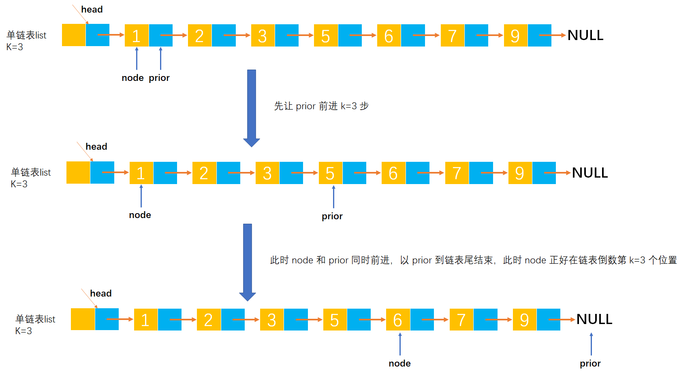

# Example015

## 题目

已知一个带有头结点的单链表。假设该链表只给出了头指针 head。在不改变链表的前提下，设计一个尽可能高效的算法，查找链表中倒数第 k（k 为正整数）个位置上的结点。若查找成功，算法输出该节点的 data 值，并返回 1；否则，只返回 0。

## 分析

本题考查的知识点：

- 单链表

**分析**：

- 本题有两种解法：
- 第一种，先计算出单链表的长度 `len`，然后用 `len` 减去 `k` 就可以得到第 `k` 个节点在正序链表中的序号位置。
- 第二步，设置两根指针 `node` 和 `prior`，其中初始时 `node` 和 `prior` 都指向单链表的第一个节点，然后让指针 `prior` 先前进 `k` 步，然后再同时让指针 `node` 和 `prior` 前进，当 `prior` 到链表尾时 `node` 结点正好在倒数第 `k` 个节点的位置。

## 图解




## C实现

解法一核心代码：

```c
/**
 * 求单链表倒数第 k 个节点的值
 * @param list 单链表
 * @param k 倒数序号，从 1 开始
 * @return 若查找成功，算法输出该节点的 data 值，并返回 1；否则，只返回 0
 */
int findReciprocalKth(LNode *list, int k) {
    // 变量，计数器，记录单链表的长度
    int len = 0;
    // 变量，记录链表中的每个节点（用于遍历链表），初始为链表的第一个节点
    LNode *node = list->next;

    // 循环链表所有节点，统计链表长度
    while (node != NULL) {
        // 计数器加 1
        len++;
        // 继续链表的下一个节点
        node = node->next;
    }

    // 参数校验
    if (k < 1 || k > len) {
        return 0;
    }

    // 计算 k 在正序链表中的节点位置
    int num = len - k + 1;
    // 重新将 node 变量指向链表的第一个节点
    node = list->next;
    // 变量计数器，记录正序遍历的节点个数
    int count = 0;
    while (node != NULL) {
        count++;
        if (num == count) {
            // 打印倒数第 k 个节点的数据值
            printf("%d\n", node->data);
            // 结束循环
            return 1;
        }
        node = node->next;
    }

    return 0;
}
```

解法二核心代码：

```c
/**
 * 求单链表倒数第 k 个节点的值
 * @param list 单链表
 * @param k 倒数序号，从 1 开始
 * @return 若查找成功，算法输出该节点的 data 值，并返回 1；否则，只返回 0
 */
int findReciprocalKth(LNode *list, int k) {
    // 参数校验
    if (k < 1) {
        return 0;
    }
    // 双指针，其中 prior 指针先前进 k 步，初始时都为链表的第一个节点
    LNode *prior = list->next;
    LNode *node = list->next;

    // 变量，记录 prior 节点的前进步数
    int i = 0;
    // 让 prior 节点前进 k 步，因为 k 可能超过链表长度，所以要注意 prior 为 null 的情况
    while (i < k && prior != NULL) {
        prior = prior->next;
        i++;
    }

    // 同时遍历 prior 和 node，以 prior 为 null 作为结束条件，此时 node 刚好处于倒数第 k 个节点
    while (node != NULL && prior != NULL) {
        node = node->next;
        prior = prior->next;
    }
    // 打印倒数第 k 个节点的数据值
    if (node != NULL && node != list->next) {
        printf("%d\n", node->data);
        return 1;
    }
    return 0;
}
```

完整代码：

```c
#include <stdio.h>
#include <malloc.h>

/**
 * 单链表节点
 */
typedef struct LNode {
    /**
     * 单链表节点的数据域
     */
    int data;
    /**
     * 单链表节点的的指针域，指向当前节点的后继节点
     */
    struct LNode *next;
} LNode;

/**
 * 初始化单链表
 * @param list 待初始化的单链表
 */
void init(LNode **list) {
    // 创建头结点，分配空间
    *list = (LNode *) malloc(sizeof(LNode));
    // 同时将头节点的 next 指针指向 NULL，因为空链表没有任何节点
    (*list)->next = NULL;
}

/**
 * 通过尾插法创建单链表
 * @param list 单链表
 * @param nums 创建单链表时插入的数据数组
 * @param n 数组长度
 * @return 创建好的单链表
 */
LNode *createByTail(LNode **list, int nums[], int n) {
    // 1.初始化单链表
    // 创建链表必须要先初始化链表，也可以选择直接调用 init() 函数
    *list = (LNode *) malloc(sizeof(LNode));
    (*list)->next = NULL;

    // 尾插法，必须知道链表的尾节点（即链表的最后一个节点），初始时，单链表的头结点就是尾节点
    // 因为在单链表中插入节点我们必须知道前驱节点，而头插法中的前驱节点一直是头节点，但尾插法中要在单链表的末尾插入新节点，所以前驱节点一直都是链表的最后一个节点，而链表的最后一个节点由于链表插入新节点会一直变化
    LNode *node = (*list);

    // 2.循环数组，将所有数依次插入到链表的尾部
    for (int i = 0; i < n; i++) {
        // 2.1 创建新节点，并指定数据域和指针域
        // 2.1.1 创建新节点，为其分配空间
        LNode *newNode = (LNode *) malloc(sizeof(LNode));
        // 2.1.2 为新节点指定数据域
        newNode->data = nums[i];
        // 2.1.3 为新节点指定指针域，新节点的指针域初始时设置为 null
        newNode->next = NULL;

        // 2.2 将新节点插入到单链表的尾部
        // 2.2.1 将链表原尾节点的 next 指针指向新节点
        node->next = newNode;
        // 2.2.2 将新节点置为新的尾节点
        node = newNode;
    }
    return *list;
}

/**
 * 求单链表倒数第 k 个节点的值
 * @param list 单链表
 * @param k 倒数序号，从 1 开始
 * @return 若查找成功，算法输出该节点的 data 值，并返回 1；否则，只返回 0
 */
int findReciprocalKth(LNode *list, int k) {
    // 参数校验
    if (k < 1) {
        return 0;
    }
    // 双指针，其中 prior 指针先前进 k 步，初始时都为链表的第一个节点
    LNode *prior = list->next;
    LNode *node = list->next;

    // 变量，记录 prior 节点的前进步数
    int i = 0;
    // 让 prior 节点前进 k 步，因为 k 可能超过链表长度，所以要注意 prior 为 null 的情况
    while (i < k && prior != NULL) {
        prior = prior->next;
        i++;
    }

    // 同时遍历 prior 和 node，以 prior 为 null 作为结束条件，此时 node 刚好处于倒数第 k 个节点
    while (node != NULL && prior != NULL) {
        node = node->next;
        prior = prior->next;
    }
    // 打印倒数第 k 个节点的数据值
    if (node != NULL && node != list->next) {
        printf("%d\n", node->data);
        return 1;
    }
    return 0;

}

/**
 * 打印链表的所有节点
 * @param list 单链表
 */
void print(LNode *list) {
    printf("[");
    // 链表的第一个节点
    LNode *node = list->next;
    // 循环单链表所有节点，打印值
    while (node != NULL) {
        printf("%d", node->data);
        if (node->next != NULL) {
            printf(", ");
        }
        node = node->next;
    }
    printf("]\n");
}

int main() {
    // 声明单链表并初始化
    LNode *list;
    init(&list);

    // 通过尾插法创建单链表
    int nums[] = {1, 2, 3, 5, 6, 7, 9};
    int n = 7;
    createByTail(&list, nums, n);
    print(list);

    printf("%d\n", findReciprocalKth(list, 1));
    printf("%d\n", findReciprocalKth(list, 3));
    printf("%d\n", findReciprocalKth(list, 8));
}
```

执行结果：

```text
[1, 2, 3, 5, 6, 7, 9]
9
1
6
1
0
```

上面的代码略显冗余，下面代码虽然都是一样的原理但更加简洁：

```c
/**
 * 求单链表倒数第 k 个节点的值
 * @param list 单链表
 * @param k 倒数序号，从 1 开始
 * @return 若查找成功，算法输出该节点的 data 值，并返回 1；否则，只返回 0
 */
int findReciprocalKth(LNode *list, int k) {
    // 记录 prior 指针，先前进 k 步
    LNode *prior = list->next;
    // 记录 node 指针
    LNode *node = list->next;

    // 计数器，记录 prior 节点的移动步数
    int i = 0;
    // 以 prior 结束为条件
    while (prior != NULL) {
        prior = prior->next;
        i++;
        if (i > k) {// 如果 prior 已经前进了 k 步，则 node 节点也开始向前移动
            node = node->next;
        }
    }

    if (node == list->next) {// 说明链表没有 k 个节点
        return 0;
    } else {
        printf("%d\n", node->data);
        return 1;
    }
}
```

## Java实现

解法一核心代码：

```java
    /**
     * 找到单链表中倒数第 k 个节点
     *
     * @param k 指定序号，倒数，从 1 开始
     * @return 若查找成功，算法输出该节点的 data 值，并返回 1；否则，只返回 0
     */
    public int findReciprocalKth(int k) {
        // 变量，计数器，记录单链表的长度
        int len = 0;
        // 变量，记录链表中的每个节点（用于遍历链表），初始为链表的第一个节点
        LNode node = list.next;

        // 循环链表所有节点，统计链表长度
        while (node != null) {
            // 计数器加 1
            len++;
            // 继续链表的下一个节点
            node = node.next;
        }

        // 参数校验
        if (k < 1 || k > len) {
            return 0;
        }

        // 计算 k 在正序链表中的节点位置
        int num = len - k + 1;
        // 重新将 node 变量指向链表的第一个节点
        node = list.next;
        // 变量计数器，记录正序遍历的节点个数
        int count = 0;
        while (node != null) {
            count++;
            if (num == count) {
                // 打印倒数第 k 个节点的数据值
                System.out.println(node.data);
                // 结束循环
                return 1;
            }
            node = node.next;
        }

        return 0;
    }
```

解法二核心代码：

```java
    /**
     * 找到单链表中倒数第 k 个节点
     *
     * @param k 指定序号，倒数，从 1 开始
     * @return 若查找成功，算法输出该节点的 data 值，并返回 1；否则，只返回 0
     */
    public int findReciprocalKth(int k) {
        // 参数校验
        if (k < 1) {
            return 0;
        }

        // 双指针，其中 prior 指针先前进 k 步，初始时都为链表的第一个节点
        LNode prior = list.next;
        LNode node = list.next;
        // 变量，记录 prior 节点的前进步数
        int i = 0;

        // 让 prior 节点前进 k 步，因为 k 可能超过链表长度，所以要注意 prior 为 null 的情况
        while (i < k && prior != null) {
            prior = prior.next;
            i++;
        }

        // 同时遍历 prior 和 node，以 prior 为 null 作为结束条件，此时 node 刚好处于倒数第 k 个节点
        while (prior != null && node != null) {
            prior = prior.next;
            node = node.next;
        }
        // 打印倒数第 k 个节点的数据值
        if (node != null && node != list.next) {
            System.out.println(node.data);
            return 1;
        }

        return 0;
    }
```

完整代码：

```java
/**
 * @author lcl100
 * @create 2022-03-01 21:32
 */
public class LinkedList {
    /**
     * 单链表
     */
    private LNode list;

    /**
     * 通过尾插法创建单链表
     *
     * @param nums 创建单链表时插入的数据
     * @return 创建好的单链表
     */
    public LNode createByTail(int... nums) {
        // 1.初始化单链表
        // 创建链表必须要先初始化链表，也可以选择直接调用 init() 函数
        list = new LNode();
        list.next = null;

        // 尾插法，必须知道链表的尾节点（即链表的最后一个节点），初始时，单链表的头结点就是尾节点
        // 因为在单链表中插入节点我们必须知道前驱节点，而头插法中的前驱节点一直是头节点，但尾插法中要在单链表的末尾插入新节点，所以前驱节点一直都是链表的最后一个节点，而链表的最后一个节点由于链表插入新节点会一直变化
        LNode tailNode = list;

        // 2.循环数组，将所有数依次插入到链表的尾部
        for (int i = 0; i < nums.length; i++) {
            // 2.1 创建新节点，并指定数据域和指针域
            // 2.1.1 创建新节点，为其分配空间
            LNode newNode = new LNode();
            // 2.1.2 为新节点指定数据域
            newNode.data = nums[i];
            // 2.1.3 为新节点指定指针域，新节点的指针域初始时设置为 null
            newNode.next = null;

            // 2.2 将新节点插入到单链表的尾部
            // 2.2.1 将链表原尾节点的 next 指针指向新节点
            tailNode.next = newNode;
            // 2.2.2 将新节点置为新的尾节点
            tailNode = newNode;
        }

        return list;
    }

    /**
     * 找到单链表中倒数第 k 个节点
     *
     * @param k 指定序号，倒数，从 1 开始
     * @return 若查找成功，算法输出该节点的 data 值，并返回 1；否则，只返回 0
     */
    public int findReciprocalKth(int k) {
        // 参数校验
        if (k < 1) {
            return 0;
        }

        // 双指针，其中 prior 指针先前进 k 步，初始时都为链表的第一个节点
        LNode prior = list.next;
        LNode node = list.next;
        // 变量，记录 prior 节点的前进步数
        int i = 0;

        // 让 prior 节点前进 k 步，因为 k 可能超过链表长度，所以要注意 prior 为 null 的情况
        while (i < k && prior != null) {
            prior = prior.next;
            i++;
        }

        // 同时遍历 prior 和 node，以 prior 为 null 作为结束条件，此时 node 刚好处于倒数第 k 个节点
        while (prior != null && node != null) {
            prior = prior.next;
            node = node.next;
        }
        // 打印倒数第 k 个节点的数据值
        if (node != null && node != list.next) {
            System.out.println(node.data);
            return 1;
        }

        return 0;
    }

    /**
     * 打印单链表所有节点
     */
    public void print() {
        // 链表的第一个节点
        LNode node = list.next;
        // 循环打印
        String str = "[";
        while (node != null) {
            // 拼接节点的数据域
            str += node.data;
            // 只要不是最后一个节点，那么就在每个节点的数据域后面添加一个分号，用于分隔字符串
            if (node.next != null) {
                str += ", ";
            }
            // 继续链表的下一个节点
            node = node.next;
        }
        str += "]";
        // 打印链表
        System.out.println(str);
    }
}

/**
 * 单链表的节点
 */
class LNode {
    /**
     * 链表的数据域，暂时指定为 int 类型，因为 Java 支持泛型，可以指定为泛型，就能支持更多的类型了
     */
    int data;
    /**
     * 链表的指针域，指向该节点的下一个节点
     */
    LNode next;
}
```

测试代码：

```java
public class LinkedListTest {
    public static void main(String[] args) {
        // 创建单链表
        LinkedList list = new LinkedList();
        list.createByTail(1, 2, 3, 5, 6, 7, 9);
        list.print();

        // 求倒数第 k 个节点
        System.out.println(list.findReciprocalKth(1));
        System.out.println(list.findReciprocalKth(3));
        System.out.println(list.findReciprocalKth(8));
    }
}
```

执行结果：

```text
[1, 2, 3, 5, 6, 7, 9]
9
1
6
1
0
```