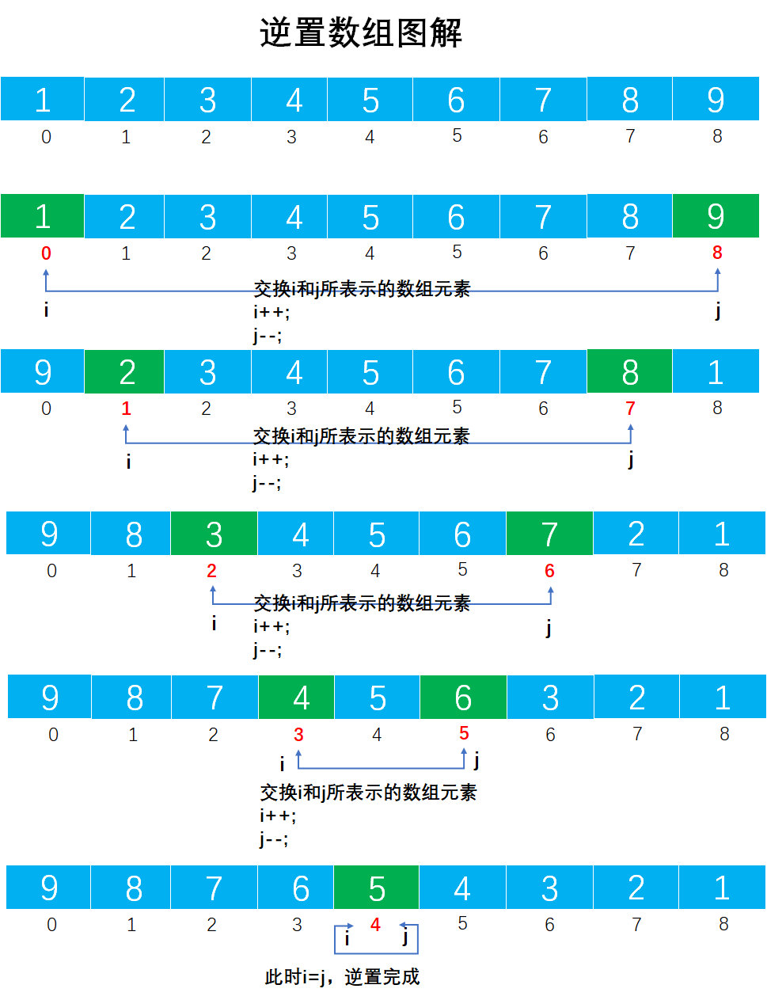
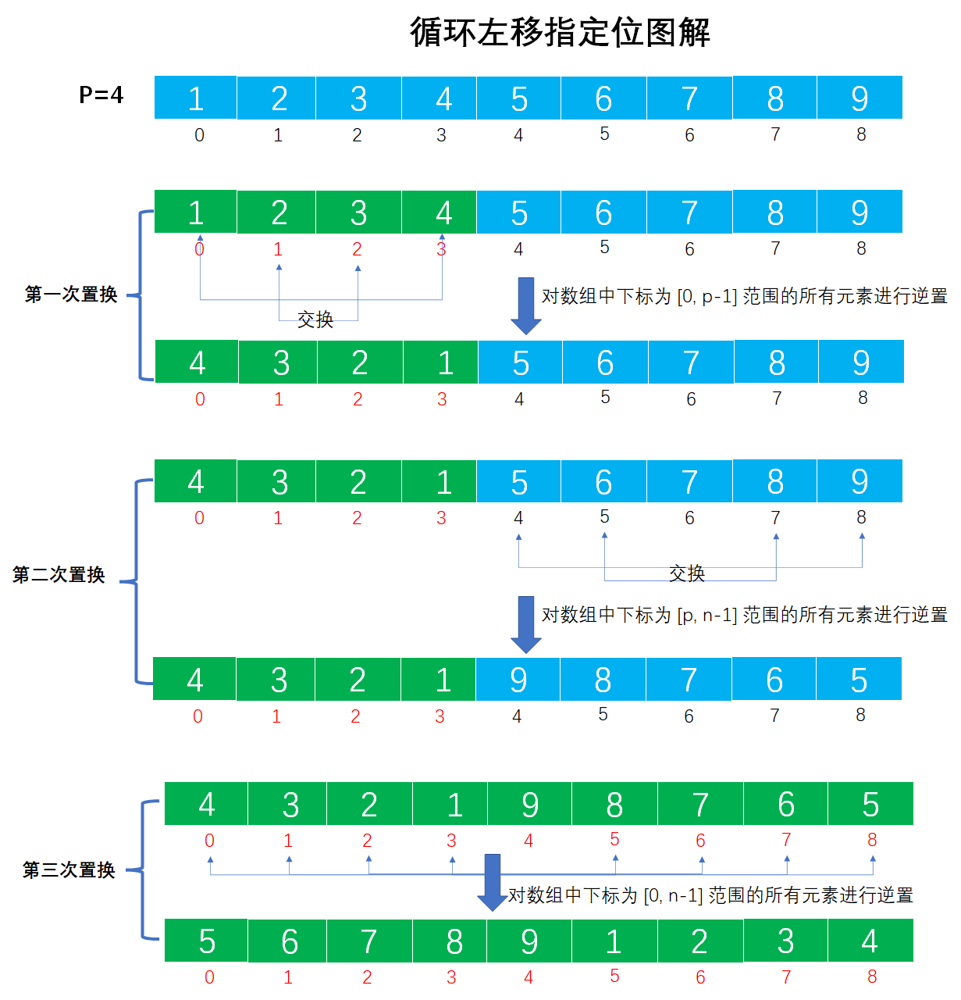

# Example016

## 题目

设将 `n`（`n>1`）个整数存放到一维数组 `R` 中。设计一个在时间和空间两方面尽可能高效的算法。将 `R` 中保存的序列循环左移 `P`（`0<P<n`）个位置，即将 `R` 中的数据由（`X0, X1, ..., X(n-1)`）变换为（`Xp, X(p+1), ..., X(n-1), X0, X1, ..., X(p-1)`）。

## 分析

本题考查的知识点：
- 顺序表
- 逆置数组

**分析**：

例如，`[1 2 3 4 5 6 7 8 9]` 循环左移 p=4 位后结果是 `[5 6 7 8 9 1 2 3 4]`。即将 数组的高 4 位 `[1 2 3 4]` 左移了，然后数组的低 5 位都向前移动 4 位，而数组原高 4 位填充到现数组的低 4 位。

要解决这个题我们要先明白如何逆置数组，所谓的逆置就是逆序数组元素，如原数组是 `[1, 2, 3, 4, 5]`，那么逆置后的数组是 `[5, 4, 3, 2, 1]`。逆置图解如下：



逆置数组的算法是：定义两根指针 i 和 j，分别指向数组的第一个元素和最后一个元素，交换数组中对应指针的元素。以 `i<j` 作为循环条件，指针 i 不断向后移动，指针 j 不断向前移动，然后交换对应指针的元素，直至结束循环。代码如下：

```c
/**
 * 从头到尾逆置数组
 * @param arr 数组
 * @param n 数组长度
 */
void inversion(int arr[], int n) {
    // 声明两根指针，分别指向数组第一个元素和最后一个元素
    int i = 0;
    int j = n - 1;
    while (i < j) {
        // 交换 i 指针和 j 指针对应的数组元素
        int temp = arr[i];
        arr[i] = arr[j];
        arr[j] = temp;
        // 移动两根指针
        i++;
        j--;
    }
}
```

也可以通过 `for` 循环完成，只需要一个变量来指定移动位置，然后循环 `n/2` 次。代码如下：

```c
/**
 * 从头到尾逆置数组
 * @param arr 数组
 * @param n 数组长度
 */
void inversion(int arr[], int n) {
    // 无论数组元素是奇数个还是偶数个，都不影响循环次数
    for (int i = 0; i < n / 2; i++) {
        int temp = arr[i];
        arr[i] = arr[n - i - 1];
        arr[n - i - 1] = temp;
    }
}
```

而本题的逆置稍微复杂点，是只逆置数组中指定范围内的元素，而非逆置整个数组。

明白了逆置算法后，就很快能解决该题了，该题需要对数组进行三次指定范围的逆置（例如，`[1, 2, 3, 4, 5, 6, 7, 8, 9]` 和 `p=4`）：
- 第一次，对数组中下标为 `[0, p-1]` 范围内的所有元素进行逆置。如 `[4, 3, 2, 1, 5, 6, 7, 8, 9]`。
- 第二次，对数组中下标为 `[p, n-1]` 范围内的所有元素进行逆置。如 `[4, 3, 2, 1, 9, 8, 7, 6, 5]`。
- 第三次，对数组中下标为 `[0, n-1]` 范围内的所有元素进行逆置。如 `[5, 6, 7, 8, 9, 1, 2, 3, 4]`。

## 图解

三次置换的图解如下：




## C实现

核心代码：

```c
/**
 * 从起始下标到结束下标，逆置数组中的元素
 * @param arr 数组
 * @param left 起始下标，从 0 开始
 * @param right 结束下标
 */
void move(int arr[], int left, int right) {
    // 循环次数为 (right-left+1)/2
    for (int i = 0; i < (right - left + 1) / 2; i++) {
        int temp = arr[left + i];
        arr[left + i] = arr[right - i];
        arr[right - i] = temp;
    }
}

/**
 * 将数组中的元素循环左移 p 个位置
 * @param R 数组
 * @param n 数组长度
 * @param p 循环左移位置数
 */
void rotateLeftMove(int R[], int n, int p) {
    move(R, 0, p - 1);
    move(R, p, n - 1);
    move(R, 0, n - 1);
}
```

完整代码：

```c
#include <stdio.h>

/**
 * 从起始下标到结束下标，逆置数组中的元素
 * @param arr 数组
 * @param left 起始下标，从 0 开始
 * @param right 结束下标
 */
void move(int arr[], int left, int right) {
    // 循环次数为 (right-left+1)/2
    for (int i = 0; i < (right - left + 1) / 2; i++) {
        int temp = arr[left + i];
        arr[left + i] = arr[right - i];
        arr[right - i] = temp;
    }
}

/**
 * 将数组中的元素循环左移 p 个位置
 * @param R 数组
 * @param n 数组长度
 * @param p 循环左移位置数
 */
void rotateLeftMove(int R[], int n, int p) {
    move(R, 0, p - 1);
    move(R, p, n - 1);
    move(R, 0, n - 1);
}

/**
 * 打印数组
 * @param arr 待打印的数组
 * @param n 数组长度
 */
void print(int arr[], int n) {
    printf("[");
    for (int i = 0; i < n; i++) {
        printf("%d", arr[i]);
        if (i != n - 1) {
            printf(", ");
        }
    }
    printf("]\n");
}

int main() {
    int arr[] = {1, 2, 3, 4, 5, 6, 7, 8, 9};
    int n = 9;
    print(arr, n);

    // 调用函数循环左移 p=4 个位置
    int p = 4;
    rotateLeftMove(arr, n, p);
    print(arr, n);
}
```

执行结果：

```text
[1, 2, 3, 4, 5, 6, 7, 8, 9]
[5, 6, 7, 8, 9, 1, 2, 3, 4]
```

## Java实现

核心代码：

```java
    /**
     * 将数组循环左移 p 个位置
     *
     * @param R 待移动的数组
     * @param n 数组中的元素个数
     * @param p 循环左移个数
     */
    public static void rotateLeftMove(int[] R, int n, int p) {
        move(R, 0, p - 1);
        move(R, p, n - 1);
        move(R, 0, n - 1);
    }

    /**
     * 逆置数组中从起始下标到结束下标中的所有元素
     *
     * @param arr   数组
     * @param left  起始下标，从 0 开始
     * @param right 结束下标，从 0 开始
     */
    private static void move(int[] arr, int left, int right) {
        // 交换次数 (right-left+1)/2 ，无论元素个数是奇数还是偶数
        for (int i = 0; i < (right - left + 1) / 2; i++) {
            int temp = arr[left + i];
            arr[left + i] = arr[right - i];
            arr[right - i] = temp;
        }
    }
```

完整代码：

```java
public class Test {
    public static void main(String[] args) {
        int[] A = new int[]{1, 2, 3, 4, 5, 6, 7, 8, 9};
        int n = A.length;
        System.out.println(Arrays.toString(A));// 打印数组

        // 循环左移 p 个位置
        int p = 4;
        rotateLeftMove(A, n, p);
        System.out.println(Arrays.toString(A));// 打印数组
    }

    /**
     * 将数组循环左移 p 个位置
     *
     * @param R 待移动的数组
     * @param n 数组中的元素个数
     * @param p 循环左移个数
     */
    public static void rotateLeftMove(int[] R, int n, int p) {
        move(R, 0, p - 1);
        move(R, p, n - 1);
        move(R, 0, n - 1);
    }

    /**
     * 逆置数组中从起始下标到结束下标中的所有元素
     *
     * @param arr   数组
     * @param left  起始下标，从 0 开始
     * @param right 结束下标，从 0 开始
     */
    private static void move(int[] arr, int left, int right) {
        // 交换次数 (right-left+1)/2 ，无论元素个数是奇数还是偶数
        for (int i = 0; i < (right - left + 1) / 2; i++) {
            int temp = arr[left + i];
            arr[left + i] = arr[right - i];
            arr[right - i] = temp;
        }
    }
}
```

执行结果：

```text
[1, 2, 3, 4, 5, 6, 7, 8, 9]
[5, 6, 7, 8, 9, 1, 2, 3, 4]
```