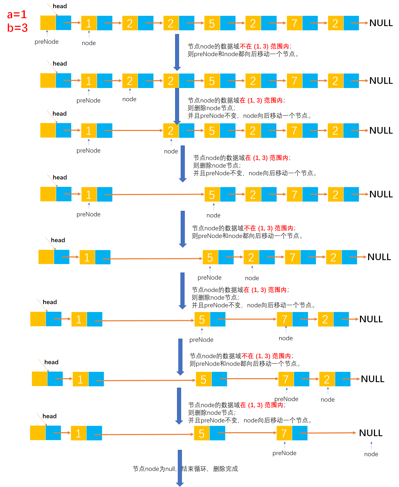

# Example019

## 题目

设在一个带表头结点的单链表中所有元素结点的数据值无序，试编写一个函数，删除表中所有介于给定的两个值（作为函数参数给出）之间的元素的元素（若存在）。


## 分析

本题考查的知识点：

- 单链表
- 单链表删除节点

**分析**：

- 其实本题和删除单链表中所有等于指定值的节点的题目是一样的解法，只是本题中待删除的节点的数据域值在一个范围内，而非指定某个值。
- 设定两个指针 `node` 和 `preNode`，其中 `node` 指向链表中的每个节点，`preNode` 指向 `node` 节点的前驱节点。
- 从头到尾进行扫描单链表，判断正在迭代的节点的数据域值是否在指定范围内，如果是则删除该节点并且让 `node` 移到链表的下一个节点；如果不是则将 `preNode` 和 `node` 节点都向后移动一个节点。
- 直至单链表被扫描完毕。


## 图解




## C实现

核心代码：

```c
/**
 * 删除链表中所有介于给定的两个值之间的元素
 * @param list 单链表
 * @param a 指定的第一个元素，不包含该元素本身
 * @param b 指定的第二个元素，不包含该元素本身
 */
void deleteByRange(LNode **list, int a, int b) {
    // 变量，记录链表的每一个节点，从头到尾扫描单链表，初始为链表的第一个节点
    LNode *node = (*list)->next;
    // 变量，记录链表节点的前驱节点，初始为链表的头结点
    LNode *preNode = (*list);

    // 从头到尾扫描单链表
    while (node != NULL) {
        // 如果是被删除节点则进行删除
        if (node->data > a && node->data < b) {
            // 局部变量，临时保存当前节点的后继节点
            LNode *temp = node->next;

            // 删除 node 节点
            preNode->next = node->next;
            // 释放结点空间
            free(node);

             // 继续链表的下一个节点
            node = temp;
        }
        // 如果不是被删除节点，则继续链表的下一个节点
        else {
            preNode = node;
            node = node->next;
        }
    }
}
```

完整代码：

```c
#include <stdio.h>
#include <malloc.h>

/**
 * 单链表节点
 */
typedef struct LNode {
    /**
     * 单链表节点的数据域
     */
    int data;
    /**
     * 单链表节点的的指针域，指向当前节点的后继节点
     */
    struct LNode *next;
} LNode;

/**
 * 通过尾插法创建单链表
 * @param list 单链表
 * @param nums 创建单链表时插入的数据数组
 * @param n 数组长度
 * @return 创建好的单链表
 */
LNode *createByTail(LNode **list, int nums[], int n) {
    // 1.初始化单链表
    // 创建链表必须要先初始化链表，也可以选择直接调用 init() 函数
    *list = (LNode *) malloc(sizeof(LNode));
    (*list)->next = NULL;

    // 尾插法，必须知道链表的尾节点（即链表的最后一个节点），初始时，单链表的头结点就是尾节点
    // 因为在单链表中插入节点我们必须知道前驱节点，而头插法中的前驱节点一直是头节点，但尾插法中要在单链表的末尾插入新节点，所以前驱节点一直都是链表的最后一个节点，而链表的最后一个节点由于链表插入新节点会一直变化
    LNode *node = (*list);

    // 2.循环数组，将所有数依次插入到链表的尾部
    for (int i = 0; i < n; i++) {
        // 2.1 创建新节点，并指定数据域和指针域
        // 2.1.1 创建新节点，为其分配空间
        LNode *newNode = (LNode *) malloc(sizeof(LNode));
        // 2.1.2 为新节点指定数据域
        newNode->data = nums[i];
        // 2.1.3 为新节点指定指针域，新节点的指针域初始时设置为 null
        newNode->next = NULL;

        // 2.2 将新节点插入到单链表的尾部
        // 2.2.1 将链表原尾节点的 next 指针指向新节点
        node->next = newNode;
        // 2.2.2 将新节点置为新的尾节点
        node = newNode;
    }
    return *list;
}

/**
 * 删除链表中所有介于给定的两个值之间的元素
 * @param list 单链表
 * @param a 指定的第一个元素，不包含该元素本身
 * @param b 指定的第二个元素，不包含该元素本身
 */
void deleteByRange(LNode **list, int a, int b) {
    // 变量，记录链表的每一个节点，从头到尾扫描单链表，初始为链表的第一个节点
    LNode *node = (*list)->next;
    // 变量，记录链表节点的前驱节点，初始为链表的头结点
    LNode *preNode = (*list);

    // 从头到尾扫描单链表
    while (node != NULL) {
        // 如果是被删除节点则进行删除
        if (node->data > a && node->data < b) {
            // 局部变量，临时保存当前节点的后继节点
            LNode *temp = node->next;

            // 删除 node 节点
            preNode->next = node->next;
            // 释放结点空间
            free(node);

             // 继续链表的下一个节点
            node = temp;
        }
        // 如果不是被删除节点，则继续链表的下一个节点
        else {
            preNode = node;
            node = node->next;
        }
    }
}

/**
 * 打印链表的所有节点
 * @param list 单链表
 */
void print(LNode *list) {
    printf("[");
    // 链表的第一个节点
    LNode *node = list->next;
    // 循环单链表所有节点，打印值
    while (node != NULL) {
        printf("%d", node->data);
        if (node->next != NULL) {
            printf(", ");
        }
        node = node->next;
    }
    printf("]\n");
}

int main() {
    // 声明单链表
    LNode *list;
    int nums[] = {1, 2, 2, 3, 2, 4, 2, 5};
    int n = 8;
    createByTail(&list, nums, n);
    print(list);

    // 调用函数，删除指定范围内的所有结点
    deleteByRange(&list, 1, 3);
    print(list);
}
```

执行结果：

```text
[1, 2, 2, 3, 2, 4, 2, 5]
[1, 3, 4, 5]
```

## Java实现

核心代码：

```java
    /**
     * 删除链表中所有介于给定的两个值之间的元素
     *
     * @param a 指定的第一个元素，不包含该元素本身
     * @param b 指定的第二个元素，不包含该元素本身
     */
    public void deleteByRange(int a, int b) {
        // 变量，记录链表的每一个节点，从头到尾扫描单链表，初始为链表的第一个节点
        LNode node = list.next;
        // 变量，记录链表节点的前驱节点，初始为链表的头结点
        LNode preNode = list;

        // 从头到尾扫描单链表
        while (node != null) {
            // 如果是被删除节点则进行删除
            if (node.data > a && node.data < b) {
                // 局部变量，临时保存当前节点的后继节点
                LNode temp = node.next;

                // 删除 node 节点
                preNode.next = node.next;
                // 释放节点空间
                node.next = null;

                // 继续链表的下一个节点
                node = temp;
            }
            // 如果不是被删除节点，则继续链表的下一个节点
            else {
                // 记录前驱节点
                preNode = node;
                // 继续链表的下一个节点
                node = node.next;
            }
        }
    }
```

完整代码：

```java
/**
 * @author lcl100
 * @create 2022-03-01 21:32
 */
public class LinkedList {
    /**
     * 单链表
     */
    private LNode list;

    /**
     * 通过尾插法创建单链表
     *
     * @param nums 创建单链表时插入的数据
     * @return 创建好的单链表
     */
    public LNode createByTail(int... nums) {
        // 1.初始化单链表
        // 创建链表必须要先初始化链表，也可以选择直接调用 init() 函数
        list = new LNode();
        list.next = null;

        // 尾插法，必须知道链表的尾节点（即链表的最后一个节点），初始时，单链表的头结点就是尾节点
        // 因为在单链表中插入节点我们必须知道前驱节点，而头插法中的前驱节点一直是头节点，但尾插法中要在单链表的末尾插入新节点，所以前驱节点一直都是链表的最后一个节点，而链表的最后一个节点由于链表插入新节点会一直变化
        LNode tailNode = list;

        // 2.循环数组，将所有数依次插入到链表的尾部
        for (int i = 0; i < nums.length; i++) {
            // 2.1 创建新节点，并指定数据域和指针域
            // 2.1.1 创建新节点，为其分配空间
            LNode newNode = new LNode();
            // 2.1.2 为新节点指定数据域
            newNode.data = nums[i];
            // 2.1.3 为新节点指定指针域，新节点的指针域初始时设置为 null
            newNode.next = null;

            // 2.2 将新节点插入到单链表的尾部
            // 2.2.1 将链表原尾节点的 next 指针指向新节点
            tailNode.next = newNode;
            // 2.2.2 将新节点置为新的尾节点
            tailNode = newNode;
        }

        return list;
    }

    /**
     * 删除链表中所有介于给定的两个值之间的元素
     *
     * @param a 指定的第一个元素，不包含该元素本身
     * @param b 指定的第二个元素，不包含该元素本身
     */
    public void deleteByRange(int a, int b) {
        // 变量，记录链表的每一个节点，从头到尾扫描单链表，初始为链表的第一个节点
        LNode node = list.next;
        // 变量，记录链表节点的前驱节点，初始为链表的头结点
        LNode preNode = list;

        // 从头到尾扫描单链表
        while (node != null) {
            // 如果是被删除节点则进行删除
            if (node.data > a && node.data < b) {
                // 局部变量，临时保存当前节点的后继节点
                LNode temp = node.next;

                // 删除 node 节点
                preNode.next = node.next;
                // 释放节点空间
                node.next = null;

                // 继续链表的下一个节点
                node = temp;
            }
            // 如果不是被删除节点，则继续链表的下一个节点
            else {
                // 记录前驱节点
                preNode = node;
                // 继续链表的下一个节点
                node = node.next;
            }
        }
    }

    /**
     * 打印单链表所有节点
     */
    public void print() {
        // 链表的第一个节点
        LNode node = list.next;
        // 循环打印
        String str = "[";
        while (node != null) {
            // 拼接节点的数据域
            str += node.data;
            // 只要不是最后一个节点，那么就在每个节点的数据域后面添加一个分号，用于分隔字符串
            if (node.next != null) {
                str += ", ";
            }
            // 继续链表的下一个节点
            node = node.next;
        }
        str += "]";
        // 打印链表
        System.out.println(str);
    }
}

/**
 * 单链表的节点
 */
class LNode {
    /**
     * 链表的数据域，暂时指定为 int 类型，因为 Java 支持泛型，可以指定为泛型，就能支持更多的类型了
     */
    int data;
    /**
     * 链表的指针域，指向该节点的下一个节点
     */
    LNode next;
}
```

测试代码：

```java
public class LinkedListTest {
    public static void main(String[] args) {
        // 创建单链表
        LinkedList list = new LinkedList();
        list.createByTail(1, 2, 6, 5, 2, 7, 2);
        list.print();

        // 删除单链表中所有值在 (1, 6) 之间的元素
        list.deleteByRange(1, 6);
        list.print();
    }
}
```

执行结果：

```text
[1, 2, 6, 5, 2, 7, 2]
[1, 6, 7]
```