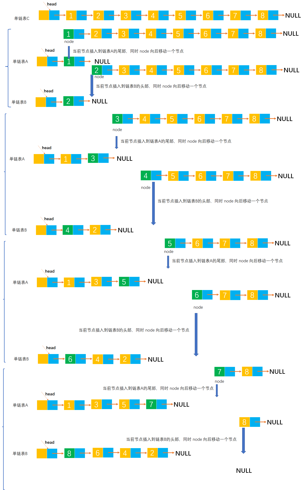

# Example020

## 题目

设 `C = {a1, b1, a2, b2, ..., an, bn}` 为线性表，采用带头结点的 `hc` 单链表存放，设计一个就地算法，将其拆分为两个线性表，使得 `A = {a1, a2, ..., an}`，`B = {bn, ..., b2, b1}`。

## 分析

本题考查的知识点：
- 单链表
- 通过头插法创建单链表
- 通过尾插法创建单链表

**分析**：
- 本题可以将单链表中的节点分在两个链表 A 和 B 中。
- 但本题要求就地修改，即可以让序号为奇数的节点保存在原链表 hc 中，然后将序号为偶数的节点倒序保存在一个新链表中。
- 其实本题没有区分节点在链表中的序号，之所以这样说是为了能够区分将哪些节点保存在链表 A 中，哪些节点保存在链表 B 中。
- B 链表中的节点是采用头插法插入的，这样才能让链表节点逆序保存。

## 图解




## C实现

核心代码：

```c
/**
 * 拆分链表
 * @param hc 待拆分的链表
 * @param A 正序保存链表 hc 中序号为奇数的节点
 * @param B 逆序保存链表 hc 中序号为偶数的节点
 */
void splitLinkedList(LNode *hc, LNode **A, LNode **B) {
    // 1.初始化单链表 A 和 B
    // 1.1 初始化单链表 A
    // 1.1.1 为链表 A 的头结点分配空间
    *A = (LNode *) malloc(sizeof(LNode));
    // 1.1.2 将头结点的 next 指针指向 null
    (*A)->next = NULL;
    // 1.2 初始化单链表 B
    // 1.2.1 为链表 B 的头结点分配空间
    *B = (LNode *) malloc(sizeof(LNode));
    // 1.2.2 将头结点的 next 指针指向 null
    (*B)->next = NULL;

    // 变量，记录链表 A 的尾节点，为了使用尾插法插入新节点，初始为链表 A 的头结点
    LNode *aTailNode = *A;
    // 变量，记录 hc 链表的结点，从头到尾扫描单链表 hc，初始为链表的第一个结点
    LNode *node = hc->next;
    // 变量，计数器，记录 hc 链表中已经遍历过的结点个数，如果是奇数则插入到链表 A 中，如果是偶数则插入到链表 B 中
    int num = 0;

    // 2.从头到尾扫描链表 hc，然后将结点分别插入到链表 A 和 B 中
    while (node != NULL) {
        // 2.1 计数器加 1，表示已经扫描过一个结点了
        num++;
        // 2.2 创建新节点（注：这里选择创建新节点的方式得到旧结点 node 的数据域值，并且将新节点的 next 指针指向 null，避免了后面再处理的问题）
        LNode *newNode = (LNode *) malloc(sizeof(LNode));
        newNode->data = node->data;
        newNode->next = NULL;
        // 2.3 判断计数器是奇数还是偶数
        // 2.3.1 如果是奇数，则采用尾插法将新节点插入到链表 A 中
        if (num % 2 != 0) {
            // 2.3.1.1 将原链表的尾节点的 next 指针指向新节点，完成新节点与链表 A 的连接
            aTailNode->next = newNode;
            // 2.3.1.2 更新变量 aTailNode，让新节点成为链表 A 的尾节点
            aTailNode = newNode;
        }
        // 2.3.2 如果是偶数，则采用头插法将新节点插入到链表 B 中
        else {
            // 2.3.2.1 将新节点的 next 指针指向原链表 B 的第一个结点（即链表 B 的头结点的后继节点），完成新节点与原链表第一个节点的连接
            newNode->next = (*B)->next;
            // 2.3.2.2 然后将链表 B 的头结点的 next 指针指向新节点，完成新节点与链表 B 头结点的连接
            (*B)->next = newNode;
        }
        // 2.4 继续 hc 链表的下一个结点
        node = node->next;
    }
}
```

完整代码：

```c
#include <stdio.h>
#include <malloc.h>

/**
 * 单链表节点
 */
typedef struct LNode {
    /**
     * 单链表节点的数据域
     */
    int data;
    /**
     * 单链表节点的的指针域，指向当前节点的后继节点
     */
    struct LNode *next;
} LNode;

/**
 * 通过尾插法创建单链表
 * @param list 单链表
 * @param nums 创建单链表时插入的数据数组
 * @param n 数组长度
 * @return 创建好的单链表
 */
LNode *createByTail(LNode **list, int nums[], int n) {
    // 1.初始化单链表
    // 创建链表必须要先初始化链表，也可以选择直接调用 init() 函数
    *list = (LNode *) malloc(sizeof(LNode));
    (*list)->next = NULL;

    // 尾插法，必须知道链表的尾节点（即链表的最后一个节点），初始时，单链表的头结点就是尾节点
    // 因为在单链表中插入节点我们必须知道前驱节点，而头插法中的前驱节点一直是头节点，但尾插法中要在单链表的末尾插入新节点，所以前驱节点一直都是链表的最后一个节点，而链表的最后一个节点由于链表插入新节点会一直变化
    LNode *node = (*list);

    // 2.循环数组，将所有数依次插入到链表的尾部
    for (int i = 0; i < n; i++) {
        // 2.1 创建新节点，并指定数据域和指针域
        // 2.1.1 创建新节点，为其分配空间
        LNode *newNode = (LNode *) malloc(sizeof(LNode));
        // 2.1.2 为新节点指定数据域
        newNode->data = nums[i];
        // 2.1.3 为新节点指定指针域，新节点的指针域初始时设置为 null
        newNode->next = NULL;

        // 2.2 将新节点插入到单链表的尾部
        // 2.2.1 将链表原尾节点的 next 指针指向新节点
        node->next = newNode;
        // 2.2.2 将新节点置为新的尾节点
        node = newNode;
    }
    return *list;
}

/**
 * 拆分链表
 * @param hc 待拆分的链表
 * @param A 正序保存链表 hc 中序号为奇数的节点
 * @param B 逆序保存链表 hc 中序号为偶数的节点
 */
void splitLinkedList(LNode *hc, LNode **A, LNode **B) {
    // 1.初始化单链表 A 和 B
    // 1.1 初始化单链表 A
    // 1.1.1 为链表 A 的头结点分配空间
    *A = (LNode *) malloc(sizeof(LNode));
    // 1.1.2 将头结点的 next 指针指向 null
    (*A)->next = NULL;
    // 1.2 初始化单链表 B
    // 1.2.1 为链表 B 的头结点分配空间
    *B = (LNode *) malloc(sizeof(LNode));
    // 1.2.2 将头结点的 next 指针指向 null
    (*B)->next = NULL;

    // 变量，记录链表 A 的尾节点，为了使用尾插法插入新节点，初始为链表 A 的头结点
    LNode *aTailNode = *A;
    // 变量，记录 hc 链表的结点，从头到尾扫描单链表 hc，初始为链表的第一个结点
    LNode *node = hc->next;
    // 变量，计数器，记录 hc 链表中已经遍历过的结点个数，如果是奇数则插入到链表 A 中，如果是偶数则插入到链表 B 中
    int num = 0;

    // 2.从头到尾扫描链表 hc，然后将结点分别插入到链表 A 和 B 中
    while (node != NULL) {
        // 2.1 计数器加 1，表示已经扫描过一个结点了
        num++;
        // 2.2 创建新节点（注：这里选择创建新节点的方式得到旧结点 node 的数据域值，并且将新节点的 next 指针指向 null，避免了后面再处理的问题）
        LNode *newNode = (LNode *) malloc(sizeof(LNode));
        newNode->data = node->data;
        newNode->next = NULL;
        // 2.3 判断计数器是奇数还是偶数
        // 2.3.1 如果是奇数，则采用尾插法将新节点插入到链表 A 中
        if (num % 2 != 0) {
            // 2.3.1.1 将原链表的尾节点的 next 指针指向新节点，完成新节点与链表 A 的连接
            aTailNode->next = newNode;
            // 2.3.1.2 更新变量 aTailNode，让新节点成为链表 A 的尾节点
            aTailNode = newNode;
        }
        // 2.3.2 如果是偶数，则采用头插法将新节点插入到链表 B 中
        else {
            // 2.3.2.1 将新节点的 next 指针指向原链表 B 的第一个结点（即链表 B 的头结点的后继节点），完成新节点与原链表第一个节点的连接
            newNode->next = (*B)->next;
            // 2.3.2.2 然后将链表 B 的头结点的 next 指针指向新节点，完成新节点与链表 B 头结点的连接
            (*B)->next = newNode;
        }
        // 2.4 继续 hc 链表的下一个结点
        node = node->next;
    }
}

/**
 * 打印链表的所有节点
 * @param list 单链表
 */
void print(LNode *list) {
    printf("[");
    // 链表的第一个节点
    LNode *node = list->next;
    // 循环单链表所有节点，打印值
    while (node != NULL) {
        printf("%d", node->data);
        if (node->next != NULL) {
            printf(", ");
        }
        node = node->next;
    }
    printf("]\n");
}

int main() {
    // 声明单链表
    LNode *hc;
    int nums[] = {1, 2, 3, 4, 5, 6, 7, 8};
    int n = 8;
    createByTail(&hc, nums, n);
    print(hc);

    // 调用函数，拆分链表
    LNode *A;
    LNode *B;
    splitLinkedList(hc, &A, &B);
    print(A);
    print(B);
}
```

执行结果：

```text
[1, 2, 3, 4, 5, 6, 7, 8]
[1, 3, 5, 7]
[8, 6, 4, 2]
```

如果是原地拆分链表的话，代码如下：
```c 
#include <stdio.h>
#include <malloc.h>

/**
 * 单链表节点
 */
typedef struct LNode {
    /**
     * 单链表节点的数据域
     */
    int data;
    /**
     * 单链表节点的的指针域，指向当前节点的后继节点
     */
    struct LNode *next;
} LNode;

/**
 * 通过尾插法创建单链表
 * @param list 单链表
 * @param nums 创建单链表时插入的数据数组
 * @param n 数组长度
 * @return 创建好的单链表
 */
LNode *createByTail(LNode **list, int nums[], int n) {
    // 1.初始化单链表
    // 创建链表必须要先初始化链表，也可以选择直接调用 init() 函数
    *list = (LNode *) malloc(sizeof(LNode));
    (*list)->next = NULL;

    // 尾插法，必须知道链表的尾节点（即链表的最后一个节点），初始时，单链表的头结点就是尾节点
    // 因为在单链表中插入节点我们必须知道前驱节点，而头插法中的前驱节点一直是头节点，但尾插法中要在单链表的末尾插入新节点，所以前驱节点一直都是链表的最后一个节点，而链表的最后一个节点由于链表插入新节点会一直变化
    LNode *node = (*list);

    // 2.循环数组，将所有数依次插入到链表的尾部
    for (int i = 0; i < n; i++) {
        // 2.1 创建新节点，并指定数据域和指针域
        // 2.1.1 创建新节点，为其分配空间
        LNode *newNode = (LNode *) malloc(sizeof(LNode));
        // 2.1.2 为新节点指定数据域
        newNode->data = nums[i];
        // 2.1.3 为新节点指定指针域，新节点的指针域初始时设置为 null
        newNode->next = NULL;

        // 2.2 将新节点插入到单链表的尾部
        // 2.2.1 将链表原尾节点的 next 指针指向新节点
        node->next = newNode;
        // 2.2.2 将新节点置为新的尾节点
        node = newNode;
    }
    return *list;
}

/**
 * 拆分链表
 * @param hc 待拆分的链表，拆分后就是链表 A
 * @return 链表 B
 */
LNode *splitLinkedList(LNode *hc) {
    // 创建存储序号为偶数节点的链表 B，并初始化头结点
    LNode *B = (LNode *) malloc(sizeof(LNode));
    B->next = NULL;
    // 链表 A，其实就是删除了一些节点后的链表 hc
    LNode *A = hc;
    LNode *aTailNode = hc;// 记录链表 A 的尾节点，用于尾插法

    // 从头到尾扫描链表 hc，记录链表 hc 中的节点，初始为第一个节点
    LNode *node = hc->next;
    LNode *temp;
    while (node != NULL) {
        // 将 node 节点保存到链表 A 中，采用尾插法
        aTailNode->next = node;
        aTailNode = node;

        // 然后链表 hc 的结点向前移动一个
        node = node->next;

        // 此时 node 结点已经后移一个了，所以要把这个结点插入到链表 B 中，前提是该结点存在
        if (node != NULL) {
            // 临时保存 node 结点的后继节点
            temp = node->next;

            // 采用头插法，将 node 节点插入到链表 B 的头部
            node->next = B->next;
            B->next = node;

            // 将节点插入到链表 B 头部后，此时 hc 链表的节点也该继续向后移动一个位置
            node = temp;
        }
    }
    // 由于是摘除节点插入到链表 A 的尾部，所以要将链表 A 的尾节点的 next 指针指向 null
    aTailNode->next = NULL;

    // 返回创建成功的单链表 B，保存了链表 hc 中序号为偶数的节点
    return B;
}

/**
 * 打印链表的所有节点
 * @param list 单链表
 */
void print(LNode *list) {
    printf("[");
    // 链表的第一个节点
    LNode *node = list->next;
    // 循环单链表所有节点，打印值
    while (node != NULL) {
        printf("%d", node->data);
        if (node->next != NULL) {
            printf(", ");
        }
        node = node->next;
    }
    printf("]\n");
}

int main() {
    // 声明单链表
    LNode *hc;
    int nums[] = {1, 2, 3, 4, 5, 6, 7, 8};
    int n = 8;
    createByTail(&hc, nums, n);
    print(hc);

    // 调用函数，拆分链表
    LNode *B = splitLinkedList(hc);
    print(hc);
    print(B);
}
```

## Java实现

核心代码：

```java
    /**
     * 拆分链表
     * @param A 正序保存链表 hc 中序号为奇数的节点
     * @param B 逆序保存链表 hc 中序号为偶数的节点
     */
    public void splitLinkedList(LinkedList A, LinkedList B) {
        // 1.初始化单链表 A 和 B
        // 1.1 初始化单链表 A
        // 1.1.1 为链表 A 的头结点分配空间
        A.list=new LNode();
        // 1.1.2 将头结点的 next 指针指向 null
        A.list.next=null;
        // 1.2 初始化单链表 B
        // 1.2.1 为链表 B 的头结点分配空间
        B.list=new LNode();
        // 1.2.2 将头结点的 next 指针指向 null
        B.list.next=null;

        // 变量，记录链表 A 的尾节点，为了使用尾插法插入新节点，初始为链表 A 的头结点
        LNode aTailNode=A.list;
        // 变量，记录 hc 链表的结点，从头到尾扫描单链表 hc，初始为链表的第一个结点
        LNode node=list.next;
        // 变量，计数器，记录 hc 链表中已经遍历过的结点个数，如果是奇数则插入到链表 A 中，如果是偶数则插入到链表 B 中
        int num=0;

        // 2.从头到尾扫描链表 hc，然后将结点分别插入到链表 A 和 B 中
        while (node!=null){
            // 2.1 计数器加 1，表示已经扫描过一个结点了
            num++;
            // 2.2 创建新节点（注：这里选择创建新节点的方式得到旧结点 node 的数据域值，并且将新节点的 next 指针指向 null，避免了后面再处理的问题）
            LNode newNode=new LNode();
            newNode.data= node.data;
            newNode.next=null;
            // 2.3 判断计数器是奇数还是偶数
            // 2.3.1 如果是奇数，则采用尾插法将新节点插入到链表 A 中
            if(num%2!=0){
                // 2.3.1.1 将原链表的尾节点的 next 指针指向新节点，完成新节点与链表 A 的连接
                aTailNode.next=newNode;
                // 2.3.1.2 更新变量 aTailNode，让新节点成为链表 A 的尾节点
                aTailNode=newNode;
            }
            // 2.3.2 如果是偶数，则采用头插法将新节点插入到链表 B 中
            else {
                // 2.3.2.1 将新节点的 next 指针指向原链表 B 的第一个结点（即链表 B 的头结点的后继节点），完成新节点与原链表第一个节点的连接
               newNode.next=B.list.next;
                // 2.3.2.2 然后将链表 B 的头结点的 next 指针指向新节点，完成新节点与链表 B 头结点的连接
               B.list.next=newNode;
            }
            // 2.4 继续 hc 链表的下一个结点
            node=node.next;
        }
    }
```

完整代码：

```java
public class LinkedList {
    /**
     * 单链表
     */
    private LNode list;

    /**
     * 通过尾插法创建单链表
     *
     * @param nums 创建单链表时插入的数据
     * @return 创建好的单链表
     */
    public LNode createByTail(int... nums) {
        // 1.初始化单链表
        // 创建链表必须要先初始化链表，也可以选择直接调用 init() 函数
        list = new LNode();
        list.next = null;

        // 尾插法，必须知道链表的尾节点（即链表的最后一个节点），初始时，单链表的头结点就是尾节点
        // 因为在单链表中插入节点我们必须知道前驱节点，而头插法中的前驱节点一直是头节点，但尾插法中要在单链表的末尾插入新节点，所以前驱节点一直都是链表的最后一个节点，而链表的最后一个节点由于链表插入新节点会一直变化
        LNode tailNode = list;

        // 2.循环数组，将所有数依次插入到链表的尾部
        for (int i = 0; i < nums.length; i++) {
            // 2.1 创建新节点，并指定数据域和指针域
            // 2.1.1 创建新节点，为其分配空间
            LNode newNode = new LNode();
            // 2.1.2 为新节点指定数据域
            newNode.data = nums[i];
            // 2.1.3 为新节点指定指针域，新节点的指针域初始时设置为 null
            newNode.next = null;

            // 2.2 将新节点插入到单链表的尾部
            // 2.2.1 将链表原尾节点的 next 指针指向新节点
            tailNode.next = newNode;
            // 2.2.2 将新节点置为新的尾节点
            tailNode = newNode;
        }

        return list;
    }

    /**
     * 拆分链表
     * @param A 正序保存链表 hc 中序号为奇数的节点
     * @param B 逆序保存链表 hc 中序号为偶数的节点
     */
    public void splitLinkedList(LinkedList A, LinkedList B) {
        // 1.初始化单链表 A 和 B
        // 1.1 初始化单链表 A
        // 1.1.1 为链表 A 的头结点分配空间
        A.list=new LNode();
        // 1.1.2 将头结点的 next 指针指向 null
        A.list.next=null;
        // 1.2 初始化单链表 B
        // 1.2.1 为链表 B 的头结点分配空间
        B.list=new LNode();
        // 1.2.2 将头结点的 next 指针指向 null
        B.list.next=null;

        // 变量，记录链表 A 的尾节点，为了使用尾插法插入新节点，初始为链表 A 的头结点
        LNode aTailNode=A.list;
        // 变量，记录 hc 链表的结点，从头到尾扫描单链表 hc，初始为链表的第一个结点
        LNode node=list.next;
        // 变量，计数器，记录 hc 链表中已经遍历过的结点个数，如果是奇数则插入到链表 A 中，如果是偶数则插入到链表 B 中
        int num=0;

        // 2.从头到尾扫描链表 hc，然后将结点分别插入到链表 A 和 B 中
        while (node!=null){
            // 2.1 计数器加 1，表示已经扫描过一个结点了
            num++;
            // 2.2 创建新节点（注：这里选择创建新节点的方式得到旧结点 node 的数据域值，并且将新节点的 next 指针指向 null，避免了后面再处理的问题）
            LNode newNode=new LNode();
            newNode.data= node.data;
            newNode.next=null;
            // 2.3 判断计数器是奇数还是偶数
            // 2.3.1 如果是奇数，则采用尾插法将新节点插入到链表 A 中
            if(num%2!=0){
                // 2.3.1.1 将原链表的尾节点的 next 指针指向新节点，完成新节点与链表 A 的连接
                aTailNode.next=newNode;
                // 2.3.1.2 更新变量 aTailNode，让新节点成为链表 A 的尾节点
                aTailNode=newNode;
            }
            // 2.3.2 如果是偶数，则采用头插法将新节点插入到链表 B 中
            else {
                // 2.3.2.1 将新节点的 next 指针指向原链表 B 的第一个结点（即链表 B 的头结点的后继节点），完成新节点与原链表第一个节点的连接
               newNode.next=B.list.next;
                // 2.3.2.2 然后将链表 B 的头结点的 next 指针指向新节点，完成新节点与链表 B 头结点的连接
               B.list.next=newNode;
            }
            // 2.4 继续 hc 链表的下一个结点
            node=node.next;
        }
    }

    /**
     * 打印单链表所有节点
     */
    public void print() {
        // 链表的第一个节点
        LNode node = list.next;
        // 循环打印
        String str = "[";
        while (node != null) {
            // 拼接节点的数据域
            str += node.data;
            // 只要不是最后一个节点，那么就在每个节点的数据域后面添加一个分号，用于分隔字符串
            if (node.next != null) {
                str += ", ";
            }
            // 继续链表的下一个节点
            node = node.next;
        }
        str += "]";
        // 打印链表
        System.out.println(str);
    }
}

/**
 * 单链表的节点
 */
class LNode {
    /**
     * 链表的数据域，暂时指定为 int 类型，因为 Java 支持泛型，可以指定为泛型，就能支持更多的类型了
     */
    int data;
    /**
     * 链表的指针域，指向该节点的下一个节点
     */
    LNode next;
}
```

测试代码：

```java
public class LinkedListTest {
    public static void main(String[] args) {
        // 创建单链表
        LinkedList list = new LinkedList();
        list.createByTail(1, 2, 3, 4, 5, 6, 7, 8);
        list.print();

        // 调用函数拆分链表
        LinkedList A = new LinkedList();
        LinkedList B = new LinkedList();
        list.splitLinkedList(A, B);
        A.print();
        B.print();
    }
}
```

执行结果：

```text
[1, 2, 3, 4, 5, 6, 7, 8]
[1, 3, 5, 7]
[8, 6, 4, 2]
```