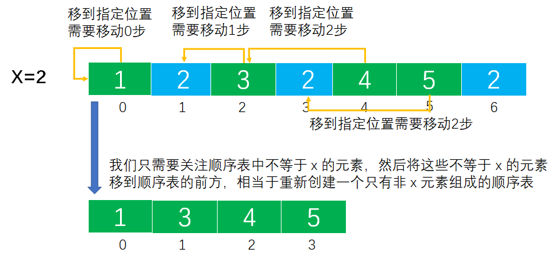
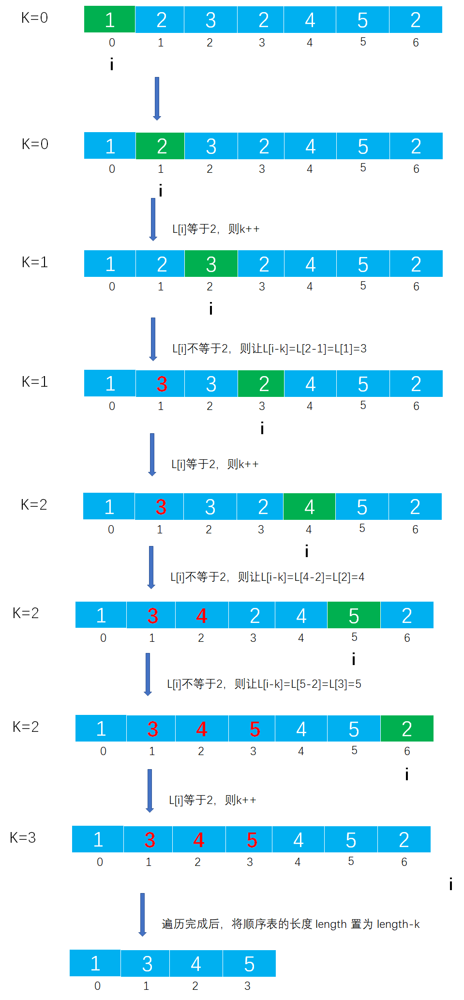
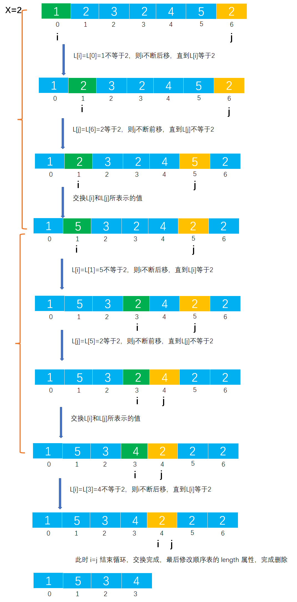

# Example022

## 题目

对长度为 n 的顺序表 L，编写一个时间复杂度为 `O(n)`、空间复杂度为 `O(1)` 的算法，该算法删除线性表中所有值为 x 的数据元素。


## 分析

本题考查的知识点：
- 顺序表
- 顺序表删除元素

**分析**：
- 本题要求时间复杂度为 `O(n)`，所以不能使用双层 `for` 来删除元素。所以本题有三种解法：
- 第一种解法，用 `k` 记录顺序表 `L` 中不等于 `x` 的元素的个数（即需要保存的元素个数），边扫描 `L` 边统计 `k`，并将不等于 `x` 的元素向前移动 `k` 个位置，最后修改 `L` 的长度。
- 第二种解法，用 `k` 记录顺序表 `L` 中等于 `x` 的元素的个数，边扫描 `L` 边统计 `k`，并将不等于 `x` 的元素前移 `k` 个位置，最后修改 `L` 的长度。
- 第三种解法，用两个指针 `i` 和 `j` 分别指向顺序表的第一个元素和顺序表的最后一个元素，`i` 指针从头到尾扫描顺序表，遇到不等于 `x` 的元素向后移动直到遇到等于 `x` 的元素为止；`j` 指针从尾到头扫描顺序表，遇到等于 `x` 的元素则向前移动直到遇到不等于 `x` 的元素为止。然后交换指针 `i` 和 `j` 所指向的元素，直到 `i=j` 结束扫描。本解法的原理就是通过交换将所有不等于 `x` 的元素移到前半部分，而所有等于 `x` 的元素移到后半部分，但注意会改变顺序表中已有元素的顺序。


其实解法一和解法二是比较难理解的，看下图能发现一二端倪，发现每个非 `x` 元素要移动它该待的位置上需要移动的步数恰好是它前面等于 `x` 的元素的个数。如`1`前面值等于 `x` 的个数是 0 个，所以保持原位；而 `3` 要移动到下标为 `1` 的位置，它的前面值等于 `x`  的个数是 1 个，恰好 `3` 所在的下标减去 `1` 就是它该待的位置，后面的非 `x` 元素也是一样的原理。




## 图解

解法二图解：




解法三图解：




## C实现

解法一核心代码：

```c
/**
 * 删除顺序表中所有值等于 x 的元素
 * @param x 指定值
 */
void deleteAllByEle(SeqList *list, int x) {
    int k = 0;// 记录值不等于 x 的元素个数
    for (int i = 0; i < list->length; i++) {
        if (list->data[i] != x) {
            list->data[k] = list->data[i];
            k++;// 不等于 x 的元素加 1
        }
    }
    list->length = k;// 顺序表的长度等于 k
}
```

解法二核心代码：

```c 
/**
 * 删除顺序表中所有值等于 x 的元素
 * @param x 指定值
 */
void deleteAllByEle(SeqList *list, int x) {
    int k = 0;// k 记录顺序表中值等于 x 的元素个数
    int i = 0;// 从头到尾扫描顺序表，记录下标
    while (i < list->length) {
        if (list->data[i] == x) {
            k++;
        } else {
            list->data[i - k] = list->data[i];// 当前元素前移 k 个位置
        }
        i++;
    }
    list->length = list->length - k;// 顺序表 L 的长度递减
}
```

解法三核心代码：

```c
/**
 * 删除顺序表中所有值等于 x 的元素
 * @param x 指定值
 */
void deleteAllByEle(SeqList *list, int x) {
    // 变量，第一根指针，从头到尾开始扫描，初始指向顺序表的第一个元素
    int i = 0;
    // 变量，第二根指针，从尾到头开始扫描，初始指向顺序表的最后一个元素
    int j = list->length - 1;

    // 1.两根指针同时进行扫描
    while (i < j) {
        // 1.1 指针 i 所指向的顺序表元素如果不是 x 则向后移动一步，直到遇到的元素等于 x
        while (i < j && list->data[i] != x) {
            i++;
        }
        // 1.2 指针 j 所指向的顺序表元素如果是 x 则向前移动一步，直到遇到的元素不等于 x
        while (i < j && list->data[j] == x) {
            j--;
        }
        // 1.3 然后交换指针 i 和指针 j 所表示的顺序表元素，直到将所有不等于 x 的元素移到前半部分，所有等于 x 的元素移到后半部分
        if (i < j) {
            int temp = list->data[i];
            list->data[i] = list->data[j];
            list->data[j] = temp;
        }
    }
    // 2.最重要的一步，修改 length 属性，此后顺序表操作的元素都是前半部分不是 x 的元素，相当于完成了删除
    list->length = i;
}
```

完整代码：

```c
#include <stdio.h>
#include <stdlib.h>

#define MAXSIZE 20

/**
 * 顺序表的结构体
 */
typedef struct {
    /**
     * 顺序表，实际上一个长度为 MAXSIZE 的数组，存储的数据类型为整型，当然可以设置为其他类型，但推荐使用宏定义类型，方便替换
     */
    int data[MAXSIZE];
    /**
     * 顺序表长度，即数组中实际元素个数
     */
    int length;
} SeqList;

/**
 * 初始化顺序表，仅需要将 length 置为 0 即可
 * @param list 待初始化的顺序表
 */
void init(SeqList *list) {
    // 仅需要将 length 置为 0 即可
    (*list).length = 0;
    // 或者可以用下面的语法
    // list->length=0;
}

/**
 * 直接添加新元素到顺序表的尾部
 * @param list 顺序表
 * @param ele 待添加的新元素
 * @return 如果插入成功则返回 1，否则返回 0
 */
int add(SeqList *list, int ele) {
    // 0.校验
    // 0.1 向顺序表中插入元素要检查顺序表是否已经满了，如果已经满了则不能再插入新元素则添加失败
    if (list->length == MAXSIZE) {
        return 0;
    }
    // 1.插入新元素
    // 1.1 直接获取顺序表的 length，然后将新元素的值赋予到 length 位置即可
    list->data[list->length] = ele;
    // 1.2 注意修改 length
    list->length++;
    return 1;
}

/**
 * 删除顺序表中所有值等于 x 的元素
 * @param x 指定值
 */
void deleteAllByEle(SeqList *list, int x) {
    // 变量，第一根指针，从头到尾开始扫描，初始指向顺序表的第一个元素
    int i = 0;
    // 变量，第二根指针，从尾到头开始扫描，初始指向顺序表的最后一个元素
    int j = list->length - 1;

    // 1.两根指针同时进行扫描
    while (i < j) {
        // 1.1 指针 i 所指向的顺序表元素如果不是 x 则向后移动一步，直到遇到的元素等于 x
        while (i < j && list->data[i] != x) {
            i++;
        }
        // 1.2 指针 j 所指向的顺序表元素如果是 x 则向前移动一步，直到遇到的元素不等于 x
        while (i < j && list->data[j] == x) {
            j--;
        }
        // 1.3 然后交换指针 i 和指针 j 所表示的顺序表元素，直到将所有不等于 x 的元素移到前半部分，所有等于 x 的元素移到后半部分
        if (i < j) {
            int temp = list->data[i];
            list->data[i] = list->data[j];
            list->data[j] = temp;
        }
    }
    // 2.最重要的一步，修改 length 属性，此后顺序表操作的元素都是前半部分不是 x 的元素，相当于完成了删除
    list->length = i;
}

/**
 * 打印顺序表
 * @param list 待打印的顺序表
 */
void print(SeqList list) {
    printf("[");
    for (int i = 0; i < list.length; i++) {
        printf("%d", list.data[i]);
        if (i != list.length - 1) {
            printf(", ");
        }
    }
    printf("]\n");
}

int main() {
    // 声明顺序表
    SeqList list;
    init(&list);
    // 添加测试数据
    add(&list, 1);
    add(&list, 3);
    add(&list, 2);
    add(&list, 2);
    add(&list, 6);
    add(&list, 2);
    print(list);

    // 调用函数删除顺序表中所有值等于 x 的元素
    int x = 2;
    deleteAllByEle(&list, x);
    print(list);
}
```

执行结果：

```text
[1, 3, 2, 2, 6, 2]
[1, 3, 6]
```


## Java实现

解法三核心代码：

```java
    /**
     * 删除顺序表中所有值为 x 的数据元素
     *
     * @param x 指定数值
     */
    public void deleteAllByEle(int x) {
        // 变量，第一根指针，从头到尾开始扫描，初始指向顺序表的第一个元素
        int i = 0;
        // 变量，第二根指针，从尾到头开始扫描，初始指向顺序表的最后一个元素
        int j = list.length - 1;

        // 1.两根指针同时进行扫描
        while (i < j) {
            // 1.1 指针 i 所指向的顺序表元素如果不是 x 则向后移动一步，直到遇到的元素等于 x
            while (i < j && list.data[i] != x) {
                i++;
            }
            // 1.2 指针 j 所指向的顺序表元素如果是 x 则向前移动一步，直到遇到的元素不等于 x
            while (i < j && list.data[j] == x) {
                j--;
            }
            // 1.3 然后交换指针 i 和指针 j 所表示的顺序表元素，直到将所有不等于 x 的元素移到前半部分，所有等于 x 的元素移到后半部分
            if (i < j) {
                int temp = list.data[i];
                list.data[i] = list.data[j];
                list.data[j] = temp;
            }
        }
        // 2.最重要的一步，修改 length 属性，此后顺序表操作的元素都是前半部分不是 x 的元素，相当于完成了删除
        list.length = i;
    }
```

完整代码：

```java
public class SeqList {
    /**
     * 顺序表最大能存放元素个数
     */
    private final int MAXSIZE = 20;

    /**
     * 声明的顺序表，未初始化
     */
    private List list;

    /**
     * 初始化顺序表
     */
    public void init() {
        list = new List();
        // 指定数据数组长度为 MAXSIZE
        list.data = new int[MAXSIZE];
        // 但指定顺序表实际元素个数为 0
        list.length = 0;
    }

    /**
     * 直接添加新元素到顺序表的尾部
     *
     * @param ele 待插入的新元素
     */
    public void add(int ele) throws Exception {
        // 0.校验
        // 0.1 向顺序表中插入元素要检查顺序表是否已经满了，如果已经满了则不能再插入新元素则抛出异常
        if (list.length == MAXSIZE) {
            throw new Exception("顺序表已满，不能再插入了！");
        }
        // 1.插入新元素
        // 1.1 直接获取顺序表的 length，然后将新元素的值赋予到 length 位置即可
        list.data[list.length] = ele;
        // 1.2 注意修改 length
        list.length++;
    }

    /**
     * 删除顺序表中所有值为 x 的数据元素
     *
     * @param x 指定数值
     */
    public void deleteAllByEle(int x) {
        // 变量，第一根指针，从头到尾开始扫描，初始指向顺序表的第一个元素
        int i = 0;
        // 变量，第二根指针，从尾到头开始扫描，初始指向顺序表的最后一个元素
        int j = list.length - 1;

        // 1.两根指针同时进行扫描
        while (i < j) {
            // 1.1 指针 i 所指向的顺序表元素如果不是 x 则向后移动一步，直到遇到的元素等于 x
            while (i < j && list.data[i] != x) {
                i++;
            }
            // 1.2 指针 j 所指向的顺序表元素如果是 x 则向前移动一步，直到遇到的元素不等于 x
            while (i < j && list.data[j] == x) {
                j--;
            }
            // 1.3 然后交换指针 i 和指针 j 所表示的顺序表元素，直到将所有不等于 x 的元素移到前半部分，所有等于 x 的元素移到后半部分
            if (i < j) {
                int temp = list.data[i];
                list.data[i] = list.data[j];
                list.data[j] = temp;
            }
        }
        // 2.最重要的一步，修改 length 属性，此后顺序表操作的元素都是前半部分不是 x 的元素，相当于完成了删除
        list.length = i;
    }

    /**
     * 打印顺序表
     */
    public void print() {
        String str = "[";
        for (int i = 0; i < list.length; i++) {
            str += list.data[i];
            if (i != list.length - 1) {
                str += ", ";
            }
        }
        str += "]";
        System.out.println(str);
    }
}

/**
 * 顺序表
 */
class List {
    /**
     * 数据域，保存数据的数组
     */
    int[] data;
    /**
     * 数组中实际元素个数
     */
    int length;
}
```

测试代码：

```java
public class SeqListTest {
    public static void main(String[] args) throws Exception {
        // 实例化顺序表对象
        SeqList list = new SeqList();
        list.init();
        // 为顺序表添加测试数据
        list.add(2);
        list.add(1);
        list.add(2);
        list.add(2);
        list.add(4);
        list.add(2);
        list.print();

        // 调用函数删除所有值为 x 的元素
        int x = 2;
        list.deleteAllByEle(x);
        list.print();
    }
}
```

执行结果：

```text
[2, 1, 2, 2, 4, 2]
[4, 1]
```