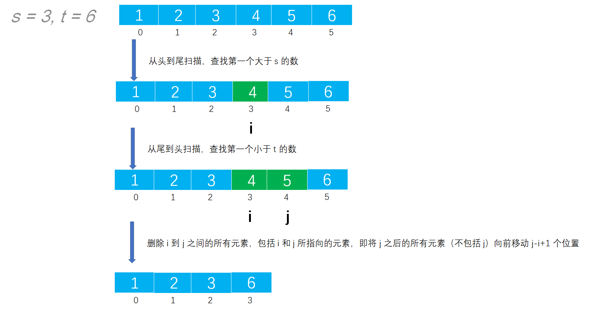

# Example023

## 题目

从有序顺序表中删除其值在给定值 s 与 t 之间（要求 `s<t`）的所有元素，若 s 或 t 不合理或顺序表为空，则显示出错信息并退出运行。


## 分析

本题考查的知识点：
- 顺序表
- 顺序表删除元素

**分析**：
- 注意，本题中的顺序表是有序的（如 `[1, 2, 3, 4, 5, 6]`），所以我们如果要删除的数一定是指定范围内的一组数（如 `s=3, t=6`），则会删除 `[4, 5]`，最后得到的结果是 `[1, 2, 3, 6]`，发现它是删除多个数，而非删除单个数。
- 本题解法是删除是不包括边界的，即如果顺序表中有元素等于 `s` 或者 `t`，则是不需要删除的。即只删除顺序表中范围在 `(s, t)` 之内的数。但书中的解法是包括 `s` 和　`t` 的，考虑到书中下一道题是明确说明包括 `s` 和 `t`的，所以本题是不包括边界的。
- 注意删除的三种情况（如顺序表是 `[1, 2, 3, 4, 5, 6]` ）：第一种情况，删除顺序表中间的元素（如`s=3, t=6` 那么结果是 `[1, 2, 3, 6]`）；第二种情况，删除顺序表开头的元素（如 `s=0, t=4` 那么结果是 `[4, 5, 6]`）；第三种情况，删除顺序表结尾的元素（如 `s=3, t=7`）。
- 本题的算法思想是，先寻找要删除的第一个元素的起始下标（即第一个大于 `s` 的元素），再寻找要删除的最后一个元素的下标（即第一个小于 `t` 的元素），然后将这段元素删除，直接用后面的元素覆盖前面的元素，最后修改顺序表的长度即完成删除。


## 图解




## C实现

核心代码：

```c
/**
 * 删除顺序表中值在 (s, t) 之间的所有元素
 *
 * @param list 顺序表
 * @param s 指定起始值，不包括本身
 * @param t 指定结束值，不包括本身
 *
 * @throws Exception 如果参数不合法则抛出异常
 */
void deleteByRange(SeqList *list, int s, int t) {
    // 0.参数校验
    // 0.1 s必须小于t
    if (s >= t) {
        printf("s 应该小于 t: s=%d, t=%d", s, t);
        exit(0);
    }
    // 0.2 顺序表为空则不能进行删除
    if (list->length == 0) {
        printf("顺序表为空，不能删除！");
        exit(0);
    }

    // 1.计算起始边界和结束边界，包括边界本身
    // 1.1 计算要删除的第一个元素的下标，包含本身
    int start = 0;
    while (list->data[start] <= s) {
        start++;
    }
    // 1.2 计算要删除的最后一个元素的下标，包含本身
    int end = list->length - 1;
    while (list->data[end] >= t) {
        end--;
    }

    // 2.删除 [start, end] 所表示的所有元素
    // 2.1 移动 end 之后的所有元素（包括 end 所指向的元素）到 start 及之后的位置
    for (int i = 0; i < list->length - 1 - end; i++) {
        list->data[start + i] = list->data[end + 1 + i];
    }
    // 2.2 最重要的是，修改顺序表的 length 属性，删除了 end-start+1 个元素
    list->length -= end - start + 1;
}
```

完整代码：

```c
#include <stdio.h>
#include <stdlib.h>

#define MAXSIZE 20

/**
 * 顺序表的结构体
 */
typedef struct {
    /**
     * 顺序表，实际上一个长度为 MAXSIZE 的数组，存储的数据类型为整型，当然可以设置为其他类型，但推荐使用宏定义类型，方便替换
     */
    int data[MAXSIZE];
    /**
     * 顺序表长度，即数组中实际元素个数
     */
    int length;
} SeqList;

/**
 * 初始化顺序表，仅需要将 length 置为 0 即可
 * @param list 待初始化的顺序表
 */
void init(SeqList *list) {
    // 仅需要将 length 置为 0 即可
    (*list).length = 0;
    // 或者可以用下面的语法
    // list->length=0;
}

/**
 * 直接添加新元素到顺序表的尾部
 * @param list 顺序表
 * @param ele 待添加的新元素
 * @return 如果插入成功则返回 1，否则返回 0
 */
int add(SeqList *list, int ele) {
    // 0.校验
    // 0.1 向顺序表中插入元素要检查顺序表是否已经满了，如果已经满了则不能再插入新元素则添加失败
    if (list->length == MAXSIZE) {
        return 0;
    }
    // 1.插入新元素
    // 1.1 直接获取顺序表的 length，然后将新元素的值赋予到 length 位置即可
    list->data[list->length] = ele;
    // 1.2 注意修改 length
    list->length++;
    return 1;
}

/**
 * 删除顺序表中值在 (s, t) 之间的所有元素
 *
 * @param list 顺序表
 * @param s 指定起始值，不包括本身
 * @param t 指定结束值，不包括本身
 *
 * @throws Exception 如果参数不合法则抛出异常
 */
void deleteByRange(SeqList *list, int s, int t) {
    // 0.参数校验
    // 0.1 s必须小于t
    if (s >= t) {
        printf("s 应该小于 t: s=%d, t=%d", s, t);
        exit(0);
    }
    // 0.2 顺序表为空则不能进行删除
    if (list->length == 0) {
        printf("顺序表为空，不能删除！");
        exit(0);
    }

    // 1.计算起始边界和结束边界，包括边界本身
    // 1.1 计算要删除的第一个元素的下标，包含本身
    int start = 0;
    while (list->data[start] <= s) {
        start++;
    }
    // 1.2 计算要删除的最后一个元素的下标，包含本身
    int end = list->length - 1;
    while (list->data[end] >= t) {
        end--;
    }

    // 2.删除 [start, end] 所表示的所有元素
    // 2.1 移动 end 之后的所有元素（包括 end 所指向的元素）到 start 及之后的位置
    for (int i = 0; i < list->length - 1 - end; i++) {
        list->data[start + i] = list->data[end + 1 + i];
    }
    // 2.2 最重要的是，修改顺序表的 length 属性，删除了 end-start+1 个元素
    list->length -= end - start + 1;
}

/**
 * 打印顺序表
 * @param list 待打印的顺序表
 */
void print(SeqList list) {
    printf("[");
    for (int i = 0; i < list.length; i++) {
        printf("%d", list.data[i]);
        if (i != list.length - 1) {
            printf(", ");
        }
    }
    printf("]\n");
}

int main() {
    // 声明顺序表
    SeqList list;
    init(&list);
    // 添加测试数据
    add(&list, 1);
    add(&list, 2);
    add(&list, 3);
    add(&list, 4);
    add(&list, 5);
    add(&list, 6);
    print(list);

    // 调用函数进行删除
    int s = 3, t = 6;
    deleteByRange(&list, s, t);
    print(list);
}
```

执行结果：

```text
[1, 2, 3, 4, 5, 6]
[1, 2, 3, 6]
```


## Java实现

核心代码：

```java
    /**
     * 删除顺序表中值在 (s, t) 之间的所有元素
     *
     * @param s 指定起始值，不包括本身
     * @param t 指定结束值，不包括本身
     * @throws Exception 如果参数不合法则抛出异常
     */
    public void deleteByRange(int s, int t) throws Exception {
        // 0.参数校验
        // 0.1 s必须小于t
        if (s >= t) {
            throw new Exception("s 应该小于 t: s=" + s + ", t=" + t);
        }
        // 0.2 顺序表为空则不能进行删除
        if (list.length == 0) {
            throw new Exception("顺序表为空，不能删除！");
        }

        // 1.计算起始边界和结束边界，包括边界本身
        // 1.1 计算要删除的第一个元素的下标，包含本身
        int start = 0;
        while (list.data[start] <= s) {
            start++;
        }
        // 1.2 计算要删除的最后一个元素的下标，包含本身
        int end = list.length - 1;
        while (list.data[end] >= t) {
            end--;
        }

        // 2.删除 [start, end] 所表示的所有元素
        // 2.1 移动 end 之后的所有元素（包括 end 所指向的元素）到 start 及之后的位置
        for (int i = 0; i < list.length - 1 - end; i++) {
            list.data[start + i] = list.data[end + 1 + i];
        }
        // 2.2 最重要的是，修改顺序表的 length 属性，删除了 end-start+1 个元素
        list.length -= end - start + 1;
    }
```

完整代码：

```java
public class SeqList {
    /**
     * 顺序表最大能存放元素个数
     */
    private final int MAXSIZE = 20;

    /**
     * 声明的顺序表，未初始化
     */
    private List list;

    /**
     * 初始化顺序表
     */
    public void init() {
        list = new List();
        // 指定数据数组长度为 MAXSIZE
        list.data = new int[MAXSIZE];
        // 但指定顺序表实际元素个数为 0
        list.length = 0;
    }

    /**
     * 直接添加新元素到顺序表的尾部
     *
     * @param ele 待插入的新元素
     */
    public void add(int ele) throws Exception {
        // 0.校验
        // 0.1 向顺序表中插入元素要检查顺序表是否已经满了，如果已经满了则不能再插入新元素则抛出异常
        if (list.length == MAXSIZE) {
            throw new Exception("顺序表已满，不能再插入了！");
        }
        // 1.插入新元素
        // 1.1 直接获取顺序表的 length，然后将新元素的值赋予到 length 位置即可
        list.data[list.length] = ele;
        // 1.2 注意修改 length
        list.length++;
    }

    /**
     * 删除顺序表中值在 (s, t) 之间的所有元素
     *
     * @param s 指定起始值，不包括本身
     * @param t 指定结束值，不包括本身
     * @throws Exception 如果参数不合法则抛出异常
     */
    public void deleteByRange(int s, int t) throws Exception {
        // 0.参数校验
        // 0.1 s必须小于t
        if (s >= t) {
            throw new Exception("s 应该小于 t: s=" + s + ", t=" + t);
        }
        // 0.2 顺序表为空则不能进行删除
        if (list.length == 0) {
            throw new Exception("顺序表为空，不能删除！");
        }

        // 1.计算起始边界和结束边界，包括边界本身
        // 1.1 计算要删除的第一个元素的下标，包含本身
        int start = 0;
        while (list.data[start] <= s) {
            start++;
        }
        // 1.2 计算要删除的最后一个元素的下标，包含本身
        int end = list.length - 1;
        while (list.data[end] >= t) {
            end--;
        }

        // 2.删除 [start, end] 所表示的所有元素
        // 2.1 移动 end 之后的所有元素（包括 end 所指向的元素）到 start 及之后的位置
        for (int i = 0; i < list.length - 1 - end; i++) {
            list.data[start + i] = list.data[end + 1 + i];
        }
        // 2.2 最重要的是，修改顺序表的 length 属性，删除了 end-start+1 个元素
        list.length -= end - start + 1;
    }

    /**
     * 打印顺序表
     */
    public void print() {
        String str = "[";
        for (int i = 0; i < list.length; i++) {
            str += list.data[i];
            if (i != list.length - 1) {
                str += ", ";
            }
        }
        str += "]";
        System.out.println(str);
    }
}

/**
 * 顺序表
 */
class List {
    /**
     * 数据域，保存数据的数组
     */
    int[] data;
    /**
     * 数组中实际元素个数
     */
    int length;
}
```

测试代码：

```java
public class SeqListTest {
    public static void main(String[] args) throws Exception {
        // 实例化顺序表对象
        SeqList list = new SeqList();
        list.init();
        // 为顺序表添加测试数据
        list.add(1);
        list.add(2);
        list.add(3);
        list.add(4);
        list.add(5);
        list.add(6);
        list.print();

        // 调用函数删除所有指定范围内的元素
        int s = 3, t = 7;
        list.deleteByRange(s, t);
        list.print();
    }
}
```

执行结果：

```text
[1, 2, 3, 4, 5, 6]
[1, 2, 3]
```