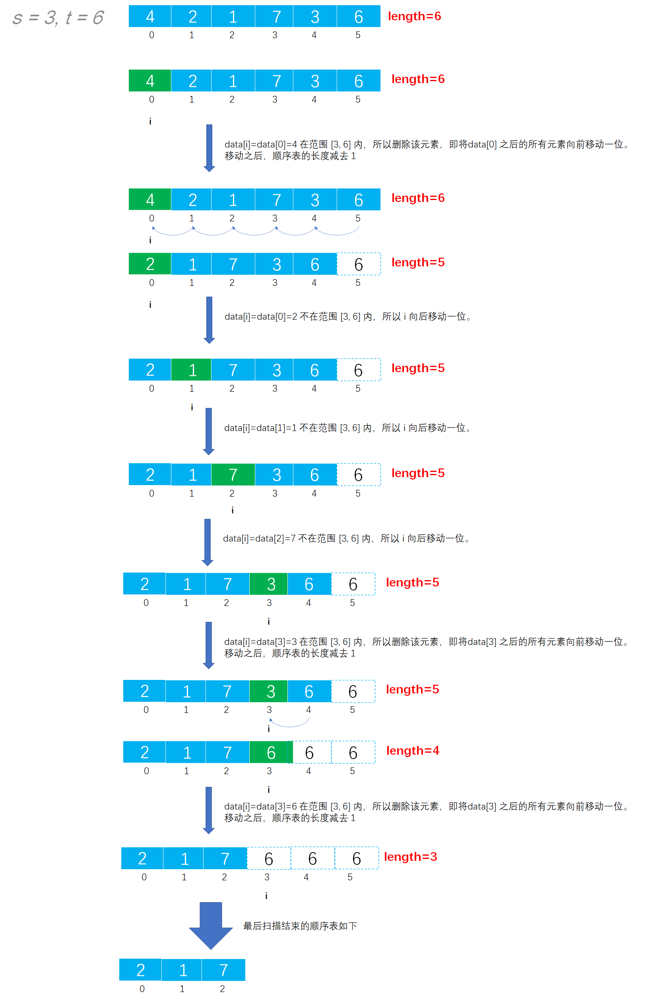
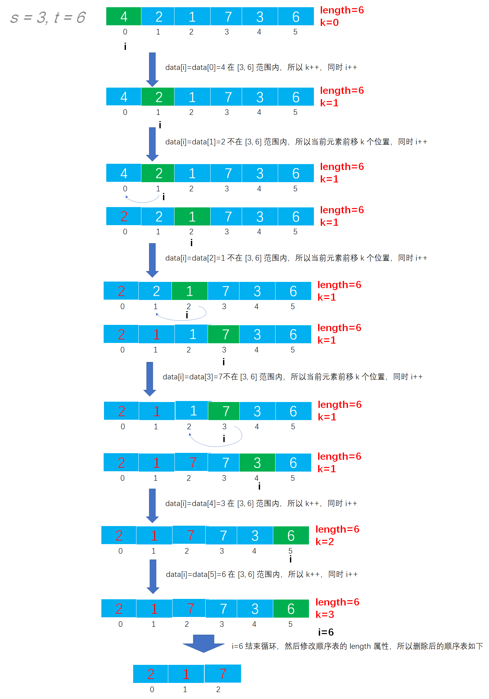

# Example024

## 题目

从顺序表中删除其值在给定值 s 与 t 之间（包含 s 和 t，要求 `s<t`）的所有元素，若 s 或 t 不合理或顺序表为空，则显示出错信息并退出运行。

## 分析

本题考查的知识点：

- 顺序表
- 顺序表删除元素

**分析**：

- 注意，本题题目中没有说明顺序表是有序的，所以可能顺序表中的元素是无序的，所以值在 `[s, t]` 范围的元素在顺序表中可能是离散分布的，而非像上一道题中是连续的。
- 本题解法是包括边界的，即如果顺序表中有元素等于 `s` 或者 `t`，则是需要删除的。即删除顺序表中范围在 `[s, t]` 中的数。
- 本题有两种解法，它们的时间复杂度是不同的。算法思想如下：
- 第一种解法，从头到尾扫描顺序表，如果当前元素处于 `[s, t]` 范围内，则将该元素之后的所有元素都向前移动一位，移动完成之后顺序表的 `length` 减去 1；如果当前元素不在 `[s, t]`
  范围内，则继续顺序表的下一个元素的判断比较。
- 第二种解法，从头到尾扫描顺序表，用一个变量 `k` 来记录在 `[s, t]` 范围内的元素的个数。对于当前扫描的元素，如果值不在 `[s, t]` 范围内则将该数前移 `k` 个位置；否则执行 `k++`。

## 图解

解法一图解：



解法二图解：



## C实现

解法一核心代码：

```c
/**
 * 删除顺序表中值在 [s, t] 之间的所有元素
 * @param list 顺序表
 * @param s 指定起始值，包括本身
 * @param t 指定结束值，包括本身
 */
void deleteByRange(SeqList *list, int s, int t) {
    // 0.参数校验
    // 0.1 s必须小于t
    if (s >= t) {
        printf("s 应该小于 t: s=%d, t=%d", s, t);
        exit(0);
    }
    // 0.2 顺序表为空则不能进行删除
    if (list->length == 0) {
        printf("顺序表为空，不能删除！");
        exit(0);
    }

    // 变量，记录扫描顺序表中元素的下标
    int i = 0;

    // 1.从头到尾扫描顺序表，通过双层 for 循环删除元素
    while (i < list->length) {
        // 1.1 如果当前元素处于 [s, t] 范围内
        if (list->data[i] >= s && list->data[i] <= t) {
            // 1.1.1 则将该元素之后的所有元素向前移动一位
            for (int j = i; j < list->length - 1; j++) {
                list->data[j] = list->data[j + 1];// 用后面的元素覆盖前一位的元素
            }
            // 1.1.2 移动之后顺序表的长度减 1
            list->length--;
        }
        // 1.2 如果扫描的当前元素不在 [s, t] 范围内
        else {
            // 1.2.1 则继续顺序表的下一个元素的判断比较
            i++;
        }
    }
}
```

解法二核心代码：

```c
/**
 * 删除顺序表中值在 [s, t] 之间的所有元素
 * @param list 顺序表
 * @param s 指定起始值，包括本身
 * @param t 指定结束值，包括本身
 */
void deleteByRange(SeqList *list, int s, int t) {
    // 0.参数校验
    // 0.1 s必须小于t
    if (s >= t) {
        printf("s 应该小于 t: s=%d, t=%d", s, t);
        exit(0);
    }
    // 0.2 顺序表为空则不能进行删除
    if (list->length == 0) {
        printf("顺序表为空，不能删除！");
        exit(0);
    }

    // 变量，记录顺序表中不在 [s, t] 范围内的数
    int k = 0;

    // 1.从头到尾扫描顺序表
    for (int i = 0; i < list->length; i++) {
        // 1.1如果遇到的数在 [s, t] 范围内，则 k 加 1
        if (list->data[i] >= s && list->data[i] <= t) {
            k++;
        }
            // 1.2 如果遇到的数不在 [s, t] 范围内，则将该数前移 k 个位置
        else {
            list->data[i - k] = list->data[i];
        }
    }
    // 2.修改顺序表的 length
    list->length = list->length - k;
}
```

完整代码：

```c
#include <stdio.h>
#include <stdlib.h>

#define MAXSIZE 20
/**
 * 顺序表的结构体
 */
typedef struct {
    /**
     * 顺序表，实际上一个长度为 MAXSIZE 的数组，存储的数据类型为整型，当然可以设置为其他类型，但推荐使用宏定义类型，方便替换
     */
    int data[MAXSIZE];
    /**
     * 顺序表长度，即数组中实际元素个数
     */
    int length;
}
        SeqList;

/**
 * 初始化顺序表，仅需要将 length 置为 0 即可
 * @param list 待初始化的顺序表
 */
void init(SeqList *list) {
    // 仅需要将 length 置为 0 即可
    (*list).length = 0;
    // 或者可以用下面的语法
    // list->length=0;
}

/**
 * 直接添加新元素到顺序表的尾部
 * @param list 顺序表
 * @param ele 待添加的新元素
 * @return 如果插入成功则返回 1，否则返回 0
 */
int add(SeqList *list, int ele) {
    // 0.校验
    // 0.1 向顺序表中插入元素要检查顺序表是否已经满了，如果已经满了则不能再插入新元素则添加失败
    if (list->length == MAXSIZE) {
        return 0;
    }
    // 1.插入新元素
    // 1.1 直接获取顺序表的 length，然后将新元素的值赋予到 length 位置即可
    list->data[list->length] = ele;
    // 1.2 注意修改 length
    list->length++;
    return 1;
}

/**
 * 删除顺序表中值在 [s, t] 之间的所有元素
 * @param list 顺序表
 * @param s 指定起始值，包括本身
 * @param t 指定结束值，包括本身
 */
void deleteByRange(SeqList *list, int s, int t) {
    // 0.参数校验
    // 0.1 s必须小于t
    if (s >= t) {
        printf("s 应该小于 t: s=%d, t=%d", s, t);
        exit(0);
    }
    // 0.2 顺序表为空则不能进行删除
    if (list->length == 0) {
        printf("顺序表为空，不能删除！");
        exit(0);
    }

    // 变量，记录顺序表中不在 [s, t] 范围内的数
    int k = 0;

    // 1.从头到尾扫描顺序表
    for (int i = 0; i < list->length; i++) {
        // 1.1如果遇到的数在 [s, t] 范围内，则 k 加 1
        if (list->data[i] >= s && list->data[i] <= t) {
            k++;
        }
            // 1.2 如果遇到的数不在 [s, t] 范围内，则将该数前移 k 个位置
        else {
            list->data[i - k] = list->data[i];
        }
    }
    // 2.修改顺序表的 length
    list->length = list->length - k;
}


/**
 * 打印顺序表
 * @param list 待打印的顺序表
 */
void print(SeqList list) {
    printf("[");
    for (int i = 0; i < list.length; i++) {
        printf("%d", list.data[i]);
        if (i != list.length - 1) {
            printf(", ");
        }
    }
    printf("]\n");
}

int main() {
    // 声明顺序表
    SeqList list;
    init(&list);
    // 添加测试数据
    add(&list, 4);
    add(&list, 2);
    add(&list, 1);
    add(&list, 7);
    add(&list, 3);
    add(&list, 6);
    print(list);

    // 调用函数进行删除
    int s = 3, t = 6;
    deleteByRange(&list, s, t);
    print(list);
}
```

执行结果：

```text
[4, 2, 1, 7, 3, 6]
[2, 1, 7]
```

## Java实现

核心代码：

```java
    /**
     * 删除顺序表中值在 [s, t] 之间的所有元素
     *
     * @param s 指定起始值，包括本身
     * @param t 指定结束值，包括本身
     * @throws Exception 如果参数不合法则抛出异常
     */
    public void deleteByRange(int s, int t) throws Exception {
        // 0.参数校验
        // 0.1 s必须小于t
        if (s >= t) {
            throw new Exception("s 应该小于 t: s=" + s + ", t=" + t);
        }
        // 0.2 顺序表为空则不能进行删除
        if (list.length == 0) {
            throw new Exception("顺序表为空，不能删除！");
        }

        // 变量，记录顺序表中不在 [s, t] 范围内的数
        int k = 0;

        // 1.从头到尾扫描顺序表
        for (int i = 0; i < list.length; i++) {
            // 1.1如果遇到的数在 [s, t] 范围内，则 k 加 1
            if (list.data[i] >= s && list.data[i] <= t) {
                k++;
            }
            // 1.2 如果遇到的数不在 [s, t] 范围内，则将该数前移 k 个位置
            else {
                list.data[i - k] = list.data[i];
            }
        }
        // 2.修改顺序表的 length
        list.length = list.length - k;
    }
```

完整代码：

```java
public class SeqList {
    /**
     * 顺序表最大能存放元素个数
     */
    private final int MAXSIZE = 20;

    /**
     * 声明的顺序表，未初始化
     */
    private List list;

    /**
     * 初始化顺序表
     */
    public void init() {
        list = new List();
        // 指定数据数组长度为 MAXSIZE
        list.data = new int[MAXSIZE];
        // 但指定顺序表实际元素个数为 0
        list.length = 0;
    }

    /**
     * 直接添加新元素到顺序表的尾部
     *
     * @param ele 待插入的新元素
     */
    public void add(int ele) throws Exception {
        // 0.校验
        // 0.1 向顺序表中插入元素要检查顺序表是否已经满了，如果已经满了则不能再插入新元素则抛出异常
        if (list.length == MAXSIZE) {
            throw new Exception("顺序表已满，不能再插入了！");
        }
        // 1.插入新元素
        // 1.1 直接获取顺序表的 length，然后将新元素的值赋予到 length 位置即可
        list.data[list.length] = ele;
        // 1.2 注意修改 length
        list.length++;
    }

    /**
     * 删除顺序表中值在 [s, t] 之间的所有元素
     *
     * @param s 指定起始值，包括本身
     * @param t 指定结束值，包括本身
     * @throws Exception 如果参数不合法则抛出异常
     */
    public void deleteByRange(int s, int t) throws Exception {
        // 0.参数校验
        // 0.1 s必须小于t
        if (s >= t) {
            throw new Exception("s 应该小于 t: s=" + s + ", t=" + t);
        }
        // 0.2 顺序表为空则不能进行删除
        if (list.length == 0) {
            throw new Exception("顺序表为空，不能删除！");
        }

        // 变量，记录顺序表中不在 [s, t] 范围内的数
        int k = 0;

        // 1.从头到尾扫描顺序表
        for (int i = 0; i < list.length; i++) {
            // 1.1如果遇到的数在 [s, t] 范围内，则 k 加 1
            if (list.data[i] >= s && list.data[i] <= t) {
                k++;
            }
            // 1.2 如果遇到的数不在 [s, t] 范围内，则将该数前移 k 个位置
            else {
                list.data[i - k] = list.data[i];
            }
        }
        // 2.修改顺序表的 length
        list.length = list.length - k;
    }

    /**
     * 打印顺序表
     */
    public void print() {
        String str = "[";
        for (int i = 0; i < list.length; i++) {
            str += list.data[i];
            if (i != list.length - 1) {
                str += ", ";
            }
        }
        str += "]";
        System.out.println(str);
    }
}

/**
 * 顺序表
 */
class List {
    /**
     * 数据域，保存数据的数组
     */
    int[] data;
    /**
     * 数组中实际元素个数
     */
    int length;
}
```

测试代码：

```java
public class SeqListTest {
    public static void main(String[] args) throws Exception {
        // 实例化顺序表对象
        SeqList list = new SeqList();
        list.init();
        // 为顺序表添加测试数据
        list.add(7);
        list.add(3);
        list.add(3);
        list.add(4);
        list.add(2);
        list.add(6);
        list.print();

        // 调用函数删除所有指定范围内的元素
        int s = 3, t = 6;
        list.deleteByRange(s, t);
        list.print();
    }
}
```

执行结果：

```text
[7, 3, 3, 4, 2, 6]
[7, 2]
```