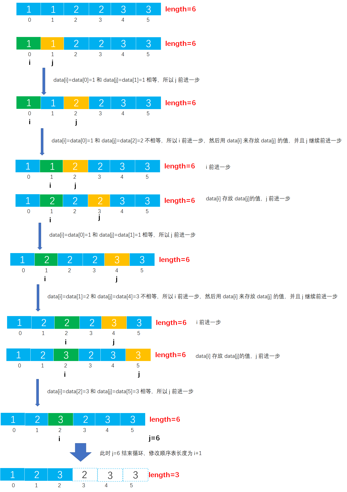

# Example025

## 题目

从有序顺序表中删除所有其值重复的元素，使表中所有元素的值均不同。

## 分析

本题考查的知识点：

- 顺序表
- 顺序表删除元素

**分析**：

- 本题中的顺序表是有序顺序表，所以所有的重复值元素是连续相邻的。
- 本题有两种解法，它们的时间复杂度都不一样，如下：
- 第一种解法，从头到尾扫描顺序表，比较顺序表中的相邻元素是否相等。如果相等则用后面的所有元素向前移动一位，并且顺序表长度减 1；如果不相等则继续比较顺序表的下一对相邻元素。
- 第二种解法，设定两个变量 `i` 和 `j` 都用来存放顺序表下标，其中 `i` 指向顺序表中非重复元素，而 `j` 从头到尾扫描顺序表（从第二个元素开始，初始时将第一个元素视为非重复元素）。之后依次判断 `i` 和 `j`
  所指向的元素是否相等，如果相等则 `j` 继续前进直到遇到不等的情况；如果不相等则让 `i` 加 1（因为初始第一个元素是非重复元素，所以要让下一个位置来存储非重复元素），然后存储 `j`
  所表示的非重复元素，直至判断道表尾为止。该解法的时间复杂度为 `O(n)`，推荐学习。

## 图解

解法一图解：


解法二图解：



## C实现

解法一核心代码：

```c
/**
 * 删除顺序表中连续重复的元素
 * @param list 有序顺序表
 */
void deleteRepeat(SeqList *list) {
    // 记录顺序表中元素的下标
    int i = 0;

    // 1.从头到尾扫描顺序表中所有元素，但注意由于要相邻元素比较是否相等，所以循环结束的条件是 i<list.length-1，如果是 i<list.length 则会超出边界报错
    while (i < list->length - 1) {
        // 1.1比较相邻元素是否相等
        if (list->data[i] == list->data[i + 1]) {
            // 1.1.1 如果相等则将后面的所有元素都向前移动一位，删除相邻元素
            for (int j = i; j < list->length - 1; j++) {// 注意结束条件是 j<list->length-1，而不是 j<list->length
                list->data[j] = list->data[j + 1];// 后面的元素覆盖前面的元素
            }
            // 1.1.2 删除元素后，记得将 length 属性减去 1
            list->length--;
        }
        // 1.2 如果不相等，则继续比较下一个元素，即将 i 变量指向顺序表的下一个元素
        else {
            i++;
        }
    }
}
```

解法二核心代码：

```c
/**
 * 删除顺序表中连续重复的元素
 * @param list 有序顺序表
 */
void deleteRepeat(SeqList *list) {
    // 变量，指向顺序表中非重复元素的下标，初始时将第一个元素视为非重复元素
    int i = 0;
    // 变量，从头到尾扫描顺序表，从第二个元素开始
    int j = 1;

    // 从头到尾扫描顺序表
    while (j < list->length) {
        // 如果 i 指向的元素与 j 指向的元素不相等
        if (list->data[i] != list->data[j]) {
            // 则变量 i 加 1，因为初始第一个元素已经被视为非重复元素了，所以要下一个位置来存放这个非重复元素 data[j]
            i++;
            // 让 i 位置来存放非重复元素 data[j]
            list->data[i] = list->data[j];
        }
        // 继续顺序表的下一个元素
        j++;
    }
    // 删除后，修改顺序表的 length，其中 i+1 就是非重复元素的个数
    list->length = i + 1;
}
```

完整代码：

```c
#include <stdio.h>

#define MAXSIZE 20
/**
 * 顺序表的结构体
 */
typedef struct {
    /**
     * 顺序表，实际上一个长度为 MAXSIZE 的数组，存储的数据类型为整型，当然可以设置为其他类型，但推荐使用宏定义类型，方便替换
     */
    int data[MAXSIZE];
    /**
     * 顺序表长度，即数组中实际元素个数
     */
    int length;
} SeqList;

/**
 * 初始化顺序表，仅需要将 length 置为 0 即可
 * @param list 待初始化的顺序表
 */
void init(SeqList *list) {
    // 仅需要将 length 置为 0 即可
    (*list).length = 0;
    // 或者可以用下面的语法
    // list->length=0;
}

/**
 * 直接添加新元素到顺序表的尾部
 * @param list 顺序表
 * @param ele 待添加的新元素
 * @return 如果插入成功则返回 1，否则返回 0
 */
int add(SeqList *list, int ele) {
    // 0.校验
    // 0.1 向顺序表中插入元素要检查顺序表是否已经满了，如果已经满了则不能再插入新元素则添加失败
    if (list->length == MAXSIZE) {
        return 0;
    }
    // 1.插入新元素
    // 1.1 直接获取顺序表的 length，然后将新元素的值赋予到 length 位置即可
    list->data[list->length] = ele;
    // 1.2 注意修改 length
    list->length++;
    return 1;
}

/**
 * 删除顺序表中连续重复的元素
 * @param list 有序顺序表
 */
void deleteRepeat(SeqList *list) {
    // 记录顺序表中元素的下标
    int i = 0;

    // 1.从头到尾扫描顺序表中所有元素，但注意由于要相邻元素比较是否相等，所以循环结束的条件是 i<list.length-1，如果是 i<list.length 则会超出边界报错
    while (i < list->length - 1) {
        // 1.1比较相邻元素是否相等
        if (list->data[i] == list->data[i + 1]) {
            // 1.1.1 如果相等则将后面的所有元素都向前移动一位，删除相邻元素
            for (int j = i; j < list->length - 1; j++) {// 注意结束条件是 j<list->length-1，而不是 j<list->length
                list->data[j] = list->data[j + 1];// 后面的元素覆盖前面的元素
            }
            // 1.1.2 删除元素后，记得将 length 属性减去 1
            list->length--;
        }
        // 1.2 如果不相等，则继续比较下一个元素，即将 i 变量指向顺序表的下一个元素
        else {
            i++;
        }
    }
}


/**
 * 打印顺序表
 * @param list 待打印的顺序表
 */
void print(SeqList list) {
    printf("[");
    for (int i = 0; i < list.length; i++) {
        printf("%d", list.data[i]);
        if (i != list.length - 1) {
            printf(", ");
        }
    }
    printf("]\n");
}

int main() {
    // 声明顺序表
    SeqList list;
    init(&list);
    // 添加测试数据
    add(&list, 1);
    add(&list, 1);
    add(&list, 2);
    add(&list, 2);
    add(&list, 3);
    add(&list, 3);
    print(list);

    // 调用函数进行删除
    deleteRepeat(&list);
    print(list);
}
```

执行结果：

```text
[1, 1, 2, 2, 3, 3]
[1, 2, 3]
```

## Java实现

核心代码：

```java
    /**
 * 删除顺序表中连续重复的元素
 */
public void deleteRepeat(){
        // 记录顺序表中元素的下标
        int i=0;
        // 从头到尾扫描顺序表中所有元素，但注意由于要相邻元素比较是否相等，所以循环结束的条件是 i<list.length-1，如果是 i<list.length 则会超出边界报错
        while(i<list.length-1){
        // 比较相邻元素是否相等
        if(list.data[i]==list.data[i+1]){
        // 如果相等则将后面的所有元素都向前移动一位，删除相邻元素
        for(int j=i;j<list.length-1;j++){
        list.data[j]=list.data[j+1];// 后面的元素覆盖前面的元素
        }
        // 删除元素后，记得将 length 属性减去 1
        list.length--;
        }else{
        // 如果不相等，则继续比较下一个元素，即将 i 变量指向顺序表的下一个元素
        i++;
        }
        }
        }
```

完整代码：

```java
public class SeqList {
    /**
     * 顺序表最大能存放元素个数
     */
    private final int MAXSIZE = 20;

    /**
     * 声明的顺序表，未初始化
     */
    private List list;

    /**
     * 初始化顺序表
     */
    public void init() {
        list = new List();
        // 指定数据数组长度为 MAXSIZE
        list.data = new int[MAXSIZE];
        // 但指定顺序表实际元素个数为 0
        list.length = 0;
    }

    /**
     * 直接添加新元素到顺序表的尾部
     *
     * @param ele 待插入的新元素
     */
    public void add(int ele) throws Exception {
        // 0.校验
        // 0.1 向顺序表中插入元素要检查顺序表是否已经满了，如果已经满了则不能再插入新元素则抛出异常
        if (list.length == MAXSIZE) {
            throw new Exception("顺序表已满，不能再插入了！");
        }
        // 1.插入新元素
        // 1.1 直接获取顺序表的 length，然后将新元素的值赋予到 length 位置即可
        list.data[list.length] = ele;
        // 1.2 注意修改 length
        list.length++;
    }

    /**
     * 删除顺序表中连续重复的元素
     */
    public void deleteRepeat() {
        // 记录顺序表中元素的下标
        int i = 0;
        // 从头到尾扫描顺序表中所有元素，但注意由于要相邻元素比较是否相等，所以循环结束的条件是 i<list.length-1，如果是 i<list.length 则会超出边界报错
        while (i < list.length - 1) {
            // 比较相邻元素是否相等
            if (list.data[i] == list.data[i + 1]) {
                // 如果相等则将后面的所有元素都向前移动一位，删除相邻元素
                for (int j = i; j < list.length - 1; j++) {
                    list.data[j] = list.data[j + 1];// 后面的元素覆盖前面的元素
                }
                // 删除元素后，记得将 length 属性减去 1
                list.length--;
            } else {
                // 如果不相等，则继续比较下一个元素，即将 i 变量指向顺序表的下一个元素
                i++;
            }
        }
    }

    /**
     * 打印顺序表
     */
    public void print() {
        String str = "[";
        for (int i = 0; i < list.length; i++) {
            str += list.data[i];
            if (i != list.length - 1) {
                str += ", ";
            }
        }
        str += "]";
        System.out.println(str);
    }
}

/**
 * 顺序表
 */
class List {
    /**
     * 数据域，保存数据的数组
     */
    int[] data;
    /**
     * 数组中实际元素个数
     */
    int length;
}
```

测试代码：

```java
public class SeqListTest {
    public static void main(String[] args) throws Exception {
        // 实例化顺序表对象
        SeqList list = new SeqList();
        list.init();
        // 为顺序表添加测试数据
        list.add(2);
        list.add(2);
        list.add(3);
        list.add(3);
        list.add(3);
        list.add(5);
        list.print();

        // 调用函数删除所有重复的元素
        list.deleteRepeat();
        list.print();
    }
}
```

执行结果：

```text
[2, 2, 3, 3, 3, 5]
[2, 3, 5]
```