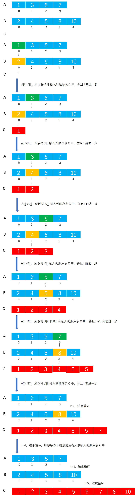

# Example026

## 题目

将两个有序顺序表合并为一个新的有序顺序表，并由函数返回结果顺序表。

## 分析

本题考查的知识点：

- 顺序表

**分析**：

- 算法思想：首先，按照顺序不断取下两个顺序表表头较小的节点存入新的顺序表中。
- 然后看哪个表还有剩余，将剩下的部分加到新的顺序表的后面。

## 图解



## C实现

核心代码：

```c
/**
 * 将两个有序顺序表合并为一个新的有序顺序表
 * @param A 第一个有序顺序表
 * @param B 第二个有序顺序表
 * @return 一个新的有序顺序表
 */
SeqList *merge(SeqList A, SeqList B) {
    // 并没有说是递增有序还是递减有序
    // 创建一个新的顺序表，用来存放合并后的顺序表元素，不必太关心下面创建顺序表 C 的代码，如果想要屏蔽掉这部分代码则可以将 C 作为参数传入
    SeqList list;
    SeqList *C = &list;
    C->length = A.length + B.length;

    // 变量，指向顺序表 A 中的元素
    int i = 0;
    // 变量，指向顺序表 B 中的元素
    int j = 0;
    // 变量，指向顺序表 C 中的元素
    int m = 0;

    // 同时循环扫描顺序表 A 和 B
    while (i < A.length && j < B.length) {
        // 两两比较，将小的结果存入顺序表 C 中
        if (A.data[i] > B.data[j]) {// A 中元素大于 B 中元素，所以将 B 中的元素存入顺序表 C，然后变量 m 和 j 都前移一步
            C->data[m] = B.data[j];
            m++;
            j++;
        } else if (A.data[i] < B.data[j]) {// A 中元素小于 B 中元素，所以将 A 中的元素存入顺序表 C，然后变量 m 和 i 都前移一步
            C->data[m] = A.data[i];
            m++;
            i++;
        } else {// A 中元素等于 B 中元素，所以将 A 中元素和 B 中元素都存入顺序表 C 中，i 和 j 都前移一步，注意 m 前移两步
            C->data[m] = A.data[i];
            m++;
            i++;
            C->data[m] = B.data[j];
            m++;
            j++;
        }
    }

    // 如果顺序表 A 还有剩余，则将剩余部分全部添加到顺序表 C 中
    while (i < A.length) {
        C->data[m] = A.data[i];
        m++;
        i++;
    }
    // 如果顺序表 B 还有剩余，则将剩余部分全部添加到顺序表 C 中
    while (j < B.length) {
        C->data[m] = B.data[j];
        m++;
        j++;
    }
    return C;
}
```

完整代码：

```c
#include <stdio.h>

#define MAXSIZE 20
/**
 * 顺序表的结构体
 */
typedef struct {
    /**
     * 顺序表，实际上一个长度为 MAXSIZE 的数组，存储的数据类型为整型，当然可以设置为其他类型，但推荐使用宏定义类型，方便替换
     */
    int data[MAXSIZE];
    /**
     * 顺序表长度，即数组中实际元素个数
     */
    int length;
} SeqList;

/**
 * 初始化顺序表，仅需要将 length 置为 0 即可
 * @param list 待初始化的顺序表
 */
void init(SeqList *list) {
    // 仅需要将 length 置为 0 即可
    (*list).length = 0;
    // 或者可以用下面的语法
    // list->length=0;
}

/**
 * 直接添加新元素到顺序表的尾部
 * @param list 顺序表
 * @param ele 待添加的新元素
 * @return 如果插入成功则返回 1，否则返回 0
 */
int add(SeqList *list, int ele) {
    // 0.校验
    // 0.1 向顺序表中插入元素要检查顺序表是否已经满了，如果已经满了则不能再插入新元素则添加失败
    if (list->length == MAXSIZE) {
        return 0;
    }
    // 1.插入新元素
    // 1.1 直接获取顺序表的 length，然后将新元素的值赋予到 length 位置即可
    list->data[list->length] = ele;
    // 1.2 注意修改 length
    list->length++;
    return 1;
}

/**
 * 将两个有序顺序表合并为一个新的有序顺序表
 * @param A 第一个有序顺序表
 * @param B 第二个有序顺序表
 * @return 一个新的有序顺序表
 */
SeqList *merge(SeqList A, SeqList B) {
    // 并没有说是递增有序还是递减有序
    // 创建一个新的顺序表，用来存放合并后的顺序表元素，不必太关心下面创建顺序表 C 的代码，如果想要屏蔽掉这部分代码则可以将 C 作为参数传入
    SeqList list;
    SeqList *C = &list;
    C->length = A.length + B.length;

    // 变量，指向顺序表 A 中的元素
    int i = 0;
    // 变量，指向顺序表 B 中的元素
    int j = 0;
    // 变量，指向顺序表 C 中的元素
    int m = 0;

    // 同时循环扫描顺序表 A 和 B
    while (i < A.length && j < B.length) {
        // 两两比较，将小的结果存入顺序表 C 中
        if (A.data[i] > B.data[j]) {// A 中元素大于 B 中元素，所以将 B 中的元素存入顺序表 C，然后变量 m 和 j 都前移一步
            C->data[m] = B.data[j];
            m++;
            j++;
        } else if (A.data[i] < B.data[j]) {// A 中元素小于 B 中元素，所以将 A 中的元素存入顺序表 C，然后变量 m 和 i 都前移一步
            C->data[m] = A.data[i];
            m++;
            i++;
        } else {// A 中元素等于 B 中元素，所以将 A 中元素和 B 中元素都存入顺序表 C 中，i 和 j 都前移一步，注意 m 前移两步
            C->data[m] = A.data[i];
            m++;
            i++;
            C->data[m] = B.data[j];
            m++;
            j++;
        }
    }

    // 如果顺序表 A 还有剩余，则将剩余部分全部添加到顺序表 C 中
    while (i < A.length) {
        C->data[m] = A.data[i];
        m++;
        i++;
    }
    // 如果顺序表 B 还有剩余，则将剩余部分全部添加到顺序表 C 中
    while (j < B.length) {
        C->data[m] = B.data[j];
        m++;
        j++;
    }
    return C;
}

/**
 * 打印顺序表
 * @param list 待打印的顺序表
 */
void print(SeqList list) {
    printf("[");
    for (int i = 0; i < list.length; i++) {
        printf("%d", list.data[i]);
        if (i != list.length - 1) {
            printf(", ");
        }
    }
    printf("]\n");
}

int main() {
    // 声明顺序表 A 并添加测试数据
    SeqList aList;
    init(&aList);
    add(&aList, 1);
    add(&aList, 3);
    add(&aList, 5);
    print(aList);

    // 声明顺序表 B 并添加测试数据
    SeqList bList;
    init(&bList);
    add(&bList, 2);
    add(&bList, 4);
    add(&bList, 6);
    add(&bList, 8);
    print(bList);

    // 调用函数合并顺序表
    SeqList *C = merge(aList, bList);
    print(*C);
}
```

执行结果：

```text
[1, 3, 5]
[2, 4, 6, 8]
[1, 2, 3, 4, 5, 6, 8]
```

## Java实现

核心代码：

```java
    /**
 * 合并两个有序顺序表
 *
 * @param A 第一个有序顺序表
 * @param B 第二个有序顺序表
 * @return 合并后的有序顺序表
 */
public SeqList merge(SeqList A,SeqList B){
        List aList=A.list;
        List bList=B.list;
        // 创建新链表用来存放合并后的元素，不必过于关心下面创建新顺序表的代码
        SeqList C=new SeqList();
        C.list=new List();
        C.list.data=new int[aList.length+bList.length];
        C.list.length=aList.length+bList.length;
        List cList=C.list;

        // 变量，记录顺序表 A 中元素的下标
        int i=0;
        // 变量，记录顺序表 B 中元素的下标
        int j=0;
        // 变量，记录顺序表 C 中元素的下标
        int m=0;
        // 同时扫描顺序表 A 和 B
        while(i<aList.length&&j<bList.length){
        // 如果顺序表 A 中的元素大于顺序表 B 中的元素
        if(aList.data[i]>bList.data[j]){
        // 则将顺序表 B 中的元素插入到顺序表 C 中
        cList.data[m]=bList.data[j];
        // 之后更新 m 和 j
        m++;
        j++;
        }
        // 如果顺序表 A 中的元素小于顺序表 B 中的元素
        else if(aList.data[i]<bList.data[j]){
        // 则将顺序表 A 中的元素插入到顺序表 C 中
        cList.data[m]=aList.data[i];
        // 之后更新 m 和 i
        m++;
        i++;
        }
        // 如果相等则将元素都插入到顺序表 C 中
        else{
        cList.data[m]=aList.data[i];
        m++;
        i++;
        cList.data[m]=bList.data[j];
        m++;
        j++;
        }
        }
        // 如果顺序表 A 还有剩余，则全部插入到顺序表 C 的尾部
        while(i<aList.length){
        cList.data[m]=aList.data[i];
        m++;
        i++;
        }
        // 如果顺序表 B 还有剩余，则全部插入到顺序表 C 的尾部
        while(j<bList.length){
        cList.data[m]=bList.data[j];
        m++;
        j++;
        }
        return C;
        }
```

完整代码：

```java
public class SeqList {
    /**
     * 顺序表最大能存放元素个数
     */
    private final int MAXSIZE = 20;

    /**
     * 声明的顺序表，未初始化
     */
    private List list;

    /**
     * 初始化顺序表
     */
    public void init() {
        list = new List();
        // 指定数据数组长度为 MAXSIZE
        list.data = new int[MAXSIZE];
        // 但指定顺序表实际元素个数为 0
        list.length = 0;
    }

    /**
     * 直接添加新元素到顺序表的尾部
     *
     * @param ele 待插入的新元素
     */
    public void add(int ele) throws Exception {
        // 0.校验
        // 0.1 向顺序表中插入元素要检查顺序表是否已经满了，如果已经满了则不能再插入新元素则抛出异常
        if (list.length == MAXSIZE) {
            throw new Exception("顺序表已满，不能再插入了！");
        }
        // 1.插入新元素
        // 1.1 直接获取顺序表的 length，然后将新元素的值赋予到 length 位置即可
        list.data[list.length] = ele;
        // 1.2 注意修改 length
        list.length++;
    }

    /**
     * 合并两个有序顺序表
     *
     * @param A 第一个有序顺序表
     * @param B 第二个有序顺序表
     * @return 合并后的有序顺序表
     */
    public SeqList merge(SeqList A, SeqList B) {
        List aList = A.list;
        List bList = B.list;
        // 创建新链表用来存放合并后的元素，不必过于关心下面创建新顺序表的代码
        SeqList C = new SeqList();
        C.list = new List();
        C.list.data = new int[aList.length + bList.length];
        C.list.length = aList.length + bList.length;
        List cList = C.list;

        // 变量，记录顺序表 A 中元素的下标
        int i = 0;
        // 变量，记录顺序表 B 中元素的下标
        int j = 0;
        // 变量，记录顺序表 C 中元素的下标
        int m = 0;
        // 同时扫描顺序表 A 和 B
        while (i < aList.length && j < bList.length) {
            // 如果顺序表 A 中的元素大于顺序表 B 中的元素
            if (aList.data[i] > bList.data[j]) {
                // 则将顺序表 B 中的元素插入到顺序表 C 中
                cList.data[m] = bList.data[j];
                // 之后更新 m 和 j
                m++;
                j++;
            }
            // 如果顺序表 A 中的元素小于顺序表 B 中的元素
            else if (aList.data[i] < bList.data[j]) {
                // 则将顺序表 A 中的元素插入到顺序表 C 中
                cList.data[m] = aList.data[i];
                // 之后更新 m 和 i
                m++;
                i++;
            }
            // 如果相等则将元素都插入到顺序表 C 中
            else {
                cList.data[m] = aList.data[i];
                m++;
                i++;
                cList.data[m] = bList.data[j];
                m++;
                j++;
            }
        }
        // 如果顺序表 A 还有剩余，则全部插入到顺序表 C 的尾部
        while (i < aList.length) {
            cList.data[m] = aList.data[i];
            m++;
            i++;
        }
        // 如果顺序表 B 还有剩余，则全部插入到顺序表 C 的尾部
        while (j < bList.length) {
            cList.data[m] = bList.data[j];
            m++;
            j++;
        }
        return C;
    }

    /**
     * 打印顺序表
     */
    public void print() {
        String str = "[";
        for (int i = 0; i < list.length; i++) {
            str += list.data[i];
            if (i != list.length - 1) {
                str += ", ";
            }
        }
        str += "]";
        System.out.println(str);
    }
}

/**
 * 顺序表
 */
class List {
    /**
     * 数据域，保存数据的数组
     */
    int[] data;
    /**
     * 数组中实际元素个数
     */
    int length;
}
```

测试代码：

```java
public class SeqListTest {
    public static void main(String[] args) throws Exception {
        // 实例化顺序表 A 并为顺序表添加测试数据
        SeqList aList = new SeqList();
        aList.init();
        aList.add(1);
        aList.add(3);
        aList.add(5);
        aList.add(7);
        aList.print();

        // 实例化顺序表 B 并为顺序表添加测试数据
        SeqList bList = new SeqList();
        bList.init();
        bList.add(2);
        bList.add(4);
        bList.add(6);
        bList.add(8);
        bList.print();

        // 调用函数合并顺序表
        SeqList list = new SeqList();
        SeqList mergeList = list.merge(aList, bList);
        mergeList.print();
    }
}
```

执行结果：

```text
[1, 3, 5, 7]
[2, 4, 6, 8]
[1, 2, 3, 4, 5, 6, 7, 8]
```