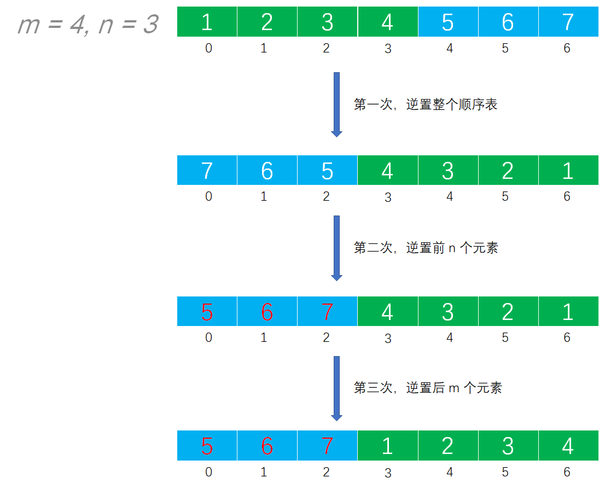

# Example027

## 题目

已知在一维数组 `A[m+n]` 中依次存放两个线性表 `(a1, a2, a3, ..., am)` 和 `(b1, b2, b3, ..., bn)`。编写一个函数，将数组中两个顺序表的位置交换，即将 `(b1, b2, b3, ..., bn)` 放在 `(a1, a2, a3, ..., am)` 的前面。

## 分析

本题考查的知识点：
- 顺序表
- 逆置顺序表

**分析**：
- 算法思想：将数组 `A[m+n]` 中的全部元素 `[a1, a2, a3, ..., am, b1, b2, b3, ..., bn]` 原地逆置为 `[bn, b(n-1), b(n-2), ..., b1, am, a(m-1), a(m-2), ..., a1]`，再对前 n 个元素和后 m 个元素分别使用逆置算法，即可得到 `[b1, b2, b3, ..., bn, a1, a2, a3, ..., am]`，从而实现顺序表的位置互换。

## 图解



## C实现

核心代码：

```c
/**
 * 逆置指定范围 [start, end] 内的数组元素
 * @param arr 数组
 * @param start 起始下标，包括本身
 * @param end 结束下标，包括本身
 */
void swap(int arr[], int start, int end) {
    for (int i = 0; i < (end - start + 1) / 2; i++) {
        int temp = arr[start + i];
        arr[start + i] = arr[end - i];
        arr[end - i] = temp;
    }
}

/**
 * 交换顺序表前 m 个元素的位置与后 n 个元素的位置
 * @param A 顺序表
 * @param m 前半部分元素个数
 * @param n 后半部分元素个数
 */
void exchange(int A[], int m, int n) {
    // 第一次逆置整个顺序表
    swap(A, 0, m + n - 1);
    // 第二次逆置前 n 个元素
    swap(A, 0, n - 1);
    // 第三次逆置后 m 个元素
    swap(A, n, m + n - 1);
}
```

完整代码：

```c
#include <stdio.h>

/**
 * 逆置指定范围 [start, end] 内的数组元素
 * @param arr 数组
 * @param start 起始下标，包括本身
 * @param end 结束下标，包括本身
 */
void swap(int arr[], int start, int end) {
    for (int i = 0; i < (end - start + 1) / 2; i++) {
        int temp = arr[start + i];
        arr[start + i] = arr[end - i];
        arr[end - i] = temp;
    }
}

/**
 * 交换顺序表前 m 个元素的位置与后 n 个元素的位置
 * @param A 顺序表
 * @param m 前半部分元素个数
 * @param n 后半部分元素个数
 */
void exchange(int A[], int m, int n) {
    // 第一次逆置整个顺序表
    swap(A, 0, m + n - 1);
    // 第二次逆置前 n 个元素
    swap(A, 0, n - 1);
    // 第三次逆置后 m 个元素
    swap(A, n, m + n - 1);
}

/**
 * 打印数组
 * @param arr 数组
 * @param n 数组长度
 */
void print(int arr[], int n) {
    printf("[");
    for (int i = 0; i < n; i++) {
        printf("%d", arr[i]);
        if (i != n - 1) {
            printf(", ");
        }
    }
    printf("]\n");
}

int main() {
    int A[] = {1, 2, 3, 4, 5, 6, 7};
    int m = 4;
    int n = 3;
    print(A, m + n);

    // 调用函数交换位置
    exchange(A, m, n);
    print(A, m + n);
}
```

执行结果：

```text
[1, 2, 3, 4, 5, 6, 7]
[5, 6, 7, 1, 2, 3, 4]
```

## Java实现

核心代码：

```java
    /**
     * 将数组中后 n 个元素与前 n 个元素交换位置
     *
     * @param arr 指定数组
     * @param m   前 m 个元素组成的线性表
     * @param n   后 n 个元素组成的线性表
     */
    public static void exchange(int[] arr, int m, int n) {
        // 第一次逆置整个顺序表
        swap(arr, 0, m + n - 1);
        // 第二次逆置前 n 个元素
        swap(arr, 0, n - 1);
        // 第三次逆置后 m 个元素
        swap(arr, n, m + n - 1);
    }

    /**
     * 逆置数组中 [start, end] 中的所有元素
     *
     * @param arr   指定数组
     * @param start 起始索引，包含本身
     * @param end   结束索引，包含本身
     */
    private static void swap(int[] arr, int start, int end) {
        while (start < end) {
            int temp = arr[start];
            arr[start] = arr[end];
            arr[end] = temp;
            start++;
            end--;
        }
    }
```

完整代码：

```java
public class Test {
    public static void main(String[] args) throws Exception {
        int[] A = new int[]{1, 2, 3, 4, 5, 6, 7};
        int m = 4;
        int n = 3;
        System.out.println(Arrays.toString(A));

        // 调用函数进行交换
        exchange(A, m, n);
        System.out.println(Arrays.toString(A));
    }

    /**
     * 将数组中后 n 个元素与前 n 个元素交换位置
     *
     * @param arr 指定数组
     * @param m   前 m 个元素组成的线性表
     * @param n   后 n 个元素组成的线性表
     */
    public static void exchange(int[] arr, int m, int n) {
        // 第一次逆置整个顺序表
        swap(arr, 0, m + n - 1);
        // 第二次逆置前 n 个元素
        swap(arr, 0, n - 1);
        // 第三次逆置后 m 个元素
        swap(arr, n, m + n - 1);
    }

    /**
     * 逆置数组中 [start, end] 中的所有元素
     *
     * @param arr   指定数组
     * @param start 起始索引，包含本身
     * @param end   结束索引，包含本身
     */
    private static void swap(int[] arr, int start, int end) {
        while (start < end) {
            int temp = arr[start];
            arr[start] = arr[end];
            arr[end] = temp;
            start++;
            end--;
        }
    }
}
```


执行结果：

```text
[1, 2, 3, 4, 5, 6, 7]
[5, 6, 7, 1, 2, 3, 4]
```