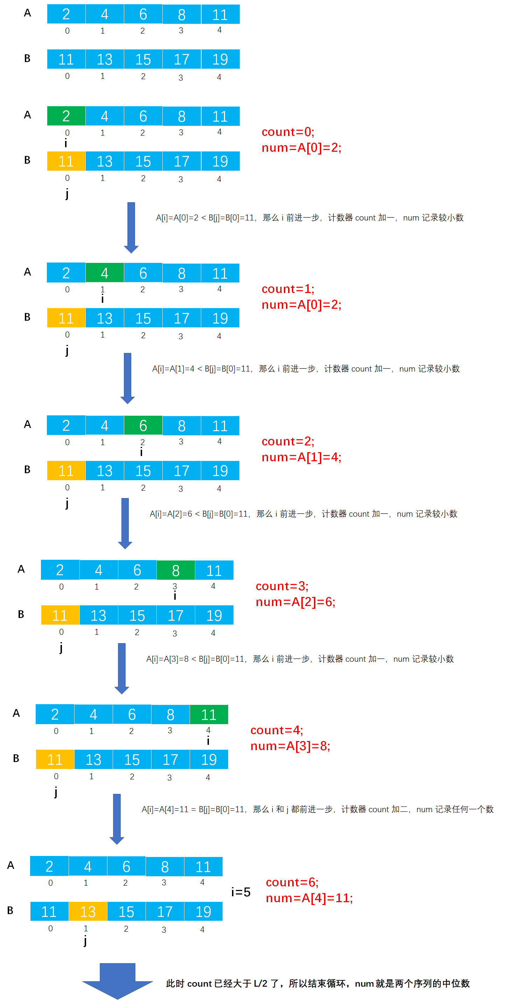

# Example029

## 题目

一个长度为 L（`L>=1`）的升序序列 S，处在第 `┌L/2┐` 个位置的数称为 S 的中位数。例如，若序列 `S1=(11, 13, 15, 17, 19)`，则 S1 的中位数是
15，两个序列的中位数是含它们所有元素的升序序列的中位数。例如，`S2=(2, 4, 6, 8, 20)`，则 S1 和 S2 的中位数是 11。现在有两个等长升序序列 A 和
B，试设计一个在时间和空间两方面都尽可能高效的算法，找出两个序列 A 和 B 的中位数。

## 分析

**分析**：

- 如果序列的元素个数是奇数（如 `S1=(1, 3, 5, 7, 9)`）则中位数是第 `(L+1)/2` 位置（即向上取整）上的数（如 `(L+1)/2=(5+1)/2=3`，即数 5）。
- 如果序列的元素个数是偶数（如 `S1=(2, 4, 6, 8, 11, 13, 15, 17, 19, 20)`）则中位数是第 `L/2` 位置上的数（如 `L/2=10/2=5`，即数 11）。
- 本题的第一种解法的算法思想：因为是升序序列，两个序列合并后长度是 `2L`，我们边扫描边比较并且计数，只需要比较 `L` 次就可以得到中位数，时间复杂度为 `O(n)`。
- 本题的第二种解法是书上所写的解法，时间复杂度为 `O(log₂n)`
  ，因为涉及二分查找的思想所以理解比较困难，下面仅提供代码做参考。推荐阅读 [（详解）11年真题：求两个序列合并后的的中位数](https://blog.csdn.net/holly_Z_P_F/article/details/106352037)。

## 图解

解法一图解：



## C实现

解法一核心代码：

```c
/**
 * 求序列 A 和 B 的中位数
 *
 * @param A 第一个递增序列
 * @param B 第二个递增序列
 * @param n 数组长度，两个序列的长度相等
 * @return 两个序列的中位数
 */
int getMedian(int A[], int B[], int n) {
    // 变量，用来记录中位数，不必在意将 A 数组第一个数设为初始中位数
    int num = A[0];
    // 变量，从头到尾扫描序列 A，记录元素下标
    int i = 0;
    // 变量，从头到尾扫描序列 B，记录元素下标
    int j = 0;
    // 变量，计数器，记录已经扫描过的元素个数
    int count = 0;

    // 同时扫描序列 A 和 B
    while (i < n && j < n) {
        // 比较大小
        if (A[i] < B[j]) {
            // 将其中较小的元素置为中位数，同时 i 前移一个，并且计数器加 1
            num = A[i];
            i++;
            count++;
        } else if (A[i] > B[j]) {
            // 将其中较小的元素置为中位数，同时 j 前移一个，并且计数器加 1
            num = B[j];
            j++;
            count++;
        } else {
            // 如果相等则将任意一个元素置为中位数即可，同时 i 和 j 都前移一个，并且计数器加 2
            num = A[i];
            i++;
            count++;
            j++;
            count++;
        }

        // 如果找到第 L 个数，则表示该数是中位数，跳出循环，并返回结果
        if (count >= (n + n) / 2) {// 为什么要大于等于 L/2，因为恰好可能两个元素相等，两个元素都是中位数，最后 count 就会大于 L/2，而不是等于
            break;
        }
    }
    return num;
}
```

解法二核心代码：

```c 
/**
 * 算法的基本思想：
 * 分别求两个升序序列 A 和 B 的中位数，设为 a 和 b，求序列 A 和 B 的中位数的过程如下：
 * ① 若 a = b，则 a 或 b 即为所求中位数，算法结束。
 * ② 若 a < b，则舍弃序列 A 中较小的一半，同时舍弃序列 B 中较大的一半，要求两次舍弃的长度相等。
 * ③ 若 a < b，则舍弃序列 A 中较大的一半，同时舍弃序列 B 中较小的一半，要求两次舍弃的长度相等。
 * 在保留的两个升序序列中，重复过程①、②、③，直到两个序列中钧只含有一个元素时为止，较小者即为所求的中位数。
 */

/**
 * 求序列 A 和 B 的中位数
 *
 * @param A 第一个递增序列
 * @param B 第二个递增序列
 * @param n 数组长度，两个序列的长度相等
 * @return 两个序列的中位数
 */
int getMedian(int A[], int B[], int n) {
    // 分别表示序列 A 和 B 的首位数、末位数和中位数
    int s1 = 0, d1 = n - 1, m1, s2 = 0, d2 = n - 1, m2;
    while (s1 != d1 || s2 != d2) {
        m1 = (s1 + d1) / 2;
        m2 = (s2 + d2) / 2;
        if (A[m1] == B[m2]) {// 满足条件①
            return A[m1];
        }
        if (A[m1] < B[m2]) {// 满足条件②
            if ((s1 + d1) % 2 == 0) {// 若元素个数为奇数
                s1 = m1;// 舍弃 A 中间点以前的部分且保留中间点
                d2 = m2;// 舍弃 B 中间点以后的部分且保留中间点
            } else {// 若元素个数为偶数
                s1 = m1 + 1;// 舍弃 A 中间点及中间点以前的部分
                d2 = m2;// 舍弃 B 中间点以后部分并且保留中间点
            }
        } else {// 满足条件③
            if ((s2 + d2) % 2 == 0) {// 若元素个数为奇数
                d1 = m1;// 舍弃 A 中间点以后的部分且保留中间点
                d2 = m2;// 舍弃 B 中间点以前的部分且保留中间点
            } else {// 若元素个数为偶数
                d1 = m1;// 舍弃 A 中间点以后的部分且保留中间点
                d2 = m2 + 1;// 舍弃 B 中间点及中间点以前的部分
            }
        }
    }
    // 返回剩下的两个数中较小的一个
    return A[s1] < B[s2] ? A[s1] : B[s2];
}
```

完整代码：

```c
#include <stdio.h>

/**
 * 求序列 A 和 B 的中位数
 *
 * @param A 第一个递增序列
 * @param B 第二个递增序列
 * @param n 数组长度，两个序列的长度相等
 * @return 两个序列的中位数
 */
int getMedian(int A[], int B[], int n) {
    // 变量，用来记录中位数，不必在意将 A 数组第一个数设为初始中位数
    int num = A[0];
    // 变量，从头到尾扫描序列 A，记录元素下标
    int i = 0;
    // 变量，从头到尾扫描序列 B，记录元素下标
    int j = 0;
    // 变量，计数器，记录已经扫描过的元素个数
    int count = 0;

    // 同时扫描序列 A 和 B
    while (i < n && j < n) {
        // 比较大小
        if (A[i] < B[j]) {
            // 将其中较小的元素置为中位数，同时 i 前移一个，并且计数器加 1
            num = A[i];
            i++;
            count++;
        } else if (A[i] > B[j]) {
            // 将其中较小的元素置为中位数，同时 j 前移一个，并且计数器加 1
            num = B[j];
            j++;
            count++;
        } else {
            // 如果相等则将任意一个元素置为中位数即可，同时 i 和 j 都前移一个，并且计数器加 2
            num = A[i];
            i++;
            count++;
            j++;
            count++;
        }

        // 如果找到第 L 个数，则表示该数是中位数，跳出循环，并返回结果
        if (count >= (n + n) / 2) {// 为什么要大于等于 L/2，因为恰好可能两个元素相等，两个元素都是中位数，最后 count 就会大于 L/2，而不是等于
            break;
        }
    }
    return num;
}

int main() {
    int A[] = {2, 4, 6, 8, 11};
    int B[] = {11, 13, 15, 17, 19};
    int n = 5;

    // 调用函数，计算中位数
    int median = getMedian(A, B, n);
    printf("中位数：%d\n", median);
}
```

执行结果：

```text
中位数：11
```

## Java实现

核心代码：

```java
    /**
 * 求序列 A 和 B 的中位数
 *
 * @param A 第一个递增序列
 * @param B 第二个递增序列
 * @param n 数组长度，两个序列的长度相等
 * @return 两个序列的中位数
 */
private static int getMedian(int[]A,int[]B,int n){
        // 变量，用来记录中位数，不必在意将 A 数组第一个数设为初始中位数
        int num=A[0];
        // 变量，从头到尾扫描序列 A，记录元素下标
        int i=0;
        // 变量，从头到尾扫描序列 B，记录元素下标
        int j=0;
        // 变量，计数器，记录已经扫描过的元素个数
        int count=0;

        // 同时扫描序列 A 和 B
        while(i<n &&j<n){
        // 比较大小
        if(A[i]<B[j]){
        // 将其中较小的元素置为中位数，同时 i 前移一个，并且计数器加 1
        num=A[i];
        i++;
        count++;
        }else if(A[i]>B[j]){
        // 将其中较小的元素置为中位数，同时 j 前移一个，并且计数器加 1
        num=B[j];
        j++;
        count++;
        }else{
        // 如果相等则将任意一个元素置为中位数即可，同时 i 和 j 都前移一个，并且计数器加 2
        num=A[i];
        i++;
        count++;
        j++;
        count++;
        }

        // 如果找到第 L 个数，则表示该数是中位数，跳出循环，并返回结果
        if(count>=(n+n)/2){// 为什么要大于等于 L/2，因为恰好可能两个元素相等，两个元素都是中位数，最后 count 就会大于 L/2，而不是等于
        break;
        }
        }
        return num;
        }
```

完整代码：

```java
public class Test {
    public static void main(String[] args) throws Exception {
        int[] A = new int[]{2, 4, 6, 8, 11};
        int[] B = new int[]{11, 13, 15, 17, 19};

        // 调用函数，计算中位数
        int median = getMedian(A, B, A.length);
        System.out.println("中位数：" + median);
    }

    /**
     * 求序列 A 和 B 的中位数
     *
     * @param A 第一个递增序列
     * @param B 第二个递增序列
     * @param n 数组长度，两个序列的长度相等
     * @return 两个序列的中位数
     */
    private static int getMedian(int[] A, int[] B, int n) {
        // 变量，用来记录中位数，不必在意将 A 数组第一个数设为初始中位数
        int num = A[0];
        // 变量，从头到尾扫描序列 A，记录元素下标
        int i = 0;
        // 变量，从头到尾扫描序列 B，记录元素下标
        int j = 0;
        // 变量，计数器，记录已经扫描过的元素个数
        int count = 0;

        // 同时扫描序列 A 和 B
        while (i < n && j < n) {
            // 比较大小
            if (A[i] < B[j]) {
                // 将其中较小的元素置为中位数，同时 i 前移一个，并且计数器加 1
                num = A[i];
                i++;
                count++;
            } else if (A[i] > B[j]) {
                // 将其中较小的元素置为中位数，同时 j 前移一个，并且计数器加 1
                num = B[j];
                j++;
                count++;
            } else {
                // 如果相等则将任意一个元素置为中位数即可，同时 i 和 j 都前移一个，并且计数器加 2
                num = A[i];
                i++;
                count++;
                j++;
                count++;
            }

            // 如果找到第 L 个数，则表示该数是中位数，跳出循环，并返回结果
            if (count >= (n + n) / 2) {// 为什么要大于等于 L/2，因为恰好可能两个元素相等，两个元素都是中位数，最后 count 就会大于 L/2，而不是等于
                break;
            }
        }
        return num;
    }
}
```

执行结果：

```text
中位数：11
```