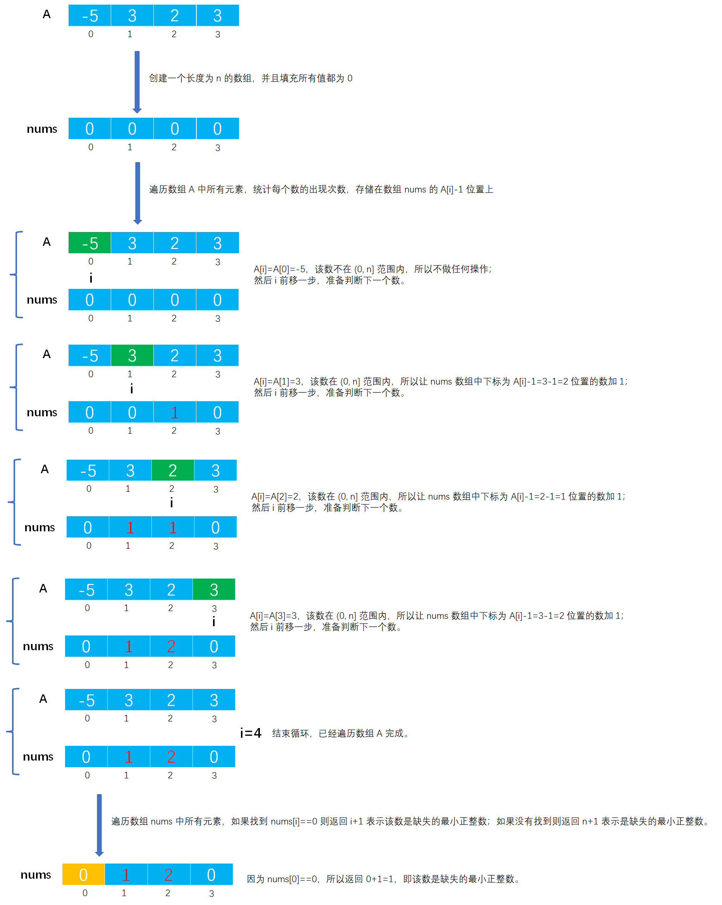

# Example030

## 题目

给定一个含 n（`n>=1`）个整数的数组，请设计一个在时间上尽可能高效的算法，找出数组中未出现的最小正整数。例如，数组 `{-5, 3, 2, 3}` 中未出现的最小正整数是 1；数组 `{1, 2, 3}` 中未出现的最小正整数是 4。


## 分析

**解法一分析**：

第一种解法，循环 `[1, n]` 之间的所有数，判断它们在数组 A 中的出现次数，如果出现 0 次，那么表示该数正是缺失的最小正整数；如果循环完成仍没有找到，则返回 `n+1` 是缺失的最小正整数。

**解法二分析**：

第二种解法，时间复杂度更低，采用了空间换时间的办法。分配一个长度为 `n` 的数组 nums，用来记录 A 中是否出现了 1~n 中的正整数的出现次数，其中 `nums[0]` 存储正整数 1 在数组 A 中的出现次数，`nums[n-1]` 存储正整数 n 在数组 A 中的出现次数。由于 A 中含有 n 个整数，所以返回的最小正整数困难是 1~n+1，当 A 中 n 个数恰好为 1~n 则返回 n+1（如 `A = [1, 2, 3]` 则返回 4）。但注意只统计大于 0 并且小于等于 n 的数值，而其他数值如负数、零、大于 n 的数没有任何意义就不采取操作。注意，也可以创建长度为 `n+1` 的数组，然后 `nums[1]` 存储正整数 1 的出现次数，`nums[n]` 存储正整数 n 的出现次数。

因此算法流程如下：
- 先创建一个长度为 `n` 的数组，填充数组初始值为 0，方便进行计数。
- 接着从头到尾遍历数组 A，如果 `0<A[i]<=n` 则让 `nums[A[i]-1]++`，否则不做任何操作。
- 对 A 遍历完成后，遍历数组 nums，如果找到第一个满足 `nums[i]==0` 的下标 i，则返回　`i+1` 表示缺失的最小正整数；如果 nums[i] 全部都大于 0，则返回 `n+1`（其实这时候 `i+1` 也等于 `n+1`，所以返回 `i+1` 也是可行的），说明 A 中从未出现的最小正整数是 `n+1`。

其实本题的解法还是很多的，但时间复杂度可能就不如人意了。更多解法请参考[Leetcode-41.缺失的第一个正数的2种解法](https://leetcode-cn.com/problems/first-missing-positive/solution/41que-shi-de-di-yi-ge-zheng-shu-de-2chon-5i3o/)。


## 图解

解法二图解：




## C实现

解法一核心代码：

```c
/**
 * 找出数组中未出现的最小正整数
 *
 * @param A 包含 n（n>=1） 个整数的数组
 * @param n 数组长度
 * @return 数组中未出现的最小正整数
 */
int minPositiveInteger(int A[], int n) {
    // 从 [1, n] 判断所有数是否在数组中出现
    for (int i = 1; i <= n; i++) {
        // 统计 i 在数组中的出现次数
        int count = 0;
        // 从头到尾扫描数组中所有元素
        for (int j = 0; j < n; j++) {
            // 统计 i 在数组中的出现次数
            if (i == A[j]) {
                count++;
            }
        }
        // 如果出现次数为 0，表示 i 就是在数组中未出现的最小正整数
        if (count == 0) {
            return i;
        }
    }
    // 如果都没有，则数组中未出现的最小正整数就是 n+1，如 {1, 2, 3}
    return n + 1;
}
```

解法二核心代码：

```c 
/**
 * 找出数组中未出现的最小正整数
 *
 * @param A 包含 n（n>=1） 个整数的数组
 * @param n 数组长度
 * @return 数组中未出现的最小正整数
 */
int minPositiveInteger(int A[], int n) {
    // 创建长度为 n 的数组，然后将所有值都填充为 0
    int nums[n];
    for (int i = 0; i < n; i++) {
        nums[i] = 0;
    }

    // 遍历数组 A 中所有元素
    for (int i = 0; i < n; i++) {
        // 如果 A[i] 在 (0, n] 范围内，则让 nums 数组中下标为 A[i]-1 的位置中的计数器加 1
        if (A[i] > 0 && A[i] <= n) {
            nums[A[i] - 1]++;
        }
    }

    // 遍历数组 nums 中所有元素
    for (int i = 0; i < n; i++) {
        // 判断是否有元素等于 0，如果有则表示找到缺失的最小正整数 i+1
        if (nums[i] == 0) {
            return i + 1;
        }
    }
    // 如果 nums[i] 全部大于 0，则返回 n+1 是缺失的最小正整数
    return n + 1;
}
```

完整代码：

```c
#include <stdio.h>

/**
 * 找出数组中未出现的最小正整数
 *
 * @param A 包含 n（n>=1） 个整数的数组
 * @param n 数组长度
 * @return 数组中未出现的最小正整数
 */
int minPositiveInteger(int A[], int n) {
    // 创建长度为 n 的数组，然后将所有值都填充为 0
    int nums[n];
    for (int i = 0; i < n; i++) {
        nums[i] = 0;
    }

    // 遍历数组 A 中所有元素
    for (int i = 0; i < n; i++) {
        // 如果 A[i] 在 (0, n] 范围内，则让 nums 数组中下标为 A[i]-1 的位置中的计数器加 1
        if (A[i] > 0 && A[i] <= n) {
            nums[A[i] - 1]++;
        }
    }

    // 遍历数组 nums 中所有元素
    for (int i = 0; i < n; i++) {
        // 判断是否有元素等于 0，如果有则表示找到缺失的最小正整数 i+1
        if (nums[i] == 0) {
            return i + 1;
        }
    }
    // 如果 nums[i] 全部大于 0，则返回 n+1 是缺失的最小正整数
    return n + 1;
}

int main() {
    int A[] = {2, 4, 6, 8};
    int n = 4;

    // 调用函数，计算中位数
    int min = minPositiveInteger(A, n);
    printf("最小正整数：%d\n", min);
}
```

执行结果：

```text
最小正整数：1
```

## Java实现

解法一核心代码：

```java
    /**
     * 找出数组中未出现的最小正整数
     *
     * @param A 包含 n（n>=1） 个整数的数组
     * @param n 数组长度
     * @return 数组中未出现的最小正整数
     */
    public static int minPositiveInteger(int[] A, int n) {
        // 从 [1, n] 判断所有数是否在数组中出现
        for (int i = 1; i <= n; i++) {
            // 统计 i 在数组中的出现次数
            int count = 0;
            // 从头到尾扫描数组中所有元素
            for (int j = 0; j < n; j++) {
                // 统计 i 在数组中的出现次数
                if (i == A[j]) {
                    count++;
                }
            }
            // 如果出现次数为 0，表示 i 就是在数组中未出现的最小正整数
            if (count == 0) {
                return i;
            }
        }
        // 如果都没有，则数组中未出现的最小正整数就是 n+1，如 {1, 2, 3}
        return n + 1;
    }
```

解法二核心代码：

```java
    /**
     * 找出数组中未出现的最小正整数
     *
     * @param A 包含 n（n>=1） 个整数的数组
     * @param n 数组长度
     * @return 数组中未出现的最小正整数
     */
    public static int minPositiveInteger(int[] A, int n) {
        // 创建长度为 n 的数组，然后将所有值都填充为 0
        int[] nums = new int[n];
        for (int i = 0; i < n; i++) {
            nums[i] = 0;
        }

        // 遍历数组 A 中所有元素
        for (int i = 0; i < n; i++) {
            // 如果 A[i] 在 (0, n] 范围内，则让 nums 数组中下标为 A[i]-1 的位置中的计数器加 1
            if (A[i] > 0 && A[i] <= n) {
                nums[A[i] - 1]++;
            }
        }

        // 遍历数组 nums 中所有元素
        for (int i = 0; i < n; i++) {
            // 判断是否有元素等于 0，如果有则表示找到缺失的最小正整数 i+1
            if (nums[i] == 0) {
                return i + 1;
            }
        }
        // 如果 nums[i] 全部大于 0，则返回 n+1 是缺失的最小正整数
        return n + 1;
    }
```

完整代码：

```java
public class Test {
    public static void main(String[] args) {
        int[] A = new int[]{-5, 3, 2, 3};

        // 调用函数找最小正整数
        int min = minPositiveInteger(A, A.length);
        System.out.println(Arrays.toString(A));
        System.out.println("最小正整数：" + min);
    }

    /**
     * 找出数组中未出现的最小正整数
     *
     * @param A 包含 n（n>=1） 个整数的数组
     * @param n 数组长度
     * @return 数组中未出现的最小正整数
     */
    public static int minPositiveInteger(int[] A, int n) {
        // 创建长度为 n 的数组，然后将所有值都填充为 0
        int[] nums = new int[n];
        for (int i = 0; i < n; i++) {
            nums[i] = 0;
        }

        // 遍历数组 A 中所有元素
        for (int i = 0; i < n; i++) {
            // 如果 A[i] 在 (0, n] 范围内，则让 nums 数组中下标为 A[i]-1 的位置中的计数器加 1
            if (A[i] > 0 && A[i] <= n) {
                nums[A[i] - 1]++;
            }
        }

        // 遍历数组 nums 中所有元素
        for (int i = 0; i < n; i++) {
            // 判断是否有元素等于 0，如果有则表示找到缺失的最小正整数 i+1
            if (nums[i] == 0) {
                return i + 1;
            }
        }
        // 如果 nums[i] 全部大于 0，则返回 n+1 是缺失的最小正整数
        return n + 1;
    }
}
```

执行结果：

```text
[-5, 3, 2, 3]
最小正整数：1
```