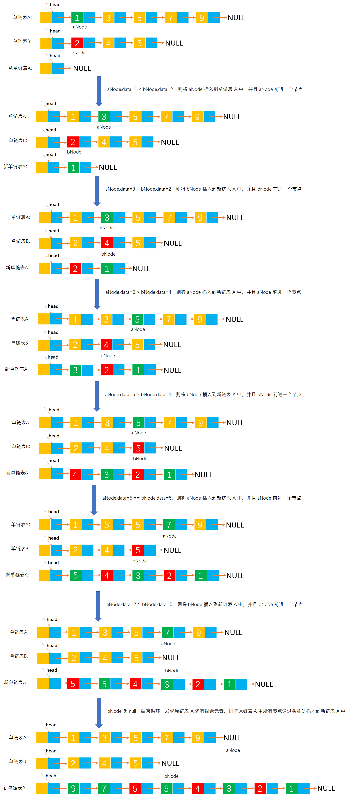

# Example033

## 题目

假设有两个按元素值递增次序排列的线性表，均以单链表形式存储。请编写算法将这两个单链表归并为一个按元素值递减次序排列的单链表，并要求利用原来两个单链表的节点存放归并后的单链表。

## 分析

本题考查的知识点：
- 单链表
- 头插法创建单链表

如链表 `A = [1, 3, 5]`，链表 `B=[2, 3, 6, 8]`，归并后的单链表是 `[8, 6, 5, 3, 3, 2, 1]`。

算法思想是：同时扫描单链表 A 和 B，比较正在扫描的单链表节点元素值，使用头插法（因为要求链表按元素值递减次序排列）插入两个元素中值较小的元素。比较结束后，可能会有一个链表为空，所以此时要用头插法将剩下的节点依次插入到新链表中。

## 图解

> 注：之所以有下面两幅图，只是区分下当链表 A 和 B 中出现元素值相同节点的处理。处理都是一样的，只是代码行数多少不同而已，下面 C 和 Java 代码分别对应这两种处理，不必在乎使用哪种处理，自己喜欢用哪种都行。

如果链表 A 和 B 中存在节点元素值相同的情况，则将这两个节点都插入到新链表 A 中：


如果链表 A 和 B 中存在节点元素值相同的情况，则将原链表 A 中的节点插入到新链表 A 中：




## C实现

核心代码：

```c
/**
 * 归并两个元素递增的单链表
 * @param A 第一个单链表，但会将归并后的元素保存在该链表中。之所以是 **A 是因为要修改链表 B
 * @param B 第二个单链表
 */
void merge(LNode **A, LNode *B) {
    // 链表 A 和 B 的第一个节点
    LNode *aNode = (*A)->next;
    LNode *bNode = B->next;

    // 初始化链表 A（已经分配了空间），所以只需要将头结点的 next 指向 null。因为我们打算将归并后的元素保存到链表 A 中
    (*A)->next = NULL;

    // 同时扫描原链表 A 和 B
    while (aNode != NULL && bNode != NULL) {
        // 如果链表 A 的当前节点的元素值小于链表 B 的当前节点的元素值
        if (aNode->data < bNode->data) {
            LNode *temp = aNode->next;// 临时保存当前节点的后继节点。因为要将 aNode 节点插入到链表 A 中，会修改 aNode 的 next 指针指向，所以才需要临时保存它的后继节点

            // 则将小的节点通过头插法插入到链表 A 中
            aNode->next = (*A)->next;
            (*A)->next = aNode;

            aNode = temp;// 继续链表 A 的下一个节点
        }
        // 如果链表 A 的当前节点的元素值大于链表 B 的当前节点的元素值
        else if (aNode->data > bNode->data) {
            LNode *temp = bNode->next;

            // 则将小的节点通过头插法插入到链表 A 中
            bNode->next = (*A)->next;
            (*A)->next = bNode;

            bNode = temp;// 继续链表 B 的下一个节点
        }
        // 如果链表 A 的当前节点的元素值等于链表 B 的当前节点的元素值，那么将这两个节点都插入到链表 A 中
        else {
            LNode *temp = aNode->next;
            aNode->next = (*A)->next;
            (*A)->next = aNode;
            aNode = temp;

            temp = bNode->next;
            bNode->next = (*A)->next;
            (*A)->next = bNode;
            bNode = temp;
        }
    }

    // 如果链表 A 还有剩余元素，则将剩余的所有元素通过头插法插入到链表 A 中
    while (aNode != NULL) {
        LNode *temp = aNode->next;

        aNode->next = (*A)->next;
        (*A)->next = aNode;

        aNode = temp;
    }

    // 如果链表 B 还有剩余元素，则将剩余的所有元素通过头插法插入到链表 A 中
    while (bNode != NULL) {
        LNode *temp = bNode->next;

        bNode->next = (*A)->next;
        (*A)->next = bNode;

        bNode = temp;
    }
}
```

完整代码：

```c
#include <stdio.h>
#include <malloc.h>

/**
 * 单链表节点
 */
typedef struct LNode {
    /**
     * 单链表节点的数据域
     */
    int data;
    /**
     * 单链表节点的的指针域，指向当前节点的后继节点
     */
    struct LNode *next;
} LNode;

/**
 * 通过尾插法创建单链表
 * @param list 单链表
 * @param nums 创建单链表时插入的数据数组
 * @param n 数组长度
 * @return 创建好的单链表
 */
LNode *createByTail(LNode **list, int nums[], int n) {
    // 1.初始化单链表
    // 创建链表必须要先初始化链表，也可以选择直接调用 init() 函数
    *list = (LNode *) malloc(sizeof(LNode));
    (*list)->next = NULL;

    // 尾插法，必须知道链表的尾节点（即链表的最后一个节点），初始时，单链表的头结点就是尾节点
    // 因为在单链表中插入节点我们必须知道前驱节点，而头插法中的前驱节点一直是头节点，但尾插法中要在单链表的末尾插入新节点，所以前驱节点一直都是链表的最后一个节点，而链表的最后一个节点由于链表插入新节点会一直变化
    LNode *node = (*list);

    // 2.循环数组，将所有数依次插入到链表的尾部
    for (int i = 0; i < n; i++) {
        // 2.1 创建新节点，并指定数据域和指针域
        // 2.1.1 创建新节点，为其分配空间
        LNode *newNode = (LNode *) malloc(sizeof(LNode));
        // 2.1.2 为新节点指定数据域
        newNode->data = nums[i];
        // 2.1.3 为新节点指定指针域，新节点的指针域初始时设置为 null
        newNode->next = NULL;

        // 2.2 将新节点插入到单链表的尾部
        // 2.2.1 将链表原尾节点的 next 指针指向新节点
        node->next = newNode;
        // 2.2.2 将新节点置为新的尾节点
        node = newNode;
    }
    return *list;
}

/**
 * 归并两个元素递增的单链表
 * @param A 第一个单链表，但会将归并后的元素保存在该链表中。之所以是 **A 是因为要修改链表 B
 * @param B 第二个单链表
 */
void merge(LNode **A, LNode *B) {
    // 链表 A 和 B 的第一个节点
    LNode *aNode = (*A)->next;
    LNode *bNode = B->next;

    // 初始化链表 A（已经分配了空间），所以只需要将头结点的 next 指向 null。因为我们打算将归并后的元素保存到链表 A 中
    (*A)->next = NULL;

    // 同时扫描原链表 A 和 B
    while (aNode != NULL && bNode != NULL) {
        // 如果链表 A 的当前节点的元素值小于链表 B 的当前节点的元素值
        if (aNode->data < bNode->data) {
            LNode *temp = aNode->next;// 临时保存当前节点的后继节点。因为要将 aNode 节点插入到链表 A 中，会修改 aNode 的 next 指针指向，所以才需要临时保存它的后继节点

            // 则将小的节点通过头插法插入到链表 A 中
            aNode->next = (*A)->next;
            (*A)->next = aNode;

            aNode = temp;// 继续链表 A 的下一个节点
        }
        // 如果链表 A 的当前节点的元素值大于链表 B 的当前节点的元素值
        else if (aNode->data > bNode->data) {
            LNode *temp = bNode->next;

            // 则将小的节点通过头插法插入到链表 A 中
            bNode->next = (*A)->next;
            (*A)->next = bNode;

            bNode = temp;// 继续链表 B 的下一个节点
        }
        // 如果链表 A 的当前节点的元素值等于链表 B 的当前节点的元素值，那么将这两个节点都插入到链表 A 中
        else {
            LNode *temp = aNode->next;
            aNode->next = (*A)->next;
            (*A)->next = aNode;
            aNode = temp;

            temp = bNode->next;
            bNode->next = (*A)->next;
            (*A)->next = bNode;
            bNode = temp;
        }
    }

    // 如果链表 A 还有剩余元素，则将剩余的所有元素通过头插法插入到链表 A 中
    while (aNode != NULL) {
        LNode *temp = aNode->next;

        aNode->next = (*A)->next;
        (*A)->next = aNode;

        aNode = temp;
    }

    // 如果链表 B 还有剩余元素，则将剩余的所有元素通过头插法插入到链表 A 中
    while (bNode != NULL) {
        LNode *temp = bNode->next;

        bNode->next = (*A)->next;
        (*A)->next = bNode;

        bNode = temp;
    }
}

/**
 * 打印链表的所有节点
 * @param list 单链表
 */
void print(LNode *list) {
    printf("[");
    // 链表的第一个节点
    LNode *node = list->next;
    // 循环单链表所有节点，打印值
    while (node != NULL) {
        printf("%d", node->data);
        if (node->next != NULL) {
            printf(", ");
        }
        node = node->next;
    }
    printf("]\n");
}

int main() {
    // 声明单链表 A
    LNode *A;
    int aNums[] = {1, 3, 5};
    int an = 3;
    createByTail(&A, aNums, an);
    print(A);
    // 声明单链表 B
    LNode *B;
    int bNums[] = {2, 3, 6, 8};
    int bn = 4;
    createByTail(&B, bNums, bn);
    print(B);

    // 调用函数，拆分链表
    merge(&A, B);
    print(A);
}
```

执行结果：

```text
[1, 3, 5]
[2, 3, 6, 8]
[8, 6, 5, 3, 3, 2, 1]
```

注意：在数据结构题目中更倾向于使用 `*&` 引用来修改单链表，而不是使用指向指针的指针 `**`。尽管那属于 C++ 中的知识。

```c++
#include <stdio.h>
#include <malloc.h>

/**
 * 单链表节点
 */
typedef struct LNode {
    /**
     * 单链表节点的数据域
     */
    int data;
    /**
     * 单链表节点的的指针域，指向当前节点的后继节点
     */
    struct LNode *next;
} LNode;

/**
 * 通过尾插法创建单链表
 * @param list 单链表
 * @param nums 创建单链表时插入的数据数组
 * @param n 数组长度
 * @return 创建好的单链表
 */
LNode *createByTail(LNode *&list, int nums[], int n) {
    // 1.初始化单链表
    // 创建链表必须要先初始化链表，也可以选择直接调用 init() 函数
    list = (LNode *) malloc(sizeof(LNode));
    list->next = NULL;

    // 尾插法，必须知道链表的尾节点（即链表的最后一个节点），初始时，单链表的头结点就是尾节点
    // 因为在单链表中插入节点我们必须知道前驱节点，而头插法中的前驱节点一直是头节点，但尾插法中要在单链表的末尾插入新节点，所以前驱节点一直都是链表的最后一个节点，而链表的最后一个节点由于链表插入新节点会一直变化
    LNode *node = list;

    // 2.循环数组，将所有数依次插入到链表的尾部
    for (int i = 0; i < n; i++) {
        // 2.1 创建新节点，并指定数据域和指针域
        // 2.1.1 创建新节点，为其分配空间
        LNode *newNode = (LNode *) malloc(sizeof(LNode));
        // 2.1.2 为新节点指定数据域
        newNode->data = nums[i];
        // 2.1.3 为新节点指定指针域，新节点的指针域初始时设置为 null
        newNode->next = NULL;

        // 2.2 将新节点插入到单链表的尾部
        // 2.2.1 将链表原尾节点的 next 指针指向新节点
        node->next = newNode;
        // 2.2.2 将新节点置为新的尾节点
        node = newNode;
    }
    return list;
}

/**
 * 归并两个元素递增的单链表
 * @param A 第一个单链表，但会将归并后的元素保存在该链表中。之所以是 **A 是因为要修改链表 B
 * @param B 第二个单链表
 */
void merge(LNode *&A, LNode *B) {
    // 链表 A 和 B 的第一个节点
    LNode *aNode = A->next;
    LNode *bNode = B->next;

    // 初始化链表 A（已经分配了空间），所以只需要将头结点的 next 指向 null。因为我们打算将归并后的元素保存到链表 A 中
    A->next = NULL;

    // 同时扫描原链表 A 和 B
    while (aNode != NULL && bNode != NULL) {
        // 如果链表 A 的当前节点的元素值小于链表 B 的当前节点的元素值
        if (aNode->data < bNode->data) {
            LNode *temp = aNode->next;// 临时保存当前节点的后继节点。因为要将 aNode 节点插入到链表 A 中，会修改 aNode 的 next 指针指向，所以才需要临时保存它的后继节点

            // 则将小的节点通过头插法插入到链表 A 中
            aNode->next = A->next;
            A->next = aNode;

            aNode = temp;// 继续链表 A 的下一个节点
        }
        // 如果链表 A 的当前节点的元素值大于链表 B 的当前节点的元素值
        else if (aNode->data > bNode->data) {
            LNode *temp = bNode->next;

            // 则将小的节点通过头插法插入到链表 A 中
            bNode->next = A->next;
            A->next = bNode;

            bNode = temp;// 继续链表 B 的下一个节点
        }
        // 如果链表 A 的当前节点的元素值等于链表 B 的当前节点的元素值，那么将这两个节点都插入到链表 A 中
        else {
            LNode *temp = aNode->next;
            aNode->next = A->next;
            A->next = aNode;
            aNode = temp;

            temp = bNode->next;
            bNode->next = A->next;
            A->next = bNode;
            bNode = temp;
        }
    }

    // 如果链表 A 还有剩余元素，则将剩余的所有元素通过头插法插入到链表 A 中
    while (aNode != NULL) {
        LNode *temp = aNode->next;

        aNode->next = A->next;
        A->next = aNode;

        aNode = temp;
    }

    // 如果链表 B 还有剩余元素，则将剩余的所有元素通过头插法插入到链表 A 中
    while (bNode != NULL) {
        LNode *temp = bNode->next;

        bNode->next = A->next;
        A->next = bNode;

        bNode = temp;
    }
}

/**
 * 打印链表的所有节点
 * @param list 单链表
 */
void print(LNode *list) {
    printf("[");
    // 链表的第一个节点
    LNode *node = list->next;
    // 循环单链表所有节点，打印值
    while (node != NULL) {
        printf("%d", node->data);
        if (node->next != NULL) {
            printf(", ");
        }
        node = node->next;
    }
    printf("]\n");
}

int main() {
    // 声明单链表 A
    LNode *A;
    int aNums[] = {1, 3, 5};
    int an = 3;
    createByTail(A, aNums, an);
    print(A);
    // 声明单链表 B
    LNode *B;
    int bNums[] = {2, 3, 6, 8};
    int bn = 4;
    createByTail(B, bNums, bn);
    print(B);

    // 调用函数，拆分链表
    merge(A, B);
    print(A);
}
```

## Java实现

核心代码：

```java
    /**
     * 合并两个链表
     *
     * @param A 第一个链表，将合并后的元素全部保存到该链表中
     * @param B 第二个链表
     */
    public void merge(LinkedList A, LinkedList B) {
        // A.list 和 B.list 分别表示链表 A 和 B 的头结点
        // A.list.next 和 B.list.next 分别表示链表 A 和 B 的第一个节点
        LNode aNode = A.list.next;
        LNode bNode = B.list.next;

        // 将链表 A 的头结点的 next 指向 null，表示原链表 A 已经是一个新的空链表
        A.list.next = null;

        // 从头到尾同时扫描链表 A 和 B
        while (aNode != null && bNode != null) {
            // 比较正在遍历的链表 A 和 B 中的节点的元素值，将其中元素值小的节点通过头插法插入到新链表 A 中
            // 其实两个节点值相等的情况可以放到大于或者小于中处理，不必单独列出
            if (aNode.data <= bNode.data) {// 如果链表 A 中的节点元素值更小，则将 A 中的节点插入到新链表 A 中
                LNode temp = aNode.next;// 临时保存 aNode 的后继节点

                // 将节点 aNode 通过头插法插入到新链表 A 中
                aNode.next = A.list.next;
                A.list.next = aNode;

                aNode = temp;// 继续原链表 A 中的下一个节点，其实就是 aNode=aNode.next，但因为上面插入代码要修改 aNode 的 next，所以要先将 aNode.next 保存到 temp 中
            } else {// 如果链表 B 中的节点元素值更小，则将 B 中的节点插入到新链表 A 中
                LNode temp = bNode.next;

                // 将节点 bNode 通过头插法插入到新链表 A 中
                bNode.next = A.list.next;
                A.list.next = bNode;

                bNode = temp;
            }
        }

        // 如果原链表 A 还有剩余节点，则全部插入到新链表 A 中
        while (aNode != null) {
            LNode temp = aNode.next;

            aNode.next = A.list.next;
            A.list.next = aNode;

            aNode = temp;
        }

        // 如果链表 B 还有剩余节点，则全部插入到新链表 A 中
        while (bNode != null) {
            LNode temp = bNode.next;

            bNode.next = A.list.next;
            A.list.next = bNode;

            bNode = temp;
        }
    }
```

完整代码：

```java
public class LinkedList {
    /**
     * 单链表
     */
    private LNode list;

    /**
     * 通过尾插法创建单链表
     *
     * @param nums 创建单链表时插入的数据
     * @return 创建好的单链表
     */
    public LNode createByTail(int... nums) {
        // 1.初始化单链表
        // 创建链表必须要先初始化链表，也可以选择直接调用 init() 函数
        list = new LNode();
        list.next = null;

        // 尾插法，必须知道链表的尾节点（即链表的最后一个节点），初始时，单链表的头结点就是尾节点
        // 因为在单链表中插入节点我们必须知道前驱节点，而头插法中的前驱节点一直是头节点，但尾插法中要在单链表的末尾插入新节点，所以前驱节点一直都是链表的最后一个节点，而链表的最后一个节点由于链表插入新节点会一直变化
        LNode tailNode = list;

        // 2.循环数组，将所有数依次插入到链表的尾部
        for (int i = 0; i < nums.length; i++) {
            // 2.1 创建新节点，并指定数据域和指针域
            // 2.1.1 创建新节点，为其分配空间
            LNode newNode = new LNode();
            // 2.1.2 为新节点指定数据域
            newNode.data = nums[i];
            // 2.1.3 为新节点指定指针域，新节点的指针域初始时设置为 null
            newNode.next = null;

            // 2.2 将新节点插入到单链表的尾部
            // 2.2.1 将链表原尾节点的 next 指针指向新节点
            tailNode.next = newNode;
            // 2.2.2 将新节点置为新的尾节点
            tailNode = newNode;
        }

        return list;
    }

    /**
     * 合并两个链表
     *
     * @param A 第一个链表，将合并后的元素全部保存到该链表中
     * @param B 第二个链表
     */
    public void merge(LinkedList A, LinkedList B) {
        // A.list 和 B.list 分别表示链表 A 和 B 的头结点
        // A.list.next 和 B.list.next 分别表示链表 A 和 B 的第一个节点
        LNode aNode = A.list.next;
        LNode bNode = B.list.next;

        // 将链表 A 的头结点的 next 指向 null，表示原链表 A 已经是一个新的空链表
        A.list.next = null;

        // 从头到尾同时扫描链表 A 和 B
        while (aNode != null && bNode != null) {
            // 比较正在遍历的链表 A 和 B 中的节点的元素值，将其中元素值小的节点通过头插法插入到新链表 A 中
            // 其实两个节点值相等的情况可以放到大于或者小于中处理，不必单独列出
            if (aNode.data <= bNode.data) {// 如果链表 A 中的节点元素值更小，则将 A 中的节点插入到新链表 A 中
                LNode temp = aNode.next;// 临时保存 aNode 的后继节点

                // 将节点 aNode 通过头插法插入到新链表 A 中
                aNode.next = A.list.next;
                A.list.next = aNode;

                aNode = temp;// 继续原链表 A 中的下一个节点，其实就是 aNode=aNode.next，但因为上面插入代码要修改 aNode 的 next，所以要先将 aNode.next 保存到 temp 中
            } else {// 如果链表 B 中的节点元素值更小，则将 B 中的节点插入到新链表 A 中
                LNode temp = bNode.next;

                // 将节点 bNode 通过头插法插入到新链表 A 中
                bNode.next = A.list.next;
                A.list.next = bNode;

                bNode = temp;
            }
        }

        // 如果原链表 A 还有剩余节点，则全部插入到新链表 A 中
        while (aNode != null) {
            LNode temp = aNode.next;

            aNode.next = A.list.next;
            A.list.next = aNode;

            aNode = temp;
        }

        // 如果链表 B 还有剩余节点，则全部插入到新链表 A 中
        while (bNode != null) {
            LNode temp = bNode.next;

            bNode.next = A.list.next;
            A.list.next = bNode;

            bNode = temp;
        }
    }

    /**
     * 打印单链表所有节点
     */
    public void print() {
        // 链表的第一个节点
        LNode node = list.next;
        // 循环打印
        String str = "[";
        while (node != null) {
            // 拼接节点的数据域
            str += node.data;
            // 只要不是最后一个节点，那么就在每个节点的数据域后面添加一个分号，用于分隔字符串
            if (node.next != null) {
                str += ", ";
            }
            // 继续链表的下一个节点
            node = node.next;
        }
        str += "]";
        // 打印链表
        System.out.println(str);
    }
}

/**
 * 单链表的节点
 */
class LNode {
    /**
     * 链表的数据域，暂时指定为 int 类型，因为 Java 支持泛型，可以指定为泛型，就能支持更多的类型了
     */
    int data;
    /**
     * 链表的指针域，指向该节点的下一个节点
     */
    LNode next;
}
```

测试代码：

```java
public class LinkedListTest {
    public static void main(String[] args) {
        // 创建单链表 A
        LinkedList A = new LinkedList();
        A.createByTail(1, 3, 5, 7, 9);
        A.print();
        // 创建单链表 B
        LinkedList B = new LinkedList();
        B.createByTail(2, 4, 5);
        B.print();

        // 调用函数，合并链表
        LinkedList list = new LinkedList();
        list.merge(A, B);
        A.print();// 打印合并后的链表 A
    }
}
```

执行结果：

```text
[1, 3, 5, 7, 9]
[2, 4, 5]
[9, 7, 5, 5, 4, 3, 2, 1]
```