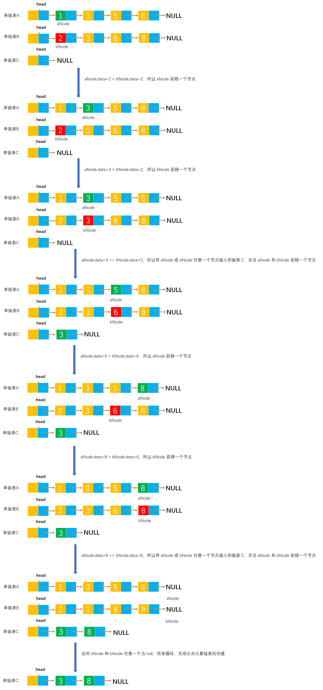

# Example034

## 题目

设 A 和 B 是两个单链表（带头结点），其中元素递增有序。设计一个算法从 A 和 B 中的公共元素产生单链表 C，要求不破坏 A、B 的结点。


## 分析

本题考查的知识点：

- 单链表
- 尾插法创建单链表


算法思想：单链表 A 和 B 都是有序的，可以从链表的第一个元素起依次比较 A 和 B 两个表的元素。若元素值不等，则值较小的指针往后移动；若元素值相等，则创建一个值等于两节点的元素值的新节点，使用尾插法插入到新链表中，并且将两个原表 A 和 B 指针后移一位，直到其中一个链表遍历到链表尾。


注意：不需要关注任何一个链表还有剩余元素的情况，因为剩余的元素一定不会与扫描完成的链表中的元素有相等的情况出现。因为链表元素是有序递增的。


## 图解




## C实现

核心代码：

```c
/**
 * 从链表 A 和 B 的公共元素产生链表 C
 * @param A 第一个单链表
 * @param B 第二个单链表
 * @return 带有公共元素的单链表 C
 */
LNode *commonElements(LNode *A, LNode *B) {
    // 创建单链表 C，初始化头结点，并且头结点的 next 指向 null
    LNode *C = (LNode *) malloc(sizeof(LNode));
    C->next = NULL;
    // 变量，记录链表 C 的尾节点，方便插入
    LNode *cTailNode = C;

    // 变量，链表 A 和 B 的第一个结点
    LNode *aNode = A->next;
    LNode *bNode = B->next;

    // 同时扫描链表 A 和 B
    while (aNode != NULL && bNode != NULL) {
        // 比较链表节点的元素值大小，将其中元素值小的节点前移
        if (aNode->data < bNode->data) {
            aNode = aNode->next;
        } else if (aNode->data > bNode->data) {
            bNode = bNode->next;
        } else {// 如果两个节点的元素值相等，则表示该节点是公共元素，则插入到链表 C 中
            // 创建新节点并赋予指针域和数据域
            LNode *newNode = (LNode *) malloc(sizeof(LNode));
            newNode->data = aNode->data;
            newNode->next = NULL;
            // 将新节点插入到链表 C 的尾部
            cTailNode->next = newNode;
            cTailNode = newNode;
            // aNode 和 bNode 同时前移一个结点
            aNode = aNode->next;
            bNode = bNode->next;
        }
    }

    return C;
}
```

完整代码：

```c
#include <stdio.h>
#include <malloc.h>

/**
 * 单链表节点
 */
typedef struct LNode {
    /**
     * 单链表节点的数据域
     */
    int data;
    /**
     * 单链表节点的的指针域，指向当前节点的后继节点
     */
    struct LNode *next;
} LNode;

/**
 * 通过尾插法创建单链表
 * @param list 单链表
 * @param nums 创建单链表时插入的数据数组
 * @param n 数组长度
 * @return 创建好的单链表
 */
LNode *createByTail(LNode **list, int nums[], int n) {
    // 1.初始化单链表
    // 创建链表必须要先初始化链表，也可以选择直接调用 init() 函数
    *list = (LNode *) malloc(sizeof(LNode));
    (*list)->next = NULL;

    // 尾插法，必须知道链表的尾节点（即链表的最后一个节点），初始时，单链表的头结点就是尾节点
    // 因为在单链表中插入节点我们必须知道前驱节点，而头插法中的前驱节点一直是头节点，但尾插法中要在单链表的末尾插入新节点，所以前驱节点一直都是链表的最后一个节点，而链表的最后一个节点由于链表插入新节点会一直变化
    LNode *node = (*list);

    // 2.循环数组，将所有数依次插入到链表的尾部
    for (int i = 0; i < n; i++) {
        // 2.1 创建新节点，并指定数据域和指针域
        // 2.1.1 创建新节点，为其分配空间
        LNode *newNode = (LNode *) malloc(sizeof(LNode));
        // 2.1.2 为新节点指定数据域
        newNode->data = nums[i];
        // 2.1.3 为新节点指定指针域，新节点的指针域初始时设置为 null
        newNode->next = NULL;

        // 2.2 将新节点插入到单链表的尾部
        // 2.2.1 将链表原尾节点的 next 指针指向新节点
        node->next = newNode;
        // 2.2.2 将新节点置为新的尾节点
        node = newNode;
    }
    return *list;
}

/**
 * 从链表 A 和 B 的公共元素产生链表 C
 * @param A 第一个单链表
 * @param B 第二个单链表
 * @return 带有公共元素的单链表 C
 */
LNode *commonElements(LNode *A, LNode *B) {
    // 创建单链表 C，初始化头结点，并且头结点的 next 指向 null
    LNode *C = (LNode *) malloc(sizeof(LNode));
    C->next = NULL;
    // 变量，记录链表 C 的尾节点，方便插入
    LNode *cTailNode = C;

    // 变量，链表 A 和 B 的第一个结点
    LNode *aNode = A->next;
    LNode *bNode = B->next;

    // 同时扫描链表 A 和 B
    while (aNode != NULL && bNode != NULL) {
        // 比较链表节点的元素值大小，将其中元素值小的节点前移
        if (aNode->data < bNode->data) {
            aNode = aNode->next;
        } else if (aNode->data > bNode->data) {
            bNode = bNode->next;
        } else {// 如果两个节点的元素值相等，则表示该节点是公共元素，则插入到链表 C 中
            // 创建新节点并赋予指针域和数据域
            LNode *newNode = (LNode *) malloc(sizeof(LNode));
            newNode->data = aNode->data;
            newNode->next = NULL;
            // 将新节点插入到链表 C 的尾部
            cTailNode->next = newNode;
            cTailNode = newNode;
            // aNode 和 bNode 同时前移一个结点
            aNode = aNode->next;
            bNode = bNode->next;
        }
    }

    return C;
}

/**
 * 打印链表的所有节点
 * @param list 单链表
 */
void print(LNode *list) {
    printf("[");
    // 链表的第一个节点
    LNode *node = list->next;
    // 循环单链表所有节点，打印值
    while (node != NULL) {
        printf("%d", node->data);
        if (node->next != NULL) {
            printf(", ");
        }
        node = node->next;
    }
    printf("]\n");
}

int main() {
    // 声明单链表 A
    LNode *A;
    int aNums[] = {1, 3, 5, 8};
    int an = 4;
    createByTail(&A, aNums, an);
    print(A);
    // 声明单链表 B
    LNode *B;
    int bNums[] = {2, 3, 6, 8};
    int bn = 4;
    createByTail(&B, bNums, bn);
    print(B);

    // 调用函数，计算两个链表的公共元素
    LNode *C = commonElements(A, B);
    print(C);
}
```

执行结果：

```text
[1, 3, 5, 8]
[2, 3, 6, 8]
[3, 8]
```


## Java实现

核心代码：

```java
    /**
     * 从链表 A 和 B 的公共元素产生链表 C
     *
     * @param A 第一个单链表
     * @param B 第二个单链表
     * @return 带有公共元素的单链表 C
     */
    public LinkedList commonElements(LinkedList A, LinkedList B) {
        // 创建单链表 C，初始化头结点，并且头结点的 next 指向 null
        LinkedList C = new LinkedList();
        C.list = new LNode();
        C.list.next = null;
        // 变量，记录链表 C 的尾节点，方便插入
        LNode cTailNode = C.list;

        // 变量，链表 A 和 B 的第一个结点
        LNode aNode = A.list.next;
        LNode bNode = B.list.next;

        // 同时扫描链表 A 和 B
        while (aNode != null && bNode != null) {
            // 比较链表节点的元素值大小，将其中元素值小的节点前移
            if (aNode.data < bNode.data) {
                aNode = aNode.next;
            } else if (aNode.data > bNode.data) {
                bNode = bNode.next;
            } else {// 如果两个节点的元素值相等，则表示该节点是公共元素，则插入到链表 C 中
                // 创建新节点并赋予指针域和数据域
                LNode newNode = new LNode();
                newNode.data = aNode.data;
                newNode.next = null;
                // 将新节点插入到链表 C 的尾部
                cTailNode.next = newNode;
                cTailNode = newNode;
                // aNode 和 bNode 同时前移一个结点
                aNode = aNode.next;
                bNode = bNode.next;
            }
        }

        return C;
    }
```

完整代码：

```java
public class LinkedList {
    /**
     * 单链表
     */
    private LNode list;

    /**
     * 通过尾插法创建单链表
     *
     * @param nums 创建单链表时插入的数据
     * @return 创建好的单链表
     */
    public LNode createByTail(int... nums) {
        // 1.初始化单链表
        // 创建链表必须要先初始化链表，也可以选择直接调用 init() 函数
        list = new LNode();
        list.next = null;

        // 尾插法，必须知道链表的尾节点（即链表的最后一个节点），初始时，单链表的头结点就是尾节点
        // 因为在单链表中插入节点我们必须知道前驱节点，而头插法中的前驱节点一直是头节点，但尾插法中要在单链表的末尾插入新节点，所以前驱节点一直都是链表的最后一个节点，而链表的最后一个节点由于链表插入新节点会一直变化
        LNode tailNode = list;

        // 2.循环数组，将所有数依次插入到链表的尾部
        for (int i = 0; i < nums.length; i++) {
            // 2.1 创建新节点，并指定数据域和指针域
            // 2.1.1 创建新节点，为其分配空间
            LNode newNode = new LNode();
            // 2.1.2 为新节点指定数据域
            newNode.data = nums[i];
            // 2.1.3 为新节点指定指针域，新节点的指针域初始时设置为 null
            newNode.next = null;

            // 2.2 将新节点插入到单链表的尾部
            // 2.2.1 将链表原尾节点的 next 指针指向新节点
            tailNode.next = newNode;
            // 2.2.2 将新节点置为新的尾节点
            tailNode = newNode;
        }

        return list;
    }

    /**
     * 从链表 A 和 B 的公共元素产生链表 C
     *
     * @param A 第一个单链表
     * @param B 第二个单链表
     * @return 带有公共元素的单链表 C
     */
    public LinkedList commonElements(LinkedList A, LinkedList B) {
        // 创建单链表 C，初始化头结点，并且头结点的 next 指向 null
        LinkedList C = new LinkedList();
        C.list = new LNode();
        C.list.next = null;
        // 变量，记录链表 C 的尾节点，方便插入
        LNode cTailNode = C.list;

        // 变量，链表 A 和 B 的第一个结点
        LNode aNode = A.list.next;
        LNode bNode = B.list.next;

        // 同时扫描链表 A 和 B
        while (aNode != null && bNode != null) {
            // 比较链表节点的元素值大小，将其中元素值小的节点前移
            if (aNode.data < bNode.data) {
                aNode = aNode.next;
            } else if (aNode.data > bNode.data) {
                bNode = bNode.next;
            } else {// 如果两个节点的元素值相等，则表示该节点是公共元素，则插入到链表 C 中
                // 创建新节点并赋予指针域和数据域
                LNode newNode = new LNode();
                newNode.data = aNode.data;
                newNode.next = null;
                // 将新节点插入到链表 C 的尾部
                cTailNode.next = newNode;
                cTailNode = newNode;
                // aNode 和 bNode 同时前移一个结点
                aNode = aNode.next;
                bNode = bNode.next;
            }
        }

        return C;
    }

    /**
     * 打印单链表所有节点
     */
    public void print() {
        // 链表的第一个节点
        LNode node = list.next;
        // 循环打印
        String str = "[";
        while (node != null) {
            // 拼接节点的数据域
            str += node.data;
            // 只要不是最后一个节点，那么就在每个节点的数据域后面添加一个分号，用于分隔字符串
            if (node.next != null) {
                str += ", ";
            }
            // 继续链表的下一个节点
            node = node.next;
        }
        str += "]";
        // 打印链表
        System.out.println(str);
    }
}

/**
 * 单链表的节点
 */
class LNode {
    /**
     * 链表的数据域，暂时指定为 int 类型，因为 Java 支持泛型，可以指定为泛型，就能支持更多的类型了
     */
    int data;
    /**
     * 链表的指针域，指向该节点的下一个节点
     */
    LNode next;
}
```

测试代码：

```java
public class LinkedListTest {
    public static void main(String[] args) {
        // 创建单链表 A
        LinkedList A = new LinkedList();
        A.createByTail(1, 3, 5, 7, 9);
        A.print();
        // 创建单链表 B
        LinkedList B = new LinkedList();
        B.createByTail(2, 4, 5, 7, 10);
        B.print();

        // 调用函数，计算公共元素
        LinkedList list = new LinkedList();
        LinkedList C = list.commonElements(A, B);
        C.print();// 打印合并后的链表 C
    }
}
```

执行结果：

```text
[1, 3, 5, 7, 9]
[2, 4, 5, 7, 10]
[5, 7]
```