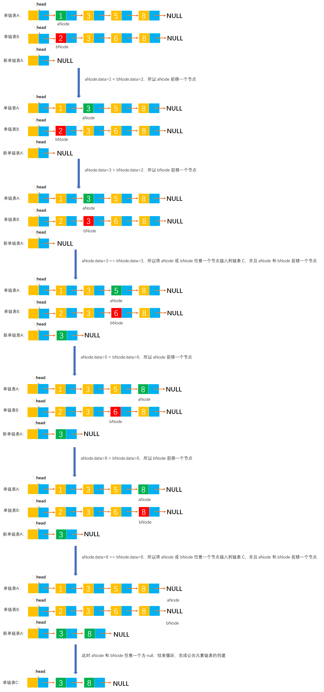

# Example035

## 题目

已知两个链表 A 和 B 分别表示两个集合，其元素递增排列。编写函数，求 A 与 B 的交集，并存放于 A 链表中。


## 分析

本题考查的知识点：
- 单链表
- 尾插法创建单链表
- 归并算法

算法思想：采用归并的思想，设置两个工作指针 `aNode` 和 `bNode`，对两个链表 A 和 B 进行归并扫描，只有同时出现在两个集合中的元素才插入到新链表 A 中，其他节点都释放掉。当一个链表遍历完毕后释放剩余的所有结点。

注意，本题与 **Example034** 题是一样的，只是本题中产生的交集是保存在链表 A 中的。


## 图解




## C实现

核心代码：

```c
/**
 * 计算两个链表的交集，结果存放在链表 A 中
 * @param A 第一个单链表，求得交集后，将交集结果存放于该链表中
 * @param B 第二个单链表
 */
void commonElements(LNode **A, LNode *B) {
    // 变量，链表 A 和 B 的第一个节点
    LNode *aNode = (*A)->next;
    LNode *bNode = B->next;

    // 由于交集结果要保存在链表 A 中，所以将链表 A 的头结点的 next 指针指向 null，表示这是一个空链表
    (*A)->next = NULL;
    // 变量，记录链表 A 的尾节点
    LNode *aTailNode = *A;

    // 同时扫描单链表 A 和 B
    while (aNode != NULL && bNode != NULL) {
        // 比较 aNode 和 bNode 节点的元素值大小
        if (aNode->data < bNode->data) {
            // 如果 aNode 节点的元素值更小，则 aNode 节点前移一个
            aNode = aNode->next;
        } else if (aNode->data > bNode->data) {
            // 如果 bNode 节点的元素值更小，则 bNode 节点前移一个
            bNode = bNode->next;
        } else {
            // 如果 aNode 和 bNode 节点的元素值相等，则将 aNode 或 bNode 节点插入到新链表 A 中
            // 由于要将原链表 A 的节点插入到新链表 A 中，而非是创建新节点，所以临时保存 aNode 节点的后继节点
            LNode *temp = aNode->next;

            // 使用尾插法将 aNode 插入到新链表 A 的尾部
            aTailNode->next = aNode;
            aTailNode = aNode;

            // 同时更新 aNode 和 bNode，都前移到下一个节点
            aNode = temp;
            bNode = bNode->next;
        }
    }
    // 注意，循环结束后将 aTailNode 的 next 指针指向 null，表示新链表 A 创建结束
    aTailNode->next = NULL;
}
```

考虑到释放节点空间，代码如下：

```c
/**
 * 计算两个链表的交集，结果存放在链表 A 中
 * @param A 第一个单链表，求得交集后，将交集结果存放于该链表中
 * @param B 第二个单链表
 */
void commonElements(LNode **A, LNode *B) {
    // 变量，链表 A 和 B 的第一个节点
    LNode *aNode = (*A)->next;
    LNode *bNode = B->next;

    // 由于交集结果要保存在链表 A 中，所以将链表 A 的头结点的 next 指针指向 null，表示这是一个空链表
    (*A)->next = NULL;
    // 变量，记录链表 A 的尾节点
    LNode *aTailNode = *A;
    // 变量，临时记录节点
    LNode *temp;

    // 同时扫描单链表 A 和 B
    while (aNode != NULL && bNode != NULL) {
        // 比较 aNode 和 bNode 节点的元素值大小
        if (aNode->data < bNode->data) {
            temp = aNode->next;
            free(aNode);// 注意释放节点空间
            // 如果 aNode 节点的元素值更小，则 aNode 节点前移一个
            aNode = temp;
        } else if (aNode->data > bNode->data) {
            temp = bNode->next;
            free(bNode);
            // 如果 bNode 节点的元素值更小，则 bNode 节点前移一个
            bNode = temp;
        } else {
            // 如果 aNode 和 bNode 节点的元素值相等，则将 aNode 或 bNode 节点插入到新链表 A 中
            // 由于要将原链表 A 的节点插入到新链表 A 中，而非是创建新节点，所以临时保存 aNode 节点的后继节点
            LNode *aTemp = aNode->next;
            // 使用尾插法将 aNode 插入到新链表 A 的尾部
            aTailNode->next = aNode;
            aTailNode = aNode;
            // 更新 aNode ，都前移到下一个节点
            aNode = aTemp;

            // 临时保存 bNode 的后继节点
            temp = bNode->next;
            // 释放 bNode 节点，不需要释放 aNode，因为 aNode 要连接到新链表 A 的尾部
            free(bNode);
            // 更新 bNode，移到下一个节点
            bNode = temp;
        }
    }

    // 如果原链表 A 还有剩余节点，则将剩余节点的空间都释放掉
    while (aNode != NULL) {
        temp = aNode->next;
        free(aNode);
        aNode = temp;
    }

    // 如果链表 B 还有剩余节点，则将剩余节点的空间都释放掉
    while (bNode != NULL) {
        temp = bNode->next;
        free(bNode);
        bNode = temp;
    }

    // 注意，循环结束后将 aTailNode 的 next 指针指向 null，表示新链表 A 创建结束
    aTailNode->next = NULL;
    // 释放掉链表 B 头结点的空间
    free(B);
}
```

完整代码：

```c
#include <stdio.h>
#include <malloc.h>

/**
 * 单链表节点
 */
typedef struct LNode {
    /**
     * 单链表节点的数据域
     */
    int data;
    /**
     * 单链表节点的的指针域，指向当前节点的后继节点
     */
    struct LNode *next;
} LNode;

/**
 * 通过尾插法创建单链表
 * @param list 单链表
 * @param nums 创建单链表时插入的数据数组
 * @param n 数组长度
 * @return 创建好的单链表
 */
LNode *createByTail(LNode **list, int nums[], int n) {
    // 1.初始化单链表
    // 创建链表必须要先初始化链表，也可以选择直接调用 init() 函数
    *list = (LNode *) malloc(sizeof(LNode));
    (*list)->next = NULL;

    // 尾插法，必须知道链表的尾节点（即链表的最后一个节点），初始时，单链表的头结点就是尾节点
    // 因为在单链表中插入节点我们必须知道前驱节点，而头插法中的前驱节点一直是头节点，但尾插法中要在单链表的末尾插入新节点，所以前驱节点一直都是链表的最后一个节点，而链表的最后一个节点由于链表插入新节点会一直变化
    LNode *node = (*list);

    // 2.循环数组，将所有数依次插入到链表的尾部
    for (int i = 0; i < n; i++) {
        // 2.1 创建新节点，并指定数据域和指针域
        // 2.1.1 创建新节点，为其分配空间
        LNode *newNode = (LNode *) malloc(sizeof(LNode));
        // 2.1.2 为新节点指定数据域
        newNode->data = nums[i];
        // 2.1.3 为新节点指定指针域，新节点的指针域初始时设置为 null
        newNode->next = NULL;

        // 2.2 将新节点插入到单链表的尾部
        // 2.2.1 将链表原尾节点的 next 指针指向新节点
        node->next = newNode;
        // 2.2.2 将新节点置为新的尾节点
        node = newNode;
    }
    return *list;
}

/**
 * 计算两个链表的交集，结果存放在链表 A 中
 * @param A 第一个单链表，求得交集后，将交集结果存放于该链表中
 * @param B 第二个单链表
 */
void commonElements(LNode **A, LNode *B) {
    // 变量，链表 A 和 B 的第一个节点
    LNode *aNode = (*A)->next;
    LNode *bNode = B->next;

    // 由于交集结果要保存在链表 A 中，所以将链表 A 的头结点的 next 指针指向 null，表示这是一个空链表
    (*A)->next = NULL;
    // 变量，记录链表 A 的尾节点
    LNode *aTailNode = *A;

    // 同时扫描单链表 A 和 B
    while (aNode != NULL && bNode != NULL) {
        // 比较 aNode 和 bNode 节点的元素值大小
        if (aNode->data < bNode->data) {
            // 如果 aNode 节点的元素值更小，则 aNode 节点前移一个
            aNode = aNode->next;
        } else if (aNode->data > bNode->data) {
            // 如果 bNode 节点的元素值更小，则 bNode 节点前移一个
            bNode = bNode->next;
        } else {
            // 如果 aNode 和 bNode 节点的元素值相等，则将 aNode 或 bNode 节点插入到新链表 A 中
            // 由于要将原链表 A 的节点插入到新链表 A 中，而非是创建新节点，所以临时保存 aNode 节点的后继节点
            LNode *temp = aNode->next;

            // 使用尾插法将 aNode 插入到新链表 A 的尾部
            aTailNode->next = aNode;
            aTailNode = aNode;

            // 同时更新 aNode 和 bNode，都前移到下一个节点
            aNode = temp;
            bNode = bNode->next;
        }
    }
    // 注意，循环结束后将 aTailNode 的 next 指针指向 null，表示新链表 A 创建结束
    aTailNode->next = NULL;
}

/**
 * 打印链表的所有节点
 * @param list 单链表
 */
void print(LNode *list) {
    printf("[");
    // 链表的第一个节点
    LNode *node = list->next;
    // 循环单链表所有节点，打印值
    while (node != NULL) {
        printf("%d", node->data);
        if (node->next != NULL) {
            printf(", ");
        }
        node = node->next;
    }
    printf("]\n");
}

int main() {
    // 声明单链表 A
    LNode *A;
    int aNums[] = {1, 3, 5, 8};
    int an = 4;
    createByTail(&A, aNums, an);
    print(A);
    // 声明单链表 B
    LNode *B;
    int bNums[] = {2, 3, 6, 8};
    int bn = 4;
    createByTail(&B, bNums, bn);
    print(B);

    // 调用函数，计算两个链表的公共元素
    commonElements(&A, B);
    print(A);
}
```

执行结果：

```text
[1, 3, 5, 8]
[2, 3, 6, 8]
[3, 8]
```


## Java实现

核心代码：

```java
    /**
     * 计算两个链表的交集，结果存放在链表 A 中
     *
     * @param A 第一个单链表，求得交集后，将交集结果存放于该链表中
     * @param B 第二个单链表
     */
    public void commonElements(LinkedList A, LinkedList B) {
        // 变量，链表 A 和 B 的第一个节点
        // 其中 A.list 和 B.list 表示链表 A 和 B 的头结点；A.list.next 和 B.list.next 表示链表 A 和 B 的第一个节点
        LNode aNode = A.list.next;
        LNode bNode = B.list.next;

        // 由于交集结果要保存在链表 A 中，所以将链表 A 的头结点的 next 指针指向 null，表示这是一个空链表
        A.list.next = null;
        // 变量，记录链表 A 的尾节点
        LNode aTailNode = A.list;

        // 同时扫描单链表 A 和 B
        while (aNode != null && bNode != null) {
            // 比较 aNode 和 bNode 节点的元素值大小
            if (aNode.data < bNode.data) {
                // 如果 aNode 节点的元素值更小，则 aNode 节点前移一个
                aNode = aNode.next;
            } else if (aNode.data > bNode.data) {
                // 如果 bNode 节点的元素值更小，则 bNode 节点前移一个
                bNode = bNode.next;
            } else {
                // 如果 aNode 和 bNode 节点的元素值相等，则将 aNode 或 bNode 节点插入到新链表 A 中
                // 由于要将原链表 A 的节点插入到新链表 A 中，而非是创建新节点，所以临时保存 aNode 节点的后继节点
                LNode temp = aNode.next;

                // 使用尾插法将 aNode 插入到新链表 A 的尾部
                aTailNode.next = aNode;
                aTailNode = aNode;

                // 同时更新 aNode 和 bNode，都向前移一步
                aNode = temp;
                bNode = bNode.next;
            }
        }

        // 注意，循环结束后将 aTailNode 的 next 指针指向 null，表示新链表 A 创建结束
        aTailNode.next = null;
    }
```

完整代码：

```java
public class LinkedList {
    /**
     * 单链表
     */
    private LNode list;

    /**
     * 通过尾插法创建单链表
     *
     * @param nums 创建单链表时插入的数据
     * @return 创建好的单链表
     */
    public LNode createByTail(int... nums) {
        // 1.初始化单链表
        // 创建链表必须要先初始化链表，也可以选择直接调用 init() 函数
        list = new LNode();
        list.next = null;

        // 尾插法，必须知道链表的尾节点（即链表的最后一个节点），初始时，单链表的头结点就是尾节点
        // 因为在单链表中插入节点我们必须知道前驱节点，而头插法中的前驱节点一直是头节点，但尾插法中要在单链表的末尾插入新节点，所以前驱节点一直都是链表的最后一个节点，而链表的最后一个节点由于链表插入新节点会一直变化
        LNode tailNode = list;

        // 2.循环数组，将所有数依次插入到链表的尾部
        for (int i = 0; i < nums.length; i++) {
            // 2.1 创建新节点，并指定数据域和指针域
            // 2.1.1 创建新节点，为其分配空间
            LNode newNode = new LNode();
            // 2.1.2 为新节点指定数据域
            newNode.data = nums[i];
            // 2.1.3 为新节点指定指针域，新节点的指针域初始时设置为 null
            newNode.next = null;

            // 2.2 将新节点插入到单链表的尾部
            // 2.2.1 将链表原尾节点的 next 指针指向新节点
            tailNode.next = newNode;
            // 2.2.2 将新节点置为新的尾节点
            tailNode = newNode;
        }

        return list;
    }

    /**
     * 计算两个链表的交集，结果存放在链表 A 中
     *
     * @param A 第一个单链表，求得交集后，将交集结果存放于该链表中
     * @param B 第二个单链表
     */
    public void commonElements(LinkedList A, LinkedList B) {
        // 变量，链表 A 和 B 的第一个节点
        // 其中 A.list 和 B.list 表示链表 A 和 B 的头结点；A.list.next 和 B.list.next 表示链表 A 和 B 的第一个节点
        LNode aNode = A.list.next;
        LNode bNode = B.list.next;

        // 由于交集结果要保存在链表 A 中，所以将链表 A 的头结点的 next 指针指向 null，表示这是一个空链表
        A.list.next = null;
        // 变量，记录链表 A 的尾节点
        LNode aTailNode = A.list;

        // 同时扫描单链表 A 和 B
        while (aNode != null && bNode != null) {
            // 比较 aNode 和 bNode 节点的元素值大小
            if (aNode.data < bNode.data) {
                // 如果 aNode 节点的元素值更小，则 aNode 节点前移一个
                aNode = aNode.next;
            } else if (aNode.data > bNode.data) {
                // 如果 bNode 节点的元素值更小，则 bNode 节点前移一个
                bNode = bNode.next;
            } else {
                // 如果 aNode 和 bNode 节点的元素值相等，则将 aNode 或 bNode 节点插入到新链表 A 中
                // 由于要将原链表 A 的节点插入到新链表 A 中，而非是创建新节点，所以临时保存 aNode 节点的后继节点
                LNode temp = aNode.next;

                // 使用尾插法将 aNode 插入到新链表 A 的尾部
                aTailNode.next = aNode;
                aTailNode = aNode;

                // 同时更新 aNode 和 bNode，都向前移一步
                aNode = temp;
                bNode = bNode.next;
            }
        }

        // 注意，循环结束后将 aTailNode 的 next 指针指向 null，表示新链表 A 创建结束
        aTailNode.next = null;
    }

    /**
     * 打印单链表所有节点
     */
    public void print() {
        // 链表的第一个节点
        LNode node = list.next;
        // 循环打印
        String str = "[";
        while (node != null) {
            // 拼接节点的数据域
            str += node.data;
            // 只要不是最后一个节点，那么就在每个节点的数据域后面添加一个分号，用于分隔字符串
            if (node.next != null) {
                str += ", ";
            }
            // 继续链表的下一个节点
            node = node.next;
        }
        str += "]";
        // 打印链表
        System.out.println(str);
    }
}

/**
 * 单链表的节点
 */
class LNode {
    /**
     * 链表的数据域，暂时指定为 int 类型，因为 Java 支持泛型，可以指定为泛型，就能支持更多的类型了
     */
    int data;
    /**
     * 链表的指针域，指向该节点的下一个节点
     */
    LNode next;
}
```

测试代码：

```java
public class LinkedListTest {
    public static void main(String[] args) {
        // 创建单链表 A
        LinkedList A = new LinkedList();
        A.createByTail(1, 3, 5, 7, 9);
        A.print();
        // 创建单链表 B
        LinkedList B = new LinkedList();
        B.createByTail(2, 4, 5, 7, 10);
        B.print();

        // 调用函数，计算链表 A 和 B 的交集
        LinkedList list = new LinkedList();
        list.commonElements(A, B);
        A.print();// 打印交集结果
    }
}
```

执行结果：

```text
[1, 3, 5, 7, 9]
[2, 4, 5, 7, 10]
[5, 7]
```