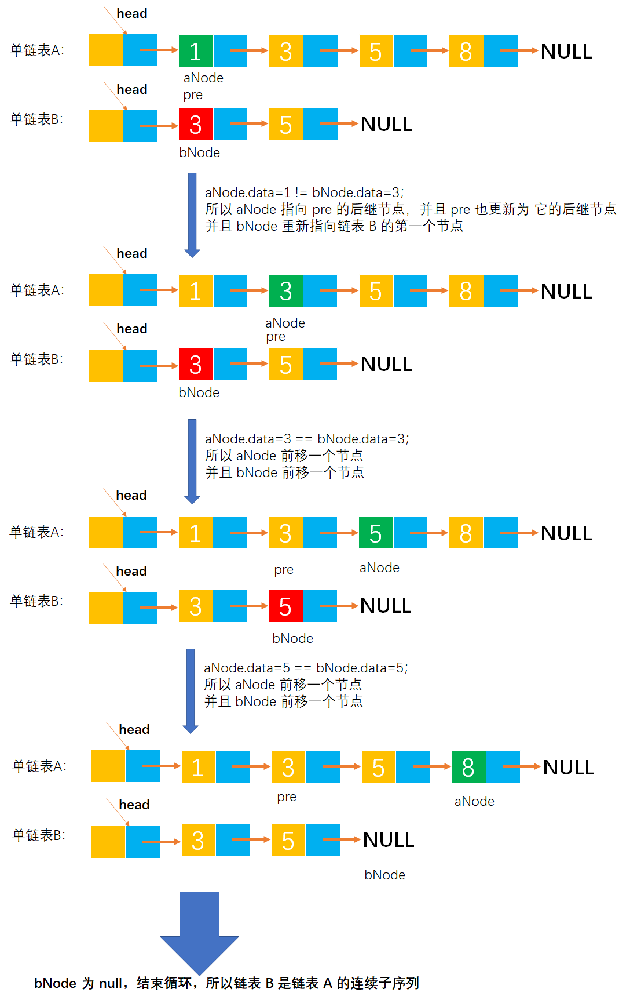
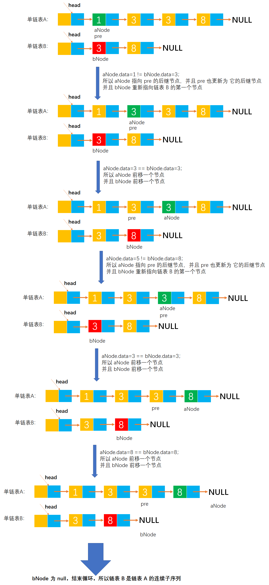
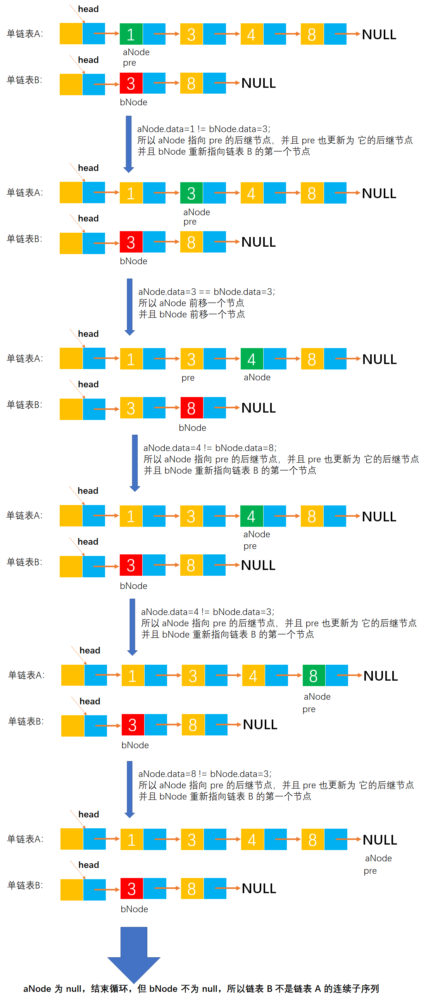

# Example036

## 题目

两个整数序列 `A = a1, a2, a3, ..., am` 和 `B = b1, b2, b3, ..., bn` 已经存入两个单链表中，设计一个算法，判断序列 B 是否是序列 A 的连续子序列。


## 分析

本题考查的知识点：
- 单链表

**分析**：
同时扫描链表 A 和 B，从两个链表的第一个结点开始，若对应的数据相等，则后移指针；若对应数据不等，则从 A 链表从上次开始比较结点的后继节点开始，链表 B 仍然从第一个节点开始比较，直到 B 链表到尾表示匹配成功。而 A 链表到尾而 B 链表未到尾表示失败。

**注意**：
- 要记住链表 A 每次的开始节点，以便下次匹配时好从其后继节点开始。
- 每次匹配失败，都要重新从链表 B 的第一个节点开始。
- 优化代码无论是可读性还是优雅性都更好。


## 图解

链表 B 是链表 A 的情况图解（`A={1, 3, 5, 8}` 和 `B={3, 5}`）：



链表 B 是链表 A 的情况图解（`A={1, 3, 3, 8}` 和 `B={3, 8}`）：



链表 B 不是链表 A 的情况图解（`A={1, 3, 4, 8}` 和 `B={3, 8}`）：




## C实现

核心代码：

```c
/**
 * 判断序列 B 是否是序列 A 的连续子序列
 * @param A 第一个序列
 * @param B 第二个序列
 * @return 如果 B 是 A 的连续子序列则返回 1，否则返回 0
 */
int isSubsequence(LNode *A, LNode *B) {
    // 变量，记录链表 A 和 B 的第一个节点
    LNode *aNode = A->next;
    LNode *bNode = B->next;

    // 1.从头到尾扫描单链表 A，从第一个节点开始
    while (aNode != NULL) {
        // 1.1 首先判断当前正在被扫描的节点的元素值是否等于链表 B 的头节点元素值，如果相等则遍历链表 B 进行比较
        if (aNode->data == bNode->data) {
            // 局部变量，记录正在扫描的链表 A 的当前节点，因为要同时扫描链表 A 和 B，所以 aNode 会发生改变，如果没有匹配成功那么 aNode 就会前移多个节点，导致不能正确匹配，所以需要临时存储，用 tempA 所表示的链表同 B 来进行之后的比较
            LNode *tempA = aNode;

            // 1.1.1 同时扫描 tempA 和 bNode 所表示的链表
            while (tempA != NULL && bNode != NULL) {
                // 如果节点元素值相等，则继续判断下一对节点，直到任何一个链表扫描结束；如果不相等，则跳出循环，不再扫描判断后面的节点
                if (tempA->data == bNode->data) {
                    tempA = tempA->next;
                    bNode = bNode->next;
                } else {
                    break;
                }
            }

            // 1.1.2 扫描完成后，判断是否是连续子序列
            // 1.1.2.1 扫描完成后，如果 bNode 扫描到了链表的末尾，表示 B 是 A 的连续子序列，所以直接返回 1
            if (bNode == NULL) {
                return 1;
            }
                // 1.1.2.2 如果 bNode 没有扫描到链表末尾，表示未能完全匹配，所以 B 不是 aNode 所表示的链表的连续子序列
            else {
                // 那么就需要让 aNode 指向它的后继节点，继续下一轮的比较，而 bNode 恢复为链表 B 的头节点
                aNode = aNode->next;
                bNode = B->next;
            }
        }
        // 1.2 如果不相等，则继续判断链表 A 的下一个节点
        else {
            aNode = aNode->next;
        }
    }
    // 2.如果扫描完链表 A 都未能发现匹配成功的，则表示 B 一定不是 A 的连续子序列
    return 0;
}
```

优化后代码：

```c
/**
 * 判断序列 B 是否是序列 A 的连续子序列
 * @param A 第一个序列
 * @param B 第二个序列
 * @return 如果 B 是 A 的连续子序列则返回 1，否则返回 0
 */
int isSubsequence(LNode *A, LNode *B) {
    // 变量，记录链表 A 和 B 的第一个节点，这里 A 和 B 分别表示头节点，书上的题解是不包含头节点的
    LNode *aNode = A->next;
    LNode *bNode = B->next;

    // 变量，记录每趟比较中 A 链表的开始节点，初始为 A 链表的第一个节点
    LNode *pre = aNode;

    // 同时扫描链表 A 和 B
    while (aNode != NULL && bNode != NULL) {
        // 如果正在扫描的节点的元素值相等
        if (aNode->data == bNode->data) {
            // 则 aNode 和 bNode 都前移一步，继续比较下一对节点
            aNode = aNode->next;
            bNode = bNode->next;
        }
        // 如果不相等
        else {
            pre = pre->next;
            // 重置 aNode 为上一次开始比较节点的后继节点
            aNode = pre;
            // 则 bNode 复原为链表 B 的第一个节点，又重头开始比较
            bNode = B->next;
        }
    }

    // 如果 B 是 A 的连续子序列，那么扫描完成后，bNode 一定会到链表尾部，所以将 bNode==NULL 作为是否是连续子序列的条件
    return bNode == NULL;
}
```

完整代码：

```c
#include <stdio.h>
#include <malloc.h>

/**
 * 单链表节点
 */
typedef struct LNode {
    /**
     * 单链表节点的数据域
     */
    int data;
    /**
     * 单链表节点的的指针域，指向当前节点的后继节点
     */
    struct LNode *next;
} LNode;

/**
 * 通过尾插法创建单链表
 * @param list 单链表
 * @param nums 创建单链表时插入的数据数组
 * @param n 数组长度
 * @return 创建好的单链表
 */
LNode *createByTail(LNode **list, int nums[], int n) {
    // 1.初始化单链表
    // 创建链表必须要先初始化链表，也可以选择直接调用 init() 函数
    *list = (LNode *) malloc(sizeof(LNode));
    (*list)->next = NULL;

    // 尾插法，必须知道链表的尾节点（即链表的最后一个节点），初始时，单链表的头结点就是尾节点
    // 因为在单链表中插入节点我们必须知道前驱节点，而头插法中的前驱节点一直是头节点，但尾插法中要在单链表的末尾插入新节点，所以前驱节点一直都是链表的最后一个节点，而链表的最后一个节点由于链表插入新节点会一直变化
    LNode *node = (*list);

    // 2.循环数组，将所有数依次插入到链表的尾部
    for (int i = 0; i < n; i++) {
        // 2.1 创建新节点，并指定数据域和指针域
        // 2.1.1 创建新节点，为其分配空间
        LNode *newNode = (LNode *) malloc(sizeof(LNode));
        // 2.1.2 为新节点指定数据域
        newNode->data = nums[i];
        // 2.1.3 为新节点指定指针域，新节点的指针域初始时设置为 null
        newNode->next = NULL;

        // 2.2 将新节点插入到单链表的尾部
        // 2.2.1 将链表原尾节点的 next 指针指向新节点
        node->next = newNode;
        // 2.2.2 将新节点置为新的尾节点
        node = newNode;
    }
    return *list;
}

/**
 * 判断序列 B 是否是序列 A 的连续子序列
 * @param A 第一个序列
 * @param B 第二个序列
 * @return 如果 B 是 A 的连续子序列则返回 1，否则返回 0
 */
int isSubsequence(LNode *A, LNode *B) {
    // 变量，记录链表 A 和 B 的第一个节点，这里 A 和 B 分别表示头节点，书上的题解是不包含头节点的
    LNode *aNode = A->next;
    LNode *bNode = B->next;

    // 变量，记录每趟比较中 A 链表的开始节点，初始为 A 链表的第一个节点
    LNode *pre = aNode;

    // 同时扫描链表 A 和 B
    while (aNode != NULL && bNode != NULL) {
        // 如果正在扫描的节点的元素值相等
        if (aNode->data == bNode->data) {
            // 则 aNode 和 bNode 都前移一步，继续比较下一对节点
            aNode = aNode->next;
            bNode = bNode->next;
        }
        // 如果不相等
        else {
            pre = pre->next;
            // 重置 aNode 为上一次开始比较节点的后继节点
            aNode = pre;
            // 则 bNode 复原为链表 B 的第一个节点，又重头开始比较
            bNode = B->next;
        }
    }

    // 如果 B 是 A 的连续子序列，那么扫描完成后，bNode 一定会到链表尾部，所以将 bNode==NULL 作为是否是连续子序列的条件
    return bNode == NULL;
}

/**
 * 打印链表的所有节点
 * @param list 单链表
 */
void print(LNode *list) {
    printf("[");
    // 链表的第一个节点
    LNode *node = list->next;
    // 循环单链表所有节点，打印值
    while (node != NULL) {
        printf("%d", node->data);
        if (node->next != NULL) {
            printf(", ");
        }
        node = node->next;
    }
    printf("]\n");
}

int main() {
    // 声明单链表 A
    LNode *A;
    int aNums[] = {1, 3, 3, 8};
    int an = 4;
    createByTail(&A, aNums, an);
    print(A);
    // 声明单链表 B
    LNode *B;
    int bNums[] = {3, 8};
    int bn = 2;
    createByTail(&B, bNums, bn);
    print(B);

    // 调用函数，判断 B 是否是 A 的连续子序列
    int result = isSubsequence(A, B);
    printf("后者是否是前者的连续子序列：%d", result);
}
```

执行结果：

```text
[1, 3, 5, 8]
[3, 5]
后者是否是前者的连续子序列：1
```


## Java实现

核心代码：

```java
    /**
     * 判断 B 是否是 A 的连续子序列
     *
     * @param A 第一个序列
     * @param B 第二个序列
     * @return 如果是则返回 true，否则返回 false
     */
    public boolean isSubsequence(LinkedList A, LinkedList B) {
        // 链表 A 和 B 的第一个节点，其中 A.list 表示链表 A 的头节点，A.list.next 表示链表的第一个节点
        LNode aNode = A.list.next;
        LNode bNode = B.list.next;

        // 变量，记录每趟比较中 A 链表的开始节点，初始为 A 链表的第一个节点
        LNode pre = aNode;

        // 从头到尾同时扫描链表 A 和 B
        while (aNode != null && bNode != null) {
            // 如果正在扫描的节点的元素值相等
            if (aNode.data == bNode.data) {
                // 则 aNode 和 bNode 都前移一步，继续比较下一对节点
                aNode = aNode.next;
                bNode = bNode.next;
            }
            // 如果不相等
            else {
                pre = pre.next;
                // 重置 aNode 为上一次开始比较节点的后继节点
                aNode = pre;
                // 则 bNode 复原为链表 B 的第一个节点，又重头开始比较
                bNode = B.list.next;
            }
        }

        // 如果 B 是 A 的连续子序列，那么扫描完成后，bNode 一定会到链表尾部，所以将 bNode==NULL 作为是否是连续子序列的条件
        return bNode == null;
    }
```

完整代码：

```java
public class LinkedList {
    /**
     * 单链表
     */
    private LNode list;

    /**
     * 通过尾插法创建单链表
     *
     * @param nums 创建单链表时插入的数据
     * @return 创建好的单链表
     */
    public LNode createByTail(int... nums) {
        // 1.初始化单链表
        // 创建链表必须要先初始化链表，也可以选择直接调用 init() 函数
        list = new LNode();
        list.next = null;

        // 尾插法，必须知道链表的尾节点（即链表的最后一个节点），初始时，单链表的头结点就是尾节点
        // 因为在单链表中插入节点我们必须知道前驱节点，而头插法中的前驱节点一直是头节点，但尾插法中要在单链表的末尾插入新节点，所以前驱节点一直都是链表的最后一个节点，而链表的最后一个节点由于链表插入新节点会一直变化
        LNode tailNode = list;

        // 2.循环数组，将所有数依次插入到链表的尾部
        for (int i = 0; i < nums.length; i++) {
            // 2.1 创建新节点，并指定数据域和指针域
            // 2.1.1 创建新节点，为其分配空间
            LNode newNode = new LNode();
            // 2.1.2 为新节点指定数据域
            newNode.data = nums[i];
            // 2.1.3 为新节点指定指针域，新节点的指针域初始时设置为 null
            newNode.next = null;

            // 2.2 将新节点插入到单链表的尾部
            // 2.2.1 将链表原尾节点的 next 指针指向新节点
            tailNode.next = newNode;
            // 2.2.2 将新节点置为新的尾节点
            tailNode = newNode;
        }

        return list;
    }

    /**
     * 判断 B 是否是 A 的连续子序列
     *
     * @param A 第一个序列
     * @param B 第二个序列
     * @return 如果是则返回 true，否则返回 false
     */
    public boolean isSubsequence(LinkedList A, LinkedList B) {
        // 链表 A 和 B 的第一个节点，其中 A.list 表示链表 A 的头节点，A.list.next 表示链表的第一个节点
        LNode aNode = A.list.next;
        LNode bNode = B.list.next;

        // 变量，记录每趟比较中 A 链表的开始节点，初始为 A 链表的第一个节点
        LNode pre = aNode;

        // 从头到尾同时扫描链表 A 和 B
        while (aNode != null && bNode != null) {
            // 如果正在扫描的节点的元素值相等
            if (aNode.data == bNode.data) {
                // 则 aNode 和 bNode 都前移一步，继续比较下一对节点
                aNode = aNode.next;
                bNode = bNode.next;
            }
            // 如果不相等
            else {
                pre = pre.next;
                // 重置 aNode 为上一次开始比较节点的后继节点
                aNode = pre;
                // 则 bNode 复原为链表 B 的第一个节点，又重头开始比较
                bNode = B.list.next;
            }
        }

        // 如果 B 是 A 的连续子序列，那么扫描完成后，bNode 一定会到链表尾部，所以将 bNode==NULL 作为是否是连续子序列的条件
        return bNode == null;
    }

    /**
     * 打印单链表所有节点
     */
    public void print() {
        // 链表的第一个节点
        LNode node = list.next;
        // 循环打印
        String str = "[";
        while (node != null) {
            // 拼接节点的数据域
            str += node.data;
            // 只要不是最后一个节点，那么就在每个节点的数据域后面添加一个分号，用于分隔字符串
            if (node.next != null) {
                str += ", ";
            }
            // 继续链表的下一个节点
            node = node.next;
        }
        str += "]";
        // 打印链表
        System.out.println(str);
    }
}

/**
 * 单链表的节点
 */
class LNode {
    /**
     * 链表的数据域，暂时指定为 int 类型，因为 Java 支持泛型，可以指定为泛型，就能支持更多的类型了
     */
    int data;
    /**
     * 链表的指针域，指向该节点的下一个节点
     */
    LNode next;
}
```

测试代码：

```java
public class LinkedListTest {
    public static void main(String[] args) {
        // 创建单链表 A
        LinkedList A = new LinkedList();
        A.createByTail(1, 5, 5, 7, 9);
        A.print();
        // 创建单链表 B
        LinkedList B = new LinkedList();
        B.createByTail(5, 7);
        B.print();

        // 调用函数，判断是否是连续子序列
        LinkedList list = new LinkedList();
        boolean result = list.isSubsequence(A, B);
        System.out.println("是否是连续子序列：" + result);
    }
}
```

执行结果：

```text
[1, 5, 5, 7, 9]
[5, 7]
是否是连续子序列：true
```