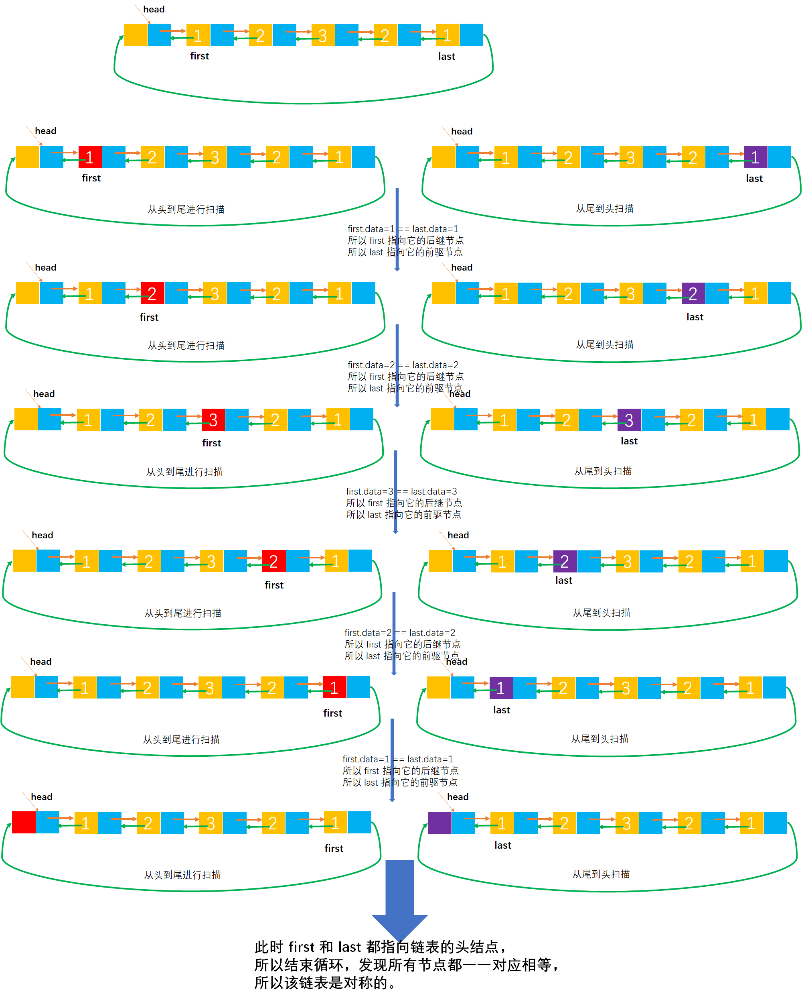
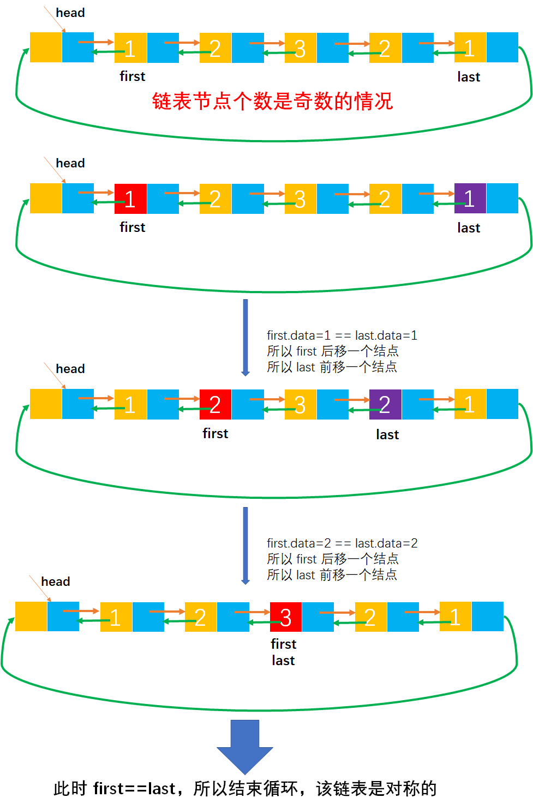
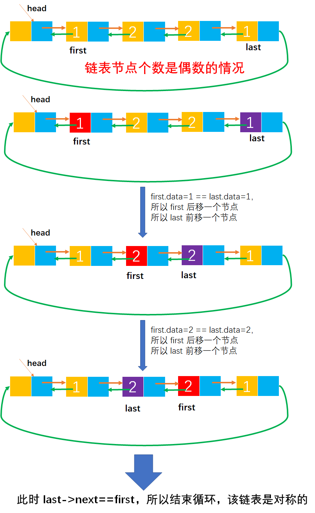

# Example037

## 题目

请设计一个算法用于判断带头节点的循环双链表是否对称。

## 分析

本题考查的知识点：
- 循环双链表

我们首先要明白所谓的对称是什么：
- 如 `{1, 2, 1}` 中元素个数是奇数个，它是对称的。
- 如 `{1, 2, 2, 1}` 中元素个数是偶数个，它是对称的。

**解法一分析**：
其实解法一和解法二的核心代码基本上是一致的。算法思想：从头到尾扫描链表的所有结点和从尾到头扫描链表所有结点，一一比较正在扫描结点的元素值，如果相等则继续比较下一对结点，如果不相等则表示循环双链表不是对称的。注意，由于是从头到尾和从尾到头扫描，所以循环结束的条件是不等于链表的头结点。

如 `{1, 2, 1}` 是对称的链表，那么从头到尾扫描的所有结点和从尾到头扫描的所有结点值一一对应相等。如 `{1, 2, 3, 1}` 中从头到尾扫描是 `[1, 2, 3, 1]`，而从尾到头扫描是 `[1, 3, 2, 1]`，发现并不是一一对应相等，所以该链表不是对称的。

**解法二分析**：
算法思想：让 `first` 从头到尾扫描，`last` 从尾到头扫描，直到它们指向同一结点（即 `first==last`，当循环双链表中结点个数为奇数时）或相邻（`first->next=last` 或 `last-prior=first`，当循环双链表中结点个数为偶数时）为止（注意：这就是解法一和解法二不一样的地方，就是循环结束条件不一样）。若它们所指结点元素值相同，则继续比较下去，否则返回 0。如果全部相等，则返回 1。

在书中提供的代码，循环结束的条件是：`while(first!=last&&last->next!=first)`，同时考虑了元素个数为奇数和偶数的情况。其中 `first!=last` 考虑的是奇数个元素的情况，而 `last->next!=first` 考虑的是元素个数偶数的情况。

解法二可以说是对解法一的优化，现在只需要比较一半的次数就可以判断链表是否对称了。

## 图解

解法一图解：



解法二图解：






## C实现

解法一核心代码：

```c
/**
 * 判断循环双链表是否是对称的
 * @param list 循环双链表
 * @return 如果循环双链表是对称的则返回 1，否则返回 0
 */
int isSymmetry(CDLNode *list) {
    // list 表示循环双链表的头节点
    // 循环双链表第一个节点
    CDLNode *first = list->next;
    // 循环双链表最后一个节点
    CDLNode *last = list->prior;

    // first 从头到尾进行扫描，last 从尾到头进行扫描
    while (first != list && last != list) {// 注意，循环结束的条件是不等于头节点
        // 如果各自节点的元素值相等，则继续比较下一对节点
        if (first->data == last->data) {
            // 注意，first 是向后移动
            first = first->next;
            // last 是向前移动
            last = last->prior;
        } else {
            // 如果不等那么一定不是对称的，所以返回 0
            return 0;
        }
    }
    // 扫描完成后，如果所有节点的元素值都一一对应相等，那么表示该链表是对称的
    return 1;
}
```

解法二核心代码：

```c 
/**
 * 判断循环双链表是否是对称的
 * @param list 循环双链表
 * @return 如果循环双链表是对称的则返回 1，否则返回 0
 */
int isSymmetry(CDLNode *list) {
    // list 表示循环双链表的头节点
    // 循环双链表第一个节点
    CDLNode *first = list->next;
    // 循环双链表最后一个节点
    CDLNode *last = list->prior;

    // first 从头到尾进行扫描，last 从尾到头进行扫描
    while (first != last && last->next != first) {// 注意，循环结束的条件是不等于头节点
        // 如果各自节点的元素值相等，则继续比较下一对节点
        if (first->data == last->data) {
            // 注意，first 是向后移动
            first = first->next;
            // last 是向前移动
            last = last->prior;
        } else {
            // 如果不等那么一定不是对称的，所以返回 0
            return 0;
        }
    }
    // 扫描完成后，如果所有节点的元素值都一一对应相等，那么表示该链表是对称的
    return 1;
}
```

完整代码：

```c
#include <stdio.h>
#include <malloc.h>

/**
 * 循环双链表的节点
 */
typedef struct CDLNode {
    /**
     * 节点的数据域
     */
    int data;
    /**
     * 节点的指针域，指向前驱节点
     */
    struct CDLNode *prior;
    /**
     * 节点的指针域，指向后继节点
     */
    struct CDLNode *next;
} CDLNode;

/**
 * 通过尾插法创建循环双链表
 * @param list 循环双链表
 * @param nums 待插入到双链表中的数据数组
 * @param n 数组长度
 * @return 创建成功的循环双链表
 */
CDLNode *createByTail(CDLNode **list, int nums[], int n) {
    // 1. 初始化循环双链表，即创建头结点，也可以直接调用 init 方法进行初始化
    // 1.1 为头结点分配空间
    *list = (CDLNode *) malloc(sizeof(CDLNode));
    // 1.2 将头结点的 prior 指针指向自身
    (*list)->prior = *list;// 注意，将头结点的 prior 和 next 指针指向自身
    // 1.3 将头结点的 next 指针指向自身
    (*list)->next = *list;

    // 保存链表的尾节点，其实可以利用循环双链表的特性，直接使用 list.prior 来获得链表的尾节点
    CDLNode *tailNode = *list;

    // 2.循环输入数组 nums，将每个元素插入到链表中
    for (int i = 0; i < n; i++) {
        // 2.1 创建新节点
        // 2.1.1 给新节点分配空间
        CDLNode *newNode = (CDLNode *) malloc(sizeof(CDLNode));
        // 2.1.2 给新节点的数据域指定内容
        newNode->data = nums[i];
        // 2.1.3 将新节点的 prior 指针指向 null
        newNode->prior = NULL;
        // 2.1.4 将新节点的 next 指针指向 null
        newNode->next = NULL;

        // 2.2 将新节点插入到链表的尾部
        // 2.2.1 将链表原尾节点的 next 指针指向新节点
        tailNode->next = newNode;
        // 2.2.2 将新节点的 prior 指针指向链表原尾节点
        newNode->prior = tailNode;
        // 2.2.3 将新节点的 next 指针指向链表的头结点
        newNode->next = *list;
        // 2.2.4 注意，将头结点的 prior 指针指向新节点（即新的尾节点），这样才能循环起来
        (*list)->prior = newNode;
        // 2.2.5 更新记录链表尾节点的变量 tailNode
        tailNode = newNode;
    }

    // 3.返回创建成功的链表
    return *list;
}

/**
 * 判断循环双链表是否是对称的
 * @param list 循环双链表
 * @return 如果循环双链表是对称的则返回 1，否则返回 0
 */
int isSymmetry(CDLNode *list) {
    // list 表示循环双链表的头节点
    // 循环双链表第一个节点
    CDLNode *first = list->next;
    // 循环双链表最后一个节点
    CDLNode *last = list->prior;

    // first 从头到尾进行扫描，last 从尾到头进行扫描
    while (first != list && last != list) {// 注意，循环结束的条件是不等于头节点
        // 如果各自节点的元素值相等，则继续比较下一对节点
        if (first->data == last->data) {
            // 注意，first 是向后移动
            first = first->next;
            // last 是向前移动
            last = last->prior;
        } else {
            // 如果不等那么一定不是对称的，所以返回 0
            return 0;
        }
    }
    // 扫描完成后，如果所有节点的元素值都一一对应相等，那么表示该链表是对称的
    return 1;
}

/**
 * 打印循环双链表
 * @param list 循环双链表
 */
void print(CDLNode *list) {
    printf("[");
    CDLNode *node = list->next;
    while (node != list) {// 注意，判断循环结束的条件是不等于头结点
        printf("%d", node->data);
        if (node->next != list) {
            printf(", ");
        }
        node = node->next;
    }
    printf("]\n");
}

int main() {
    CDLNode *list;
    int nums[] = {1, 2, 3, 2, 1};
    int n = 5;
    createByTail(&list, nums, n);
    print(list);

    int result = isSymmetry(list);
    printf("该循环双链表是否是对称的：%d", result);
}
```

执行结果：

```text
[1, 2, 3, 2, 1]
该循环双链表是否是对称的：1
```

## Java实现

核心代码：

```java
    /**
     * 判断循环双链表是否是对称的
     *
     * @return 如果链表是对称的则返回 true，否则返回 false
     */
    public boolean isSymmetry() {
        // list 表示循环双链表的头节点
        // 循环双链表第一个节点
        CDLNode first = list.next;
        // 循环双链表最后一个节点
        CDLNode last = list.prior;

        // first 从头到尾进行扫描，last 从尾到头进行扫描
        while (first != list && last != list) {
            // 如果各自节点的元素值相等，则继续比较下一对节点
            if (first.data == last.data) {
                // 注意，first 是向后移动
                first = first.next;
                // last 是向前移动
                last = last.prior;
            } else {
                // 如果不等那么一定不是对称的，所以返回 false
                return false;
            }
        }

        // 扫描完成后，如果所有节点的元素值都一一对应相等，那么表示该链表是对称的
        return true;
    }
```

完整代码：

```java
public class CircularDoubleLinkedList {
    CDLNode list;

    /**
     * 通过尾插法创建循环双链表
     *
     * @param nums 待插入到双链表中的数据数组
     * @return 创建成功的循环双链表
     */
    public CDLNode createByTail(int... nums) {
        // 1. 初始化循环双链表，即创建头结点，也可以直接调用 init 方法进行初始化
        // 1.1 为头结点分配空间
        list = new CDLNode();
        // 1.2 将头结点的 prior 指针指向自身
        list.prior = list;// 注意，将头结点的 prior 和 next 指针指向自身
        // 1.3 将头结点的 next 指针指向自身
        list.next = list;

        // 保存链表的尾节点，其实可以利用循环双链表的特性，直接使用 list.prior 来获得链表的尾节点
        CDLNode tailNode = list;

        // 2.循环输入数组 nums，将每个元素插入到链表中
        for (int i = 0; i < nums.length; i++) {
            // 2.1 创建新节点
            // 2.1.1 给新节点分配空间
            CDLNode newNode = new CDLNode();
            // 2.1.2 给新节点的数据域指定内容
            newNode.data = nums[i];
            // 2.1.3 将新节点的 prior 指针指向 null
            newNode.prior = null;
            // 2.1.4 将新节点的 next 指针指向 null
            newNode.next = null;

            // 2.2 将新节点插入到链表的尾部
            // 2.2.1 将链表原尾节点的 next 指针指向新节点
            tailNode.next = newNode;
            // 2.2.2 将新节点的 prior 指针指向链表原尾节点
            newNode.prior = tailNode;
            // 2.2.3 将新节点的 next 指针指向链表的头结点
            newNode.next = list;
            // 2.2.4 注意，将头结点的 prior 指针指向新节点（即新的尾节点），这样才能循环起来
            list.prior = newNode;
            // 2.2.5 更新记录链表尾节点的变量 tailNode
            tailNode = newNode;
        }

        // 3.返回创建成功的链表
        return list;
    }

    /**
     * 判断循环双链表是否是对称的
     *
     * @return 如果链表是对称的则返回 true，否则返回 false
     */
    public boolean isSymmetry() {
        // list 表示循环双链表的头节点
        // 循环双链表第一个节点
        CDLNode first = list.next;
        // 循环双链表最后一个节点
        CDLNode last = list.prior;

        // first 从头到尾进行扫描，last 从尾到头进行扫描
        while (first != list && last != list) {
            // 如果各自节点的元素值相等，则继续比较下一对节点
            if (first.data == last.data) {
                // 注意，first 是向后移动
                first = first.next;
                // last 是向前移动
                last = last.prior;
            } else {
                // 如果不等那么一定不是对称的，所以返回 false
                return false;
            }
        }

        // 扫描完成后，如果所有节点的元素值都一一对应相等，那么表示该链表是对称的
        return true;
    }

    /**
     * 打印循环双链表的所有节点
     */
    public void print() {
        // 链表的第一个节点
        CDLNode node = list.next;
        // 循环链表，输出链表所有节点值
        String str = "[";
        while (node != list) {// 注意，判断循环结束的条件是不等于头结点
            str += node.data;
            if (node.next != list) {
                str += ", ";
            }
            node = node.next;
        }
        str += "]";
        System.out.println(str);
    }
}

/**
 * 循环双链表节点
 */
class CDLNode {
    /**
     * 数据域
     */
    int data;
    /**
     * 指针域，指向当前节点的前驱节点
     */
    CDLNode prior;
    /**
     * 指针域，指向当前节点的后继节点
     */
    CDLNode next;
}
```

测试代码：

```java
public class CircularDoubleLinkedListTest {
    public static void main(String[] args) throws Exception {
        CircularDoubleLinkedList list = new CircularDoubleLinkedList();
        list.createByTail(1, 2, 3, 2, 1);
        list.print();

        // 调用函数判断链表是否是对称的
        boolean result = list.isSymmetry();
        System.out.println("该链表是否是对称的：" + result);
    }
}
```

执行结果：

```text
[1, 2, 3, 2, 1]
该链表是否是对称的：true
```