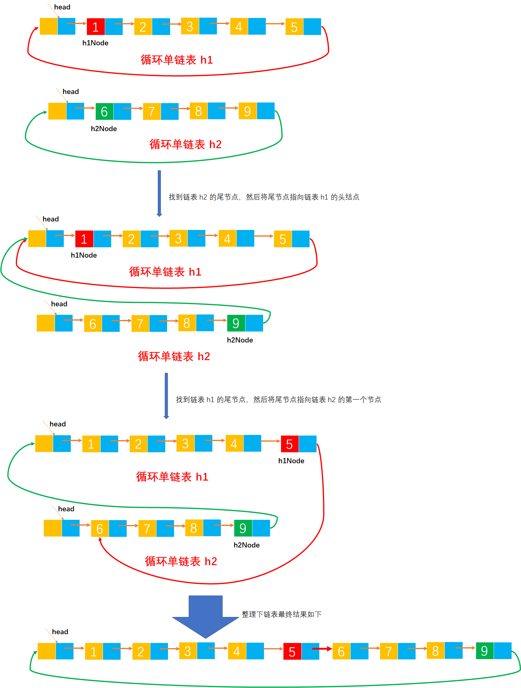

# Example038

## 题目

有两个循环单链表，链表头指针分别为 h1 和 h2，编写一个函数将链表 h2 链接到链表 h1 之后，要求链接后的链表仍然保持循环链表形式。


## 分析

本题考查的知识点：
- 循环单链表  


算法思想：将循环单链表 h1 的尾节点的 next 指针指向链表 h2 的第一个节点，然后再将链表 h2 的尾节点的 next 指针指向链表 h1 的头结点。


## 图解




## C实现

核心代码：

```c
/**
 * 将循环单链表 h2 链接到循环单链表 h1 的后面，并仍然保持循环
 * @param h1 第一个循环单链表，链接完成后，变成拥有 h1 和 h2 的循环单链表
 * @param h2 第二个循环单链表
 */
void concatList(CLNode *h1, CLNode *h2) {
    // 1.将链表 h2 尾节点的 next 指针指向链表 h1 的头节点
    // 变量，记录链表 h2 的每一个节点，初始为链表 h2 的第一个节点
    CLNode *h2Node = h2->next;
    // 1.1 通过遍历链表找到链表 h2 的最后一个节点
    while (h2Node->next != h2) {// 注意，循环结束条件的是 h2Node->next!=h2，循环结束后 h2Node 就是链表 h2 的尾节点
        h2Node = h2Node->next;
    }
    // 1.2 将链表 h2 尾节点的 next 指针指向链表 h1 的头节点
    h2Node->next = h1;

    // 2.将链表 h1 尾节点的 next 指针指向链表 h2 的第一个节点
    // 变量，记录链表 h1 的每一个节点，初始为链表 h1 的第一个节点
    CLNode *h1Node = h1->next;
    // 2.1 通过遍历链表找到链表 h1 的最后一个节点
    while (h1Node->next != h1) {// 注意，循环结束条件的是 h1Node->next!=h1，循环结束后 h1Node 就是链表 h1 的尾节点
        h1Node = h1Node->next;
    }
    // 2.2 将链表 h1 尾节点的 next 指针指向链表 h2 的第一个节点
    h1Node->next = h2->next;
}
```

完整代码：

```c
#include <stdio.h>
#include <stdlib.h>

/**
 * 循环单链表的节点
 */
typedef struct CLNode {
    /**
     * 链表节点的数据域
     */
    int data;
    /**
     * 链表节点的指针域，指向后继节点
     */
    struct CLNode *next;
} CLNode;

/**
 * 通过尾插法创建循环单链表
 * @param list  循环单链表
 * @param nums 待插入到单链表中的数据数组
 * @param n 数组长度
 * @return 创建成功的循环单链表
 */
CLNode *createByTail(CLNode **list, int nums[], int n) {
    // 1.初始化循环单链表，即创建循环单链表的头结点。也可以直接调用 init 函数来初始化
    // 1.1 为头结点分配空间
    *list = (CLNode *) malloc(sizeof(CLNode));
    // 1.2 修改头结点的 next 指针，将其指向自己，而普通单链表是指向 null
    (*list)->next = *list;// 注意，指向头结点本身

    // 保存链表的尾节点，初始为链表的头节点，即空链表的尾节点就是链表的头节点
    CLNode *tailNode = *list;

    // 2.循环数组 nums 中所有数据，插入到单链表中
    for (int i = 0; i < n; i++) {
        // 2.1 创建新节点
        // 2.1.1 给新节点分配空间
        CLNode *newNode = (CLNode *) malloc(sizeof(CLNode));
        // 2.1.2 指定新节点的数据域
        newNode->data = nums[i];
        // 2.1.3 将新节点的指针域置为 null，指向空
        newNode->next = NULL;

        // 2.2 将新节点追加到链表的尾部
        // 2.2.1 将链表原尾节点的 next 指针指向新节点，即让新节点成为链表的尾节点
        tailNode->next = newNode;
        // 2.2.2 然后将新节点（即链表新的尾节点）指向链表的头节点
        newNode->next = *list;
        // 2.2.3 然后将 tailNode 指向新节点（即新的尾节点）
        tailNode = newNode;
    }

    // 3.返回创建成功的链表
    return *list;
}

/**
 * 将循环单链表 h2 链接到循环单链表 h1 的后面，并仍然保持循环
 * @param h1 第一个循环单链表，链接完成后，变成拥有 h1 和 h2 的循环单链表
 * @param h2 第二个循环单链表
 */
void concatList(CLNode *h1, CLNode *h2) {
    // 1.将链表 h2 尾节点的 next 指针指向链表 h1 的头节点
    // 变量，记录链表 h2 的每一个节点，初始为链表 h2 的第一个节点
    CLNode *h2Node = h2->next;
    // 1.1 通过遍历链表找到链表 h2 的最后一个节点
    while (h2Node->next != h2) {// 注意，循环结束条件的是 h2Node->next!=h2，循环结束后 h2Node 就是链表 h2 的尾节点
        h2Node = h2Node->next;
    }
    // 1.2 将链表 h2 尾节点的 next 指针指向链表 h1 的头节点
    h2Node->next = h1;

    // 2.将链表 h1 尾节点的 next 指针指向链表 h2 的第一个节点
    // 变量，记录链表 h1 的每一个节点，初始为链表 h1 的第一个节点
    CLNode *h1Node = h1->next;
    // 2.1 通过遍历链表找到链表 h1 的最后一个节点
    while (h1Node->next != h1) {// 注意，循环结束条件的是 h1Node->next!=h1，循环结束后 h1Node 就是链表 h1 的尾节点
        h1Node = h1Node->next;
    }
    // 2.2 将链表 h1 尾节点的 next 指针指向链表 h2 的第一个节点
    h1Node->next = h2->next;
}

/**
 * 打印循环单链表
 * @param list 待打印的循环单链表
 */
void print(CLNode *list) {
    printf("[");
    CLNode *node = list->next;
    while (node != list) {
        printf("%d", node->data);
        if (node->next != list) {
            printf(", ");
        }
        node = node->next;
    }
    printf("]\n");
}

int main() {
    // 声明循环单链表 h1
    CLNode *h1;
    int nums1[] = {111, 222, 333, 444, 555};
    int n1 = 5;
    createByTail(&h1, nums1, n1);
    print(h1);

    // 声明循环单链表 h2
    CLNode *h2;
    int nums2[] = {5, 4, 3, 2, 1};
    int n2 = 5;
    createByTail(&h2, nums2, n2);
    print(h2);

    // 调用函数，链接两个循环单链表
    concatList(h1, h2);
    print(h1);
}
```

执行结果：

```text
[111, 222, 333, 444, 555]
[5, 4, 3, 2, 1]
[111, 222, 333, 444, 555, 5, 4, 3, 2, 1]
```


## Java实现

核心代码：

```java
    /**
     * 将循环单链表 h2 链接到循环单链表 h1 的后面，并仍然保持循环
     *
     * @param h1 第一个循环单链表，链接完成后，变成拥有 h1 和 h2 的循环单链表
     * @param h2 第二个循环单链表
     */
    public void concatList(CircularLinkedList h1, CircularLinkedList h2) {
        // h1.list 和 h2.list 分别表示循环单链表 h1 和 h2 的头节点
        // h1.list.next 和 h2.list.next 分别表示循环单链表 h1 和 h2 的第一个节点
        // 链表 h1 和 h2 的头节点
        CLNode head1 = h1.list;
        CLNode head2 = h2.list;

        // 链表 h2 的第一个节点
        CLNode h2Node = head2.next;
        // 找到链表 h2 的最后一个节点
        while (h2Node.next != head2) {
            h2Node = h2Node.next;
        }
        // 将链表 h2 尾节点的 next 指针指向链表 h1 的头节点
        h2Node.next = head1;

        // 链表 h1 的第一个节点
        CLNode h1Node = head1.next;
        // 找到链表 h1 的最后一个节点
        while (h1Node.next != head1) {
            h1Node = h1Node.next;
        }
        // 将链表 h1 尾节点的 next 指针指向链表 h2 的第一个节点
        h1Node.next = head2.next;
    }
```

完整代码：

```java
public class CircularLinkedList {
    private CLNode list;

    /**
     * 通过尾插法创建循环单链表
     *
     * @param nums 待插入到单链表中的数据数组
     * @return 创建成功的循环单链表
     */
    public CLNode createByTail(int... nums) {
        // 1.初始化循环单链表，即创建循环单链表的头结点。也可以直接调用 init 函数来初始化
        // 1.1 为头结点分配空间
        list = new CLNode();
        // 1.2 修改头结点的 next 指针，将其指向自己，而普通单链表是指向 null
        list.next = list;// 注意，这里同单链表不同的是，指向了自己

        // 保存链表的尾节点，初始为链表的头节点，即空链表的尾节点就是链表的头节点
        CLNode tailNode = list;

        // 2.循环数组 nums 中所有数据，插入到单链表中
        for (int i = 0; i < nums.length; i++) {
            // 2.1 创建新节点
            // 2.1.1 给新节点分配空间
            CLNode newNode = new CLNode();
            // 2.1.2 指定新节点的数据域
            newNode.data = nums[i];
            // 2.1.3 将新节点的指针域置为 null，指向空
            newNode.next = null;

            // 2.2 将新节点追加到链表的尾部
            // 2.2.1 将链表原尾节点的 next 指针指向新节点，即让新节点成为链表的尾节点
            tailNode.next = newNode;
            // 2.2.2 然后将新节点（即链表新的尾节点）指向链表的头节点
            newNode.next = list;
            // 2.2.3 然后将 tailNode 指向新节点（即新的尾节点）
            tailNode = newNode;
        }

        // 3.返回创建成功的链表
        return list;
    }

    /**
     * 将循环单链表 h2 链接到循环单链表 h1 的后面，并仍然保持循环
     *
     * @param h1 第一个循环单链表，链接完成后，变成拥有 h1 和 h2 的循环单链表
     * @param h2 第二个循环单链表
     */
    public void concatList(CircularLinkedList h1, CircularLinkedList h2) {
        // h1.list 和 h2.list 分别表示循环单链表 h1 和 h2 的头节点
        // h1.list.next 和 h2.list.next 分别表示循环单链表 h1 和 h2 的第一个节点
        // 链表 h1 和 h2 的头节点
        CLNode head1 = h1.list;
        CLNode head2 = h2.list;

        // 链表 h2 的第一个节点
        CLNode h2Node = head2.next;
        // 找到链表 h2 的最后一个节点
        while (h2Node.next != head2) {
            h2Node = h2Node.next;
        }
        // 将链表 h2 尾节点的 next 指针指向链表 h1 的头节点
        h2Node.next = head1;

        // 链表 h1 的第一个节点
        CLNode h1Node = head1.next;
        // 找到链表 h1 的最后一个节点
        while (h1Node.next != head1) {
            h1Node = h1Node.next;
        }
        // 将链表 h1 尾节点的 next 指针指向链表 h2 的第一个节点
        h1Node.next = head2.next;
    }

    /**
     * 打印循环单链表
     */
    public void print() {
        // 链表的第一个节点
        CLNode node = list.next;
        // 循环单链表，打印单链表的每个节点的数据值
        String str = "[";
        while (node != list) {
            str += node.data;
            if (node.next != list) {
                str += ", ";
            }
            node = node.next;
        }
        str += "]";
        // 打印结果
        System.out.println(str);
    }
}

/**
 * 循环单链表节点
 */
class CLNode {
    /**
     * 节点的数据域
     */
    int data;
    /**
     * 节点的指针域，指向后继节点
     */
    CLNode next;
}
```

测试代码：

```java
public class CircularLinkedListTest {
    public static void main(String[] args) throws Exception {
        // 创建循环单链表 A
        CircularLinkedList A = new CircularLinkedList();
        A.createByTail(111, 222, 333, 444, 555);
        A.print();

        // 创建循环单链表 B
        CircularLinkedList B = new CircularLinkedList();
        B.createByTail(5, 4, 3, 2, 1);
        B.print();

        // 调用函数连接链表
        CircularLinkedList list = new CircularLinkedList();
        list.concatList(A, B);
        A.print();
    }
}
```

执行结果：

```text
[111, 222, 333, 444, 555]
[5, 4, 3, 2, 1]
[111, 222, 333, 444, 555, 5, 4, 3, 2, 1]
```