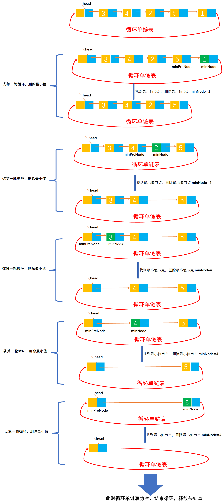

# Example039

## 题目

设有一个带头节点的循环单链表，其节点值均为正整数。设计一个算法，反复找出单链表中节点值最小的节点并输出，然后将该节点从中删除，直到单链表空为止，再删除表头节点。


## 分析

本题考查的知识点：
- 循环单链表
- 循环单链表删除节点
- 单链表寻找最小值节点

算法思想：对于循环单链表，在链表不为空时进行循环：每循环一次就查找一个链表中的最小值节点，但注意让 minNode 指向最小值节点，让 minPreNode 指向最小值节点的前驱节点，然后删除它。直到链表为空，当链表为空后释放链表的头结点。

**注意**：
- 循环单链表的循环结束条件是节点不等于头结点。
- 本题不难，着重考查删除链表的最小值节点，而删除所有的最小值节点，不过是添加一个循环而已。


## 图解




## C实现

核心代码：

```c
/**
 * @param list 循环单链表，因为要修改循环单链表，所以是双指针 **list
 */
void deleteAllMin(CLNode **list) {
    // 一直循环删除最小节点，直到链表为空链表，其中 (*list)->next==*list 表示是空链表，结束循环
    while ((*list)->next != *list) {
        // 局部变量，记录最小节点
        CLNode *minNode = (*list)->next;
        // 局部变量，记录最小节点的前驱节点
        CLNode *minPreNode = *list;

        // 局部变量，记录链表中的每个节点，初始为链表的第一个节点
        CLNode *node = (*list)->next;
        // 局部变量，记录 node 节点的前驱节点
        CLNode *pre = *list;

        // 从头到尾扫描循环单链表，寻找最小节点及其前驱节点
        while (node != *list) {
            // 如果当前节点比最小节点元素值还小，则更新 minNode 和 minPreNode
            if (node->data < minNode->data) {
                minPreNode = pre;
                minNode = node;
            }
            pre = node;
            node = node->next;
        }

        // 找到最小值节点之后，删除最小值节点
        printf("最小节点：%d\n", minNode->data);
        minPreNode->next = minNode->next;
        free(minNode);// 释放最小值节点的空间

        // 打印一下删除最小节点之后的链表
        print(*list);
    }
    // 释放头节点
    free(*list);
}
```

完整代码：

```c
#include <stdio.h>
#include <stdlib.h>

/**
 * 循环单链表的节点
 */
typedef struct CLNode {
    /**
     * 链表节点的数据域
     */
    int data;
    /**
     * 链表节点的指针域，指向后继节点
     */
    struct CLNode *next;
} CLNode;

/**
 * 通过尾插法创建循环单链表
 * @param list  循环单链表
 * @param nums 待插入到单链表中的数据数组
 * @param n 数组长度
 * @return 创建成功的循环单链表
 */
CLNode *createByTail(CLNode **list, int nums[], int n) {
    // 1.初始化循环单链表，即创建循环单链表的头结点。也可以直接调用 init 函数来初始化
    // 1.1 为头结点分配空间
    *list = (CLNode *) malloc(sizeof(CLNode));
    // 1.2 修改头结点的 next 指针，将其指向自己，而普通单链表是指向 null
    (*list)->next = *list;// 注意，指向头结点本身

    // 保存链表的尾节点，初始为链表的头节点，即空链表的尾节点就是链表的头节点
    CLNode *tailNode = *list;

    // 2.循环数组 nums 中所有数据，插入到单链表中
    for (int i = 0; i < n; i++) {
        // 2.1 创建新节点
        // 2.1.1 给新节点分配空间
        CLNode *newNode = (CLNode *) malloc(sizeof(CLNode));
        // 2.1.2 指定新节点的数据域
        newNode->data = nums[i];
        // 2.1.3 将新节点的指针域置为 null，指向空
        newNode->next = NULL;

        // 2.2 将新节点追加到链表的尾部
        // 2.2.1 将链表原尾节点的 next 指针指向新节点，即让新节点成为链表的尾节点
        tailNode->next = newNode;
        // 2.2.2 然后将新节点（即链表新的尾节点）指向链表的头节点
        newNode->next = *list;
        // 2.2.3 然后将 tailNode 指向新节点（即新的尾节点）
        tailNode = newNode;
    }

    // 3.返回创建成功的链表
    return *list;
}

/**
 * 打印循环单链表
 * @param list 待打印的循环单链表
 */
void print(CLNode *list) {
    printf("[");
    CLNode *node = list->next;
    while (node != list) {
        printf("%d", node->data);
        if (node->next != list) {
            printf(", ");
        }
        node = node->next;
    }
    printf("]\n");
}

/**
 * @param list 循环单链表，因为要修改循环单链表，所以是双指针 **list
 */
void deleteAllMin(CLNode **list) {
    // 一直循环删除最小节点，直到链表为空链表，其中 (*list)->next==*list 表示是空链表，结束循环
    while ((*list)->next != *list) {
        // 局部变量，记录最小节点
        CLNode *minNode = (*list)->next;
        // 局部变量，记录最小节点的前驱节点
        CLNode *minPreNode = *list;

        // 局部变量，记录链表中的每个节点，初始为链表的第一个节点
        CLNode *node = (*list)->next;
        // 局部变量，记录 node 节点的前驱节点
        CLNode *pre = *list;

        // 从头到尾扫描循环单链表，寻找最小节点及其前驱节点
        while (node != *list) {
            // 如果当前节点比最小节点元素值还小，则更新 minNode 和 minPreNode
            if (node->data < minNode->data) {
                minPreNode = pre;
                minNode = node;
            }
            pre = node;
            node = node->next;
        }

        // 找到最小值节点之后，删除最小值节点
        printf("最小节点：%d\n", minNode->data);
        minPreNode->next = minNode->next;
        free(minNode);// 释放最小值节点的空间

        // 打印一下删除最小节点之后的链表
        print(*list);
    }
    // 释放头节点
    free(*list);
}

int main() {
    // 声明循环单链表
    CLNode *list;
    int nums[] = {5, 2, 3, -3, 1, 4};
    int n = 6;
    createByTail(&list, nums, n);
    print(list);

    // 调用函数，删除所有的最小节点，直到链表为空
    deleteAllMin(&list);
}
```

执行结果：

```text
[5, 2, 3, -3, 1, 4]
最小节点：-3
[5, 2, 3, 1, 4]
最小节点：1
[5, 2, 3, 4]
最小节点：2
[5, 3, 4]
最小节点：3
[5, 4]
最小节点：4
[5]
最小节点：5
[]
```


## Java实现

核心代码：

```java
    /**
     * 删除循环单链表中所有最小值节点，直到链表为空，最后释放头节点
     */
    public void deleteAllMin() {
        // 一直循环删除最小节点，直到链表为空链表，其中 list.next==list 表示是空链表，结束循环
        while (list.next != list) {
            // 局部变量，记录最小节点
            CLNode minNode = list.next;
            // 局部变量，记录最小节点的前驱节点，因为单链表要删除一个节点，必须知道它的前驱节点，所以需要记录
            CLNode minPreNode = list;

            // 局部变量，记录链表中的每个节点，初始为链表的第一个节点，为了遍历单链表使用
            CLNode node = list.next;
            // 局部变量，记录 node 节点的前驱节点，记录前驱节点是为了提供给 minPreNode 使用
            CLNode pre = list;

            // 从头到尾扫描循环单链表，寻找最小节点及其前驱节点
            while (node != list) {
                // 如果当前节点比最小节点元素值还小，则更新 minNode 和 minPreNode
                if (node.data < minNode.data) {
                    minNode = node;
                    minPreNode = pre;
                }
                pre = node;
                node = node.next;
            }

            // 找到最小值节点之后，删除最小值节点
            System.out.println("最小节点：" + minNode.data);
            minPreNode.next = minNode.next;
            minNode.next = null;// 释放最小值节点的空间
            minNode = null;

            // 打印一下删除最小节点之后的链表
            print();
        }
        // 释放头节点
        list.next = null;
        list = null;
    }
```

完整代码：

```java
public class CircularLinkedList {
    private CLNode list;

    /**
     * 通过尾插法创建循环单链表
     *
     * @param nums 待插入到单链表中的数据数组
     * @return 创建成功的循环单链表
     */
    public CLNode createByTail(int... nums) {
        // 1.初始化循环单链表，即创建循环单链表的头结点。也可以直接调用 init 函数来初始化
        // 1.1 为头结点分配空间
        list = new CLNode();
        // 1.2 修改头结点的 next 指针，将其指向自己，而普通单链表是指向 null
        list.next = list;// 注意，这里同单链表不同的是，指向了自己

        // 保存链表的尾节点，初始为链表的头节点，即空链表的尾节点就是链表的头节点
        CLNode tailNode = list;

        // 2.循环数组 nums 中所有数据，插入到单链表中
        for (int i = 0; i < nums.length; i++) {
            // 2.1 创建新节点
            // 2.1.1 给新节点分配空间
            CLNode newNode = new CLNode();
            // 2.1.2 指定新节点的数据域
            newNode.data = nums[i];
            // 2.1.3 将新节点的指针域置为 null，指向空
            newNode.next = null;

            // 2.2 将新节点追加到链表的尾部
            // 2.2.1 将链表原尾节点的 next 指针指向新节点，即让新节点成为链表的尾节点
            tailNode.next = newNode;
            // 2.2.2 然后将新节点（即链表新的尾节点）指向链表的头节点
            newNode.next = list;
            // 2.2.3 然后将 tailNode 指向新节点（即新的尾节点）
            tailNode = newNode;
        }

        // 3.返回创建成功的链表
        return list;
    }

    /**
     * 删除循环单链表中所有最小值节点，直到链表为空，最后释放头节点
     */
    public void deleteAllMin() {
        // 一直循环删除最小节点，直到链表为空链表，其中 list.next==list 表示是空链表，结束循环
        while (list.next != list) {
            // 局部变量，记录最小节点
            CLNode minNode = list.next;
            // 局部变量，记录最小节点的前驱节点，因为单链表要删除一个节点，必须知道它的前驱节点，所以需要记录
            CLNode minPreNode = list;

            // 局部变量，记录链表中的每个节点，初始为链表的第一个节点，为了遍历单链表使用
            CLNode node = list.next;
            // 局部变量，记录 node 节点的前驱节点，记录前驱节点是为了提供给 minPreNode 使用
            CLNode pre = list;

            // 从头到尾扫描循环单链表，寻找最小节点及其前驱节点
            while (node != list) {
                // 如果当前节点比最小节点元素值还小，则更新 minNode 和 minPreNode
                if (node.data < minNode.data) {
                    minNode = node;
                    minPreNode = pre;
                }
                pre = node;
                node = node.next;
            }

            // 找到最小值节点之后，删除最小值节点
            System.out.println("最小节点：" + minNode.data);
            minPreNode.next = minNode.next;
            minNode.next = null;// 释放最小值节点的空间
            minNode = null;

            // 打印一下删除最小节点之后的链表
            print();
        }
        // 释放头节点
        list.next = null;
        list = null;
    }

    /**
     * 打印循环单链表
     */
    public void print() {
        // 链表的第一个节点
        CLNode node = list.next;
        // 循环单链表，打印单链表的每个节点的数据值
        String str = "[";
        while (node != list) {
            str += node.data;
            if (node.next != list) {
                str += ", ";
            }
            node = node.next;
        }
        str += "]";
        // 打印结果
        System.out.println(str);
    }
}

/**
 * 循环单链表节点
 */
class CLNode {
    /**
     * 节点的数据域
     */
    int data;
    /**
     * 节点的指针域，指向后继节点
     */
    CLNode next;
}
```

测试代码：

```java
public class CircularLinkedListTest {
    public static void main(String[] args) {
        // 实例化循环单链表对象
        CircularLinkedList list = new CircularLinkedList();
        list.createByTail(3, 4, 2, 5, 1);
        list.print();

        // 调用函数删除所有最小值节点
        list.deleteAllMin();
    }
}
```

执行结果：

```text
[3, 4, 2, 5, 1]
最小节点：1
[3, 4, 2, 5]
最小节点：2
[3, 4, 5]
最小节点：3
[4, 5]
最小节点：4
[5]
最小节点：5
[]
```