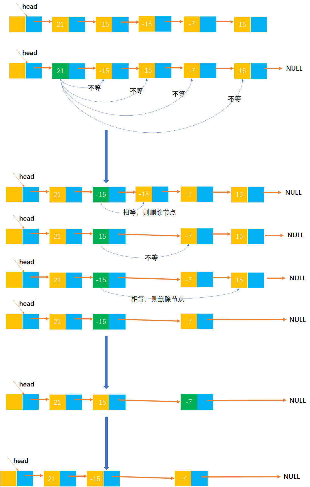
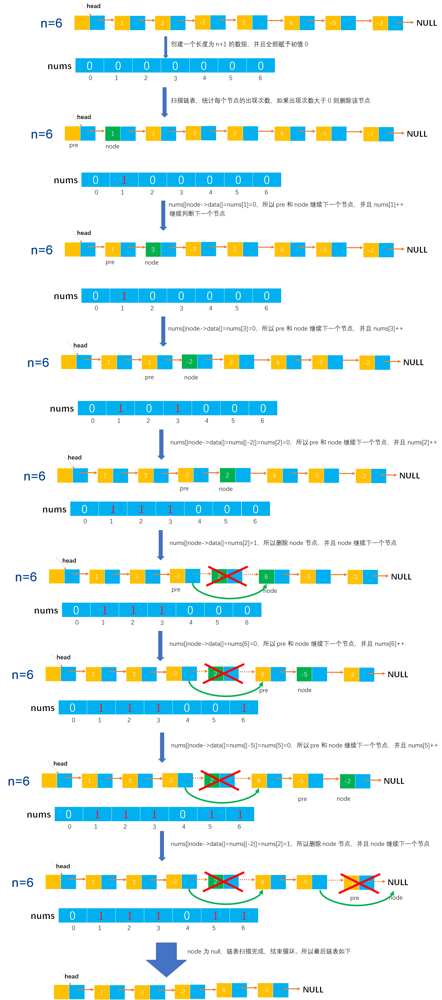

# Example040

## 题目

用单链表保存 m 个整数，节点的结构为 `[data][next]`，且 `|data|<=n`（n 为正整数）。现要求设计一个时间复杂度尽可能高效的算法，对于链表中 data
的绝对值相等的节点，仅保留第一次出现的节点而删除其余绝对值相等的节点。例如，若给定的单链表 head 如下：`head -> 21 -> -15 -> -15 -> -7 -> 15`，则删除节点后的 head
为：`head -> 21 -> -15 -> -7`。

## 分析

本题考查的知识点：

- 单链表
- 单链表删除节点

**解法一分析**：

遍历单链表中的每个节点，然后用该节点与该节点之后的所有结点的绝对值相比较，如果有相等的情况，则删除后面出现的绝对值重复的结点。直到遍历单链表完成。

**解法二分析**：

算法的核心思想就是用空间换时间，使用辅助数组记录链表中已出现数值的出现此时，从而只需要对链表进行一趟扫描。

因为题目中 `|data|<=n`，所以可以创建一个长度为 n+1 的辅助数组，之所以为 n+1 是因为 data 的绝对值可能等于 n，各数组元素赋予初值均为 0。依次扫描链表中各节点，同时检查 `nums[|data|]` 的值，如果为
0 则保留该节点，并且让 `nums[|data|]++`；否则将该节点从链表中删除，因为 `nums[|data|]` 不为 0 表示该节点至少出现过一次，所以删除掉。

## 图解

解法一图解：



解法二图解：



## C实现

解法一核心代码：

```c
/**
 * 计算一个整数的绝对值
 * @param num 整数，可以为负数，也可以为正数
 * @return 该数的绝对值
 */
int abs(int num){
    if(num<0){
        return -num;
    }else{
        return num;
    }
}

/**
 * 删除链表中所有绝对值重复的节点，仅保留第一次出现的重复节点
 * @param list 单链表
 */
void deleteRepeatAbsoluteValue(LNode **list){
    // 变量，记录单链表的每一个节点，初始为单链表的第一个节点，用于循环
    LNode* node=(*list)->next;

    // 从头到尾扫描单链表
    while(node!=NULL){
        // 判断当前节点的绝对值是否在链表中出现过，如果出现过则直接删除
        // 变量，当前节点的后继节点，从 node 的后继节点开始比较
        LNode* nextNode=node->next;
        // 变量，记录 nextNode 节点的前驱节点，用于删除节点
        LNode* preNextNode=node;

        // 从头到尾扫描 nextNode 及之后的所有节点
        while(nextNode!=NULL){
            // 如果当前 node 节点的绝对值与 nextNode 节点的绝对值相等
            if(abs(node->data)==abs(nextNode->data)){
                LNode* temp=nextNode->next;

                // 则删除 nextNode 节点
                preNextNode->next=nextNode->next;
                free(nextNode);

                // 继续下一个 nextNode 节点
                nextNode=temp;
            }
            // 如果不相等，则继续下一个 nextNode 节点
            else{
                // 注意，更新 preNextNode
                preNextNode=nextNode;
                nextNode=nextNode->next;
            }
        }

        // 继续链表的下一个节点
        node=node->next;
    }
}
```

解法二核心代码：

```c 
/**
 * 计算一个整数的绝对值
 * @param num 整数，可以为负数，也可以为正数
 * @return 该数的绝对值
 */
int abs(int num) {
    if (num < 0) {
        return -num;
    } else {
        return num;
    }
}

/**
 * 删除链表中所有绝对值重复的节点，仅保留第一次出现的重复节点
 * @param list 单链表
 * @param n 链表中所有数都 |data|<=n
 */
void deleteRepeatAbsoluteValue(LNode **list, int n) {
    // 创建一个长度为 n+1 的数组，用来存放 |data| 在链表中的出现次数，初始全部赋为 0
    int nums[n + 1];
    for (int i = 0; i < n + 1; i++) {
        nums[i] = 0;
    }

    // 变量，记录链表中的每个节点，初始为链表的第一个节点
    LNode *node = (*list)->next;
    // 变量，记录 node 的前驱节点，初始为链表的头节点
    LNode *pre = *list;

    // 从头到尾扫描链表所有节点
    while (node != NULL) {
        // 获取当前节点的数据域的绝对值
        int val = abs(node->data);
        // 然后将这个绝对值作为数组下标去数组中查询，如果值为 0，表示该绝对值之前还未出现过
        if (nums[val] == 0) {
            // 计数器加 1，表示该绝对值出现一次，后面再出现就需要删除了
            nums[val]++;
            // 更新 pre 和 node
            pre = node;
            node = node->next;
        }
        // 如果值不为 0，表示该绝对值已经出现过至少一次了，那么就需要删除该节点
        else {
            LNode *temp = node->next;

            // 删除 node 节点并释放空间
            pre->next = node->next;
            free(node);

            // 继续链表的下一个节点，其实就是 node=node->next
            node = temp;
        }
    }
}
```

完整代码：

```c
#include <stdio.h>
#include <malloc.h>

/**
 * 单链表节点
 */
typedef struct LNode {
    /**
     * 单链表节点的数据域
     */
    int data;
    /**
     * 单链表节点的的指针域，指向当前节点的后继节点
     */
    struct LNode *next;
} LNode;

/**
 * 通过尾插法创建单链表
 * @param list 单链表
 * @param nums 创建单链表时插入的数据数组
 * @param n 数组长度
 * @return 创建好的单链表
 */
LNode *createByTail(LNode **list, int nums[], int n) {
    // 1.初始化单链表
    // 创建链表必须要先初始化链表，也可以选择直接调用 init() 函数
    *list = (LNode *) malloc(sizeof(LNode));
    (*list)->next = NULL;

    // 尾插法，必须知道链表的尾节点（即链表的最后一个节点），初始时，单链表的头结点就是尾节点
    // 因为在单链表中插入节点我们必须知道前驱节点，而头插法中的前驱节点一直是头节点，但尾插法中要在单链表的末尾插入新节点，所以前驱节点一直都是链表的最后一个节点，而链表的最后一个节点由于链表插入新节点会一直变化
    LNode *node = (*list);

    // 2.循环数组，将所有数依次插入到链表的尾部
    for (int i = 0; i < n; i++) {
        // 2.1 创建新节点，并指定数据域和指针域
        // 2.1.1 创建新节点，为其分配空间
        LNode *newNode = (LNode *) malloc(sizeof(LNode));
        // 2.1.2 为新节点指定数据域
        newNode->data = nums[i];
        // 2.1.3 为新节点指定指针域，新节点的指针域初始时设置为 null
        newNode->next = NULL;

        // 2.2 将新节点插入到单链表的尾部
        // 2.2.1 将链表原尾节点的 next 指针指向新节点
        node->next = newNode;
        // 2.2.2 将新节点置为新的尾节点
        node = newNode;
    }
    return *list;
}

/**
 * 计算一个整数的绝对值
 * @param num 整数，可以为负数，也可以为正数
 * @return 该数的绝对值
 */
int abs(int num) {
    if (num < 0) {
        return -num;
    } else {
        return num;
    }
}

/**
 * 删除链表中所有绝对值重复的节点，仅保留第一次出现的重复节点
 * @param list 单链表
 * @param n 链表中所有数都 |data|<=n
 */
void deleteRepeatAbsoluteValue(LNode **list, int n) {
    // 创建一个长度为 n+1 的数组，用来存放 |data| 在链表中的出现次数，初始全部赋为 0
    int nums[n + 1];
    for (int i = 0; i < n + 1; i++) {
        nums[i] = 0;
    }

    // 变量，记录链表中的每个节点，初始为链表的第一个节点
    LNode *node = (*list)->next;
    // 变量，记录 node 的前驱节点，初始为链表的头节点
    LNode *pre = *list;

    // 从头到尾扫描链表所有节点
    while (node != NULL) {
        // 获取当前节点的数据域的绝对值
        int val = abs(node->data);
        // 然后将这个绝对值作为数组下标去数组中查询，如果值为 0，表示该绝对值之前还未出现过
        if (nums[val] == 0) {
            // 计数器加 1，表示该绝对值出现一次，后面再出现就需要删除了
            nums[val]++;
            // 更新 pre 和 node
            pre = node;
            node = node->next;
        }
            // 如果值不为 0，表示该绝对值已经出现过至少一次了，那么就需要删除该节点
        else {
            LNode *temp = node->next;

            // 删除 node 节点并释放空间
            pre->next = node->next;
            free(node);

            // 继续链表的下一个节点，其实就是 node=node->next
            node = temp;
        }
    }
}

/**
 * 打印链表的所有节点
 * @param list 单链表
 */
void print(LNode *list) {
    printf("[");
    // 链表的第一个节点
    LNode *node = list->next;
    // 循环单链表所有节点，打印值
    while (node != NULL) {
        printf("%d", node->data);
        if (node->next != NULL) {
            printf(", ");
        }
        node = node->next;
    }
    printf("]\n");
}

int main() {
    // 声明单链表
    LNode *list;
    int nums[] = {21, -15, -15, -7, 15};
    int n = 5;
    createByTail(&list, nums, n);
    print(list);

    // 调用函数
    deleteRepeatAbsoluteValue(&list, 21);
    print(list);
}
```

执行结果：

```text
[21, -15, -15, -7, 15]
[21, -15, -7]
```

## Java实现

核心代码：

```java
    /**
 * 计算一个整数的绝对值
 *
 * @param num 整数，可以是正数，也可以是负数
 * @return 绝对值
 */
public int abs(int num){
        return num< 0?-num:num;
        }

/**
 * 删除链表中所有绝对值重复的节点，仅保留第一次出现的重复节点
 *
 * @param n 链表中所有数都 |data|<=n
 */
public void deleteRepeatAbsoluteValue(int n){
        // 创建一个长度为 n+1 的数组，用来存放 |data| 在链表中的出现次数，初始全部赋为 0
        int[]nums=new int[n+1];
        for(int i=0;i<n +1;i++){
        nums[i]=0;
        }

        // 变量，记录链表中的每个节点，初始为链表的第一个节点
        LNode node=list.next;
        // 变量，记录 node 的前驱节点，初始为链表的头节点
        LNode pre=list;

        // 从头到尾扫描链表所有节点
        while(node!=null){
        // 获取当前节点的数据域的绝对值
        int val=abs(node.data);
        // 然后将这个绝对值作为数组下标去数组中查询，如果值为 0，表示该绝对值之前还未出现过
        if(nums[val]==0){
        // 计数器加 1，表示该绝对值出现一次，后面再出现就需要删除了
        nums[val]++;
        // 更新 pre 和 node
        pre=node;
        node=node.next;
        }
        // 如果值不为 0，表示该绝对值已经出现过至少一次了，那么就需要删除该节点
        else{
        // 删除 node 节点
        pre.next=node.next;
        // 继续链表的下一个节点
        node=node.next;
        }
        }
        }
```

完整代码：

```java
public class LinkedList {
    /**
     * 单链表
     */
    private LNode list;

    /**
     * 通过尾插法创建单链表
     *
     * @param nums 创建单链表时插入的数据
     * @return 创建好的单链表
     */
    public LNode createByTail(int... nums) {
        // 1.初始化单链表
        // 创建链表必须要先初始化链表，也可以选择直接调用 init() 函数
        list = new LNode();
        list.next = null;

        // 尾插法，必须知道链表的尾节点（即链表的最后一个节点），初始时，单链表的头结点就是尾节点
        // 因为在单链表中插入节点我们必须知道前驱节点，而头插法中的前驱节点一直是头节点，但尾插法中要在单链表的末尾插入新节点，所以前驱节点一直都是链表的最后一个节点，而链表的最后一个节点由于链表插入新节点会一直变化
        LNode tailNode = list;

        // 2.循环数组，将所有数依次插入到链表的尾部
        for (int i = 0; i < nums.length; i++) {
            // 2.1 创建新节点，并指定数据域和指针域
            // 2.1.1 创建新节点，为其分配空间
            LNode newNode = new LNode();
            // 2.1.2 为新节点指定数据域
            newNode.data = nums[i];
            // 2.1.3 为新节点指定指针域，新节点的指针域初始时设置为 null
            newNode.next = null;

            // 2.2 将新节点插入到单链表的尾部
            // 2.2.1 将链表原尾节点的 next 指针指向新节点
            tailNode.next = newNode;
            // 2.2.2 将新节点置为新的尾节点
            tailNode = newNode;
        }

        return list;
    }

    /**
     * 计算一个整数的绝对值
     *
     * @param num 整数，可以是正数，也可以是负数
     * @return 绝对值
     */
    public int abs(int num) {
        return num < 0 ? -num : num;
    }

    /**
     * 删除链表中所有绝对值重复的节点，仅保留第一次出现的重复节点
     *
     * @param n 链表中所有数都 |data|<=n
     */
    public void deleteRepeatAbsoluteValue(int n) {
        // 创建一个长度为 n+1 的数组，用来存放 |data| 在链表中的出现次数，初始全部赋为 0
        int[] nums = new int[n + 1];
        for (int i = 0; i < n + 1; i++) {
            nums[i] = 0;
        }

        // 变量，记录链表中的每个节点，初始为链表的第一个节点
        LNode node = list.next;
        // 变量，记录 node 的前驱节点，初始为链表的头节点
        LNode pre = list;

        // 从头到尾扫描链表所有节点
        while (node != null) {
            // 获取当前节点的数据域的绝对值
            int val = abs(node.data);
            // 然后将这个绝对值作为数组下标去数组中查询，如果值为 0，表示该绝对值之前还未出现过
            if (nums[val] == 0) {
                // 计数器加 1，表示该绝对值出现一次，后面再出现就需要删除了
                nums[val]++;
                // 更新 pre 和 node
                pre = node;
                node = node.next;
            }
            // 如果值不为 0，表示该绝对值已经出现过至少一次了，那么就需要删除该节点
            else {
                // 删除 node 节点
                pre.next = node.next;
                // 继续链表的下一个节点
                node = node.next;
            }
        }
    }

    /**
     * 打印单链表所有节点
     */
    public void print() {
        // 链表的第一个节点
        LNode node = list.next;
        // 循环打印
        String str = "[";
        while (node != null) {
            // 拼接节点的数据域
            str += node.data;
            // 只要不是最后一个节点，那么就在每个节点的数据域后面添加一个分号，用于分隔字符串
            if (node.next != null) {
                str += ", ";
            }
            // 继续链表的下一个节点
            node = node.next;
        }
        str += "]";
        // 打印链表
        System.out.println(str);
    }
}

/**
 * 单链表的节点
 */
class LNode {
    /**
     * 链表的数据域，暂时指定为 int 类型，因为 Java 支持泛型，可以指定为泛型，就能支持更多的类型了
     */
    int data;
    /**
     * 链表的指针域，指向该节点的下一个节点
     */
    LNode next;
}
```

测试代码：

```java
public class LinkedListTest {
    public static void main(String[] args) {
        // 创建单链表
        LinkedList list = new LinkedList();
        list.createByTail(21, -15, -15, -7, 15);
        list.print();

        // 调用函数
        list.deleteRepeatAbsoluteValue(21);
        list.print();
    }
}
```

执行结果：

```text
[21, -15, -15, -7, 15]
[21, -15, -7]
```