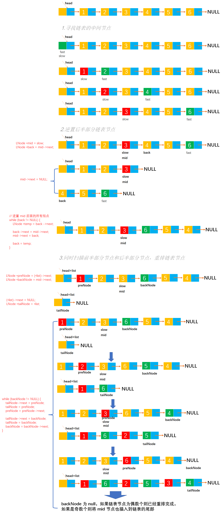

# Example041

## 题目

设线性表 `L=(a1, a2, a3, ..., a(n-2), a(n-1), an)` 采用带头结点的单链表保存，链表中的节点定义如下：

```c 
typedef struct node {
    int data;
    struct node* next;
} NODE;
```

请设计一个空间复杂度为 `O(1)` 且时间上尽可能高效的算法，重新排列 L 中的各节点，得到线性表 `L'=(a1, an, a2, a(n-1), a3, a(n-2), ...)`。


## 分析

本题考查的知识点：

- 单链表
- 寻找单链表的中间节点
- 逆置单链表
- 尾插法创建单链表

**分析**：

例如链表节点个数为奇数，如 `L = [1, 2, 3, 4, 5]` 重新排列后为 `L' = [1, 5, 2, 4, 3]`。例如链表节点个数为偶数，如 `L = [1, 2, 3, 4, 5, 6]` 重新排列后为 `L' = [1, 6, 2, 5, 3, 4]`。

发现规律是 `L'` 是 `L` 摘取第一个元素，再摘取倒数第一个元素……依次合并而成的。如果没有对空间复杂度有要求，那么如果把所有节点的数据存入数组，然后通过数组下标来取元素组成新链表，实现就很容易了。但题目要求用 `O(1)`
的空间复杂度，所以必须原地修改链表。

为了方便后半段取元素，需要先将 `L` 后半段原地逆置（要求空间复杂度为 `O(1)`），否则每取最后一个节点都需要遍历一次链表。

- ①先找出链表 `L` 的中间节点，利用快慢指针的方法，设置两个指针 `fast` 和 `slow`，指针 `slow` 每次走一步，指针 `fast` 每次走两步，当快指针 `fast` 到达链表尾时，慢指针 `slow`
  正好处于链表的中间节点。
- ②然后将 `L` 的后半段节点原地逆置。
- ③从单链表前后两段依次各取一个节点，按要求重排。

**注意**；

- 无论是寻找链表中间节点还是重排链表，都需要注意链表节点个数是奇数还是偶数，分情况处理。
- 寻找链表中间节点可参考：[寻找链表的中间节点](https://github.com/lcl100/data-structure-learning/blob/main/src/%E7%BA%BF%E6%80%A7%E8%A1%A8/%E6%B3%A8%E6%84%8F%E4%BA%8B%E9%A1%B9/Note003-%E5%AF%BB%E6%89%BE%E9%93%BE%E8%A1%A8%E7%9A%84%E4%B8%AD%E9%97%B4%E8%8A%82%E7%82%B9.md)
- 逆置单链表可参考：[原地逆置单链表](https://github.com/lcl100/data-structure-learning/blob/main/src/%E7%BA%BF%E6%80%A7%E8%A1%A8/%E6%B3%A8%E6%84%8F%E4%BA%8B%E9%A1%B9/Note004-%E9%80%86%E7%BD%AE%E5%8D%95%E9%93%BE%E8%A1%A8.md)


## 图解




## C实现

核心代码：

```c
/**
 * 重排链表中的节点
 * @param list 链表
 */
void reverse(LNode **list) {
    // 1.寻找链表的中间节点
    // 使用快慢指针法，快指针 fast 前进两步，慢指针 slow 前进一步，当快指针到达链表尾部时慢指针刚好到达链表的中部
    LNode *fast = *list;
    LNode *slow = *list;
    while (fast != NULL && fast->next != NULL) {
        fast = fast->next->next;
        slow = slow->next;
    }

    // 2.逆置后半部分链表节点
    // 变量，记录单链表的中间节点。如果链表节点个数是奇数，则是最中间的节点；如果链表节点个数是偶数，则是两个中间节点中的前一个
    LNode *mid = slow;
    // 变量，记录后半部分的节点，初始为中间节点的后继节点，即后半部分链表的第一个节点
    LNode *back = mid->next;
    // 将中间节点的 next 指针指向 null，表示把当 mid 当作一个头节点，后半部分节点逆置后仍然链接到 mid 的后面
    mid->next = NULL;
    // 扫描 back 所表示的后半部分链表，通过头插法重新插入到 mid 的后边，即逆置后半部分单链表
    while (back != NULL) {
        LNode *temp = back->next;

        back->next = mid->next;
        mid->next = back;

        back = temp;
    }

    // 3.同时扫描前半部分节点和后半部分节点，重排链表节点
    // 变量，记录前半部分的节点，初始指向链表的第一个节点，用于扫描链表前半部分的所有节点
    LNode *preNode = (*list)->next;
    // 变量，记录后半部分的节点
    LNode *backNode = mid->next;
    // 由于要重新移动链表节点，所以将头节点的 next 指向 null，重新为链表插入元素
    (*list)->next = NULL;
    // 变量，记录新链表的尾节点，用于尾插法插入
    LNode *tailNode = *list;
    // 同时扫描 preNode 和 backNode 所代表的链表，将 preNode 和 backNode 节点插入到 list 后面，直至 backNode 为 NULL 结束
    while (backNode != NULL) {
        // 使用尾插法将 preNode 节点插入到 list 后面，然后继续下一个节点
        tailNode->next = preNode;
        tailNode = preNode;
        preNode = preNode->next;

        // 使用尾插法将 backNode 节点插入到 list 后面，然后继续下一个节点
        tailNode->next = backNode;
        tailNode = backNode;
        backNode = backNode->next;
    }
    // 如果链表节点是奇数个，则可能前半部分有一个节点还未插入新链表
    if (preNode == mid) {
        tailNode->next = mid;
        tailNode = mid;
        tailNode->next = NULL;// 由于 mid 节点的 next 指针指向不为 null，为了一个链表的完整性，将最后一个节点的 next 指向 null 才能正常使用，否则陷入链表循环
    }
}
```

完整代码：

```c
#include <stdio.h>
#include <malloc.h>

/**
 * 单链表节点
 */
typedef struct LNode {
    /**
     * 单链表节点的数据域
     */
    int data;
    /**
     * 单链表节点的的指针域，指向当前节点的后继节点
     */
    struct LNode *next;
} LNode;

/**
 * 通过尾插法创建单链表
 * @param list 单链表
 * @param nums 创建单链表时插入的数据数组
 * @param n 数组长度
 * @return 创建好的单链表
 */
LNode *createByTail(LNode **list, int nums[], int n) {
    // 1.初始化单链表
    // 创建链表必须要先初始化链表，也可以选择直接调用 init() 函数
    *list = (LNode *) malloc(sizeof(LNode));
    (*list)->next = NULL;

    // 尾插法，必须知道链表的尾节点（即链表的最后一个节点），初始时，单链表的头结点就是尾节点
    // 因为在单链表中插入节点我们必须知道前驱节点，而头插法中的前驱节点一直是头节点，但尾插法中要在单链表的末尾插入新节点，所以前驱节点一直都是链表的最后一个节点，而链表的最后一个节点由于链表插入新节点会一直变化
    LNode *node = (*list);

    // 2.循环数组，将所有数依次插入到链表的尾部
    for (int i = 0; i < n; i++) {
        // 2.1 创建新节点，并指定数据域和指针域
        // 2.1.1 创建新节点，为其分配空间
        LNode *newNode = (LNode *) malloc(sizeof(LNode));
        // 2.1.2 为新节点指定数据域
        newNode->data = nums[i];
        // 2.1.3 为新节点指定指针域，新节点的指针域初始时设置为 null
        newNode->next = NULL;

        // 2.2 将新节点插入到单链表的尾部
        // 2.2.1 将链表原尾节点的 next 指针指向新节点
        node->next = newNode;
        // 2.2.2 将新节点置为新的尾节点
        node = newNode;
    }
    return *list;
}

/**
 * 重排链表中的节点
 * @param list 链表
 */
void reverse(LNode **list) {
    // 1.寻找链表的中间节点
    // 使用快慢指针法，快指针 fast 前进两步，慢指针 slow 前进一步，当快指针到达链表尾部时慢指针刚好到达链表的中部
    LNode *fast = *list;
    LNode *slow = *list;
    while (fast != NULL && fast->next != NULL) {
        fast = fast->next->next;
        slow = slow->next;
    }

    // 2.逆置后半部分链表节点
    // 变量，记录单链表的中间节点。如果链表节点个数是奇数，则是最中间的节点；如果链表节点个数是偶数，则是两个中间节点中的前一个
    LNode *mid = slow;
    // 变量，记录后半部分的节点，初始为中间节点的后继节点，即后半部分链表的第一个节点
    LNode *back = mid->next;
    // 将中间节点的 next 指针指向 null，表示把当 mid 当作一个头节点，后半部分节点逆置后仍然链接到 mid 的后面
    mid->next = NULL;
    // 扫描 back 所表示的后半部分链表，通过头插法重新插入到 mid 的后边，即逆置后半部分单链表
    while (back != NULL) {
        LNode *temp = back->next;

        back->next = mid->next;
        mid->next = back;

        back = temp;
    }

    // 3.同时扫描前半部分节点和后半部分节点，重排链表节点
    // 变量，记录前半部分的节点，初始指向链表的第一个节点，用于扫描链表前半部分的所有节点
    LNode *preNode = (*list)->next;
    // 变量，记录后半部分的节点
    LNode *backNode = mid->next;
    // 由于要重新移动链表节点，所以将头节点的 next 指向 null，重新为链表插入元素
    (*list)->next = NULL;
    // 变量，记录新链表的尾节点，用于尾插法插入
    LNode *tailNode = *list;
    // 同时扫描 preNode 和 backNode 所代表的链表，将 preNode 和 backNode 节点插入到 list 后面，直至 backNode 为 NULL 结束
    while (backNode != NULL) {
        // 使用尾插法将 preNode 节点插入到 list 后面，然后继续下一个节点
        tailNode->next = preNode;
        tailNode = preNode;
        preNode = preNode->next;

        // 使用尾插法将 backNode 节点插入到 list 后面，然后继续下一个节点
        tailNode->next = backNode;
        tailNode = backNode;
        backNode = backNode->next;
    }
    // 如果链表节点是奇数个，则可能前半部分有一个节点还未插入新链表
    if (preNode == mid) {
        tailNode->next = mid;
        tailNode = mid;
        tailNode->next = NULL;// 由于 mid 节点的 next 指针指向不为 null，为了一个链表的完整性，将最后一个节点的 next 指向 null 才能正常使用，否则陷入链表循环
    }
}


/**
 * 打印链表的所有节点
 * @param list 单链表
 */
void print(LNode *list) {
    printf("[");
    // 链表的第一个节点
    LNode *node = list->next;
    // 循环单链表所有节点，打印值
    while (node != NULL) {
        printf("%d", node->data);
        if (node->next != NULL) {
            printf(", ");
        }
        node = node->next;
    }
    printf("]\n");
}

int main() {
    // 声明单链表
    LNode *list;
    int nums[] = {1, 2, 3, 4, 5, 6};
    int n = 6;
    createByTail(&list, nums, n);
    print(list);

    // 调用函数
    reverse(&list);
    print(list);
}
```

执行结果：

```text
[1, 2, 3, 4, 5, 6]
[1, 6, 2, 5, 3, 4]
```


## Java实现

核心代码：

```java
    /**
     * 重排链表中的节点
     */
    public void reverse() {
        // 1.寻找链表的中间节点
        // 使用快慢指针法，快指针 fast 前进两步，慢指针 slow 前进一步，当快指针到达链表尾部时慢指针刚好到达链表的中部
        LNode fast = list;
        LNode slow = list;
        while (fast != null && fast.next != null) {
            fast = fast.next.next;
            slow = slow.next;
        }

        // 2.逆置后半部分链表节点
        // 变量，记录单链表的中间节点。如果链表节点个数是奇数，则是最中间的节点；如果链表节点个数是偶数，则是两个中间节点中的前一个
        LNode mid = slow;
        // 变量，记录后半部分的节点，初始为中间节点的后继节点，即后半部分链表的第一个节点
        LNode back = mid.next;
        // 将中间节点的 next 指针指向 null，表示把当 mid 当作一个头节点，后半部分节点逆置后仍然链接到 mid 的后面
        mid.next = null;
        // 扫描 back 所表示的后半部分链表，通过头插法重新插入到 mid 的后边，即逆置后半部分单链表
        while (back != null) {
            LNode temp = back.next;

            back.next = mid.next;
            mid.next = back;

            back = temp;
        }

        // 3.同时扫描前半部分节点和后半部分节点，重排链表节点
        // 变量，记录前半部分的节点，初始指向链表的第一个节点，用于扫描链表前半部分的所有节点
        LNode preNode = (list).next;
        // 变量，记录后半部分的节点
        LNode backNode = mid.next;
        // 由于要重新移动链表节点，所以将头节点的 next 指向 null，重新为链表插入元素
        (list).next = null;
        // 变量，记录新链表的尾节点，用于尾插法插入
        LNode tailNode = list;
        // 同时扫描 preNode 和 backNode 所代表的链表，将 preNode 和 backNode 节点插入到 list 后面，直至 backNode 为 null 结束
        while (backNode != null) {
            // 使用尾插法将 preNode 节点插入到 list 后面，然后继续下一个节点
            tailNode.next = preNode;
            tailNode = preNode;
            preNode = preNode.next;

            // 使用尾插法将 backNode 节点插入到 list 后面，然后继续下一个节点
            tailNode.next = backNode;
            tailNode = backNode;
            backNode = backNode.next;
        }
        // 如果链表节点是奇数个，则可能前半部分有一个节点还未插入新链表
        if (preNode == mid) {
            tailNode.next = mid;
            tailNode = mid;
            tailNode.next = null;// 由于 mid 节点的 next 指针指向不为 null，为了一个链表的完整性，将最后一个节点的 next 指向 null 才能正常使用，否则陷入链表循环
        }
    }
```

完整代码：

```java
public class LinkedList {
    /**
     * 单链表
     */
    private LNode list;

    /**
     * 通过尾插法创建单链表
     *
     * @param nums 创建单链表时插入的数据
     * @return 创建好的单链表
     */
    public LNode createByTail(int... nums) {
        // 1.初始化单链表
        // 创建链表必须要先初始化链表，也可以选择直接调用 init() 函数
        list = new LNode();
        list.next = null;

        // 尾插法，必须知道链表的尾节点（即链表的最后一个节点），初始时，单链表的头结点就是尾节点
        // 因为在单链表中插入节点我们必须知道前驱节点，而头插法中的前驱节点一直是头节点，但尾插法中要在单链表的末尾插入新节点，所以前驱节点一直都是链表的最后一个节点，而链表的最后一个节点由于链表插入新节点会一直变化
        LNode tailNode = list;

        // 2.循环数组，将所有数依次插入到链表的尾部
        for (int i = 0; i < nums.length; i++) {
            // 2.1 创建新节点，并指定数据域和指针域
            // 2.1.1 创建新节点，为其分配空间
            LNode newNode = new LNode();
            // 2.1.2 为新节点指定数据域
            newNode.data = nums[i];
            // 2.1.3 为新节点指定指针域，新节点的指针域初始时设置为 null
            newNode.next = null;

            // 2.2 将新节点插入到单链表的尾部
            // 2.2.1 将链表原尾节点的 next 指针指向新节点
            tailNode.next = newNode;
            // 2.2.2 将新节点置为新的尾节点
            tailNode = newNode;
        }

        return list;
    }

    /**
     * 重排链表中的节点
     */
    public void reverse() {
        // 1.寻找链表的中间节点
        // 使用快慢指针法，快指针 fast 前进两步，慢指针 slow 前进一步，当快指针到达链表尾部时慢指针刚好到达链表的中部
        LNode fast = list;
        LNode slow = list;
        while (fast != null && fast.next != null) {
            fast = fast.next.next;
            slow = slow.next;
        }

        // 2.逆置后半部分链表节点
        // 变量，记录单链表的中间节点。如果链表节点个数是奇数，则是最中间的节点；如果链表节点个数是偶数，则是两个中间节点中的前一个
        LNode mid = slow;
        // 变量，记录后半部分的节点，初始为中间节点的后继节点，即后半部分链表的第一个节点
        LNode back = mid.next;
        // 将中间节点的 next 指针指向 null，表示把当 mid 当作一个头节点，后半部分节点逆置后仍然链接到 mid 的后面
        mid.next = null;
        // 扫描 back 所表示的后半部分链表，通过头插法重新插入到 mid 的后边，即逆置后半部分单链表
        while (back != null) {
            LNode temp = back.next;

            back.next = mid.next;
            mid.next = back;

            back = temp;
        }

        // 3.同时扫描前半部分节点和后半部分节点，重排链表节点
        // 变量，记录前半部分的节点，初始指向链表的第一个节点，用于扫描链表前半部分的所有节点
        LNode preNode = (list).next;
        // 变量，记录后半部分的节点
        LNode backNode = mid.next;
        // 由于要重新移动链表节点，所以将头节点的 next 指向 null，重新为链表插入元素
        (list).next = null;
        // 变量，记录新链表的尾节点，用于尾插法插入
        LNode tailNode = list;
        // 同时扫描 preNode 和 backNode 所代表的链表，将 preNode 和 backNode 节点插入到 list 后面，直至 backNode 为 null 结束
        while (backNode != null) {
            // 使用尾插法将 preNode 节点插入到 list 后面，然后继续下一个节点
            tailNode.next = preNode;
            tailNode = preNode;
            preNode = preNode.next;

            // 使用尾插法将 backNode 节点插入到 list 后面，然后继续下一个节点
            tailNode.next = backNode;
            tailNode = backNode;
            backNode = backNode.next;
        }
        // 如果链表节点是奇数个，则可能前半部分有一个节点还未插入新链表
        if (preNode == mid) {
            tailNode.next = mid;
            tailNode = mid;
            tailNode.next = null;// 由于 mid 节点的 next 指针指向不为 null，为了一个链表的完整性，将最后一个节点的 next 指向 null 才能正常使用，否则陷入链表循环
        }
    }

    /**
     * 打印单链表所有节点
     */
    public void print() {
        // 链表的第一个节点
        LNode node = list.next;
        // 循环打印
        String str = "[";
        while (node != null) {
            // 拼接节点的数据域
            str += node.data;
            // 只要不是最后一个节点，那么就在每个节点的数据域后面添加一个分号，用于分隔字符串
            if (node.next != null) {
                str += ", ";
            }
            // 继续链表的下一个节点
            node = node.next;
        }
        str += "]";
        // 打印链表
        System.out.println(str);
    }
}

/**
 * 单链表的节点
 */
class LNode {
    /**
     * 链表的数据域，暂时指定为 int 类型，因为 Java 支持泛型，可以指定为泛型，就能支持更多的类型了
     */
    int data;
    /**
     * 链表的指针域，指向该节点的下一个节点
     */
    LNode next;
}
```

测试代码：

```java
public class LinkedListTest {
    public static void main(String[] args) {
        // 链表节点为奇数的情况
        LinkedList list1 = new LinkedList();
        list1.createByTail(1, 2, 3, 4, 5);// 创建单链表
        list1.print();
        list1.reverse();// 调用函数
        list1.print();

        System.out.println();

        // 链表节点为奇数的情况
        LinkedList list2 = new LinkedList();
        list2.createByTail(1, 2, 3, 4, 5, 6, 7, 8);// 创建单链表
        list2.print();
        list2.reverse();// 调用函数
        list2.print();
    }
}
```

执行结果：

```text
[1, 2, 3, 4, 5]
[1, 5, 2, 4, 3]

[1, 2, 3, 4, 5, 6, 7, 8]
[1, 8, 2, 7, 3, 6, 4, 5]
```
