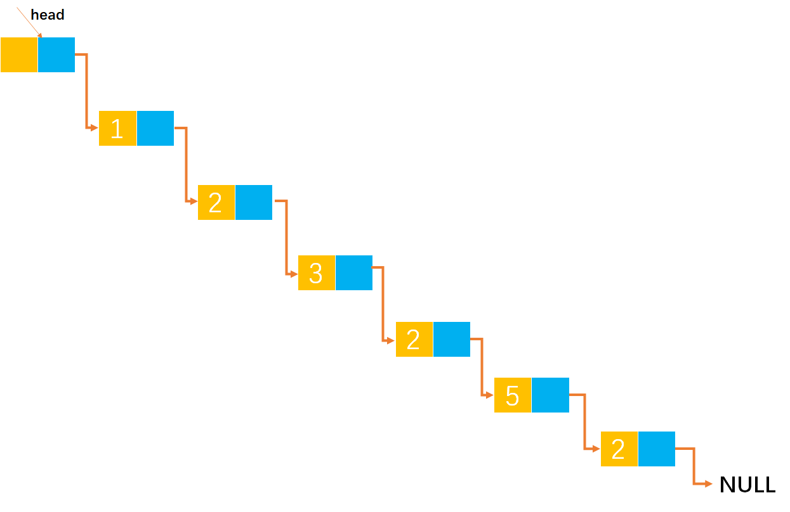

# Example042

## 题目

设计一个递归算法，删除不带头结点的单链表 L 中所有值为 x 的结点。

## 分析

设 `f(L, x)` 的功能是删除以 L 为首结点指针的单链表中所有值等于 x 的结点，而 `f(L->next, x)` 的功能是删除以 `L->next` 为首结点指针的单链表中所有值等于 x 的结点。推出递归模型如下：

- 终止条件：`f(L, x) = 不做任何事情;`    若 L 为空表
- 递归主体：
    - `f(L, x) = 删除 L 节点; f(L->next, x);`    若 `L->data==x`
    - `f(L, x) = f(L->next, x);`    其他情况

## 图解



## C实现

核心代码：

```c
/**
 * 递归删除单链表中所有值为 x 的节点
 * @param list 单链表
 * @param x 指定值
 */
void delX(LNode **list, int x) {
    if (*list == NULL) {
        return;
    }
    if ((*list)->data == x) {// 如果 L 所指结点的值为 x
        LNode *node = *list;// 删除 L，并让 L 指向下一节点
        *list = (*list)->next;
        free(node);

        delX(list, x);// 递归调用
    } else {// 若 L 所指结点的值不为 x
        delX(&((*list)->next), x);
    }
}
```

完整代码：

```c
#include <stdio.h>
#include <malloc.h>

/**
 * 单链表节点
 */
typedef struct LNode {
    /**
     * 单链表节点的数据域
     */
    int data;
    /**
     * 单链表节点的的指针域，指向当前节点的后继节点
     */
    struct LNode *next;
} LNode;

/**
 * 通过尾插法创建单链表
 * @param list 单链表
 * @param nums 创建单链表时插入的数据数组
 * @param n 数组长度
 * @return 创建好的单链表
 */
LNode *createByTail(LNode **list, int nums[], int n) {
    // 1.初始化单链表
    // 创建链表必须要先初始化链表，也可以选择直接调用 init() 函数
    *list = (LNode *) malloc(sizeof(LNode));
    (*list)->next = NULL;

    // 尾插法，必须知道链表的尾节点（即链表的最后一个节点），初始时，单链表的头结点就是尾节点
    // 因为在单链表中插入节点我们必须知道前驱节点，而头插法中的前驱节点一直是头节点，但尾插法中要在单链表的末尾插入新节点，所以前驱节点一直都是链表的最后一个节点，而链表的最后一个节点由于链表插入新节点会一直变化
    LNode *node = (*list);

    // 2.循环数组，将所有数依次插入到链表的尾部
    for (int i = 0; i < n; i++) {
        // 2.1 创建新节点，并指定数据域和指针域
        // 2.1.1 创建新节点，为其分配空间
        LNode *newNode = (LNode *) malloc(sizeof(LNode));
        // 2.1.2 为新节点指定数据域
        newNode->data = nums[i];
        // 2.1.3 为新节点指定指针域，新节点的指针域初始时设置为 null
        newNode->next = NULL;

        // 2.2 将新节点插入到单链表的尾部
        // 2.2.1 将链表原尾节点的 next 指针指向新节点
        node->next = newNode;
        // 2.2.2 将新节点置为新的尾节点
        node = newNode;
    }
    return *list;
}

/**
 * 递归删除单链表中所有值为 x 的节点
 * @param list 单链表
 * @param x 指定值
 */
void delX(LNode **list, int x) {
    if (*list == NULL) {
        return;
    }
    if ((*list)->data == x) {// 如果 L 所指结点的值为 x
        LNode *node = *list;// 删除 L，并让 L 指向下一节点
        *list = (*list)->next;
        free(node);

        delX(list, x);// 递归调用
    } else {// 若 L 所指结点的值不为 x
        delX(&((*list)->next), x);
    }
}

/**
 * 打印链表的所有节点
 * @param list 单链表
 */
void print(LNode *list) {
    printf("[");
    // 链表的第一个节点
    LNode *node = list->next;
    // 循环单链表所有节点，打印值
    while (node != NULL) {
        printf("%d", node->data);
        if (node->next != NULL) {
            printf(", ");
        }
        node = node->next;
    }
    printf("]\n");
}

int main() {
    // 声明单链表
    LNode *list;
    int nums[] = {1, 2, 3, 2, 5, 2};
    int n = 6;
    createByTail(&list, nums, n);
    print(list);

    // 调用函数
    delX(&list, 2);
    print(list);
}
```

执行结果：

```text
[1, 2, 3, 2, 5, 2]
[1, 3, 5]
```

注意：在数据结构题目中更倾向于使用 `*&` 引用来修改单链表，而不是使用指向指针的指针 `**`。尽管那属于 C++ 中的知识。避免陷入C语言语法中。

```c
#include <stdio.h>
#include <malloc.h>

/**
 * 单链表节点
 */
typedef struct LNode {
    /**
     * 单链表节点的数据域
     */
    int data;
    /**
     * 单链表节点的的指针域，指向当前节点的后继节点
     */
    struct LNode *next;
} LNode;

/**
 * 通过尾插法创建单链表
 * @param list 单链表
 * @param nums 创建单链表时插入的数据数组
 * @param n 数组长度
 * @return 创建好的单链表
 */
LNode *createByTail(LNode *&list, int nums[], int n) {
    // 1.初始化单链表
    // 创建链表必须要先初始化链表，也可以选择直接调用 init() 函数
    list = (LNode *) malloc(sizeof(LNode));
    list->next = NULL;

    // 尾插法，必须知道链表的尾节点（即链表的最后一个节点），初始时，单链表的头结点就是尾节点
    // 因为在单链表中插入节点我们必须知道前驱节点，而头插法中的前驱节点一直是头节点，但尾插法中要在单链表的末尾插入新节点，所以前驱节点一直都是链表的最后一个节点，而链表的最后一个节点由于链表插入新节点会一直变化
    LNode *node = list;

    // 2.循环数组，将所有数依次插入到链表的尾部
    for (int i = 0; i < n; i++) {
        // 2.1 创建新节点，并指定数据域和指针域
        // 2.1.1 创建新节点，为其分配空间
        LNode *newNode = (LNode *) malloc(sizeof(LNode));
        // 2.1.2 为新节点指定数据域
        newNode->data = nums[i];
        // 2.1.3 为新节点指定指针域，新节点的指针域初始时设置为 null
        newNode->next = NULL;

        // 2.2 将新节点插入到单链表的尾部
        // 2.2.1 将链表原尾节点的 next 指针指向新节点
        node->next = newNode;
        // 2.2.2 将新节点置为新的尾节点
        node = newNode;
    }
    return list;
}

/**
 * 递归删除单链表中所有值为 x 的节点
 * @param list 单链表
 * @param x 指定值
 */
void delX(LNode *&list, int x) {
    if (list == NULL) {
        return;
    }
    if (list->data == x) {// 如果 L 所指结点的值为 x
        LNode *node = list;// 删除 L，并让 L 指向下一节点
        list = list->next;
        free(node);

        delX(list, x);// 递归调用
    } else {// 若 L 所指结点的值不为 x
        delX(list->next, x);
    }
}

/**
 * 打印链表的所有节点
 * @param list 单链表
 */
void print(LNode *list) {
    printf("[");
    // 链表的第一个节点
    LNode *node = list->next;
    // 循环单链表所有节点，打印值
    while (node != NULL) {
        printf("%d", node->data);
        if (node->next != NULL) {
            printf(", ");
        }
        node = node->next;
    }
    printf("]\n");
}

int main() {
    // 声明单链表
    LNode *list;
    int nums[] = {1, 2, 3, 2, 5, 2};
    int n = 6;
    createByTail(list, nums, n);
    print(list);

    // 调用函数
    delX(list, 2);
    print(list);
}
```

## Java实现

> 注：下面的代码并未完整实现功能。

核心代码：

```java
    /**
 * 利用递归删除单链表中所有值为 x 的节点
 *
 * @param x 指定值
 */
public void delX(int x){
        recursion(list,x);
        }

/**
 * 递归删除单链表中所有值为 x 的节点
 *
 * @param list 单链表
 * @param x    指定值
 */
private void recursion(LNode list,int x){
        // 终止条件
        if(list==null){
        return;
        }
        if(list.data==x){// 如果 L 所指结点的值为 x
        // 删除节点
        list=list.next;
        // 递归调用
        recursion(list,x);
        }else{// 若 L 所指结点的值不为 x
        // 递归调用
        recursion(list.next,x);
        }
        }
```

完整代码：

```java
public class LinkedList {
    /**
     * 单链表
     */
    private LNode list;

    /**
     * 通过尾插法创建单链表
     *
     * @param nums 创建单链表时插入的数据
     * @return 创建好的单链表
     */
    public LNode createByTail(int... nums) {
        // 1.初始化单链表
        // 创建链表必须要先初始化链表，也可以选择直接调用 init() 函数
        list = new LNode();
        list.next = null;

        // 尾插法，必须知道链表的尾节点（即链表的最后一个节点），初始时，单链表的头结点就是尾节点
        // 因为在单链表中插入节点我们必须知道前驱节点，而头插法中的前驱节点一直是头节点，但尾插法中要在单链表的末尾插入新节点，所以前驱节点一直都是链表的最后一个节点，而链表的最后一个节点由于链表插入新节点会一直变化
        LNode tailNode = list;

        // 2.循环数组，将所有数依次插入到链表的尾部
        for (int i = 0; i < nums.length; i++) {
            // 2.1 创建新节点，并指定数据域和指针域
            // 2.1.1 创建新节点，为其分配空间
            LNode newNode = new LNode();
            // 2.1.2 为新节点指定数据域
            newNode.data = nums[i];
            // 2.1.3 为新节点指定指针域，新节点的指针域初始时设置为 null
            newNode.next = null;

            // 2.2 将新节点插入到单链表的尾部
            // 2.2.1 将链表原尾节点的 next 指针指向新节点
            tailNode.next = newNode;
            // 2.2.2 将新节点置为新的尾节点
            tailNode = newNode;
        }

        return list;
    }

    /**
     * 利用递归删除单链表中所有值为 x 的节点
     *
     * @param x 指定值
     */
    public void delX(int x) {
        recursion(list, x);
    }

    /**
     * 递归删除单链表中所有值为 x 的节点
     *
     * @param list 单链表
     * @param x    指定值
     */
    private void recursion(LNode list, int x) {
        // 终止条件
        if (list == null) {
            return;
        }
        if (list.data == x) {// 如果 L 所指结点的值为 x
            // 删除节点
            list = list.next;
//            list.data = list.next.data;
//            list.next = list.next.next;
            // 递归调用
            recursion(list, x);
        } else {// 若 L 所指结点的值不为 x
            // 递归调用
            recursion(list.next, x);
        }
    }

    /**
     * 打印单链表所有节点
     */
    public void print() {
        // 链表的第一个节点
        LNode node = list.next;
        // 循环打印
        String str = "[";
        while (node != null) {
            // 拼接节点的数据域
            str += node.data;
            // 只要不是最后一个节点，那么就在每个节点的数据域后面添加一个分号，用于分隔字符串
            if (node.next != null) {
                str += ", ";
            }
            // 继续链表的下一个节点
            node = node.next;
        }
        str += "]";
        // 打印链表
        System.out.println(str);
    }
}

/**
 * 单链表的节点
 */
class LNode {
    /**
     * 链表的数据域，暂时指定为 int 类型，因为 Java 支持泛型，可以指定为泛型，就能支持更多的类型了
     */
    int data;
    /**
     * 链表的指针域，指向该节点的下一个节点
     */
    LNode next;
}
```

测试代码：

```java
public class LinkedListTest {
    public static void main(String[] args) {
        LinkedList list = new LinkedList();
        list.createByTail(1, 2, 3, 2, 5);// 创建单链表
        list.print();

        // 调用函数删除所有值为 x 的节点
        int x = 2;
        list.delX(x);
        list.print();
    }
}
```

执行结果：

```text
[1, 2, 3, 2, 5]
[1, 2, 3, 2, 5]
```

可以看到上述代码并未实现单链表的删除功能，因为函数传入的 `list` 参数并未改变函数外的 `list`，Java函数传参是值传递而非引用传递，所以该算法无法有效实现。

我们还可以尝试另外一种删除办法，即将后继节点的数据域值赋给被删除节点，然后删除被删除的后继节点，这种做法有一个弊端，就是无法删除链表的尾节点，如`head -> 1 -> 2 -> 3 -> 2 -> 5`
是可以成功删除的，但是 `head -> 1 -> 2 -> 3 -> 2 -> 5 -> 2`就会报错了。代码如下：

```java
    /**
 * 利用递归删除单链表中所有值为 x 的节点
 *
 * @param x 指定值
 */
public void delX(int x){
        recursion(list,x);
        }

/**
 * 递归删除单链表中所有值为 x 的节点
 *
 * @param list 单链表
 * @param x    指定值
 */
private void recursion(LNode list,int x){
        // 终止条件
        if(list==null){
        return;
        }
        if(list.data==x){// 如果 L 所指结点的值为 x
        // 删除节点
        list.data=list.next.data;// 将 list.next 节点的数据域值赋给 list 节点
        list.next=list.next.next;// 然后删除 list.next 节点
        // 递归调用
        recursion(list,x);
        }else{// 若 L 所指结点的值不为 x
        // 递归调用
        recursion(list.next,x);
        }
        }
```


