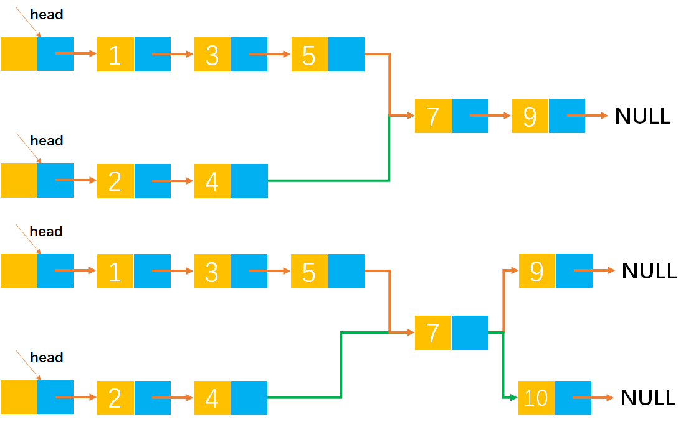
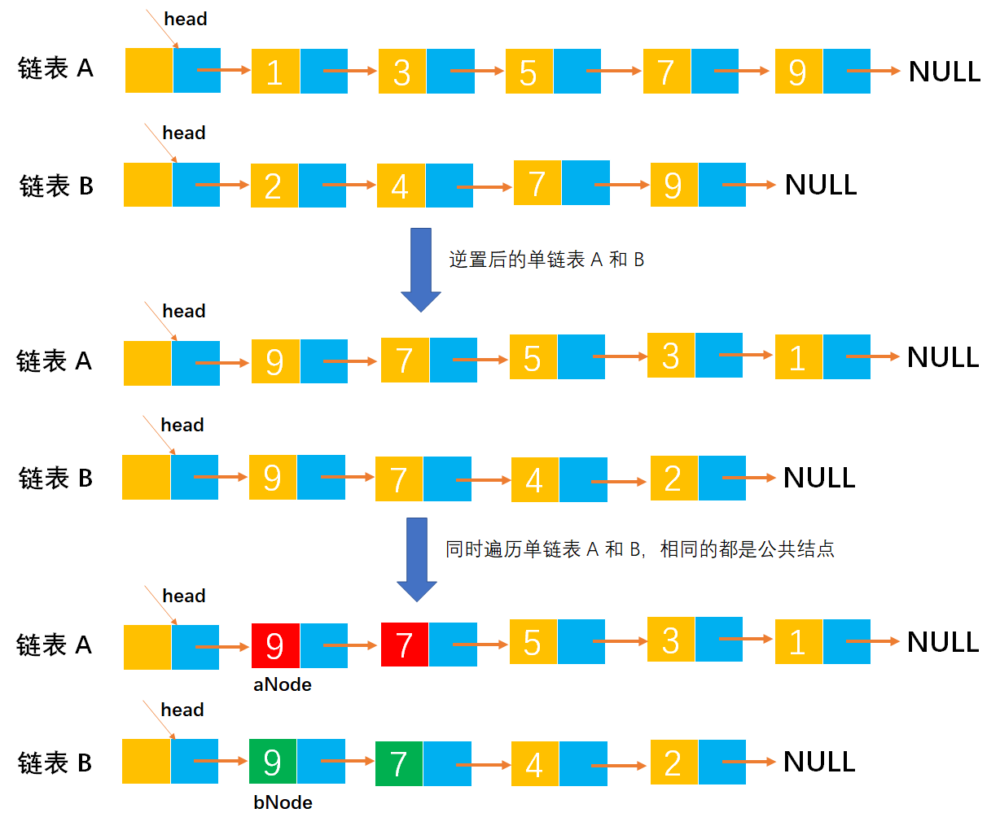
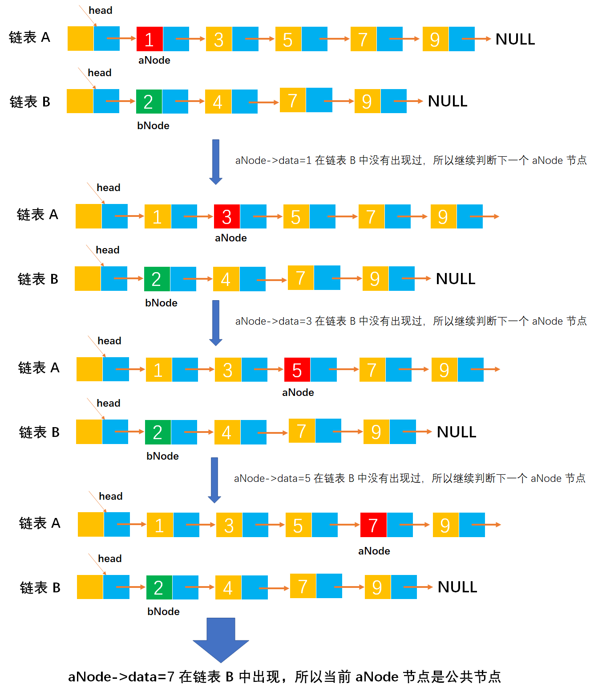
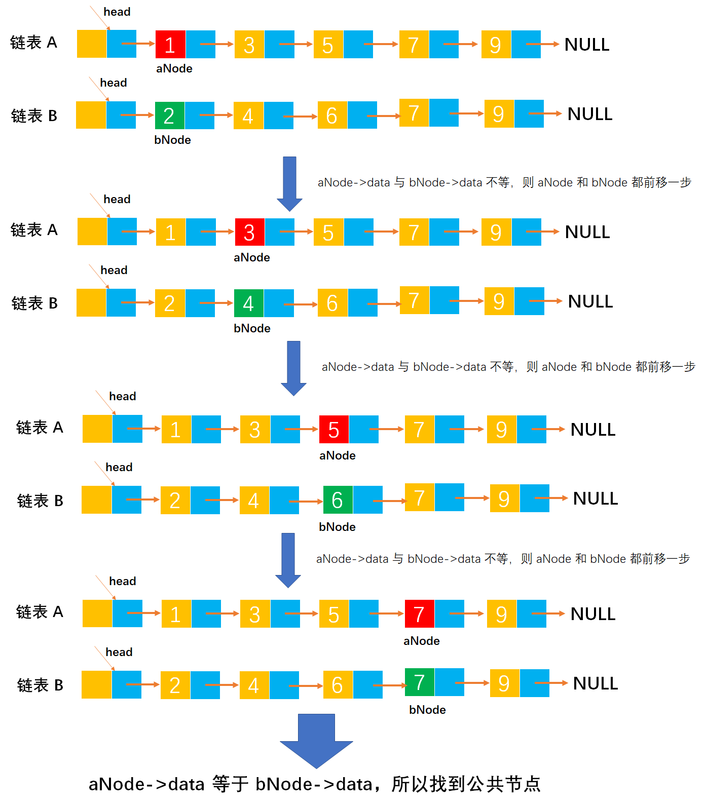
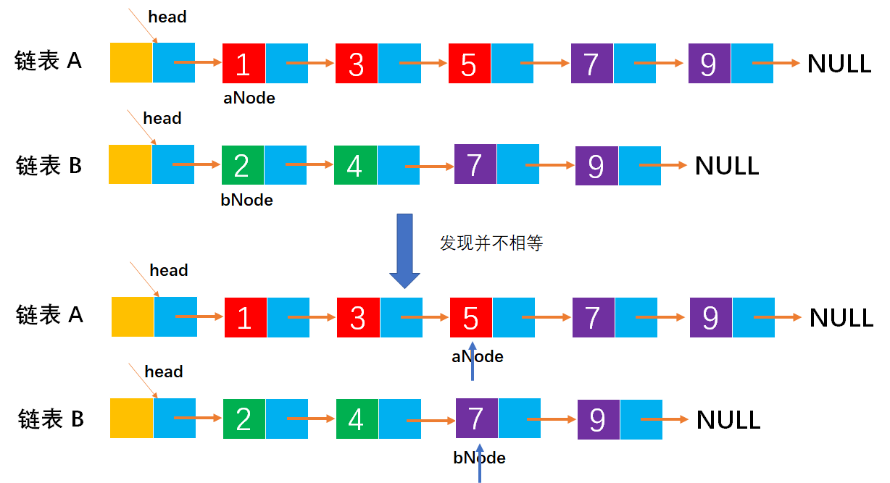
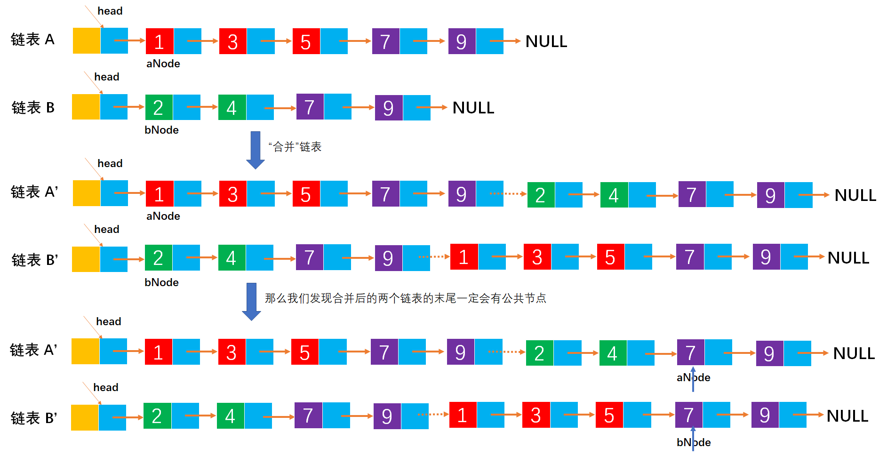
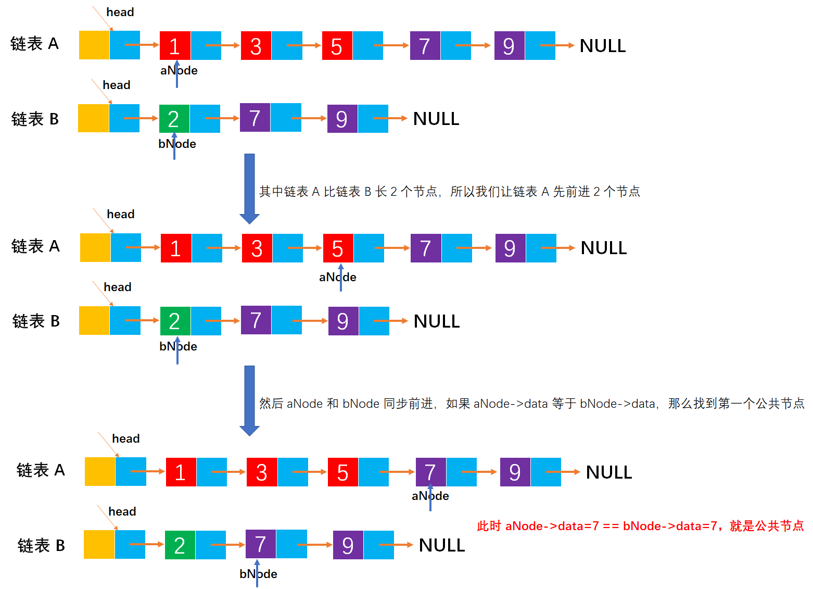

# Example043

## 题目

给定两个单链表，编写算法找出两个链表的公共节点。


## 分析

两个单链表有公共结点，即两个链表从某一结点开始，它们的 `next` 都指向同一个结点。由于每个单链表结点只有一个 `next` 域，因此从第一个公共结点开始，之后它们所有的结点都是重合的，不可能再出现分叉。所以两个有公共结点而部分重合的单链表，拓扑形状看起来像 `Y`，而不可能像 `X`。




### 解法一分析

如果我们不考虑维持原链表，那么我们可以将两个链表逆置，逆置之后的链表如果存在公共结点，那么前几个结点一定相等，就是公共结点。




### 解法二分析

在第一个链表上顺序遍历每个结点，每遍历一个结点，在第二个链表上顺序遍历所有节点，若找到两个相同的节点，则找到了它们的公共节点。该算法的时间复杂度为 `O(an*bn)`。




### 解法三分析

当链表 A 和 B 长度相同时，找出公共节点很简单，只需要设置两个指针 `aNode` 和 `bNode` 同时指向链表 A 和 B 的第一个节点，并依次比较两个指针指向的数据域是否相同，那么一定会在公共节点处返回。如图：



但是，如果链表 A 和 B 的长度不相等，那么 `aNode` 和 `bNode` 就不会同时经过公共节点，自然无法判断相等。如图：



解决办法很简单，我们可以把链表 B 链接到链表 A 的后面，将链表 A 链接到链表 B 的后面，这样形成的两个新链表，长度一定是相等。但事实上我们不需要拼接链表，只需要在遍历完自己的链表后立刻遍历对方的链表，这样两个链表长度就是“相等”的，那么就很容易找到公共节点了。



### 解法四分析

解法四是书上提供的思路。由于两个链表的长度不一样，因此顺序遍历两个链表到尾节点时，并不能保证在两个链表上同时到达公共结点。但假设一个链表比另外一个链表长 `k` 个节点，那么我们先在长的链表上遍历 `k` 个节点，之后再同步遍历，此时我们就能保证同时到达最后一个节点。由于两个链表从第一个公共节点开始到链表的尾节点，这一部分是重合的，因此它们肯定也是同时到达第一个公共节点，于是，在遍历中第一个相同的节点就是第一个公共节点。



根据这个思路，我们要先遍历两个链表得到它们的长度，并求出两个长度之差。在长的链表上先链表长度之差个节点之后，再同步遍历两个链表，直到找到相同的节点，或者一直到链表结束。该方法的时间复杂度为 `O(an+bn)`。


## C实现

解法一核心代码：

```c
/**
 * 逆置单链表
 * @param list 单链表
 */
void inversion(LNode **list) {
    LNode *node = (*list)->next;
    (*list)->next = NULL;
    while (node != NULL) {
        LNode *temp = node->next;

        node->next = (*list)->next;
        (*list)->next = node;

        node = temp;
    }
}

/**
 * 找出两个链表的公共节点
 * @param A 第一个链表
 * @param B 第二个节点
 * @return 公共节点
 */
LNode *getCommonNode(LNode *A, LNode *B) {
    // 逆置单链表 A 和 B
    inversion(&A);
    inversion(&B);

    // 变量，记录公共节点
    LNode *commonNode;
    // 变量，记录链表 A 和 B 的第一个节点
    LNode *aNode = A->next;
    LNode *bNode = B->next;
    // 同时扫描逆置后的链表 A 和 B
    while (aNode != NULL && bNode != NULL) {
        if (aNode->data == bNode->data) {
            // 记录公共节点，commonNode 等于 aNode 或者 bNode 都可以
            commonNode = aNode;
        } else {
            // 如果不等，则跳出循环，公共节点已经遍历结束
            break;
        }
        // 继续下一对节点
        aNode = aNode->next;
        bNode = bNode->next;
    }

    return commonNode;
}
```

解法二核心代码：

```c
/**
 * 找出两个链表的公共节点
 * @param A 第一个链表
 * @param B 第二个节点
 * @return 公共节点
 */
LNode *getCommonNode(LNode *A, LNode *B) {
    // 变量，分别记录链表 A 和 B 的第一个节点
    LNode *aNode = A->next;
    LNode *bNode = B->next;

    // 变量，记录公共节点
    LNode *commonNode;
    // 从头到尾扫描链表 A 中所有节点
    while (aNode != NULL) {
        // 变量，标记 aNode 节点是否是公共节点，如果是公共节点，则退出循环
        int flag = 0;// 1 表示是公共节点，0 表示不是公共节点
        // 重置 bNode 节点为链表 B 的第一个节点，因为每次循环都需要从第一个节点开始
        bNode = B->next;
        // 然后将 aNode 节点在链表 B 中查找，如果找到相同的节点则表示是公共节点
        while (bNode != NULL) {
            if (aNode->data == bNode->data) {
                // 记录公共节点
                commonNode = aNode;
                // 修改 flag 标记，标记 aNode 为公共节点
                flag = 1;
                // 跳出循环
                break;
            }
            bNode = bNode->next;
        }
        // 判断 flag 标记，来判断 aNode 是否是公共节点，如果是公共节点则退出循环
        if (flag == 1) {
            break;
        }
        aNode = aNode->next;
    }

    return commonNode;
}
```

解法三核心代码：

```c
/**
 * 找出两个链表的公共节点
 * @param A 第一个链表
 * @param B 第二个节点
 * @return 公共节点
 */
LNode *getCommonNode(LNode *A, LNode *B) {
    // 变量，分别记录链表 A 和 B 的第一个节点
    LNode *aNode = A->next;
    LNode *bNode = B->next;

    // 变量，记录公共节点
    LNode *commonNode;
    // 从头到尾扫描链表 A+B 和 B+A
    while (aNode != NULL && bNode != NULL) {
        // 更新 aNode
        if (aNode->next != NULL) {
            // 遍历链表 A 中所有节点
            aNode = aNode->next;
        } else {
            // 如果到达链表 A 的尾节点，那么就要开始遍历链表 B 的所有结点
            aNode = B->next;
        }
        // 更新 bNode
        if (bNode->next != NULL) {
            // 遍历链表 B 中所有节点
            bNode = bNode->next;
        } else {
            // 如果到达链表 B 的尾节点，那么就要开始链表 A 的所有结点
            bNode = A->next;
        }
        // 如果找到公共结点，则返回
        if (aNode->data == bNode->data) {
            commonNode = aNode;
            break;
        }
    }

    return commonNode;
}
```

解法四核心代码：

```c
/**
 * 求链表节点个数
 * @param list 链表
 * @return 链表长度
 */
int size(LNode *list) {
    int len = 0;
    LNode *node = list->next;
    while (node != NULL) {
        len++;
        node = node->next;
    }
    return len;
}

/**
 * 找出两个链表的公共节点
 * @param A 第一个链表
 * @param B 第二个节点
 * @return 公共节点
 */
LNode *getCommonNode(LNode *A, LNode *B) {
    // 求链表 A 和 B 的长度
    int an = size(A);
    int bn = size(B);

    // 变量，记录长链表和短链表
    LNode *longList;
    LNode *shortList;
    // 变量，记录长度之差
    int diff;
    // 计算长度之差和记录长链表和短链表
    if (an > bn) {
        longList = A->next;
        shortList = B->next;
        diff = an - bn;
    } else {
        longList = B->next;
        shortList = A->next;
        diff = bn - an;
    }

    // 让长链表前进 diff 步
    while (diff > 0) {
        longList = longList->next;
        diff--;
    }

    // 变量，记录公共节点
    LNode *commonNode;
    // 然后让长链表和短链表同步前进，直到链表尾或者找到公共节点
    while (shortList != NULL && longList != NULL) {
        // 如果找到公共节点则返回
        if (shortList->data == longList->data) {
            commonNode = longList;
            break;
        }
        // 否则继续前进，判断下一对节点
        shortList = shortList->next;
        longList = longList->next;
    }

    return commonNode;
}
```

完整代码：

```c
#include <stdio.h>
#include <malloc.h>

/**
 * 单链表节点
 */
typedef struct LNode {
    /**
     * 单链表节点的数据域
     */
    int data;
    /**
     * 单链表节点的的指针域，指向当前节点的后继节点
     */
    struct LNode *next;
} LNode;

/**
 * 通过尾插法创建单链表
 * @param list 单链表
 * @param nums 创建单链表时插入的数据数组
 * @param n 数组长度
 * @return 创建好的单链表
 */
LNode *createByTail(LNode **list, int nums[], int n) {
    // 1.初始化单链表
    // 创建链表必须要先初始化链表，也可以选择直接调用 init() 函数
    *list = (LNode *) malloc(sizeof(LNode));
    (*list)->next = NULL;

    // 尾插法，必须知道链表的尾节点（即链表的最后一个节点），初始时，单链表的头结点就是尾节点
    // 因为在单链表中插入节点我们必须知道前驱节点，而头插法中的前驱节点一直是头节点，但尾插法中要在单链表的末尾插入新节点，所以前驱节点一直都是链表的最后一个节点，而链表的最后一个节点由于链表插入新节点会一直变化
    LNode *node = (*list);

    // 2.循环数组，将所有数依次插入到链表的尾部
    for (int i = 0; i < n; i++) {
        // 2.1 创建新节点，并指定数据域和指针域
        // 2.1.1 创建新节点，为其分配空间
        LNode *newNode = (LNode *) malloc(sizeof(LNode));
        // 2.1.2 为新节点指定数据域
        newNode->data = nums[i];
        // 2.1.3 为新节点指定指针域，新节点的指针域初始时设置为 null
        newNode->next = NULL;

        // 2.2 将新节点插入到单链表的尾部
        // 2.2.1 将链表原尾节点的 next 指针指向新节点
        node->next = newNode;
        // 2.2.2 将新节点置为新的尾节点
        node = newNode;
    }
    return *list;
}

/**
 * 逆置单链表
 * @param list 单链表
 */
void inversion(LNode **list) {
    LNode *node = (*list)->next;
    (*list)->next = NULL;
    while (node != NULL) {
        LNode *temp = node->next;

        node->next = (*list)->next;
        (*list)->next = node;

        node = temp;
    }
}

/**
 * 找出两个链表的公共节点
 * @param A 第一个链表
 * @param B 第二个节点
 * @return 公共节点
 */
LNode *getCommonNode(LNode *A, LNode *B) {
    // 逆置单链表 A 和 B
    inversion(&A);
    inversion(&B);

    // 变量，记录公共节点
    LNode *commonNode;
    // 变量，记录链表 A 和 B 的第一个节点
    LNode *aNode = A->next;
    LNode *bNode = B->next;
    // 同时扫描逆置后的链表 A 和 B
    while (aNode != NULL && bNode != NULL) {
        if (aNode->data == bNode->data) {
            // 记录公共节点，commonNode 等于 aNode 或者 bNode 都可以
            commonNode = aNode;
        } else {
            // 如果不等，则跳出循环，公共节点已经遍历结束
            break;
        }
        // 继续下一对节点
        aNode = aNode->next;
        bNode = bNode->next;
    }

    return commonNode;
}

/**
 * 打印链表的所有节点
 * @param list 单链表
 */
void print(LNode *list) {
    printf("[");
    // 链表的第一个节点
    LNode *node = list->next;
    // 循环单链表所有节点，打印值
    while (node != NULL) {
        printf("%d", node->data);
        if (node->next != NULL) {
            printf(", ");
        }
        node = node->next;
    }
    printf("]\n");
}

int main() {
    // 声明单链表 A
    LNode *A;
    int aNums[] = {1, 3, 5, 7, 9};
    int an = 5;
    createByTail(&A, aNums, an);
    print(A);

    // 声明单链表 B
    LNode *B;
    int bNums[] = {2, 4, 7, 9};
    int bn = 4;
    createByTail(&B, bNums, bn);
    print(B);

    // 调用函数
    LNode *commonNode = getCommonNode(A, B);
    printf("两个链表的第一个公共节点：%d\n", commonNode->data);
}
```

执行结果：

```text
[1, 3, 5, 7, 9]
[2, 4, 7, 9]
两个链表的第一个公共节点：7
```


## Java实现

核心代码：

```java
    /**
     * 找出两个链表的公共节点
     *
     * @param A 第一个链表
     * @param B 第二个节点
     * @return 公共节点
     */
    LNode getCommonNode(LinkedList A, LinkedList B) {
        // 变量，分别记录链表 A 和 B 的第一个节点
        LNode aNode = A.list.next;
        LNode bNode = B.list.next;

        // 变量，记录公共节点
        LNode commonNode = null;
        // 从头到尾扫描链表 A+B 和 B+A
        while (aNode != null && bNode != null) {
            // 更新 aNode
            if (aNode.next != null) {
                // 遍历链表 A 中所有节点
                aNode = aNode.next;
            } else {
                // 如果到达链表 A 的尾节点，那么就要开始遍历链表 B 的所有结点
                aNode = B.list.next;
            }
            // 更新 bNode
            if (bNode.next != null) {
                // 遍历链表 B 中所有节点
                bNode = bNode.next;
            } else {
                // 如果到达链表 B 的尾节点，那么就要开始链表 A 的所有结点
                bNode = A.list.next;
            }
            // 如果找到公共结点，则返回
            if (aNode.data == bNode.data) {
                commonNode = aNode;
                break;
            }
        }

        return commonNode;
    }
```

完整代码：

```java
public class LinkedList {
    /**
     * 单链表
     */
    private LNode list;

    /**
     * 通过尾插法创建单链表
     *
     * @param nums 创建单链表时插入的数据
     * @return 创建好的单链表
     */
    public LNode createByTail(int... nums) {
        // 1.初始化单链表
        // 创建链表必须要先初始化链表，也可以选择直接调用 init() 函数
        list = new LNode();
        list.next = null;

        // 尾插法，必须知道链表的尾节点（即链表的最后一个节点），初始时，单链表的头结点就是尾节点
        // 因为在单链表中插入节点我们必须知道前驱节点，而头插法中的前驱节点一直是头节点，但尾插法中要在单链表的末尾插入新节点，所以前驱节点一直都是链表的最后一个节点，而链表的最后一个节点由于链表插入新节点会一直变化
        LNode tailNode = list;

        // 2.循环数组，将所有数依次插入到链表的尾部
        for (int i = 0; i < nums.length; i++) {
            // 2.1 创建新节点，并指定数据域和指针域
            // 2.1.1 创建新节点，为其分配空间
            LNode newNode = new LNode();
            // 2.1.2 为新节点指定数据域
            newNode.data = nums[i];
            // 2.1.3 为新节点指定指针域，新节点的指针域初始时设置为 null
            newNode.next = null;

            // 2.2 将新节点插入到单链表的尾部
            // 2.2.1 将链表原尾节点的 next 指针指向新节点
            tailNode.next = newNode;
            // 2.2.2 将新节点置为新的尾节点
            tailNode = newNode;
        }

        return list;
    }

    /**
     * 找出两个链表的公共节点
     *
     * @param A 第一个链表
     * @param B 第二个节点
     * @return 公共节点
     */
    LNode getCommonNode(LinkedList A, LinkedList B) {
        // 变量，分别记录链表 A 和 B 的第一个节点
        LNode aNode = A.list.next;
        LNode bNode = B.list.next;

        // 变量，记录公共节点
        LNode commonNode = null;
        // 从头到尾扫描链表 A+B 和 B+A
        while (aNode != null && bNode != null) {
            // 更新 aNode
            if (aNode.next != null) {
                // 遍历链表 A 中所有节点
                aNode = aNode.next;
            } else {
                // 如果到达链表 A 的尾节点，那么就要开始遍历链表 B 的所有结点
                aNode = B.list.next;
            }
            // 更新 bNode
            if (bNode.next != null) {
                // 遍历链表 B 中所有节点
                bNode = bNode.next;
            } else {
                // 如果到达链表 B 的尾节点，那么就要开始链表 A 的所有结点
                bNode = A.list.next;
            }
            // 如果找到公共结点，则返回
            if (aNode.data == bNode.data) {
                commonNode = aNode;
                break;
            }
        }

        return commonNode;
    }

    /**
     * 打印单链表所有节点
     */
    public void print() {
        // 链表的第一个节点
        LNode node = list.next;
        // 循环打印
        String str = "[";
        while (node != null) {
            // 拼接节点的数据域
            str += node.data;
            // 只要不是最后一个节点，那么就在每个节点的数据域后面添加一个分号，用于分隔字符串
            if (node.next != null) {
                str += ", ";
            }
            // 继续链表的下一个节点
            node = node.next;
        }
        str += "]";
        // 打印链表
        System.out.println(str);
    }
}

/**
 * 单链表的节点
 */
class LNode {
    /**
     * 链表的数据域，暂时指定为 int 类型，因为 Java 支持泛型，可以指定为泛型，就能支持更多的类型了
     */
    int data;
    /**
     * 链表的指针域，指向该节点的下一个节点
     */
    LNode next;
}
```

测试代码：

```java
public class LinkedListTest {
    public static void main(String[] args) {
        // 创建单链表 A
        LinkedList A = new LinkedList();
        A.createByTail(1, 3, 5, 7, 9);
        A.print();

        // 创建单链表 B
        LinkedList B = new LinkedList();
        B.createByTail(2, 4, 7, 9);
        B.print();

        // 调用函数，查找公共节点
        LinkedList list = new LinkedList();
        LNode commonNode = list.getCommonNode(A, B);
        System.out.println("两个链表的第一个公共节点：" + commonNode.data);
    }
}
```

执行结果：

```text
[1, 3, 5, 7, 9]
[2, 4, 7, 9]
两个链表的第一个公共节点：7
```