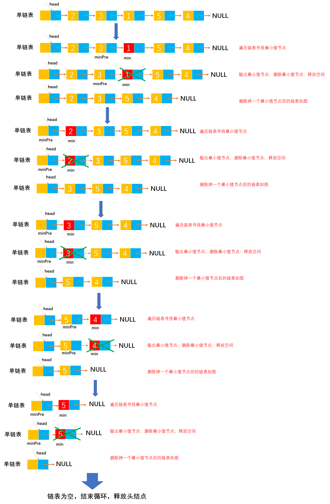

# Example044

## 题目

给定一个带头结点的单链表，设 head 为头指针，节点结构为 `(data, next)`，data 为整型元素，next 为指针，试写出算法：按递增次序输出单链表中各节点的数据元素，并释放节点所占的存储空间。要求：不允许使用数组作为辅助空间。


## 分析

本题考查的知识点：
- 单链表
- 单链表删除节点
- 寻找单链表最小节点

算法思想：对链表进行遍历，在每次遍历中找出整个链表的最小值元素，输出并释放节点所占空间；再查找次小值元素，输出并释放空间，如此下去，直到链表为空，最后释放头结点所占存储空间。该算法的时间复杂度为 `O(n^2)`。


## 图解




## C实现

核心代码：

```c
/**
 * 按递增次序打印单链表中所有元素
 * @param list 单链表
 */
void incrementPrint(LNode **list) {
    // 循环，直到链表为空则结束循环
    while ((*list)->next != NULL) {
        // 变量，记录最小值节点和最小值节点的前驱节点，初始为链表的第一个节点和头结点
        LNode *min = (*list)->next;
        LNode *minPre = *list;
        // 变量，记录链表节点（用于从头到尾扫描）和前驱节点，初始为链表的第一个节点和头结点
        LNode *node = (*list)->next;
        LNode *pre = *list;
        // 从第一个节点扫描链表所有节点
        while (node != NULL) {
            // 如果该节点比最小值节点数据域小，则更新 min 和 minPre
            if (node->data < min->data) {
                min = node;
                minPre = pre;
            }
            // 更新 pre 和 node
            pre = node;// 更新 pre 是为了 minPre 使用
            node = node->next;
        }
        // 打印最小值节点数据
        printf("%d\t", min->data);
        // 删除最小值节点
        minPre->next = min->next;
        // 释放最小值节点空间
        free(min);
    }
    // 释放头结点空间
    free(*list);
}
```

完整代码：

```c
#include <stdio.h>
#include <malloc.h>

/**
 * 单链表节点
 */
typedef struct LNode {
    /**
     * 单链表节点的数据域
     */
    int data;
    /**
     * 单链表节点的的指针域，指向当前节点的后继节点
     */
    struct LNode *next;
} LNode;

/**
 * 通过尾插法创建单链表
 * @param list 单链表
 * @param nums 创建单链表时插入的数据数组
 * @param n 数组长度
 * @return 创建好的单链表
 */
LNode *createByTail(LNode **list, int nums[], int n) {
    // 1.初始化单链表
    // 创建链表必须要先初始化链表，也可以选择直接调用 init() 函数
    *list = (LNode *) malloc(sizeof(LNode));
    (*list)->next = NULL;

    // 尾插法，必须知道链表的尾节点（即链表的最后一个节点），初始时，单链表的头结点就是尾节点
    // 因为在单链表中插入节点我们必须知道前驱节点，而头插法中的前驱节点一直是头节点，但尾插法中要在单链表的末尾插入新节点，所以前驱节点一直都是链表的最后一个节点，而链表的最后一个节点由于链表插入新节点会一直变化
    LNode *node = (*list);

    // 2.循环数组，将所有数依次插入到链表的尾部
    for (int i = 0; i < n; i++) {
        // 2.1 创建新节点，并指定数据域和指针域
        // 2.1.1 创建新节点，为其分配空间
        LNode *newNode = (LNode *) malloc(sizeof(LNode));
        // 2.1.2 为新节点指定数据域
        newNode->data = nums[i];
        // 2.1.3 为新节点指定指针域，新节点的指针域初始时设置为 null
        newNode->next = NULL;

        // 2.2 将新节点插入到单链表的尾部
        // 2.2.1 将链表原尾节点的 next 指针指向新节点
        node->next = newNode;
        // 2.2.2 将新节点置为新的尾节点
        node = newNode;
    }
    return *list;
}

/**
 * 按递增次序打印单链表中所有元素
 * @param list 单链表
 */
void incrementPrint(LNode **list) {
    // 循环，直到链表为空则结束循环
    while ((*list)->next != NULL) {
        // 变量，记录最小值节点和最小值节点的前驱节点，初始为链表的第一个节点和头结点
        LNode *min = (*list)->next;
        LNode *minPre = *list;
        // 变量，记录链表节点（用于从头到尾扫描）和前驱节点，初始为链表的第一个节点和头结点
        LNode *node = (*list)->next;
        LNode *pre = *list;
        // 从第一个节点扫描链表所有节点
        while (node != NULL) {
            // 如果该节点比最小值节点数据域小，则更新 min 和 minPre
            if (node->data < min->data) {
                min = node;
                minPre = pre;
            }
            // 更新 pre 和 node
            pre = node;// 更新 pre 是为了 minPre 使用
            node = node->next;
        }
        // 打印最小值节点数据
        printf("%d\t", min->data);
        // 删除最小值节点
        minPre->next = min->next;
        // 释放最小值节点空间
        free(min);
    }
    // 释放头结点空间
    free(*list);
}

/**
 * 打印链表的所有节点
 * @param list 单链表
 */
void print(LNode *list) {
    printf("[");
    // 链表的第一个节点
    LNode *node = list->next;
    // 循环单链表所有节点，打印值
    while (node != NULL) {
        printf("%d", node->data);
        if (node->next != NULL) {
            printf(", ");
        }
        node = node->next;
    }
    printf("]\n");
}

int main() {
    // 声明单链表
    LNode *list;
    int nums[] = {2, 3, 1, 5, 4};
    int n = 5;
    createByTail(&list, nums, n);
    print(list);

    // 调用函数
    incrementPrint(&list);
}
```

执行结果：

```text
[2, 3, 1, 5, 4]
1       2       3       4       5
```


## Java实现

核心代码：

```java
    /**
     * 按递增次序打印单链表中所有元素
     */
    public void incrementPrint() {
        // 循环，直到链表为空则结束循环
        while (list.next != null) {
            // 变量，记录最小值节点和最小值节点的前驱节点，初始为链表的第一个节点和头结点
            LNode min = list.next;
            LNode minPre = list;
            // 变量，记录链表节点（用于从头到尾扫描）和前驱节点，初始为链表的第一个节点和头结点
            LNode node = list.next;
            LNode pre = list;
            // 从第一个节点扫描链表所有节点
            while (node != null) {
                // 如果该节点比最小值节点数据域小，则更新 min 和 minPre
                if (node.data < min.data) {
                    min = node;
                    minPre = pre;
                }
                // 更新 pre 和 node
                pre = node;// 更新 pre 是为了 minPre 使用
                node = node.next;
            }
            // 打印最小值节点数据
            System.out.print(min.data + "\t");
            // 删除最小值节点
            minPre.next = min.next;
            // 释放最小值节点空间
            min.next = null;
            min = null;
        }
        // 释放头结点空间
        list = null;
    }
```

完整代码：

```java
public class LinkedList {
    /**
     * 单链表
     */
    private LNode list;

    /**
     * 通过尾插法创建单链表
     *
     * @param nums 创建单链表时插入的数据
     * @return 创建好的单链表
     */
    public LNode createByTail(int... nums) {
        // 1.初始化单链表
        // 创建链表必须要先初始化链表，也可以选择直接调用 init() 函数
        list = new LNode();
        list.next = null;

        // 尾插法，必须知道链表的尾节点（即链表的最后一个节点），初始时，单链表的头结点就是尾节点
        // 因为在单链表中插入节点我们必须知道前驱节点，而头插法中的前驱节点一直是头节点，但尾插法中要在单链表的末尾插入新节点，所以前驱节点一直都是链表的最后一个节点，而链表的最后一个节点由于链表插入新节点会一直变化
        LNode tailNode = list;

        // 2.循环数组，将所有数依次插入到链表的尾部
        for (int i = 0; i < nums.length; i++) {
            // 2.1 创建新节点，并指定数据域和指针域
            // 2.1.1 创建新节点，为其分配空间
            LNode newNode = new LNode();
            // 2.1.2 为新节点指定数据域
            newNode.data = nums[i];
            // 2.1.3 为新节点指定指针域，新节点的指针域初始时设置为 null
            newNode.next = null;

            // 2.2 将新节点插入到单链表的尾部
            // 2.2.1 将链表原尾节点的 next 指针指向新节点
            tailNode.next = newNode;
            // 2.2.2 将新节点置为新的尾节点
            tailNode = newNode;
        }

        return list;
    }

    /**
     * 按递增次序打印单链表中所有元素
     */
    public void incrementPrint() {
        // 循环，直到链表为空则结束循环
        while (list.next != null) {
            // 变量，记录最小值节点和最小值节点的前驱节点，初始为链表的第一个节点和头结点
            LNode min = list.next;
            LNode minPre = list;
            // 变量，记录链表节点（用于从头到尾扫描）和前驱节点，初始为链表的第一个节点和头结点
            LNode node = list.next;
            LNode pre = list;
            // 从第一个节点扫描链表所有节点
            while (node != null) {
                // 如果该节点比最小值节点数据域小，则更新 min 和 minPre
                if (node.data < min.data) {
                    min = node;
                    minPre = pre;
                }
                // 更新 pre 和 node
                pre = node;// 更新 pre 是为了 minPre 使用
                node = node.next;
            }
            // 打印最小值节点数据
            System.out.print(min.data + "\t");
            // 删除最小值节点
            minPre.next = min.next;
            // 释放最小值节点空间
            min.next = null;
            min = null;
        }
        // 释放头结点空间
        list = null;
    }

    /**
     * 打印单链表所有节点
     */
    public void print() {
        // 链表的第一个节点
        LNode node = list.next;
        // 循环打印
        String str = "[";
        while (node != null) {
            // 拼接节点的数据域
            str += node.data;
            // 只要不是最后一个节点，那么就在每个节点的数据域后面添加一个分号，用于分隔字符串
            if (node.next != null) {
                str += ", ";
            }
            // 继续链表的下一个节点
            node = node.next;
        }
        str += "]";
        // 打印链表
        System.out.println(str);
    }
}

/**
 * 单链表的节点
 */
class LNode {
    /**
     * 链表的数据域，暂时指定为 int 类型，因为 Java 支持泛型，可以指定为泛型，就能支持更多的类型了
     */
    int data;
    /**
     * 链表的指针域，指向该节点的下一个节点
     */
    LNode next;
}
```

测试代码：

```java
public class LinkedListTest {
    public static void main(String[] args) {
        // 创建单链表
        LinkedList list = new LinkedList();
        list.createByTail(2, 3, 1, 5, 4);
        list.print();

        // 调用函数
        list.incrementPrint();
    }
}
```

执行结果：

```text
[2, 3, 1, 5, 4]
1	2	3	4	5	
```