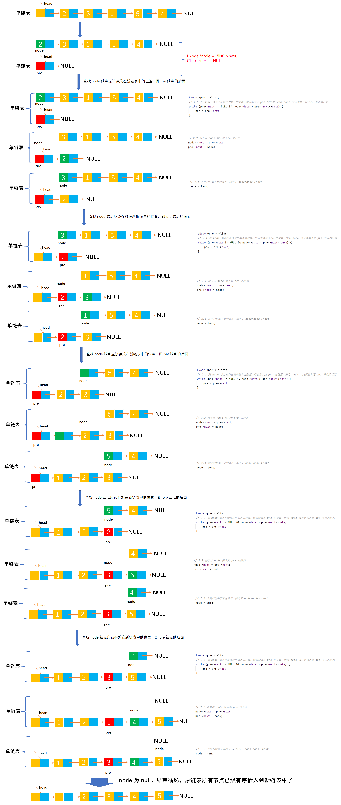

# Example045

## 题目

有一个带头结点的单链表 L，设计一个算法使其元素递增有序。


## 分析

算法思想：采用直接插入排序算法的思想，先构建一个空链表，然后依次扫描原单链表第一个节点及之后的所有结点（直至 `node==NULL` 为止），在有序表中通过比较查找插入 node 的前驱节点 pre，然后将 node 插入到 pre 之后。


## 图解




## C实现

核心代码：

```c
/**
 * 使单链表元素递增有序
 * @param list
 */
void insertSort(LNode **list) {
    // 变量，记录链表节点，初始为链表第一个节点
    LNode *node = (*list)->next;
    // 1.由于要重新构造单链表，所以将头结点的 next 指针指向 null
    (*list)->next = NULL;

    // 2.从头到尾扫描 node 所表示的单链表
    while (node != NULL) {
        // 局部变量，记录 node 节点的后继节点，为了能够 node=node->next，因为下面会修改 node 节点指向，所以要提前记录后继节点
        LNode *temp = node->next;
        // 局部变量，每次循环都需要重置，记录前驱节点，初始指向链表的头结点
        LNode *pre = *list;

        // 2.1 找 node 节点在新链表中插入的位置，即前驱节点 pre 的位置，因为 node 节点要插入到 pre 节点的后面
        while (pre->next != NULL && node->data > pre->next->data) {
            pre = pre->next;
        }

        // 2.2 将节点 node 插入到 pre 的后面
        node->next = pre->next;
        pre->next = node;

        // 2.3 方便扫描剩下来的节点，相当于 node=node->next
        node = temp;
    }
}
```

完整代码：

```c
#include <stdio.h>
#include <malloc.h>

/**
 * 单链表节点
 */
typedef struct LNode {
    /**
     * 单链表节点的数据域
     */
    int data;
    /**
     * 单链表节点的的指针域，指向当前节点的后继节点
     */
    struct LNode *next;
} LNode;

/**
 * 通过尾插法创建单链表
 * @param list 单链表
 * @param nums 创建单链表时插入的数据数组
 * @param n 数组长度
 * @return 创建好的单链表
 */
LNode *createByTail(LNode **list, int nums[], int n) {
    // 1.初始化单链表
    // 创建链表必须要先初始化链表，也可以选择直接调用 init() 函数
    *list = (LNode *) malloc(sizeof(LNode));
    (*list)->next = NULL;

    // 尾插法，必须知道链表的尾节点（即链表的最后一个节点），初始时，单链表的头结点就是尾节点
    // 因为在单链表中插入节点我们必须知道前驱节点，而头插法中的前驱节点一直是头节点，但尾插法中要在单链表的末尾插入新节点，所以前驱节点一直都是链表的最后一个节点，而链表的最后一个节点由于链表插入新节点会一直变化
    LNode *node = (*list);

    // 2.循环数组，将所有数依次插入到链表的尾部
    for (int i = 0; i < n; i++) {
        // 2.1 创建新节点，并指定数据域和指针域
        // 2.1.1 创建新节点，为其分配空间
        LNode *newNode = (LNode *) malloc(sizeof(LNode));
        // 2.1.2 为新节点指定数据域
        newNode->data = nums[i];
        // 2.1.3 为新节点指定指针域，新节点的指针域初始时设置为 null
        newNode->next = NULL;

        // 2.2 将新节点插入到单链表的尾部
        // 2.2.1 将链表原尾节点的 next 指针指向新节点
        node->next = newNode;
        // 2.2.2 将新节点置为新的尾节点
        node = newNode;
    }
    return *list;
}

/**
 * 使单链表元素递增有序
 * @param list
 */
void insertSort(LNode **list) {
    // 变量，记录链表节点，初始为链表第一个节点
    LNode *node = (*list)->next;
    // 1.由于要重新构造单链表，所以将头结点的 next 指针指向 null
    (*list)->next = NULL;

    // 2.从头到尾扫描 node 所表示的单链表
    while (node != NULL) {
        // 局部变量，记录 node 节点的后继节点，为了能够 node=node->next，因为下面会修改 node 节点指向，所以要提前记录后继节点
        LNode *temp = node->next;
        // 局部变量，每次循环都需要重置，记录前驱节点，初始指向链表的头结点
        LNode *pre = *list;

        // 2.1 找 node 节点在新链表中插入的位置，即前驱节点 pre 的位置，因为 node 节点要插入到 pre 节点的后面
        while (pre->next != NULL && node->data > pre->next->data) {
            pre = pre->next;
        }

        // 2.2 将节点 node 插入到 pre 的后面
        node->next = pre->next;
        pre->next = node;

        // 2.3 方便扫描剩下来的节点，相当于 node=node->next
        node = temp;
    }
}

/**
 * 打印链表的所有节点
 * @param list 单链表
 */
void print(LNode *list) {
    printf("[");
    // 链表的第一个节点
    LNode *node = list->next;
    // 循环单链表所有节点，打印值
    while (node != NULL) {
        printf("%d", node->data);
        if (node->next != NULL) {
            printf(", ");
        }
        node = node->next;
    }
    printf("]\n");
}

int main() {
    // 声明单链表
    LNode *list;
    int nums[] = {2, 3, 1, 5, 4};
    int n = 5;
    createByTail(&list, nums, n);
    print(list);

    // 调用函数，进行排序
    insertSort(&list);
    print(list);
}
```

执行结果：

```text
[2, 3, 1, 5, 4]
[1, 2, 3, 4, 5]
```


## Java实现

核心代码：

```java
    /**
     * 使单链表元素递增有序
     */
    public void insertSort() {
        // 变量，记录链表节点，初始为链表第一个节点
        LNode node = list.next;
        // 1.由于要重新构造单链表，所以将头结点的 next 指针指向 null
        list.next = null;

        // 2.从头到尾扫描 node 所表示的单链表
        while (node != null) {
            // 局部变量，记录 node 节点的后继节点，为了能够 node=node->next，因为下面会修改 node 节点指向，所以要提前记录后继节点
            LNode temp = node.next;
            // 局部变量，每次循环都需要重置，记录前驱节点，初始指向链表的头结点
            LNode pre = list;

            // 2.1 找 node 节点在新链表中插入的位置，即前驱节点 pre 的位置，因为 node 节点要插入到 pre 节点的后面
            while (pre.next != null && node.data > pre.next.data) {
                pre = pre.next;
            }

            // 2.2 将节点 node 插入到 pre 的后面
            node.next = pre.next;
            pre.next = node;

            // 2.3 方便扫描剩下来的节点，相当于 node=node->next
            node = temp;
        }
    }
```

完整代码：

```java
public class LinkedList {
    /**
     * 单链表
     */
    private LNode list;

    /**
     * 通过尾插法创建单链表
     *
     * @param nums 创建单链表时插入的数据
     * @return 创建好的单链表
     */
    public LNode createByTail(int... nums) {
        // 1.初始化单链表
        // 创建链表必须要先初始化链表，也可以选择直接调用 init() 函数
        list = new LNode();
        list.next = null;

        // 尾插法，必须知道链表的尾节点（即链表的最后一个节点），初始时，单链表的头结点就是尾节点
        // 因为在单链表中插入节点我们必须知道前驱节点，而头插法中的前驱节点一直是头节点，但尾插法中要在单链表的末尾插入新节点，所以前驱节点一直都是链表的最后一个节点，而链表的最后一个节点由于链表插入新节点会一直变化
        LNode tailNode = list;

        // 2.循环数组，将所有数依次插入到链表的尾部
        for (int i = 0; i < nums.length; i++) {
            // 2.1 创建新节点，并指定数据域和指针域
            // 2.1.1 创建新节点，为其分配空间
            LNode newNode = new LNode();
            // 2.1.2 为新节点指定数据域
            newNode.data = nums[i];
            // 2.1.3 为新节点指定指针域，新节点的指针域初始时设置为 null
            newNode.next = null;

            // 2.2 将新节点插入到单链表的尾部
            // 2.2.1 将链表原尾节点的 next 指针指向新节点
            tailNode.next = newNode;
            // 2.2.2 将新节点置为新的尾节点
            tailNode = newNode;
        }

        return list;
    }

    /**
     * 使单链表元素递增有序
     */
    public void insertSort() {
        // 变量，记录链表节点，初始为链表第一个节点
        LNode node = list.next;
        // 1.由于要重新构造单链表，所以将头结点的 next 指针指向 null
        list.next = null;

        // 2.从头到尾扫描 node 所表示的单链表
        while (node != null) {
            // 局部变量，记录 node 节点的后继节点，为了能够 node=node->next，因为下面会修改 node 节点指向，所以要提前记录后继节点
            LNode temp = node.next;
            // 局部变量，每次循环都需要重置，记录前驱节点，初始指向链表的头结点
            LNode pre = list;

            // 2.1 找 node 节点在新链表中插入的位置，即前驱节点 pre 的位置，因为 node 节点要插入到 pre 节点的后面
            while (pre.next != null && node.data > pre.next.data) {
                pre = pre.next;
            }

            // 2.2 将节点 node 插入到 pre 的后面
            node.next = pre.next;
            pre.next = node;

            // 2.3 方便扫描剩下来的节点，相当于 node=node->next
            node = temp;
        }
    }

    /**
     * 打印单链表所有节点
     */
    public void print() {
        // 链表的第一个节点
        LNode node = list.next;
        // 循环打印
        String str = "[";
        while (node != null) {
            // 拼接节点的数据域
            str += node.data;
            // 只要不是最后一个节点，那么就在每个节点的数据域后面添加一个分号，用于分隔字符串
            if (node.next != null) {
                str += ", ";
            }
            // 继续链表的下一个节点
            node = node.next;
        }
        str += "]";
        // 打印链表
        System.out.println(str);
    }
}

/**
 * 单链表的节点
 */
class LNode {
    /**
     * 链表的数据域，暂时指定为 int 类型，因为 Java 支持泛型，可以指定为泛型，就能支持更多的类型了
     */
    int data;
    /**
     * 链表的指针域，指向该节点的下一个节点
     */
    LNode next;
}
```

测试代码：

```java
public class LinkedListTest {
    public static void main(String[] args) {
        // 创建单链表
        LinkedList list = new LinkedList();
        list.createByTail(2, 3, 1, 5, 4);
        list.print();

        // 调用函数，进行排序
        list.insertSort();
        list.print();
    }
}
```

执行结果：

```text
[2, 3, 1, 5, 4]
[1, 2, 3, 4, 5]
```